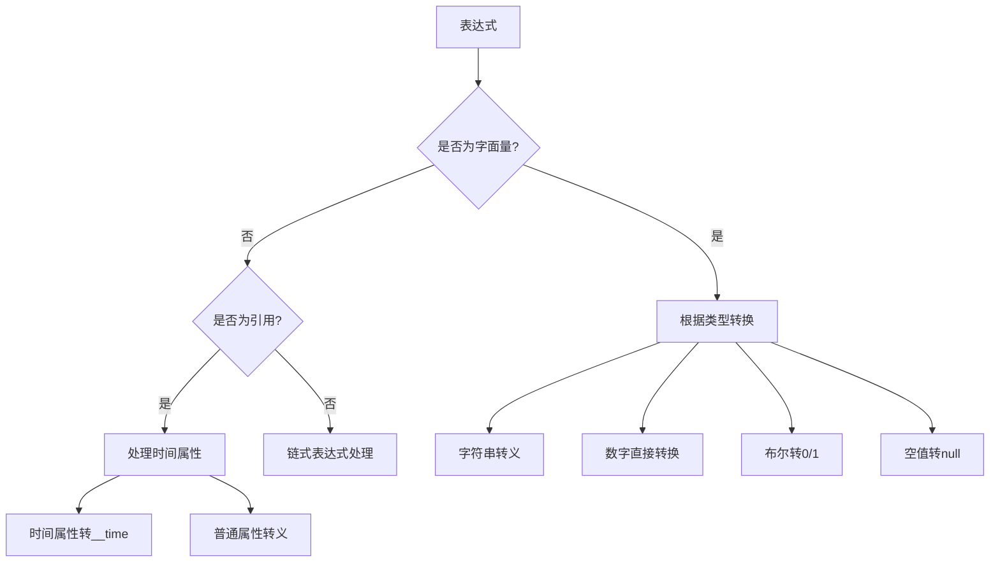
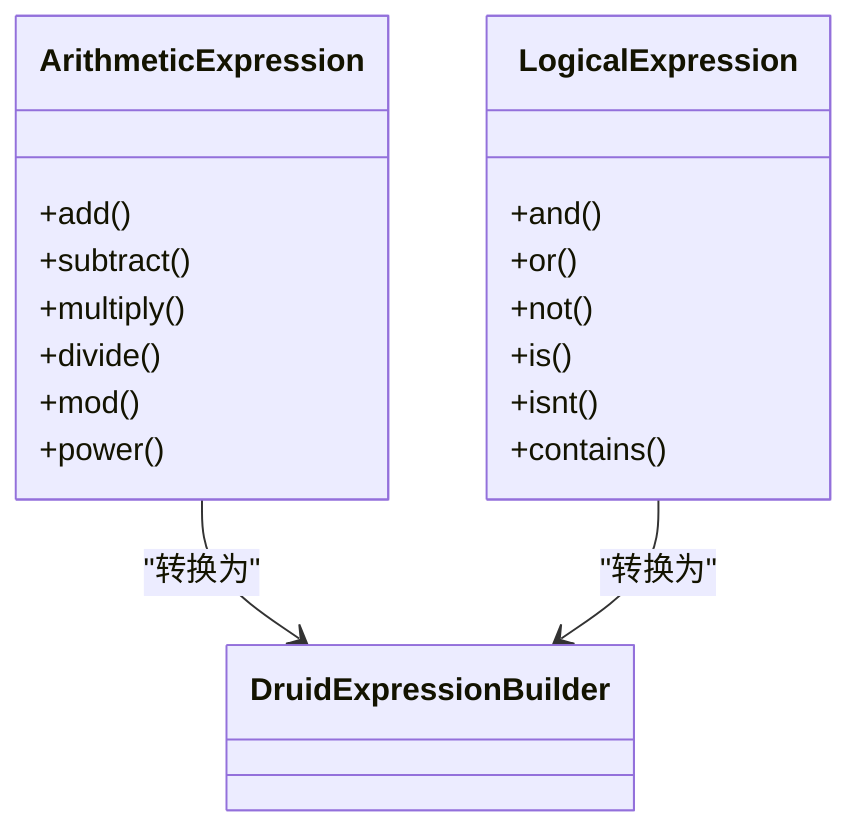
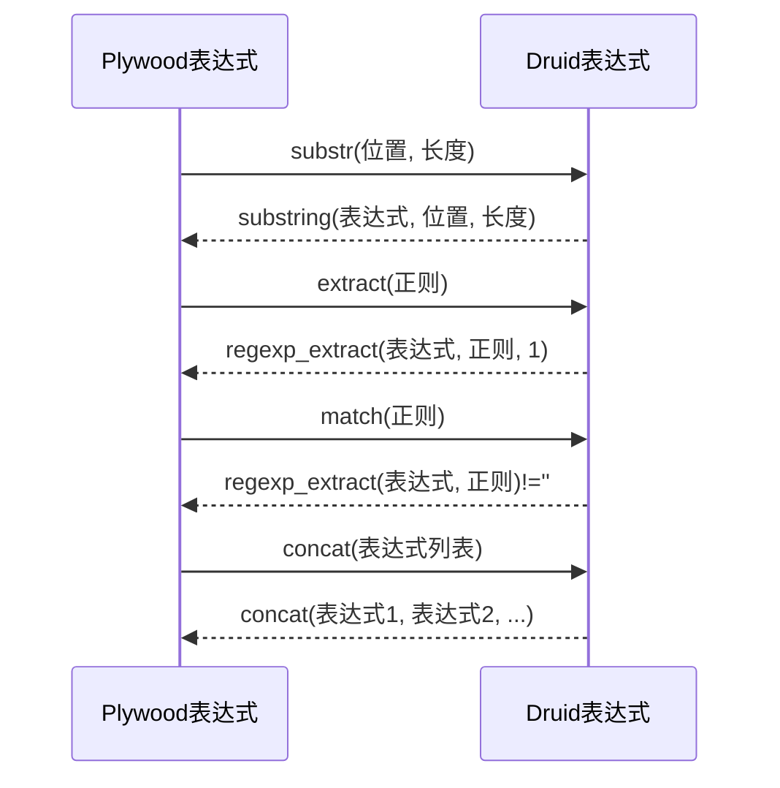
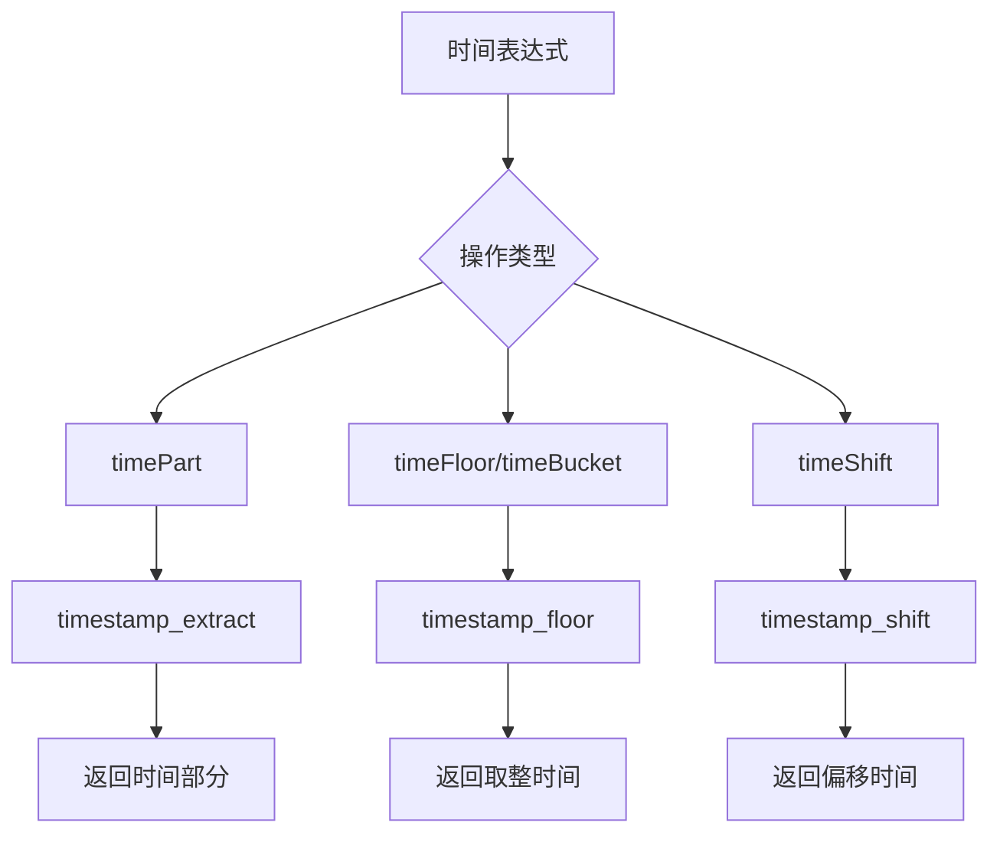
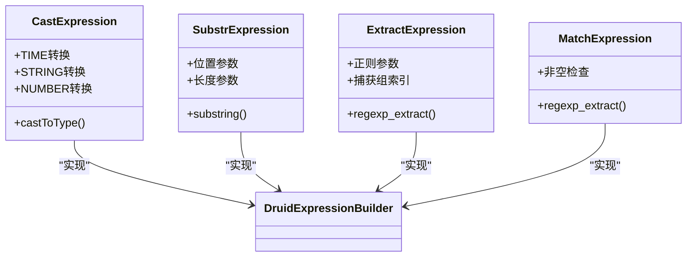
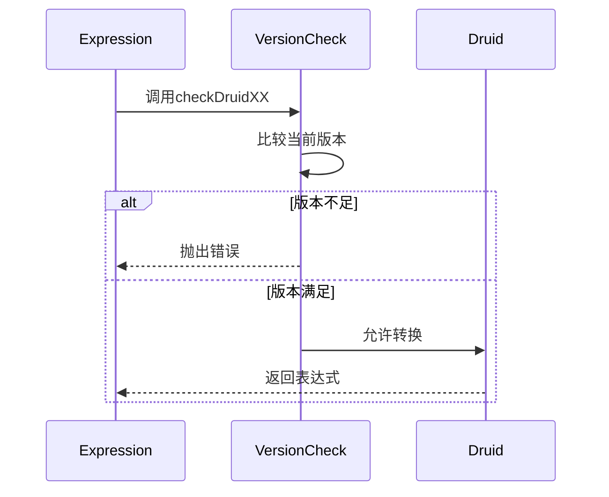
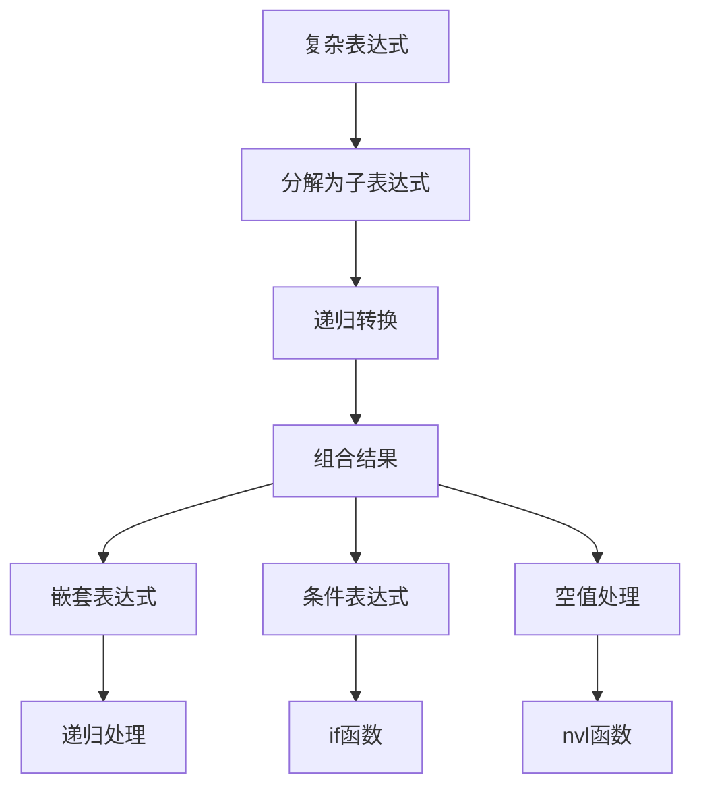

# Druid表达式构建

<cite>
**本文档引用的文件**
- [druidExpressionBuilder.ts](file://src/external/utils/druidExpressionBuilder.ts)
- [literalExpression.ts](file://src/expressions/literalExpression.ts)
- [refExpression.ts](file://src/expressions/refExpression.ts)
- [castExpression.ts](file://src/expressions/castExpression.ts)
- [substrExpression.ts](file://src/expressions/substrExpression.ts)
- [extractExpression.ts](file://src/expressions/extractExpression.ts)
- [matchExpression.ts](file://src/expressions/matchExpression.ts)
- [containsExpression.ts](file://src/expressions/containsExpression.ts)
- [timePartExpression.ts](file://src/expressions/timePartExpression.ts)
- [timeFloorExpression.ts](file://src/expressions/timeFloorExpression.ts)
- [timeShiftExpression.ts](file://src/expressions/timeShiftExpression.ts)
- [addExpression.ts](file://src/expressions/addExpression.ts)
- [multiplyExpression.ts](file://src/expressions/multiplyExpression.ts)
- [andExpression.ts](file://src/expressions/andExpression.ts)
- [orExpression.ts](file://src/expressions/orExpression.ts)
- [attributeInfo.ts](file://src/datatypes/attributeInfo.ts)
</cite>

## 目录
1. [简介](#简介)
2. [核心转换机制](#核心转换机制)
3. [字面量与引用转换](#字面量与引用转换)
4. [算术与逻辑运算转换](#算术与逻辑运算转换)
5. [字符串操作转换](#字符串操作转换)
6. [时间处理转换](#时间处理转换)
7. [特殊操作符实现](#特殊操作符实现)
8. [版本兼容性检查](#版本兼容性检查)
9. [复杂表达式链构建](#复杂表达式链构建)
10. [性能优化建议](#性能优化建议)
11. [常见问题解决方案](#常见问题解决方案)

## 简介
DruidExpressionBuilder类是Plywood框架中的核心组件，负责将Plywood表达式转换为Druid原生表达式语言。该类通过一系列规则和方法，实现了从高级抽象表达式到底层查询语言的精确转换，支持字面量、引用、算术运算、逻辑运算、字符串操作和时间处理等多种表达式类型。本文档深入解析其内部实现机制，重点阐述各类表达式的转换规则、特殊操作符的实现方式以及版本兼容性检查机制。

## 核心转换机制
DruidExpressionBuilder类的核心是`expressionToDruidExpression`方法，该方法通过类型检查和递归处理，将Plywood表达式树转换为Druid表达式字符串。转换过程遵循以下原则：
- **类型安全**：确保源表达式和目标表达式在类型上保持一致
- **递归处理**：对链式表达式进行递归分解，逐层转换
- **版本兼容**：根据Druid版本检查操作符的可用性
- **特殊处理**：对时间属性、字符串转义等特殊情况进行专门处理

**Section sources**
- [druidExpressionBuilder.ts](file://src/external/utils/druidExpressionBuilder.ts#L69-L445)

## 字面量与引用转换
### 字面量转换
字面量转换通过`expressionToDruidExpression`方法中的`LiteralExpression`分支实现。根据字面量的类型，采用不同的转换策略：
- **字符串**：使用`escapeLiteral`方法进行转义处理，确保特殊字符的安全
- **数字**：直接转换为字符串表示
- **布尔值**：转换为0或1的数字表示
- **空值**：转换为`null`关键字

### 引用转换
引用转换通过`RefExpression`分支实现，主要处理以下情况：
- **时间属性**：将时间属性引用转换为`__time`特殊标识符
- **普通属性**：使用`escapeVariable`方法对属性名进行转义
- **类型转换**：根据属性信息，对字符串类型的时间属性进行类型转换

**Diagram sources**
- [druidExpressionBuilder.ts](file://src/external/utils/druidExpressionBuilder.ts#L69-L445)
- [literalExpression.ts](file://src/expressions/literalExpression.ts#L26-L196)
- [refExpression.ts](file://src/expressions/refExpression.ts#L47-L318)

**Section sources**
- [druidExpressionBuilder.ts](file://src/external/utils/druidExpressionBuilder.ts#L69-L445)
- [literalExpression.ts](file://src/expressions/literalExpression.ts#L26-L196)
- [refExpression.ts](file://src/expressions/refExpression.ts#L47-L318)

## 算术与逻辑运算转换
### 算术运算
算术运算转换支持加、减、乘、除、取模、幂运算等操作。转换规则如下：
- **加减乘**：直接转换为对应的运算符`+`、`-`、`*`
- **除法**：强制转换为DOUBLE类型，避免整数除法问题
- **取模**：处理空值情况，确保结果的正确性
- **幂运算**：转换为`pow`函数调用

### 逻辑运算
逻辑运算转换支持与、或、非、等于、不等于等操作。转换规则如下：
- **与或非**：转换为`&&`、`||`、`!`操作符
- **等于不等于**：转换为`==`、`!=`操作符
- **包含**：使用`like`函数实现，支持大小写敏感和不敏感模式

**Diagram sources**
- [druidExpressionBuilder.ts](file://src/external/utils/druidExpressionBuilder.ts#L69-L445)
- [addExpression.ts](file://src/expressions/addExpression.ts#L20-L60)
- [multiplyExpression.ts](file://src/expressions/multiplyExpression.ts#L22-L68)
- [andExpression.ts](file://src/expressions/andExpression.ts#L34-L127)

**Section sources**
- [druidExpressionBuilder.ts](file://src/external/utils/druidExpressionBuilder.ts#L69-L445)
- [addExpression.ts](file://src/expressions/addExpression.ts#L20-L60)
- [multiplyExpression.ts](file://src/expressions/multiplyExpression.ts#L22-L68)
- [andExpression.ts](file://src/expressions/andExpression.ts#L34-L127)

## 字符串操作转换
字符串操作转换支持子串提取、正则提取、匹配、连接等操作。主要转换规则如下：

### 子串提取
`substr`操作符转换为`substring`函数调用，需要Druid 0.11.0及以上版本支持。转换时直接传递位置和长度参数。

### 正则提取
`extract`操作符转换为`regexp_extract`函数调用，提取正则表达式匹配的第一个捕获组。

### 字符串匹配
`match`操作符转换为`regexp_extract`函数调用，检查提取结果是否为空字符串。

### 字符串连接
`concat`操作符转换为`concat`函数调用，将多个表达式连接成一个字符串。

**Diagram sources**
- [druidExpressionBuilder.ts](file://src/external/utils/druidExpressionBuilder.ts#L69-L445)
- [substrExpression.ts](file://src/expressions/substrExpression.ts#L20-L89)
- [extractExpression.ts](file://src/expressions/extractExpression.ts#L21-L73)
- [matchExpression.ts](file://src/expressions/matchExpression.ts#L24-L103)
- [containsExpression.ts](file://src/expressions/containsExpression.ts#L21-L138)

**Section sources**
- [druidExpressionBuilder.ts](file://src/external/utils/druidExpressionBuilder.ts#L69-L445)
- [substrExpression.ts](file://src/expressions/substrExpression.ts#L20-L89)
- [extractExpression.ts](file://src/expressions/extractExpression.ts#L21-L73)
- [matchExpression.ts](file://src/expressions/matchExpression.ts#L24-L103)
- [containsExpression.ts](file://src/expressions/containsExpression.ts#L21-L138)

## 时间处理转换
时间处理转换支持时间部分提取、时间取整、时间偏移等操作。主要转换规则如下：

### 时间部分提取
`timePart`操作符转换为`timestamp_extract`函数调用，根据时间部分类型（如秒、分钟、小时等）提取相应的时间值。

### 时间取整
`timeFloor`和`timeBucket`操作符转换为`timestamp_floor`函数调用，将时间戳按指定周期取整。

### 时间偏移
`timeShift`操作符转换为`timestamp_shift`函数调用，将时间戳按指定周期和步长进行偏移。

**Diagram sources**
- [druidExpressionBuilder.ts](file://src/external/utils/druidExpressionBuilder.ts#L69-L445)
- [timePartExpression.ts](file://src/expressions/timePartExpression.ts#L24-L164)
- [timeFloorExpression.ts](file://src/expressions/timeFloorExpression.ts#L25-L130)
- [timeShiftExpression.ts](file://src/expressions/timeShiftExpression.ts#L24-L121)

**Section sources**
- [druidExpressionBuilder.ts](file://src/external/utils/druidExpressionBuilder.ts#L69-L445)
- [timePartExpression.ts](file://src/expressions/timePartExpression.ts#L24-L164)
- [timeFloorExpression.ts](file://src/expressions/timeFloorExpression.ts#L25-L130)
- [timeShiftExpression.ts](file://src/expressions/timeShiftExpression.ts#L24-L121)

## 特殊操作符实现
### cast操作符
`cast`操作符通过`castToType`方法实现，根据源类型和目标类型进行相应的类型转换：
- **时间类型**：使用`timestamp`函数或`cast`函数
- **字符串类型**：使用`cast`函数转换为STRING
- **数字类型**：使用`cast`函数转换为DOUBLE

### substr操作符
`substr`操作符需要Druid 0.11.0及以上版本支持，转换为`substring`函数调用，直接传递表达式、位置和长度参数。

### extract操作符
`extract`操作符需要Druid 0.11.0及以上版本支持，转换为`regexp_extract`函数调用，提取正则表达式匹配的第一个捕获组。

### match操作符
`match`操作符需要Druid 0.11.0及以上版本支持，转换为`regexp_extract`函数调用，检查提取结果是否为空字符串。

**Diagram sources**
- [druidExpressionBuilder.ts](file://src/external/utils/druidExpressionBuilder.ts#L69-L445)
- [castExpression.ts](file://src/expressions/castExpression.ts#L60-L136)

**Section sources**
- [druidExpressionBuilder.ts](file://src/external/utils/druidExpressionBuilder.ts#L69-L445)
- [castExpression.ts](file://src/expressions/castExpression.ts#L60-L136)

## 版本兼容性检查
版本兼容性检查通过`checkDruidXX`系列方法实现，确保使用的操作符与Druid版本兼容：
- **checkDruid11**：检查是否需要Druid 0.11.0及以上版本
- **checkDruid12**：检查是否需要Druid 0.12.0及以上版本
- **checkDruid22**：检查是否需要Druid 0.22.0及以上版本

这些检查在转换相应操作符时自动执行，如果版本不满足要求，则抛出错误。

**Diagram sources**
- [druidExpressionBuilder.ts](file://src/external/utils/druidExpressionBuilder.ts#L69-L445)

**Section sources**
- [druidExpressionBuilder.ts](file://src/external/utils/druidExpressionBuilder.ts#L69-L445)

## 复杂表达式链构建
复杂表达式链的构建通过递归处理实现，支持嵌套表达式、条件表达式和空值处理等高级特性：

### 嵌套表达式
嵌套表达式通过递归调用`expressionToDruidExpression`方法处理，确保每一层表达式都被正确转换。

### 条件表达式
条件表达式使用`if`函数实现，支持三元操作符的语义。

### 空值处理
空值处理使用`nvl`函数实现，提供默认值替换功能。

**Diagram sources**
- [druidExpressionBuilder.ts](file://src/external/utils/druidExpressionBuilder.ts#L69-L445)

**Section sources**
- [druidExpressionBuilder.ts](file://src/external/utils/druidExpressionBuilder.ts#L69-L445)

## 性能优化建议
1. **避免复杂表达式**：尽量使用简单的表达式，减少嵌套层级
2. **利用索引**：确保经常查询的属性有适当的索引
3. **批量处理**：对于大量数据，考虑使用批量查询
4. **缓存结果**：对于频繁查询的结果，考虑使用缓存机制
5. **版本升级**：及时升级到支持更多功能的Druid版本

## 常见问题解决方案
1. **版本不兼容**：检查Druid版本，确保满足操作符的最低版本要求
2. **表达式转换失败**：检查表达式语法，确保符合Plywood表达式规范
3. **性能问题**：优化查询语句，添加适当的索引
4. **空值处理**：使用`fallback`操作符处理可能的空值情况
5. **特殊字符**：使用转义函数处理包含特殊字符的字符串