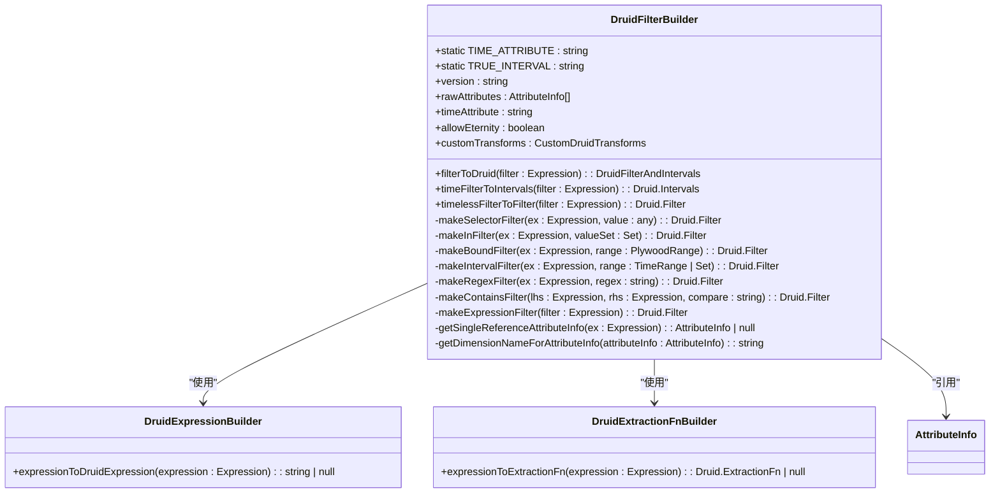
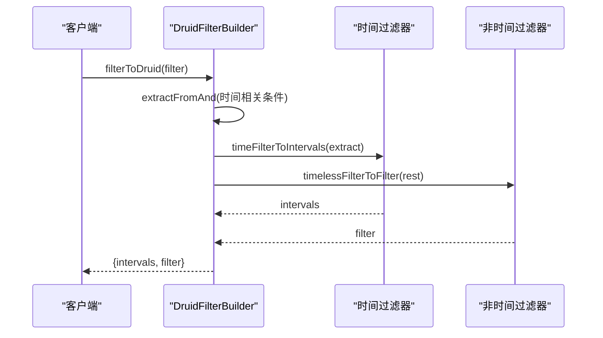
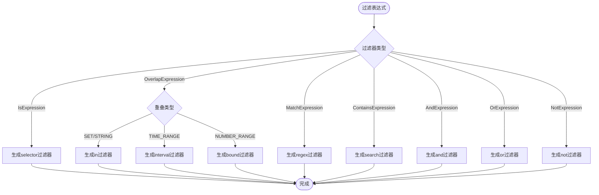
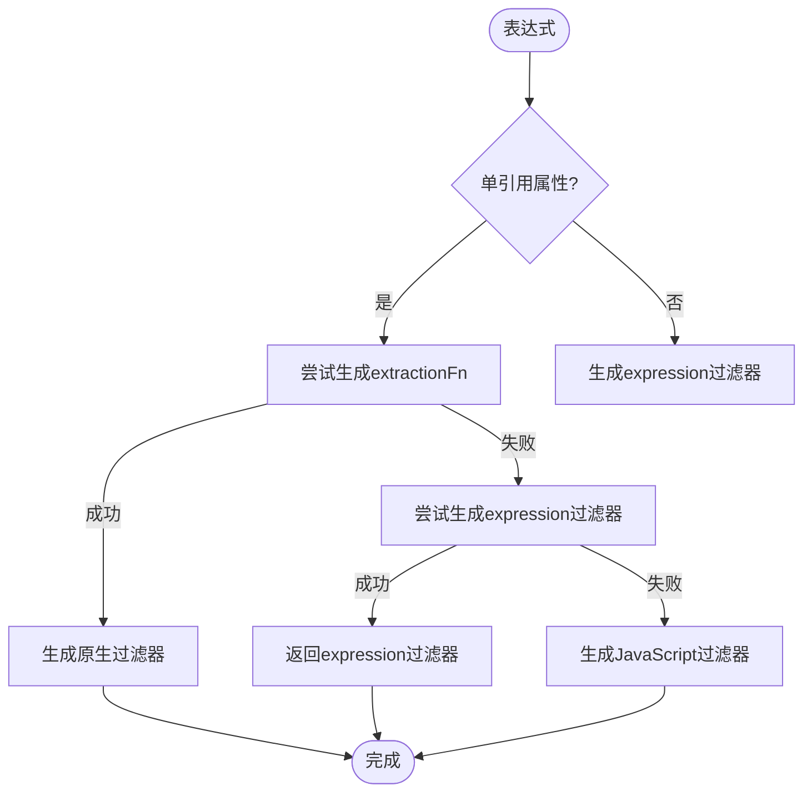

# Druid过滤构建

<cite>
**本文档引用的文件**   
- [druidFilterBuilder.ts](file://src/external/utils/druidFilterBuilder.ts)
- [druidTypes.ts](file://src/external/utils/druidTypes.ts)
- [attributeInfo.ts](file://src/datatypes/attributeInfo.ts)
- [druid.d.ts](file://node_modules/druid.d.ts/druid/druid.d.ts)
- [druidExpressionBuilder.ts](file://src/external/utils/druidExpressionBuilder.ts)
- [druidExtractionFnBuilder.ts](file://src/external/utils/druidExtractionFnBuilder.ts)
</cite>

## 目录
1. [简介](#简介)
2. [核心组件](#核心组件)
3. [时间过滤处理机制](#时间过滤处理机制)
4. [过滤器类型转换逻辑](#过滤器类型转换逻辑)
5. [表达式降级处理策略](#表达式降级处理策略)
6. [复杂过滤条件构建](#复杂过滤条件构建)
7. [性能优化建议](#性能优化建议)
8. [常见问题解决方案](#常见问题解决方案)

## 简介
DruidFilterBuilder类是Plywood框架中的核心组件，负责将Plywood表达式转换为Druid查询系统可识别的过滤器格式。该类实现了完整的过滤表达式解析和转换机制，支持多种过滤条件类型，包括时间过滤、范围过滤、正则匹配和包含关系等。通过分离时间过滤器和非时间过滤器，该类能够高效地生成Druid查询所需的interval和filter参数，同时提供了灵活的降级处理策略以应对复杂表达式。

**Section sources**
- [druidFilterBuilder.ts](file://src/external/utils/druidFilterBuilder.ts#L54-L489)

## 核心组件
DruidFilterBuilder类是过滤构建的核心实现，通过filterToDruid方法将Plywood过滤表达式转换为Druid过滤器和时间间隔的组合。该类利用AttributeInfo获取属性元数据，通过DruidExpressionBuilder和DruidExtractionFnBuilder处理复杂表达式，并支持自定义转换函数。核心功能包括时间过滤分离、多种过滤器类型生成和表达式降级处理。

**Diagram sources **
- [druidFilterBuilder.ts](file://src/external/utils/druidFilterBuilder.ts#L54-L489)
- [druidExpressionBuilder.ts](file://src/external/utils/druidExpressionBuilder.ts#L69-L445)
- [druidExtractionFnBuilder.ts](file://src/external/utils/druidExtractionFnBuilder.ts#L49-L503)
- [attributeInfo.ts](file://src/datatypes/attributeInfo.ts#L49-L229)

**Section sources**
- [druidFilterBuilder.ts](file://src/external/utils/druidFilterBuilder.ts#L54-L489)

## 时间过滤处理机制
DruidFilterBuilder通过filterToDruid方法实现时间过滤与非时间过滤的分离处理。该方法使用extractFromAnd提取时间相关的过滤条件，将时间过滤转换为Druid的interval参数，而将非时间过滤转换为filter参数。时间过滤主要通过is和overlap操作符实现，支持精确时间点和时间范围的过滤。

**Diagram sources **
- [druidFilterBuilder.ts](file://src/external/utils/druidFilterBuilder.ts#L65-L71)
- [druidFilterBuilder.ts](file://src/external/utils/druidFilterBuilder.ts#L122-L205)

**Section sources**
- [druidFilterBuilder.ts](file://src/external/utils/druidFilterBuilder.ts#L65-L71)
- [druidFilterBuilder.ts](file://src/external/utils/druidFilterBuilder.ts#L122-L205)

## 过滤器类型转换逻辑
DruidFilterBuilder支持多种过滤器类型的转换，每种类型都有特定的生成规则。selector过滤器用于精确匹配，in过滤器用于集合匹配，bound过滤器用于范围匹配，interval过滤器用于时间间隔匹配，regex过滤器用于正则匹配，而search过滤器用于包含关系匹配。

**Diagram sources **
- [druidFilterBuilder.ts](file://src/external/utils/druidFilterBuilder.ts#L154-L189)
- [druidFilterBuilder.ts](file://src/external/utils/druidFilterBuilder.ts#L186-L216)

**Section sources**
- [druidFilterBuilder.ts](file://src/external/utils/druidFilterBuilder.ts#L154-L189)
- [druidFilterBuilder.ts](file://src/external/utils/druidFilterBuilder.ts#L186-L216)

## 表达式降级处理策略
当无法直接生成原生Druid过滤器时，DruidFilterBuilder采用降级处理策略。首先尝试使用extractionFn进行转换，如果失败则尝试生成expression过滤器，最后作为备选方案生成JavaScript过滤器。这种分层降级策略确保了最大程度的兼容性和功能完整性。

**Diagram sources **
- [druidFilterBuilder.ts](file://src/external/utils/druidFilterBuilder.ts#L249-L293)
- [druidFilterBuilder.ts](file://src/external/utils/druidFilterBuilder.ts#L449-L489)

**Section sources**
- [druidFilterBuilder.ts](file://src/external/utils/druidFilterBuilder.ts#L249-L293)
- [druidFilterBuilder.ts](file://src/external/utils/druidFilterBuilder.ts#L449-L489)

## 复杂过滤条件构建
DruidFilterBuilder支持复杂的逻辑组合，包括AND/OR条件、JavaScript过滤器和嵌套表达式。通过递归处理AndExpression和OrExpression，可以构建任意复杂的逻辑组合。对于无法用原生过滤器表示的复杂表达式，系统会降级为JavaScript过滤器或expression过滤器。

**Section sources**
- [druidFilterBuilder.ts](file://src/external/utils/druidFilterBuilder.ts#L109-L152)

## 性能优化建议
1. 尽量使用原生Druid过滤器类型，避免使用JavaScript过滤器
2. 对于时间过滤，优先使用interval过滤器而非expression过滤器
3. 避免在过滤条件中使用复杂的表达式转换
4. 合理使用extractionFn来预处理数据
5. 对于频繁查询的维度，考虑使用预计算的衍生列

**Section sources**
- [druidFilterBuilder.ts](file://src/external/utils/druidFilterBuilder.ts#L54-L489)

## 常见问题解决方案
1. **无法转换过滤器**: 检查表达式是否引用了多个属性，或尝试简化表达式
2. **时间过滤失败**: 确认时间属性名称正确，并检查allowEternity设置
3. **性能问题**: 检查是否生成了JavaScript过滤器，尝试优化为原生过滤器
4. **类型不匹配**: 确认AttributeInfo中的类型定义正确
5. **范围过滤错误**: 检查边界符号的使用是否正确

**Section sources**
- [druidFilterBuilder.ts](file://src/external/utils/druidFilterBuilder.ts#L54-L489)