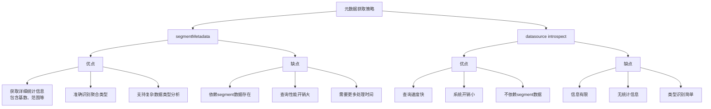

# 元数据管理

<cite>
**本文档中引用的文件**   
- [druidExternal.ts](file://src/external/druidExternal.ts)
- [attributeInfo.ts](file://src/datatypes/attributeInfo.ts)
- [druidExternalIntrospection.mocha.js](file://test/external/druidExternalIntrospection.mocha.js)
</cite>

## 目录
1. [引言](#引言)
2. [segmentMetadata元数据获取策略](#segmentmetadata元数据获取策略)
3. [datasource introspect元数据获取策略](#datasource-introspect元数据获取策略)
4. [策略对比分析](#策略对比分析)
5. [配置建议与性能考量](#配置建议与性能考量)

## 引言
本文档详细说明Druid数据源的元数据管理机制，重点解析segmentMetadata和datasource introspect两种元数据获取策略的实现原理和适用场景。通过分析代码实现，阐述两种策略在属性信息提取、统计信息获取和性能特征方面的差异，为系统配置和优化提供指导。

## segmentMetadata元数据获取策略

该策略通过Druid的segmentMetadata查询接口获取数据源的详细元数据信息。`segmentMetadataPostProcess`方法负责处理查询结果并提取属性信息。

对于时间列，该方法会验证`__time`列的存在性，并提取其基数(cardinality)和范围(range)统计信息。数值列的处理包括识别DOUBLE、FLOAT、LONG等类型，提取其统计范围，并根据聚合器(aggregators)信息判断是否为不可分割(unsplitable)指标。字符串列会根据`hasMultipleValues`属性判断是普通字符串还是集合类型(SET/STRING)，并提取相应的基数信息。

特殊聚合类型如hyperUnique、approximateHistogram等会被标记为NULL类型且不可分割，因为这些列通常表示近似聚合结果，不适合直接作为维度使用。

**Section sources**
- [druidExternal.ts](file://src/external/druidExternal.ts#L328-L423)

## datasource introspect元数据获取策略

该策略通过Druid的datasource introspect API获取数据源的基本结构信息。`introspectPostProcessFactory`方法处理API响应并构建属性信息。

与segmentMetadata策略相比，该方法获取的信息较为基础：时间属性被固定为TIME类型；维度(dimensions)统一识别为STRING类型；指标(metrics)统一识别为NUMBER类型且标记为不可分割。这种方法不包含任何统计信息(如基数、范围等)，也不分析具体的聚合器类型。

该策略的优势在于轻量级和快速响应，因为它不需要分析segment级别的详细元数据，而是直接查询数据源的结构定义。

**Section sources**
- [druidExternal.ts](file://src/external/druidExternal.ts#L425-L463)

## 策略对比分析

**Diagram sources**
- [druidExternal.ts](file://src/external/druidExternal.ts#L328-L463)

**Section sources**
- [druidExternal.ts](file://src/external/druidExternal.ts#L1717-L1819)

## 配置建议与性能考量

系统通过`introspectionStrategy`参数配置元数据获取策略，支持三种模式：`segment-metadata-fallback`（优先使用segmentMetadata，失败时回退）、`segment-metadata-only`（仅使用segmentMetadata）和`datasource-get`（仅使用introspect API）。

对于生产环境，推荐使用`segment-metadata-fallback`策略，以在获取详细元数据和系统可靠性之间取得平衡。当需要快速启动或对性能要求极高时，可采用`datasource-get`策略。`segment-metadata-only`策略适用于需要最完整元数据信息且可以接受较长初始化时间的场景。

性能方面，segmentMetadata策略由于需要分析segment元数据，其响应时间通常较长，特别是在数据源包含大量segment时。而datasource introspect策略的响应时间稳定且较短，适合对延迟敏感的应用。

**Section sources**
- [druidExternal.ts](file://src/external/druidExternal.ts#L1802-L1819)
- [druidExternalIntrospection.mocha.js](file://test/external/druidExternalIntrospection.mocha.js#L179-L221)