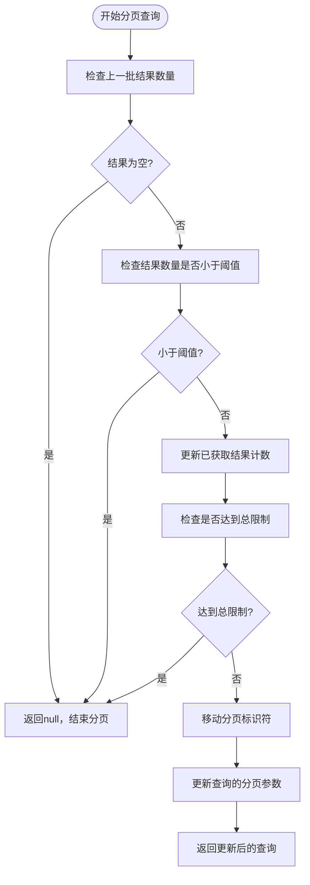
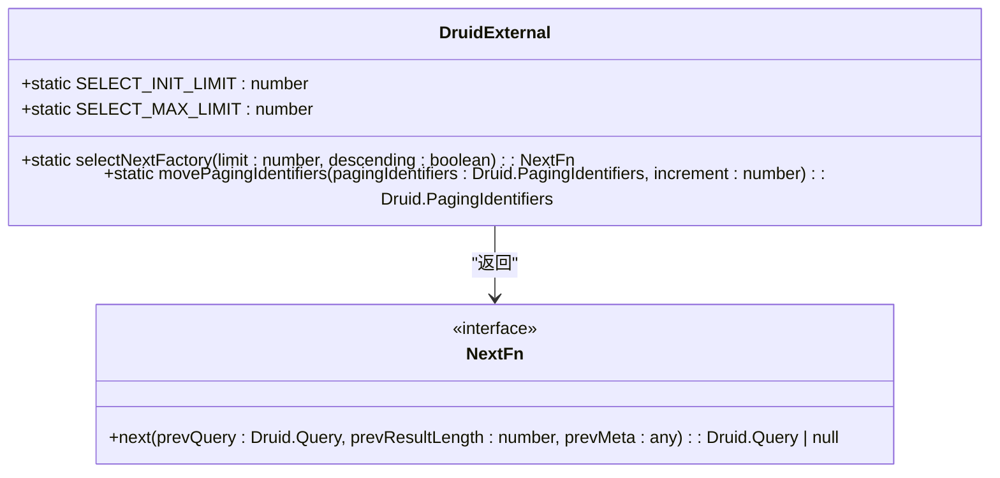
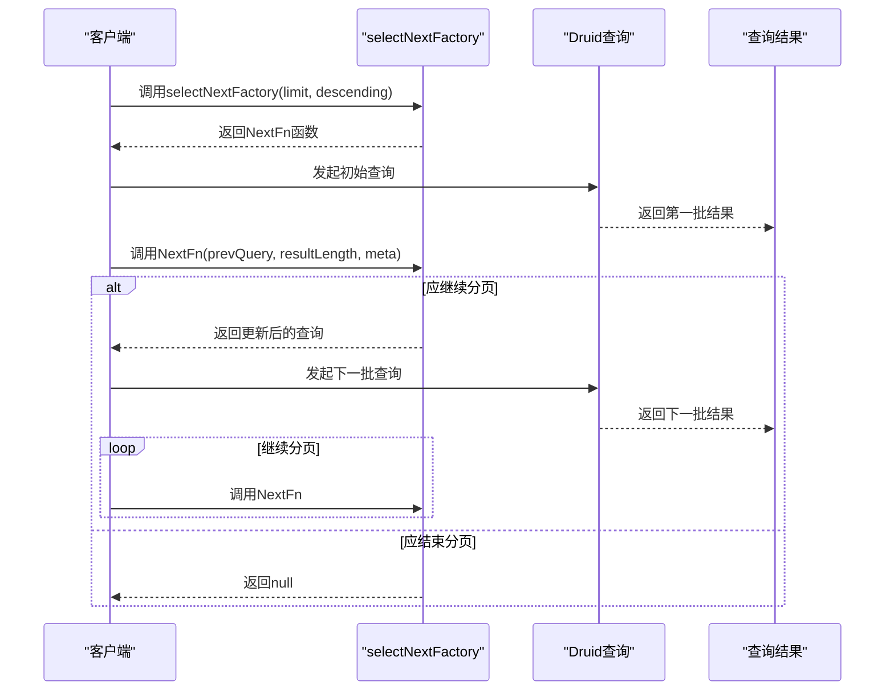

# 分页处理

<cite>
**本文档中引用的文件**   
- [druidExternal.ts](file://src/external/druidExternal.ts)
- [druidTypes.ts](file://src/external/utils/druidTypes.ts)
- [druidExpressionBuilder.ts](file://src/external/utils/druidExpressionBuilder.ts)
</cite>

## 目录
1. [引言](#引言)
2. [分页处理机制概述](#分页处理机制概述)
3. [selectNextFactory实现原理](#selectnextfactory实现原理)
4. [分页标识符的移动与结果计数](#分页标识符的移动与结果计数)
5. [阈值控制与常量作用](#阈值控制与常量作用)
6. [大规模数据集的分批获取](#大规模数据集的分批获取)
7. [性能特征与优化方向](#性能特征与优化方向)

## 引言
本文档全面解析Druid数据源的分页处理机制，重点阐述selectNextFactory的实现原理和工作流程。详细说明如何利用Druid的pagingIdentifiers实现结果集的连续获取，包括分页标识符的移动、结果计数、阈值控制等关键环节。解释SELECT_INIT_LIMIT和SELECT_MAX_LIMIT两个常量的作用及其对分页行为的影响。通过代码示例展示分页处理在实际查询中的应用，包括如何处理大规模数据集的分批获取。讨论分页处理的性能特征和潜在的优化方向。

## 分页处理机制概述
Druid数据源的分页处理机制通过selectNextFactory方法实现，该方法返回一个NextFn函数，用于生成下一个查询请求。分页处理的核心在于利用Druid查询结果中的pagingIdentifiers来追踪当前查询位置，并在后续请求中更新该标识符以获取下一批结果。整个机制涉及结果计数、阈值控制和分页标识符的移动等多个关键环节。

**Diagram sources**
- [druidExternal.ts](file://src/external/druidExternal.ts#L245-L271)

**Section sources**
- [druidExternal.ts](file://src/external/druidExternal.ts#L245-L271)

## selectNextFactory实现原理
selectNextFactory方法是Druid分页处理的核心，它接收limit和descending两个参数，返回一个NextFn函数。该函数在每次调用时会根据上一次查询的结果和元数据来决定是否继续分页以及如何构造下一个查询。实现原理主要包括以下几个步骤：首先检查上一批结果是否为空，如果为空则表示已获取所有结果，返回null结束分页；然后检查上一批结果数量是否小于查询阈值，如果小于阈值说明结果已全部返回，同样返回null；接着更新已获取结果的计数器，检查是否已达到总限制；最后更新分页标识符并构造新的查询请求。

**Section sources**
- [druidExternal.ts](file://src/external/druidExternal.ts#L245-L271)

## 分页标识符的移动与结果计数
分页标识符的移动通过movePagingIdentifiers静态方法实现，该方法接收当前的pagingIdentifiers和一个增量值作为参数。对于每个分段标识符，方法将其对应的偏移量增加指定的增量（向上分页为+1，向下分页为-1）。结果计数则通过resultsSoFar变量实现，该变量在selectNextFactory的闭包中被维护，每次成功获取一批结果后都会累加上一批结果的数量。当累计结果数量达到或超过limit参数指定的限制时，分页过程将终止。

**Diagram sources**
- [druidExternal.ts](file://src/external/druidExternal.ts#L245-L271)
- [druidExternal.ts](file://src/external/druidExternal.ts#L469-L479)

**Section sources**
- [druidExternal.ts](file://src/external/druidExternal.ts#L245-L271)
- [druidExternal.ts](file://src/external/druidExternal.ts#L469-L479)

## 阈值控制与常量作用
分页处理中的阈值控制通过SELECT_INIT_LIMIT和SELECT_MAX_LIMIT两个静态常量实现。SELECT_INIT_LIMIT定义了初始查询的限制数量，而SELECT_MAX_LIMIT则定义了单次查询的最大结果数量。在构造后续查询时，新的阈值被设置为剩余需要获取的结果数量与SELECT_MAX_LIMIT中的较小值，这确保了不会一次性请求过多数据，从而避免内存溢出和网络拥塞。这种动态调整阈值的机制使得分页处理既能高效获取数据，又能保持系统稳定性。

**Section sources**
- [druidExternal.ts](file://src/external/druidExternal.ts#L149-L150)

## 大规模数据集的分批获取
对于大规模数据集的分批获取，分页处理机制通过循环调用selectNextFactory返回的NextFn函数来实现。每次调用都会基于上一次查询的结果和元数据生成新的查询请求，直到满足终止条件为止。终止条件包括：上一批结果为空、上一批结果数量小于查询阈值、或已获取的结果总数达到limit限制。这种方式使得系统能够以可控的批次大小逐步获取大量数据，避免了一次性加载过多数据导致的性能问题。

**Diagram sources**
- [druidExternal.ts](file://src/external/druidExternal.ts#L245-L271)

**Section sources**
- [druidExternal.ts](file://src/external/druidExternal.ts#L245-L271)

## 性能特征与优化方向
Druid分页处理机制的性能特征主要体现在其内存效率和网络利用率上。由于采用分批获取的方式，系统内存占用相对稳定，不会随着数据集大小线性增长。网络传输也被分解为多个较小的请求，降低了单次请求的延迟。潜在的优化方向包括：优化分页标识符的序列化和反序列化过程，减少元数据传输开销；引入预测机制，根据历史查询模式动态调整批次大小；实现并行分页，允许多个分页流同时进行以提高吞吐量；以及增强错误恢复机制，确保在网络不稳定情况下的分页连续性。

**Section sources**
- [druidExternal.ts](file://src/external/druidExternal.ts#L245-L271)