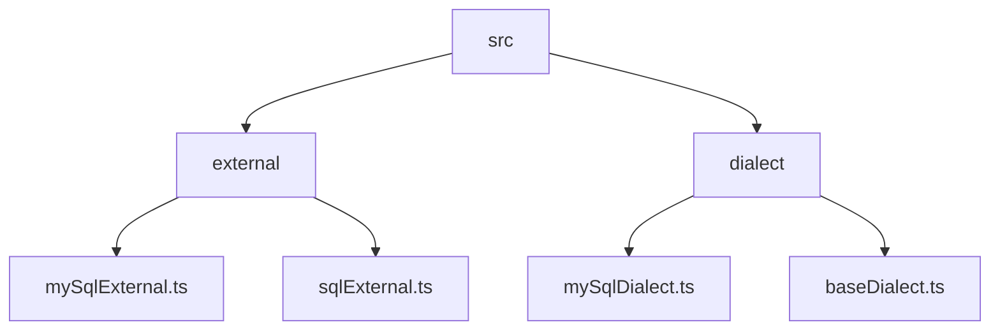
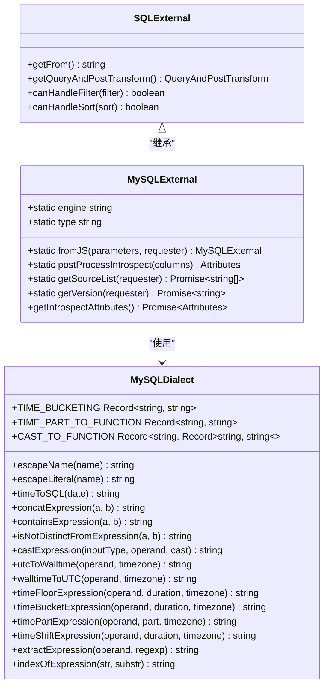
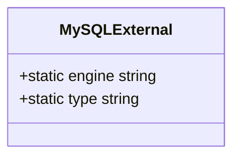
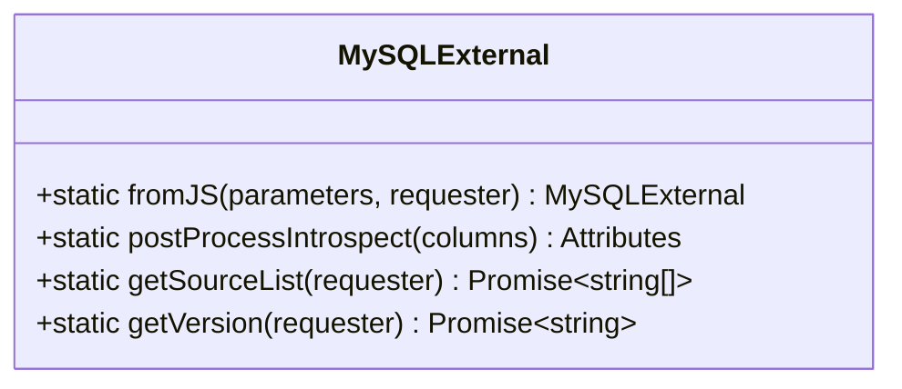
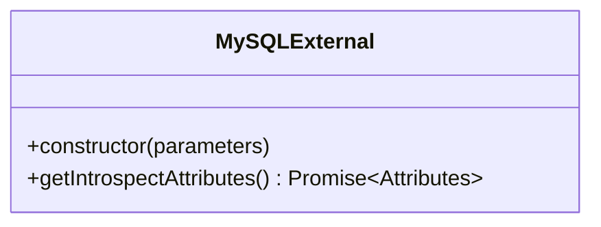
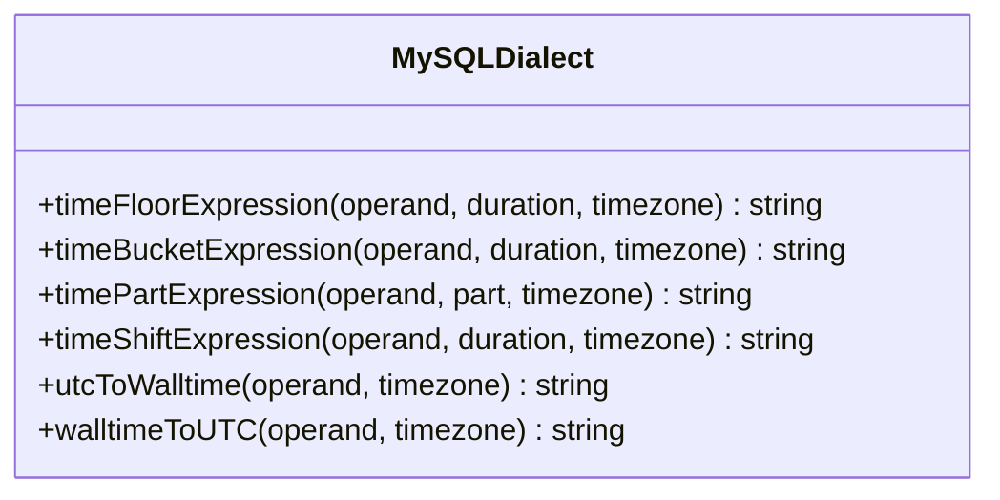
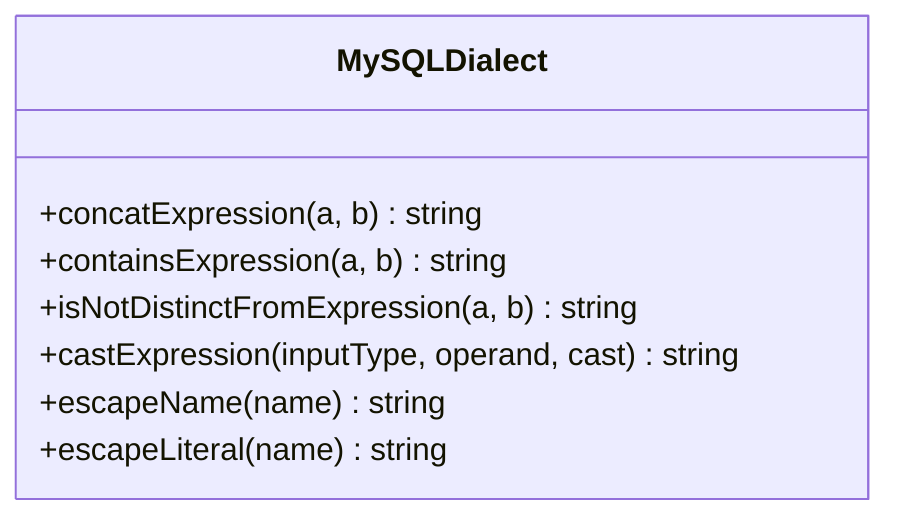
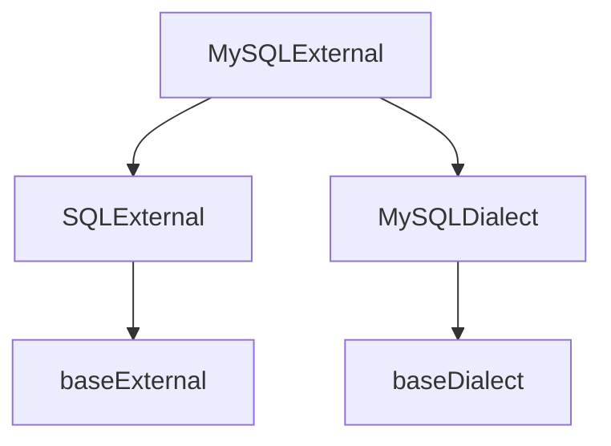

# MySQL数据源

<cite>
**本文档引用的文件**   
- [mySqlExternal.ts](file://src/external/mySqlExternal.ts)
- [mySqlDialect.ts](file://src/dialect/mySqlDialect.ts)
- [sqlExternal.ts](file://src/external/sqlExternal.ts)
- [baseExternal.ts](file://src/external/baseExternal.ts)
- [baseDialect.ts](file://src/dialect/baseDialect.ts)
- [test/info.js](file://test/info.js)
</cite>

## 目录
1. [简介](#简介)
2. [项目结构](#项目结构)
3. [核心组件](#核心组件)
4. [架构概述](#架构概述)
5. [详细组件分析](#详细组件分析)
6. [依赖分析](#依赖分析)
7. [性能考虑](#性能考虑)
8. [故障排除指南](#故障排除指南)
9. [结论](#结论)

## 简介
本文档详细介绍了Plywood项目中MySQL数据源适配器的实现。重点解析了`mySqlExternal.ts`文件中的`MySQLExternal`类，该类基于`SQLExternal`基类构建，提供了与MySQL数据库的集成能力。文档将深入探讨MySQL特有的元数据获取方式、数据类型映射规则以及SQL方言的实现细节。

## 项目结构
Plywood项目的目录结构清晰地组织了不同功能的代码模块。MySQL相关的实现主要分布在`src/external`和`src/dialect`目录下，其中`mySqlExternal.ts`和`mySqlDialect.ts`是核心文件。

**图表来源**
- [mySqlExternal.ts](file://src/external/mySqlExternal.ts)
- [mySqlDialect.ts](file://src/dialect/mySqlDialect.ts)
- [sqlExternal.ts](file://src/external/sqlExternal.ts)
- [baseDialect.ts](file://src/dialect/baseDialect.ts)

**章节来源**
- [mySqlExternal.ts](file://src/external/mySqlExternal.ts)
- [mySqlDialect.ts](file://src/dialect/mySqlDialect.ts)

## 核心组件
`MySQLExternal`类是MySQL数据源适配器的核心，它继承自`SQLExternal`基类，实现了MySQL特有的功能。该类负责处理与MySQL数据库的连接、查询构建、元数据获取等操作。

**章节来源**
- [mySqlExternal.ts](file://src/external/mySqlExternal.ts#L30-L117)

## 架构概述
MySQL数据源适配器的架构基于继承和组合模式，通过`MySQLExternal`类继承`SQLExternal`基类，并使用`MySQLDialect`类来处理MySQL特有的SQL生成逻辑。

**图表来源**
- [mySqlExternal.ts](file://src/external/mySqlExternal.ts#L30-L117)
- [mySqlDialect.ts](file://src/dialect/mySqlDialect.ts#L21-L172)

## 详细组件分析
### MySQLExternal类分析
`MySQLExternal`类是MySQL数据源适配器的主要实现，它继承了`SQLExternal`基类的功能，并添加了MySQL特有的实现。

#### 类定义和静态属性

**图表来源**
- [mySqlExternal.ts](file://src/external/mySqlExternal.ts#L26-L27)

#### 静态方法
`MySQLExternal`类提供了多个静态方法来处理MySQL特有的操作，包括从JS对象创建实例、处理元数据、获取源列表和版本信息。

**图表来源**
- [mySqlExternal.ts](file://src/external/mySqlExternal.ts#L34-L84)

#### 构造函数和实例方法
`MySQLExternal`类的构造函数初始化了MySQL方言实例，并确保了引擎类型正确。`getIntrospectAttributes`方法用于获取表的元数据。

**图表来源**
- [mySqlExternal.ts](file://src/external/mySqlExternal.ts#L105-L116)

### MySQLDialect类分析
`MySQLDialect`类实现了MySQL特有的SQL生成逻辑，包括时间处理、字符串处理、类型转换等功能。

#### 时间处理方法

**图表来源**
- [mySqlDialect.ts](file://src/dialect/mySqlDialect.ts#L113-L139)

#### 字符串和类型处理方法

**图表来源**
- [mySqlDialect.ts](file://src/dialect/mySqlDialect.ts#L76-L78)

**章节来源**
- [mySqlExternal.ts](file://src/external/mySqlExternal.ts#L30-L117)
- [mySqlDialect.ts](file://src/dialect/mySqlDialect.ts#L21-L172)

## 依赖分析
MySQL数据源适配器的实现依赖于多个核心组件，包括`SQLExternal`基类、`MySQLDialect`方言类以及基础的外部数据源类。

**图表来源**
- [mySqlExternal.ts](file://src/external/mySqlExternal.ts)
- [sqlExternal.ts](file://src/external/sqlExternal.ts)
- [mySqlDialect.ts](file://src/dialect/mySqlDialect.ts)
- [baseExternal.ts](file://src/external/baseExternal.ts)
- [baseDialect.ts](file://src/dialect/baseDialect.ts)

## 性能考虑
在使用MySQL数据源适配器时，应考虑连接池配置以提高性能。虽然文档中没有直接提及连接池配置，但通过`PlywoodRequester`接口可以实现连接池管理。

## 故障排除指南
当遇到MySQL连接或查询问题时，可以检查以下方面：
- 确保MySQL服务器版本与适配器兼容
- 检查连接参数是否正确
- 验证SQL查询语法是否符合MySQL规范

**章节来源**
- [test/info.js](file://test/info.js#L20-L24)

## 结论
本文档详细介绍了Plywood项目中MySQL数据源适配器的实现。通过继承`SQLExternal`基类并使用`MySQLDialect`方言类，`MySQLExternal`类成功实现了与MySQL数据库的集成。该适配器支持元数据获取、SQL查询构建、数据类型映射等核心功能，为Plywood项目提供了强大的MySQL数据源支持。