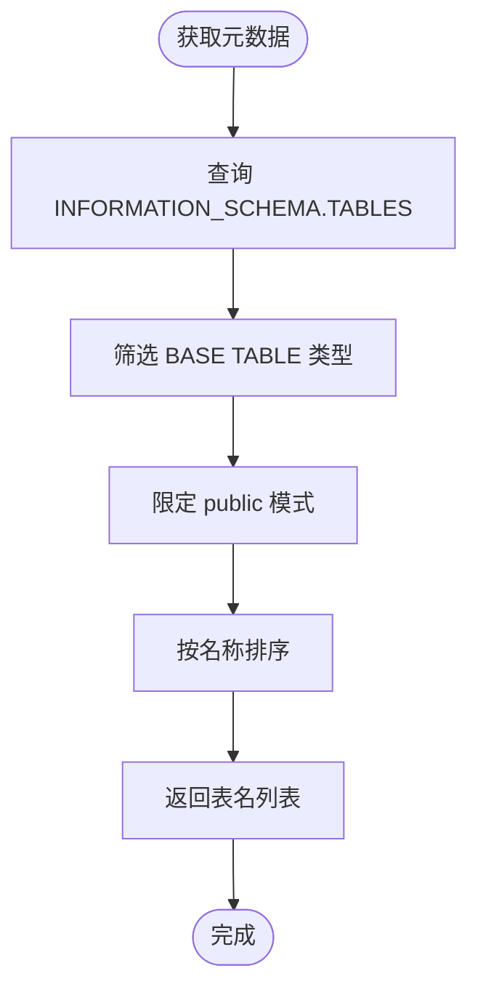
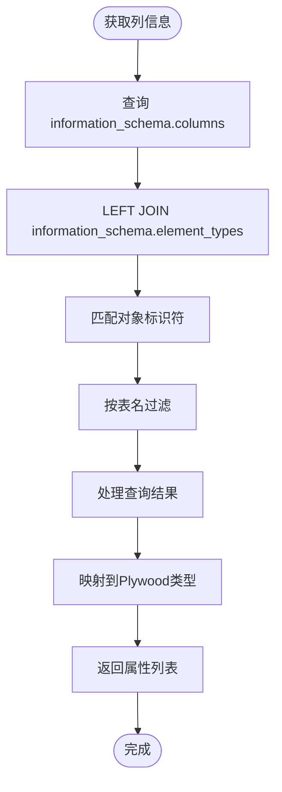
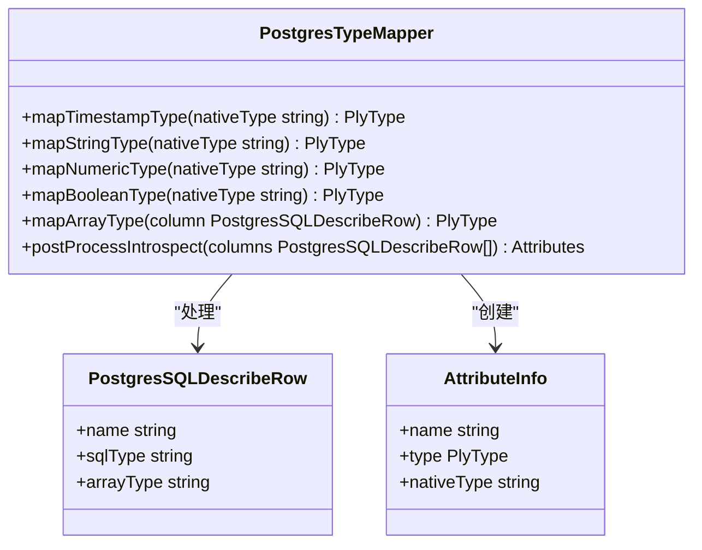
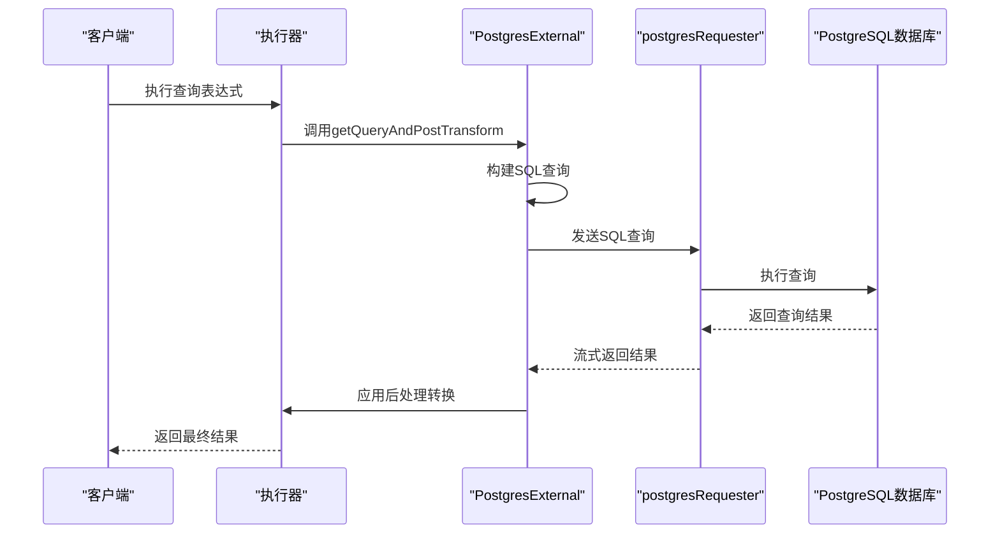
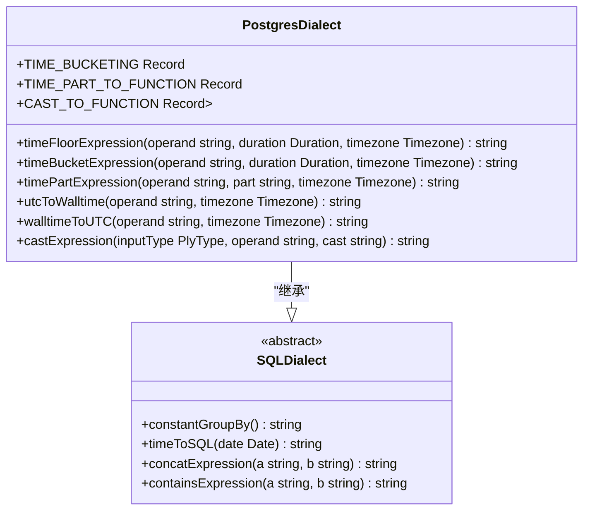
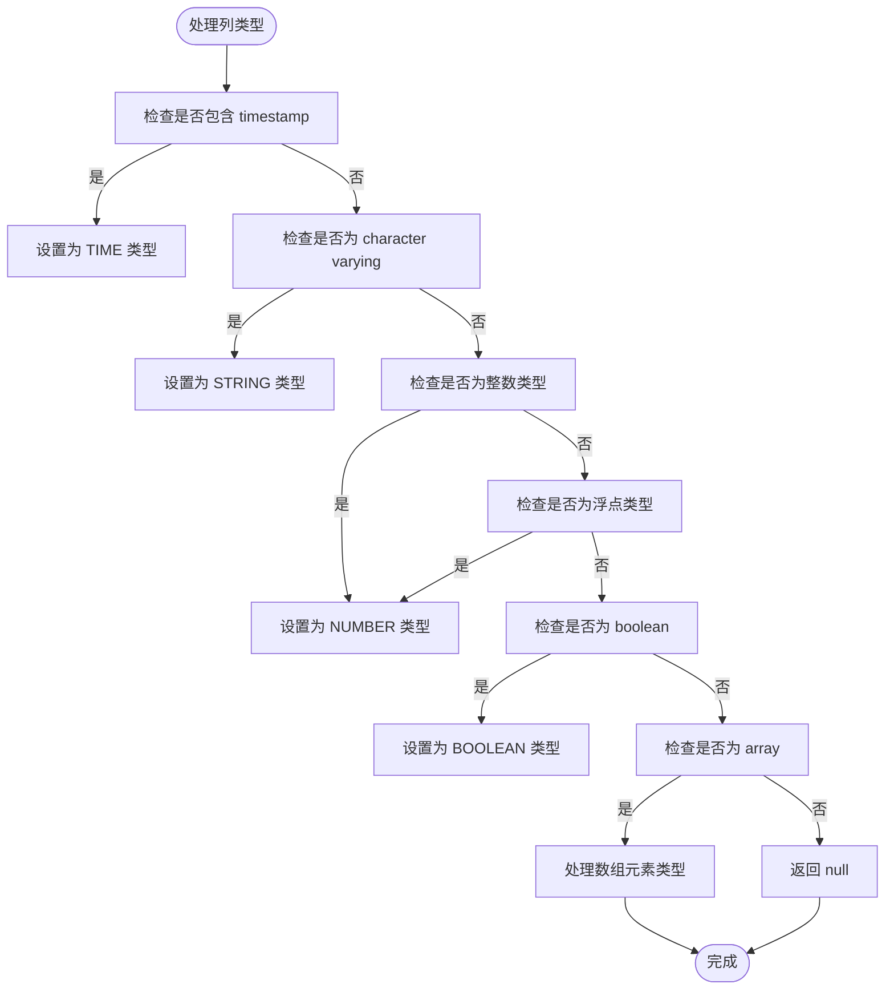

# PostgreSQL数据源

<cite>
**Referenced Files in This Document**   
- [postgresExternal.ts](file://src/external/postgresExternal.ts)
- [postgresDialect.ts](file://src/dialect/postgresDialect.ts)
- [sqlExternal.ts](file://src/external/sqlExternal.ts)
- [postgresFunctional.mocha.js](file://test/functional/postgresFunctional.mocha.js)
</cite>

## Table of Contents
1. [简介](#简介)
2. [元数据查询机制](#元数据查询机制)
3. [数据类型映射规则](#数据类型映射规则)
4. [连接配置与查询操作](#连接配置与查询操作)
5. [PostgreSQL方言特性](#postgresql方言特性)
6. [JSON/JSONB类型支持](#jsonjsonb类型支持)
7. [性能优化建议](#性能优化建议)

## 简介

PostgreSQL数据源适配器为Plywood框架提供了与PostgreSQL数据库的集成能力。该适配器通过`postgresExternal.ts`实现，继承自`SQLExternal`基类，专门处理PostgreSQL特有的数据库交互逻辑。适配器的核心功能包括元数据查询、数据类型映射、SQL生成和查询执行。

PostgreSQL适配器利用INFORMATION_SCHEMA系统视图来获取表结构信息，并通过`PostgresDialect`类处理PostgreSQL特有的SQL语法和函数。该适配器支持PostgreSQL的各种数据类型，包括基本类型、数组类型以及JSON/JSONB等复杂类型。

**Section sources**
- [postgresExternal.ts](file://src/external/postgresExternal.ts#L1-L20)
- [postgresDialect.ts](file://src/dialect/postgresDialect.ts#L1-L20)

## 元数据查询机制

PostgreSQL数据源适配器通过INFORMATION_SCHEMA系统视图实现元数据查询功能。适配器使用两个主要的元数据查询方法：`getSourceList`用于获取数据库中的表列表，`getIntrospectAttributes`用于获取特定表的列信息。

`getSourceList`方法通过查询`INFORMATION_SCHEMA.TABLES`视图来获取数据库中所有基础表的名称。查询语句限定表类型为'BASE TABLE'且表模式为'public'，确保只返回用户创建的表而非系统表或视图。

**Diagram sources**
- [postgresExternal.ts](file://src/external/postgresExternal.ts#L85-L95)

`getIntrospectAttributes`方法通过复杂的JOIN查询从`information_schema.columns`和`information_schema.element_types`视图中获取列的详细信息。该查询不仅获取列名和数据类型，还通过LEFT JOIN获取数组类型的元素类型，为后续的数据类型映射提供完整信息。

**Diagram sources**
- [postgresExternal.ts](file://src/external/postgresExternal.ts#L119-L138)

**Section sources**
- [postgresExternal.ts](file://src/external/postgresExternal.ts#L85-L138)

## 数据类型映射规则

PostgreSQL数据源适配器实现了详细的类型映射规则，将PostgreSQL的原生数据类型转换为Plywood框架使用的类型系统。类型映射在`postProcessIntrospect`静态方法中实现，该方法遍历查询结果并根据列的SQL类型确定相应的Plywood类型。

### 基本数据类型映射

对于基本数据类型，适配器采用直接映射策略：
- **timestamp类型**：包含"timestamp"关键字的类型映射为"TIME"类型
- **character varying类型**：映射为"STRING"类型
- **整数类型**：包括"integer"和"bigint"，映射为"NUMBER"类型
- **浮点类型**：包括"double precision"和"float"，映射为"NUMBER"类型
- **布尔类型**："boolean"类型映射为"BOOLEAN"类型

**Diagram sources**
- [postgresExternal.ts](file://src/external/postgresExternal.ts#L43-L83)

### 数组类型处理

PostgreSQL的数组类型处理是该适配器的一个重要特性。当列的SQL类型为"array"时，适配器会检查`arrayType`字段来确定数组元素的类型，并相应地映射为Plywood的SET类型：

- **字符数组**：元素类型为"character"时，映射为"SET/STRING"
- **时间数组**：元素类型为"timestamp"时，映射为"SET/TIME"
- **数字数组**：元素类型为整数或浮点类型时，映射为"SET/NUMBER"
- **布尔数组**：元素类型为"boolean"时，映射为"SET/BOOLEAN"

这种处理方式允许Plywood框架正确处理PostgreSQL中的数组列，将其视为集合类型进行查询和分析。

**Section sources**
- [postgresExternal.ts](file://src/external/postgresExternal.ts#L43-L83)

## 连接配置与查询操作

PostgreSQL数据源的配置主要通过连接参数和数据源定义来实现。适配器使用`PlywoodRequester`接口与PostgreSQL数据库进行通信，需要提供主机、数据库、用户名和密码等连接信息。

### 连接参数配置

连接参数通常在创建`postgresRequester`时指定，包括：
- **host**：PostgreSQL服务器地址
- **database**：目标数据库名称
- **user**：认证用户名
- **password**：认证密码

这些参数通过`postgresRequesterFactory`创建请求器实例，然后传递给`External.fromJS`方法来创建PostgreSQL外部数据源。

### 基本查询操作

通过功能测试文件中的示例，可以了解基本的查询操作模式。查询通常从创建数据集引用开始，然后应用过滤、聚合和分组等操作。

**Diagram sources**
- [postgresExternal.ts](file://src/external/postgresExternal.ts#L119-L138)
- [sqlExternal.ts](file://src/external/sqlExternal.ts#L140-L198)
- [postgresFunctional.mocha.js](file://test/functional/postgresFunctional.mocha.js#L100-L150)

**Section sources**
- [postgresExternal.ts](file://src/external/postgresExternal.ts#L119-L138)
- [sqlExternal.ts](file://src/external/sqlExternal.ts#L140-L198)
- [postgresFunctional.mocha.js](file://test/functional/postgresFunctional.mocha.js#L100-L150)

## PostgreSQL方言特性

`PostgresDialect`类专门处理PostgreSQL特有的SQL生成和转换逻辑，确保生成的SQL语句符合PostgreSQL的语法要求和最佳实践。

### 标识符转义

PostgreSQL方言实现了适当的标识符转义机制，确保表名和列名在SQL语句中正确引用。虽然具体实现细节未在代码中完全展示，但通过继承`SQLDialect`基类并重写相关方法，适配器能够处理PostgreSQL的标识符引用规则。

### 时间函数处理

PostgreSQL方言提供了完整的时间处理函数，包括时间截断、时间部分提取和时区转换等功能。`TIME_BUCKETING`静态映射定义了Plywood持续时间与PostgreSQL时间单位的对应关系，如"PT1H"映射为"hour"，"P1D"映射为"day"。

时区处理通过`utcToWalltime`和`walltimeToUTC`方法实现，使用PostgreSQL的AT TIME ZONE操作符进行时区转换。这确保了时间数据在UTC和本地时区之间的正确转换。

**Diagram sources**
- [postgresDialect.ts](file://src/dialect/postgresDialect.ts#L20-L158)

### 类型转换

类型转换通过`CAST_TO_FUNCTION`静态映射实现，定义了不同类型之间的转换规则。例如，将TIME类型转换为NUMBER类型时，使用`EXTRACT(EPOCH FROM $$) * 1000`表达式，将时间戳转换为毫秒数。

**Section sources**
- [postgresDialect.ts](file://src/dialect/postgresDialect.ts#L20-L158)

## JSON/JSONB类型支持

经过对代码库的全面搜索，当前实现中未发现对PostgreSQL JSON/JSONB类型的显式支持。在`postProcessIntrospect`方法的类型映射逻辑中，没有处理"json"或"jsonb"类型的分支，这意味着这些类型可能被映射为默认的"STRING"类型或被忽略。

**Diagram sources**
- [postgresExternal.ts](file://src/external/postgresExternal.ts#L43-L83)

这种缺失的JSON/JSONB支持可能限制了适配器处理复杂JSON数据的能力。在实际使用中，JSON/JSONB列将被视为普通字符串，无法利用PostgreSQL的JSON函数进行查询和分析。

**Section sources**
- [postgresExternal.ts](file://src/external/postgresExternal.ts#L43-L83)
- [grep_code results for JSON patterns](file://src/external/postgresExternal.ts#L43-L83)

## 性能优化建议

基于对代码实现的分析，以下是针对PostgreSQL数据源使用的性能优化建议：

### 查询性能问题

1. **元数据查询优化**：`getIntrospectAttributes`方法中的JOIN查询可能在大型数据库上性能较差。建议在生产环境中缓存元数据查询结果，避免频繁查询系统视图。

2. **数组类型处理**：数组类型的处理可能影响查询性能，特别是在进行聚合操作时。建议在可能的情况下，将频繁查询的数组数据扁平化存储。

3. **时间查询优化**：利用PostgreSQL的时间索引功能，确保时间列上有适当的索引，以提高时间范围查询的性能。

### 连接管理

1. **连接池**：确保使用连接池管理数据库连接，避免频繁创建和销毁连接带来的开销。

2. **查询超时**：设置合理的查询超时时间，防止长时间运行的查询影响系统整体性能。

3. **批量操作**：对于大量数据的读取操作，考虑使用流式处理而非一次性加载所有数据。

**Section sources**
- [postgresExternal.ts](file://src/external/postgresExternal.ts#L119-L138)
- [postgresDialect.ts](file://src/dialect/postgresDialect.ts#L20-L158)
- [postgresFunctional.mocha.js](file://test/functional/postgresFunctional.mocha.js#L100-L150)