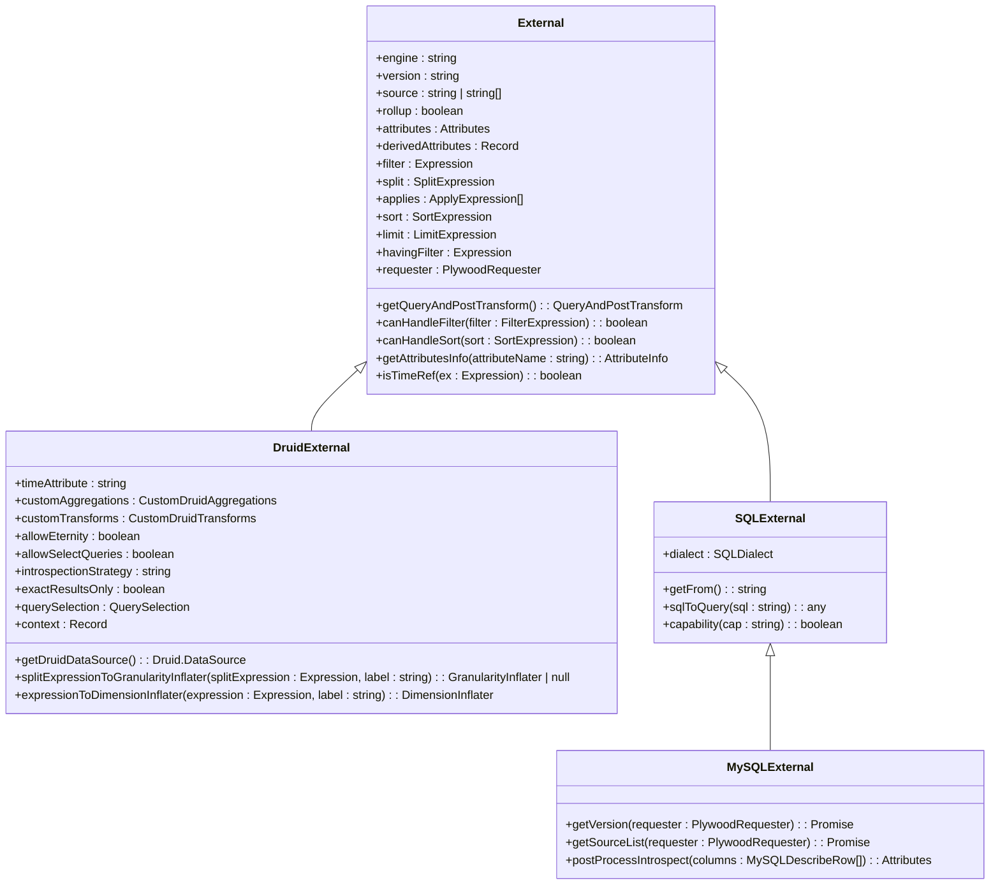
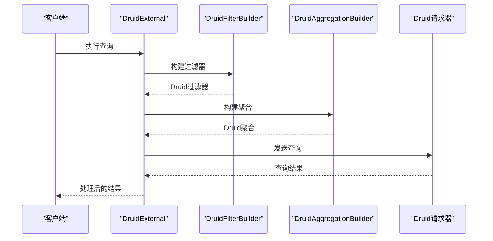
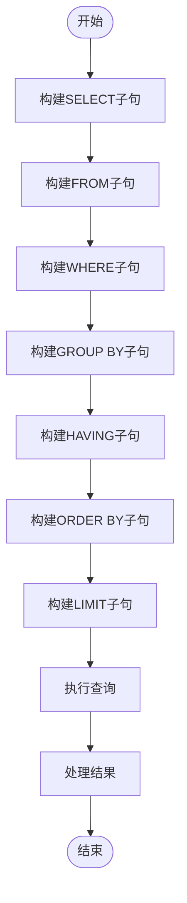
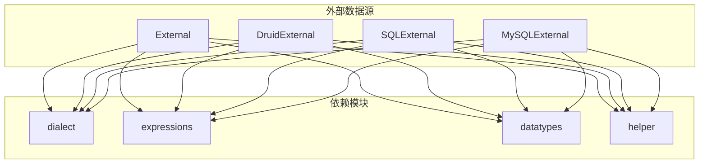

# 外部数据源

<cite>
**本文档引用的文件**   
- [baseExternal.ts](file://src/external/baseExternal.ts)
- [druidExternal.ts](file://src/external/druidExternal.ts)
- [mySqlExternal.ts](file://src/external/mySqlExternal.ts)
- [sqlExternal.ts](file://src/external/sqlExternal.ts)
- [druidDialect.ts](file://src/dialect/druidDialect.ts)
- [mySqlDialect.ts](file://src/dialect/mySqlDialect.ts)
- [druidFilterBuilder.ts](file://src/external/utils/druidFilterBuilder.ts)
- [druidAggregationBuilder.ts](file://src/external/utils/druidAggregationBuilder.ts)
</cite>

## 目录
1. [简介](#简介)
2. [项目结构](#项目结构)
3. [核心组件](#核心组件)
4. [架构概述](#架构概述)
5. [详细组件分析](#详细组件分析)
6. [依赖分析](#依赖分析)
7. [性能考虑](#性能考虑)
8. [故障排除指南](#故障排除指南)
9. [结论](#结论)

## 简介
本文档详细解析了Plywood中外部数据源适配器的设计模式，重点阐述了`baseExternal.ts`中定义的抽象基类和各具体实现（如`druidExternal.ts`、`mySqlExternal.ts`等）的差异化特性。文档深入探讨了Druid数据源适配器的特殊功能，包括对`subtotalsSpec`优化的支持和直接查询机制。同时，解释了SQL数据源（MySQL、PostgreSQL、ClickHouse）的通用查询构建和执行流程。通过代码示例展示了如何配置和使用不同类型的外部数据源，以及它们如何与查询方言协同工作。文档还包含了性能优化建议和常见问题解决方案。

## 项目结构
Plywood项目的外部数据源相关代码主要位于`src/external/`目录下，该目录包含了所有外部数据源适配器的实现。`baseExternal.ts`文件定义了所有外部数据源的抽象基类，而`druidExternal.ts`、`mySqlExternal.ts`、`postgresExternal.ts`和`clickHouseExternal.ts`等文件则分别实现了针对不同数据源的具体适配器。`sqlExternal.ts`文件为所有SQL类数据源提供了一个通用的基类。此外，`utils`子目录包含了用于构建Druid查询的辅助工具，如`druidFilterBuilder.ts`和`druidAggregationBuilder.ts`。`dialect`目录则包含了针对不同数据库的SQL方言实现，如`druidDialect.ts`和`mySqlDialect.ts`。

**Section sources**
- [baseExternal.ts](file://src/external/baseExternal.ts#L1-L100)
- [druidExternal.ts](file://src/external/druidExternal.ts#L1-L100)
- [mySqlExternal.ts](file://src/external/mySqlExternal.ts#L1-L100)
- [sqlExternal.ts](file://src/external/sqlExternal.ts#L1-L100)

## 核心组件
外部数据源的核心组件包括抽象基类`External`和具体的实现类。`External`类定义了所有外部数据源的公共接口和行为，包括查询构建、结果处理和元数据获取。具体的实现类如`DruidExternal`和`MySQLExternal`继承自`External`类，并根据各自数据源的特性实现了特定的查询逻辑和优化。

**Section sources**
- [baseExternal.ts](file://src/external/baseExternal.ts#L100-L500)
- [druidExternal.ts](file://src/external/druidExternal.ts#L100-L500)
- [mySqlExternal.ts](file://src/external/mySqlExternal.ts#L100-L500)

## 架构概述
Plywood的外部数据源架构采用抽象基类与具体实现相结合的设计模式。`External`类作为所有外部数据源的基类，提供了统一的接口和通用功能。具体的外部数据源适配器通过继承`External`类并重写相关方法来实现特定于数据源的功能。这种设计模式使得系统具有良好的扩展性，可以方便地添加新的数据源适配器。

**Diagram sources **
- [baseExternal.ts](file://src/external/baseExternal.ts#L500-L1000)
- [druidExternal.ts](file://src/external/druidExternal.ts#L500-L1000)
- [sqlExternal.ts](file://src/external/sqlExternal.ts#L500-L1000)
- [mySqlExternal.ts](file://src/external/mySqlExternal.ts#L500-L1000)

## 详细组件分析

### 基类分析
`External`类是所有外部数据源的抽象基类，它定义了外部数据源的基本属性和方法。该类提供了查询构建、结果处理和元数据获取的通用功能。`External`类的关键方法包括`getQueryAndPostTransform`，用于生成查询和结果处理管道；`canHandleFilter`和`canHandleSort`，用于检查是否支持特定的过滤和排序操作。

**Section sources**
- [baseExternal.ts](file://src/external/baseExternal.ts#L1000-L1500)

### Druid数据源分析
`DruidExternal`类是针对Druid数据源的具体实现。它继承自`External`类，并根据Druid的特性实现了特定的查询逻辑。`DruidExternal`类支持Druid特有的功能，如时间粒度聚合、维度提取和复杂过滤。该类还提供了对`subtotalsSpec`优化的支持，可以通过`subtotalsSpecQueryBuilder`和`subtotalsSpecExecutor`来实现高效的分组汇总查询。

**Diagram sources **
- [druidExternal.ts](file://src/external/druidExternal.ts#L1000-L1500)
- [druidFilterBuilder.ts](file://src/external/utils/druidFilterBuilder.ts#L1-L100)
- [druidAggregationBuilder.ts](file://src/external/utils/druidAggregationBuilder.ts#L1-L100)

### SQL数据源分析
`SQLExternal`类为所有SQL类数据源提供了一个通用的基类。它定义了SQL查询的通用构建逻辑，包括`SELECT`、`FROM`、`WHERE`、`GROUP BY`、`HAVING`、`ORDER BY`和`LIMIT`子句的生成。具体的SQL数据源适配器如`MySQLExternal`继承自`SQLExternal`类，并根据具体数据库的特性实现了特定的方言和功能。

**Diagram sources **
- [sqlExternal.ts](file://src/external/sqlExternal.ts#L1000-L1500)
- [mySqlExternal.ts](file://src/external/mySqlExternal.ts#L1000-L1500)

## 依赖分析
外部数据源组件依赖于多个其他模块，包括`dialect`模块用于SQL方言处理，`expressions`模块用于表达式解析和操作，`datatypes`模块用于数据类型定义，以及`helper`模块提供各种辅助功能。这些依赖关系确保了外部数据源能够正确地构建查询、处理结果和与底层数据源进行交互。

**Diagram sources **
- [baseExternal.ts](file://src/external/baseExternal.ts#L1500-L2000)
- [druidExternal.ts](file://src/external/druidExternal.ts#L1500-L2000)
- [sqlExternal.ts](file://src/external/sqlExternal.ts#L1500-L2000)
- [mySqlExternal.ts](file://src/external/mySqlExternal.ts#L1500-L2000)

## 性能考虑
在使用外部数据源时，应考虑以下性能优化建议：
1. 尽量使用`subtotalsSpec`优化来减少查询的复杂性和执行时间。
2. 对于Druid数据源，合理配置`allowEternity`和`exactResultsOnly`参数以平衡查询性能和结果准确性。
3. 对于SQL数据源，确保查询中的过滤条件和排序字段有适当的索引。
4. 使用`derivedAttributes`来预计算复杂的表达式，避免在查询时进行重复计算。
5. 合理使用`limit`和`sort`来控制查询结果的大小和顺序。

## 故障排除指南
在使用外部数据源时，可能会遇到以下常见问题：
1. **查询超时**：检查数据源的连接配置和网络状况，适当增加超时时间。
2. **结果不准确**：检查`exactResultsOnly`参数的设置，对于近似查询结果，可能需要调整查询逻辑。
3. **过滤条件无效**：确保过滤表达式中的字段名和数据类型正确，并且数据源支持该过滤操作。
4. **排序失败**：检查排序字段是否存在于查询结果中，并且数据源支持对该字段的排序。
5. **元数据获取失败**：检查数据源的连接权限和元数据查询语句的正确性。

**Section sources**
- [baseExternal.ts](file://src/external/baseExternal.ts#L2000-L2500)
- [druidExternal.ts](file://src/external/druidExternal.ts#L2000-L2500)
- [mySqlExternal.ts](file://src/external/mySqlExternal.ts#L2000-L2500)

## 结论
Plywood的外部数据源适配器设计模式具有良好的扩展性和灵活性，能够支持多种不同类型的数据源。通过抽象基类和具体实现的结合，系统能够统一处理各种数据源的共性，同时保留各自特性的灵活性。Druid数据源适配器的特殊功能，如`subtotalsSpec`优化和支持直接查询机制，为复杂分析场景提供了强大的支持。SQL数据源的通用查询构建和执行流程确保了与各种关系型数据库的兼容性。通过合理配置和使用这些外部数据源，可以实现高效、准确的数据分析。