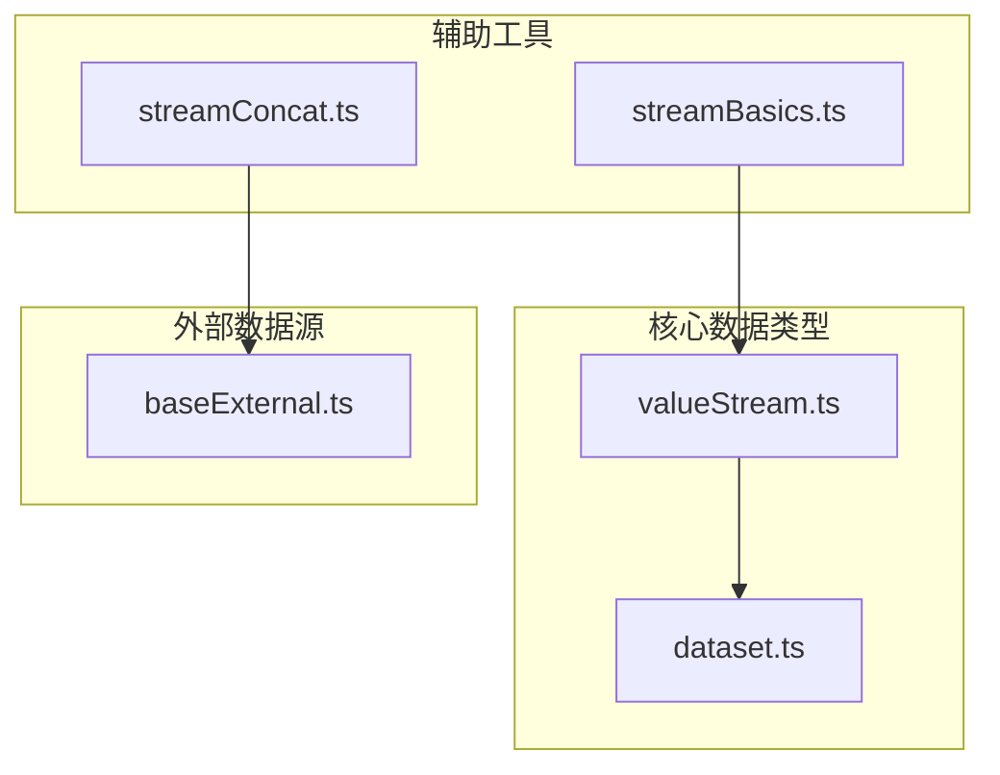
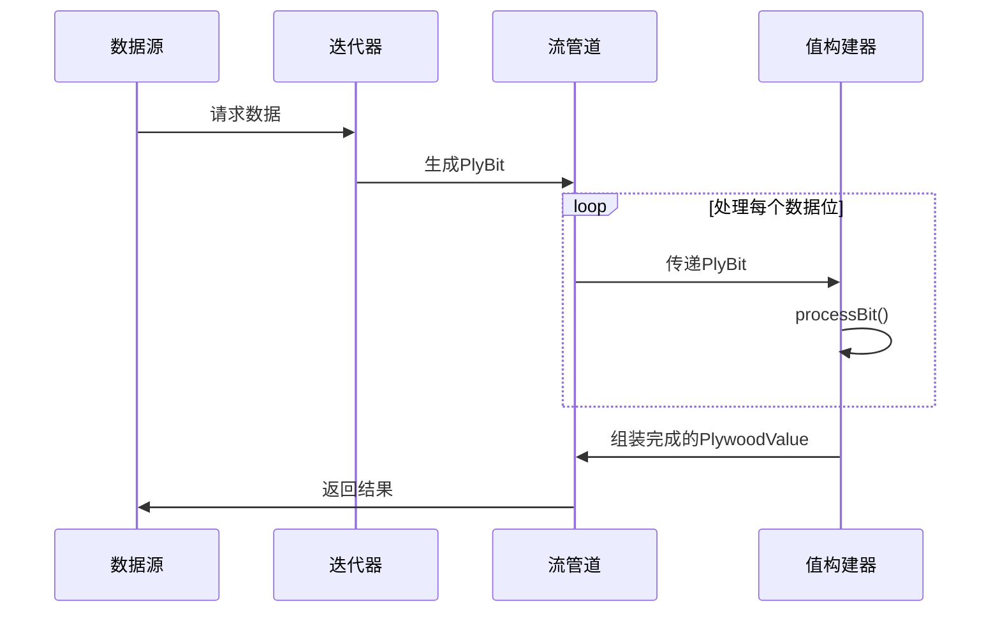
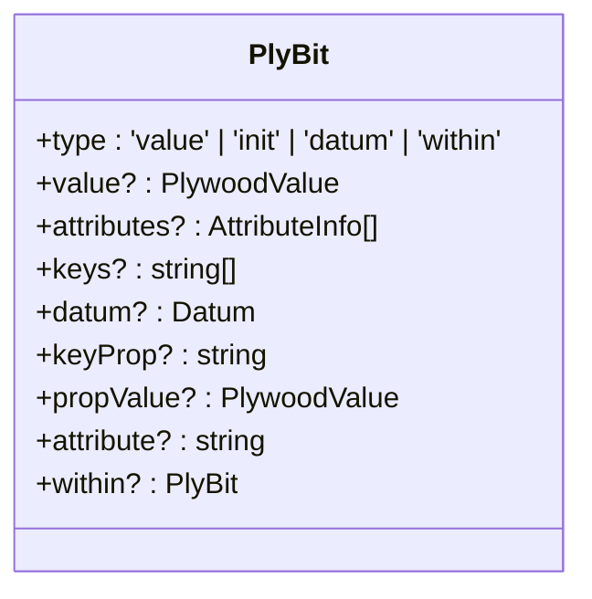
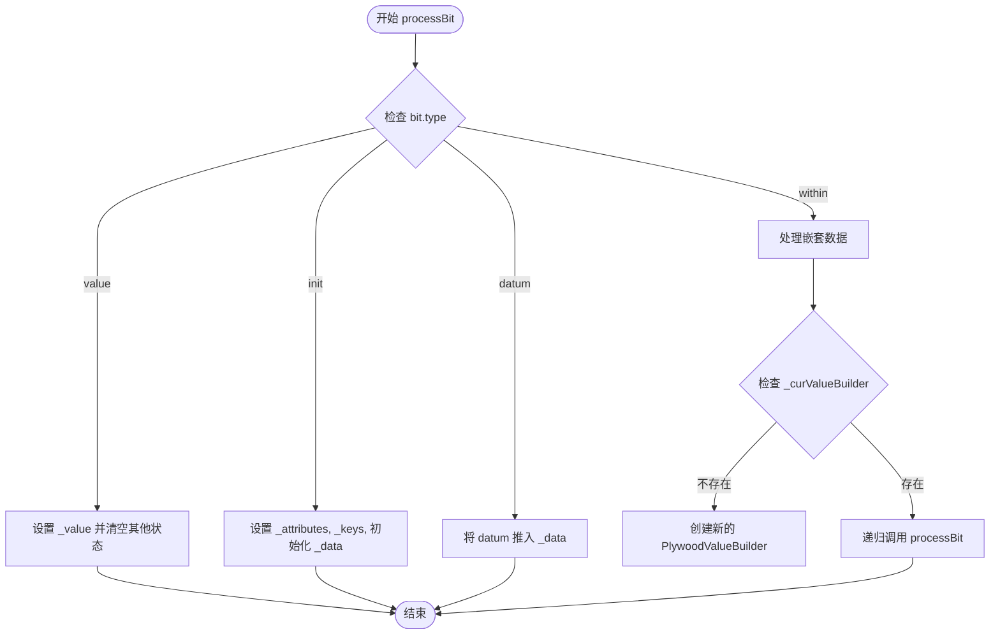
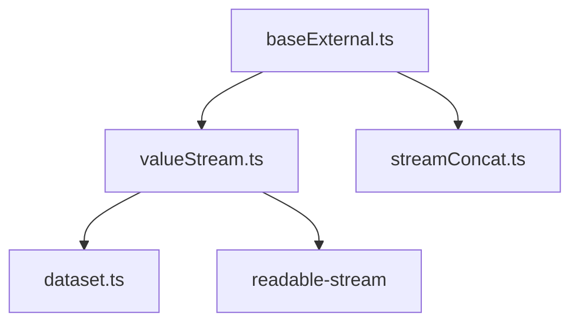

# 值流

<cite>
**本文档中引用的文件**
- [valueStream.ts](file://src/datatypes/valueStream.ts)
- [streamBasics.ts](file://src/helper/streamBasics.ts)
- [streamConcat.ts](file://src/helper/streamConcat.ts)
- [dataset.ts](file://src/datatypes/dataset.ts)
- [baseExternal.ts](file://src/external/baseExternal.ts)
</cite>

## 目录
1. [简介](#简介)
2. [项目结构](#项目结构)
3. [核心组件](#核心组件)
4. [架构概述](#架构概述)
5. [详细组件分析](#详细组件分析)
6. [依赖分析](#依赖分析)
7. [性能考虑](#性能考虑)
8. [故障排除指南](#故障排除指南)
9. [结论](#结论)

## 简介
本文档深入解析了Plywood中的值流（ValueStream）机制，这是一种基于Node.js的`readable-stream`库实现的流式数据处理系统。该机制旨在高效处理大数据集，通过背压（backpressure）处理策略和异步数据传递模式，有效避免内存溢出问题。文档将详细阐述`valueStream.ts`中定义的流式数据处理原理，展示如何创建、转换和消费值流，并说明其在外部查询执行、结果传输和实时数据处理场景中的应用。

## 项目结构
Plywood项目的结构清晰，主要功能模块分布在`src`目录下。`valueStream.ts`文件位于`src/datatypes/`目录中，是值流机制的核心实现。相关的辅助工具，如`ReadableError`和`StreamConcat`，则位于`src/helper/`目录下的`streamBasics.ts`和`streamConcat.ts`文件中。整个项目遵循模块化设计，便于维护和扩展。

**图表来源**
- [valueStream.ts](file://src/datatypes/valueStream.ts#L1-L193)
- [streamBasics.ts](file://src/helper/streamBasics.ts#L1-L35)
- [streamConcat.ts](file://src/helper/streamConcat.ts#L1-L46)
- [dataset.ts](file://src/datatypes/dataset.ts#L1-L1427)
- [baseExternal.ts](file://src/external/baseExternal.ts#L1-L1977)

**章节来源**
- [valueStream.ts](file://src/datatypes/valueStream.ts#L1-L193)
- [project_structure](file://project_structure#L1-L100)

## 核心组件
值流机制的核心是`PlywoodValueBuilder`类和`iteratorFactory`函数。`PlywoodValueBuilder`负责将流式数据位（`PlyBit`）逐步构建为完整的`PlywoodValue`对象，而`iteratorFactory`则负责为不同的数据类型（如普通值或`Dataset`）创建相应的迭代器，从而驱动数据流的产生。

**章节来源**
- [valueStream.ts](file://src/datatypes/valueStream.ts#L121-L191)
- [valueStream.ts](file://src/datatypes/valueStream.ts#L50-L59)

## 架构概述
值流的架构基于Node.js的流（Stream）模式，实现了生产者-消费者模型。数据从源头（如外部查询）以`PlyBit`的形式被生产，通过`Transform`流进行处理和转换，最终由`PlywoodValueBuilder`消费并组装成最终结果。这种架构支持大数据集的高效、低内存占用处理。

**图表来源**
- [valueStream.ts](file://src/datatypes/valueStream.ts#L121-L191)
- [valueStream.ts](file://src/datatypes/valueStream.ts#L50-L59)

## 详细组件分析

### PlyBit 数据位分析
`PlyBit`是值流中传递的基本数据单元，其类型决定了数据的含义和处理方式。它支持四种类型：`value`（传递一个简单的值）、`init`（初始化数据流，包含属性和键信息）、`datum`（传递一个数据行）和`within`（嵌套数据，用于处理`Dataset`中的子数据集）。

**图表来源**
- [valueStream.ts](file://src/datatypes/valueStream.ts#L29-L39)

### PlywoodValueBuilder 分析
`PlywoodValueBuilder`是值流的消费者，它通过`processBit`方法接收`PlyBit`，并根据其类型更新内部状态。当处理`Dataset`时，它会递归地为子`Dataset`创建新的`PlywoodValueBuilder`实例，从而实现对嵌套数据结构的流式处理。

**图表来源**
- [valueStream.ts](file://src/datatypes/valueStream.ts#L138-L172)

**章节来源**
- [valueStream.ts](file://src/datatypes/valueStream.ts#L121-L191)

### 辅助工具集成
`streamBasics.ts`和`streamConcat.ts`提供了构建更复杂流管道的基础工具。`ReadableError`可以创建一个立即发出错误的可读流，用于错误处理。`StreamConcat`则能将多个流按顺序连接起来，这对于分页查询等场景非常有用。

**章节来源**
- [streamBasics.ts](file://src/helper/streamBasics.ts#L18-L34)
- [streamConcat.ts](file://src/helper/streamConcat.ts#L1-L46)

## 依赖分析
值流机制深度依赖于`Dataset`数据结构和外部数据源（`External`）。`datasetIteratorFactory`函数直接利用`Dataset`的数据和属性来生成流。同时，`baseExternal.ts`中的`buildValueFromStream`和`valuePromiseToStream`方法证明了值流与外部查询系统的紧密集成，实现了查询结果与Plywood数据模型之间的无缝转换。

**图表来源**
- [valueStream.ts](file://src/datatypes/valueStream.ts#L1-L193)
- [baseExternal.ts](file://src/external/baseExternal.ts#L1-L1977)
- [streamConcat.ts](file://src/helper/streamConcat.ts#L1-L46)

**章节来源**
- [valueStream.ts](file://src/datatypes/valueStream.ts#L1-L193)
- [baseExternal.ts](file://src/external/baseExternal.ts#L1-L1977)

## 性能考虑
值流机制通过流式处理避免了将整个大数据集加载到内存中，这是其最主要的性能优势。背压机制确保了生产者不会过快地向消费者发送数据，防止了内存耗尽。为了获得最佳性能，应确保流管道中的每个处理步骤都尽可能高效，并避免在流中进行阻塞操作。

## 故障排除指南
常见的值流问题包括流中断和错误处理。如果流意外结束，应检查数据源是否正常关闭了流。对于错误处理，应始终为流添加`error`事件监听器。`ReadableError`类提供了一种方便的方式来在流的开始就发出错误，这在处理异步错误时非常有用。

**章节来源**
- [streamBasics.ts](file://src/helper/streamBasics.ts#L18-L34)
- [valueStream.ts](file://src/datatypes/valueStream.ts#L121-L191)

## 结论
Plywood的值流机制是一个强大且高效的流式数据处理系统。它通过巧妙地结合`readable-stream`库和自定义的`PlyBit`协议，实现了对大数据集的低内存、高吞吐量处理。该机制不仅支持基本的数据转换，还能通过`StreamConcat`等工具构建复杂的流式管道，是Plywood处理外部查询和实时数据的核心技术。