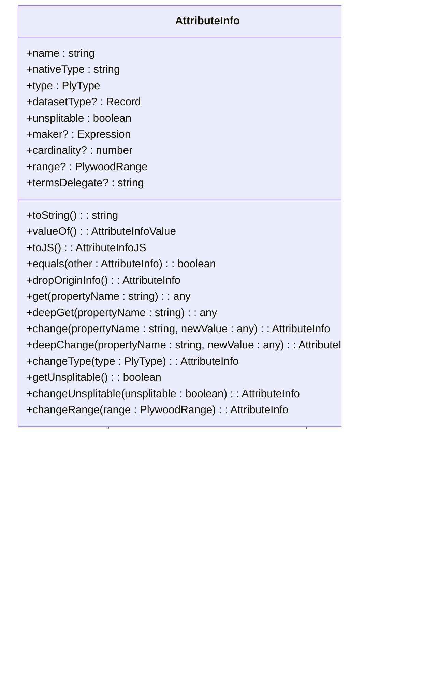
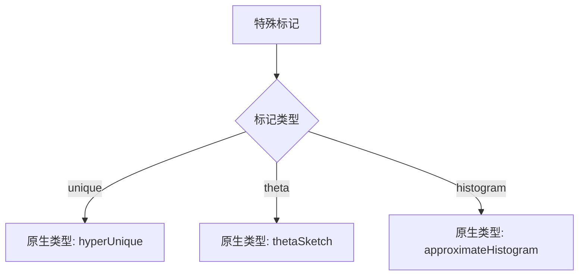
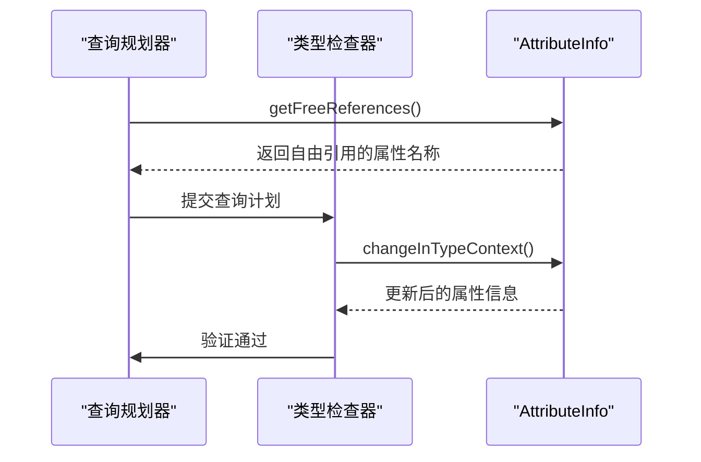
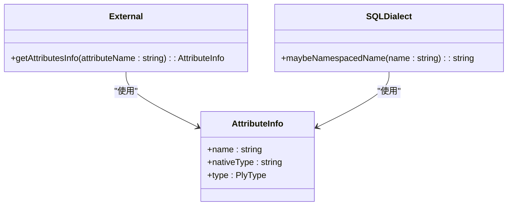

# 属性信息

<cite>
**Referenced Files in This Document**   
- [attributeInfo.ts](file://src/datatypes/attributeInfo.ts)
- [baseExternal.ts](file://src/external/baseExternal.ts)
- [baseDialect.ts](file://src/dialect/baseDialect.ts)
- [dataset.ts](file://src/datatypes/dataset.ts)
- [refExpression.ts](file://src/expressions/refExpression.ts)
- [types.ts](file://src/types.ts)
</cite>

## 目录
1. [简介](#简介)
2. [核心数据结构](#核心数据结构)
3. [属性元数据模型](#属性元数据模型)
4. [特殊标记与类型推断](#特殊标记与类型推断)
5. [在查询规划与类型检查中的作用](#在查询规划与类型检查中的作用)
6. [UI生成与表达式解析](#ui生成与表达式解析)
7. [与外部数据源和查询方言的集成](#与外部数据源和查询方言的集成)
8. [结论](#结论)

## 简介

`AttributeInfo` 是 Plywood 库中的一个核心类，用于定义和描述数据集（Dataset）中列或维度的结构特征。它作为一个属性元数据模型，不仅包含了字段的基本信息，如名称和数据类型，还通过一系列特殊标记（如主键、时间戳、唯一性等）来丰富其描述能力。`AttributeInfo` 在查询规划、类型检查、UI生成以及表达式解析和执行过程中扮演着至关重要的角色。通过 `AttributeInfo`，Plywood 能够实现跨不同数据库的元数据一致性，确保数据操作的正确性和高效性。

**Section sources**
- [attributeInfo.ts](file://src/datatypes/attributeInfo.ts#L1-L232)

## 核心数据结构

`AttributeInfo` 类定义了属性元数据模型的核心结构，包括字段名称、数据类型、原生类型、是否不可分割、生成器、基数、范围和术语委托等属性。这些属性共同构成了对数据集中列或维度的完整描述。



**Diagram sources**
- [attributeInfo.ts](file://src/datatypes/attributeInfo.ts#L26-L46)
- [attributeInfo.ts](file://src/datatypes/attributeInfo.ts#L49-L229)

**Section sources**
- [attributeInfo.ts](file://src/datatypes/attributeInfo.ts#L26-L229)

## 属性元数据模型

`AttributeInfo` 类通过其属性和方法提供了对数据集中列或维度的全面描述。每个 `AttributeInfo` 实例都包含一个 `name` 字段，用于标识该属性的名称。`type` 字段定义了该属性的数据类型，而 `nativeType` 字段则指定了该属性在底层数据存储中的原生类型。`unsplitable` 字段表示该属性是否可以被分割，这对于某些聚合操作尤为重要。`maker` 字段是一个表达式，用于生成该属性的值。`cardinality` 字段表示该属性的基数，即该属性的不同值的数量。`range` 字段定义了该属性的值域范围，而 `termsDelegate` 字段则指定了用于处理该属性术语的委托函数。

**Section sources**
- [attributeInfo.ts](file://src/datatypes/attributeInfo.ts#L49-L229)

## 特殊标记与类型推断

`AttributeInfo` 类通过 `NATIVE_TYPE_FROM_SPECIAL` 静态属性实现了特殊标记到原生类型的映射。例如，当一个属性被标记为 `unique` 时，其原生类型将被设置为 `hyperUnique`。这种映射机制允许 `AttributeInfo` 在创建时根据特殊标记自动推断出正确的原生类型，从而简化了元数据的配置过程。



**Diagram sources**
- [attributeInfo.ts](file://src/datatypes/attributeInfo.ts#L89-L89)

**Section sources**
- [attributeInfo.ts](file://src/datatypes/attributeInfo.ts#L89-L89)

## 在查询规划与类型检查中的作用

`AttributeInfo` 在查询规划和类型检查中发挥着关键作用。通过 `getFreeReferences` 方法，`AttributeInfo` 可以获取表达式中所有自由引用的属性名称，这有助于在查询规划阶段确定哪些属性需要被访问。此外，`AttributeInfo` 还提供了 `changeInTypeContext` 方法，用于在类型上下文中更新属性信息，确保类型检查的准确性。



**Diagram sources**
- [baseExpression.ts](file://src/expressions/baseExpression.ts#L702-L736)
- [refExpression.ts](file://src/expressions/refExpression.ts#L208-L212)

**Section sources**
- [baseExpression.ts](file://src/expressions/baseExpression.ts#L702-L736)
- [refExpression.ts](file://src/expressions/refExpression.ts#L208-L212)

## UI生成与表达式解析

`AttributeInfo` 还在 UI 生成和表达式解析中扮演重要角色。通过 `toJS` 和 `fromJS` 方法，`AttributeInfo` 可以方便地在 JavaScript 对象和 `AttributeInfo` 实例之间进行转换，这使得前端 UI 可以轻松地展示和编辑属性元数据。此外，`AttributeInfo` 的 `toString` 方法提供了属性的字符串表示形式，便于调试和日志记录。

```mermaid
flowchart LR
A[前端UI] --> B[AttributeInfo.toJS()]
B --> C[JavaScript对象]
C --> D[展示和编辑]
D --> E[AttributeInfo.fromJS()]
E --> F[AttributeInfo实例]
F --> G[后端处理]
```

**Diagram sources**
- [attributeInfo.ts](file://src/datatypes/attributeInfo.ts#L175-L183)
- [attributeInfo.ts](file://src/datatypes/attributeInfo.ts#L193-L202)

**Section sources**
- [attributeInfo.ts](file://src/datatypes/attributeInfo.ts#L175-L202)

## 与外部数据源和查询方言的集成

`AttributeInfo` 与外部数据源（External）和查询方言（Dialect）紧密集成，确保了跨数据库的元数据一致性。`External` 类通过 `getAttributesInfo` 方法获取 `AttributeInfo` 实例，从而在执行查询时能够正确地处理属性元数据。同时，`SQLDialect` 类通过 `maybeNamespacedName` 方法将 `AttributeInfo` 的名称转换为 SQL 查询中的命名空间名称，确保了 SQL 语句的正确生成。



**Diagram sources**
- [baseExternal.ts](file://src/external/baseExternal.ts#L760-L760)
- [baseDialect.ts](file://src/dialect/baseDialect.ts#L53-L55)

**Section sources**
- [baseExternal.ts](file://src/external/baseExternal.ts#L760-L760)
- [baseDialect.ts](file://src/dialect/baseDialect.ts#L53-L55)

## 结论

`AttributeInfo` 是 Plywood 库中不可或缺的一部分，它通过提供详细的属性元数据模型，支持了查询规划、类型检查、UI 生成和表达式解析等多个关键功能。通过与外部数据源和查询方言的集成，`AttributeInfo` 确保了跨数据库的元数据一致性，为数据操作的正确性和高效性提供了坚实的基础。

**Section sources**
- [attributeInfo.ts](file://src/datatypes/attributeInfo.ts#L1-L232)
- [baseExternal.ts](file://src/external/baseExternal.ts#L1-L1978)
- [baseDialect.ts](file://src/dialect/baseDialect.ts#L1-L175)