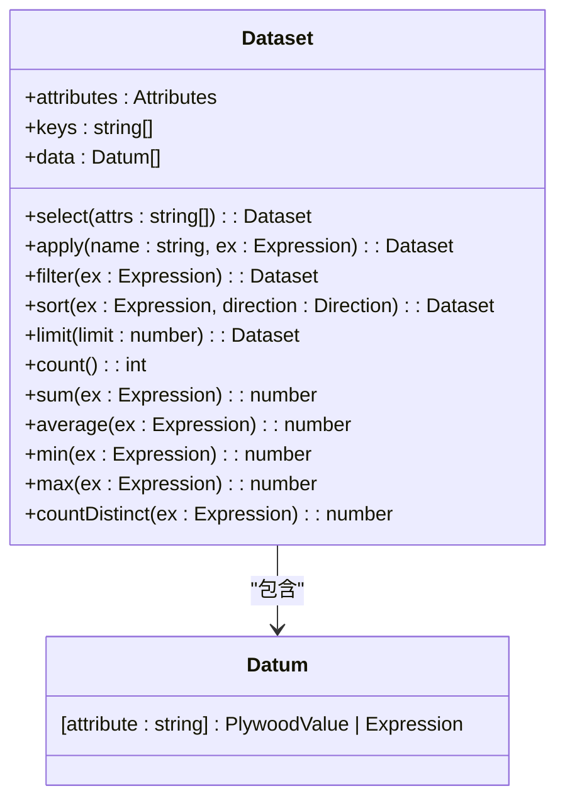
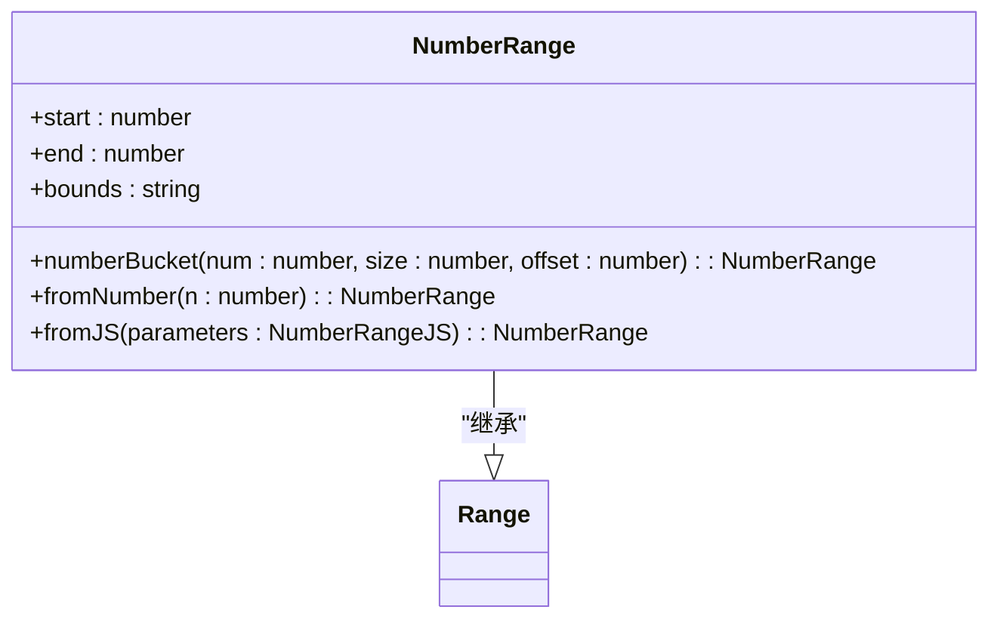
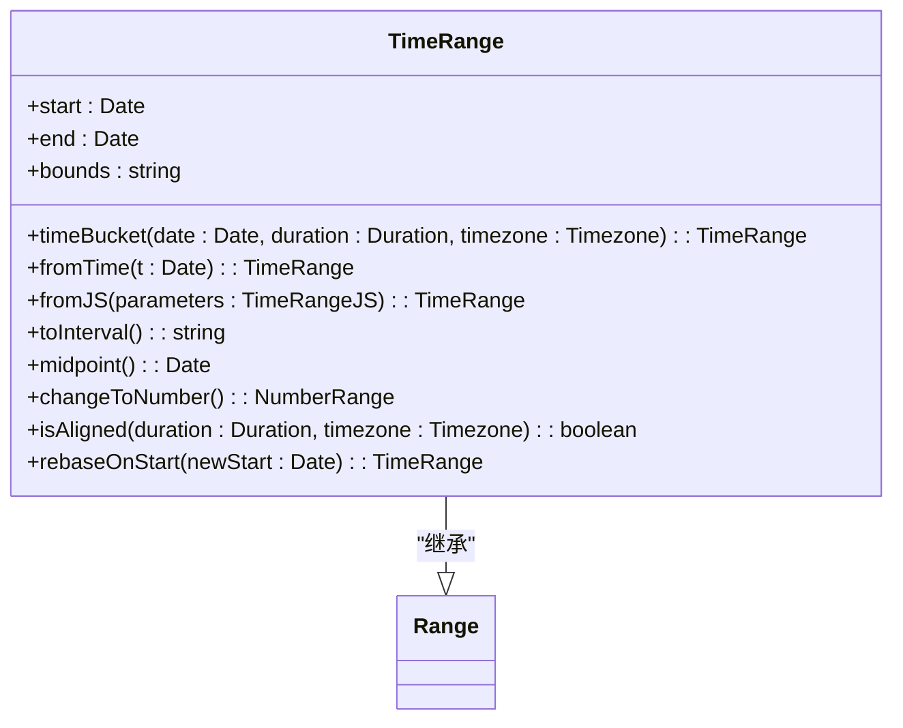
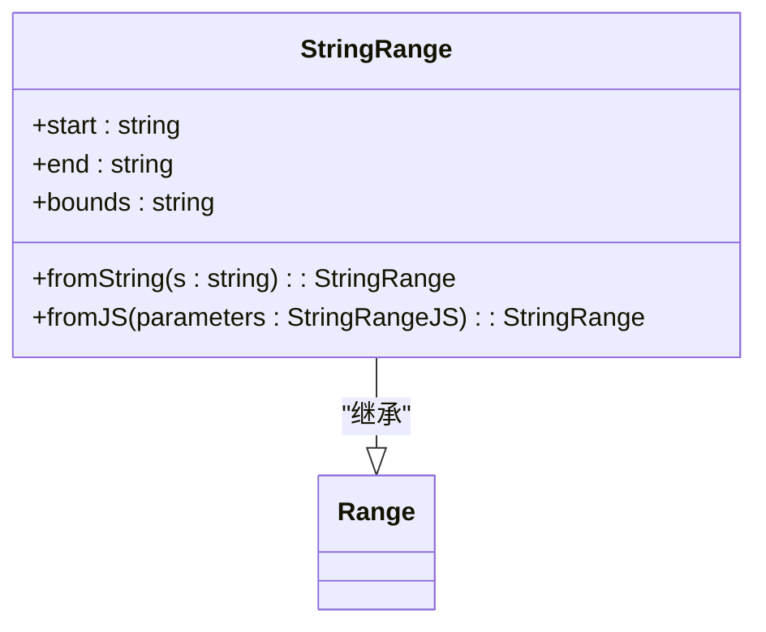
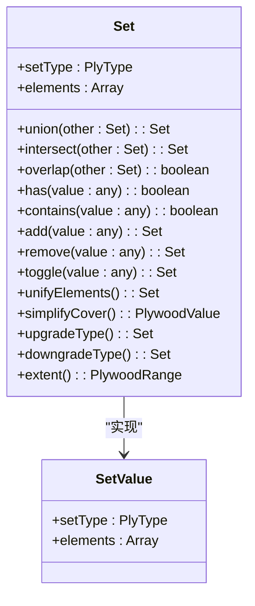
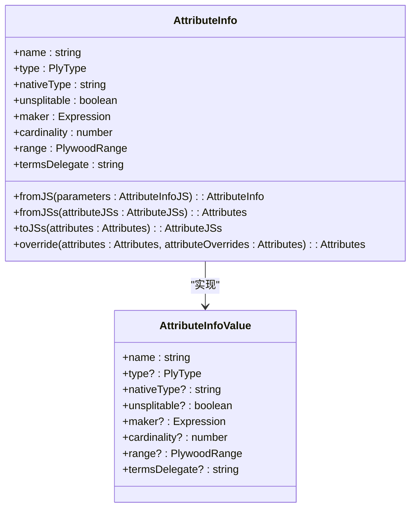
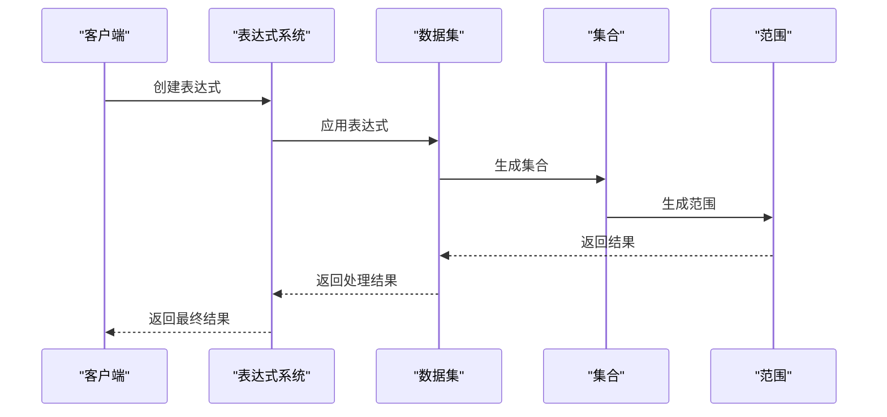

# 数据类型

<cite>
**本文档引用的文件**
- [dataset.ts](file://src/datatypes/dataset.ts)
- [set.ts](file://src/datatypes/set.ts)
- [attributeInfo.ts](file://src/datatypes/attributeInfo.ts)
- [valueStream.ts](file://src/datatypes/valueStream.ts)
- [timeRange.ts](file://src/datatypes/timeRange.ts)
- [numberRange.ts](file://src/datatypes/numberRange.ts)
- [stringRange.ts](file://src/datatypes/stringRange.ts)
- [range.ts](file://src/datatypes/range.ts)
- [common.ts](file://src/datatypes/common.ts)
</cite>

## 目录
1. [简介](#简介)
2. [数据集结构](#数据集结构)
3. [范围类型](#范围类型)
4. [集合类型](#集合类型)
5. [属性元数据](#属性元数据)
6. [流式数据处理](#流式数据处理)
7. [数据类型与表达式系统协同](#数据类型与表达式系统协同)
8. [总结](#总结)

## 简介
Plywood系统定义了一套核心数据类型，用于处理和分析结构化数据。这些数据类型包括数据集（Dataset）、范围（Range）和集合（Set）等，它们共同构成了系统的数据模型基础。本文档将详细介绍这些核心数据类型的实现和使用，重点阐述它们在查询处理中的作用和相互关系。

## 数据集结构
数据集（Dataset）是Plywood系统中的核心数据结构，用于表示和操作结构化数据。它由一组具有相同属性的记录（Datum）组成，每个记录包含多个属性值。数据集支持各种数据操作，如选择、过滤、排序和聚合等。



**图表来源**
- [dataset.ts](file://src/datatypes/dataset.ts)

**章节来源**
- [dataset.ts](file://src/datatypes/dataset.ts)

## 范围类型
Plywood系统定义了多种范围类型，用于表示数值、时间和字符串的区间。这些范围类型包括NumberRange、TimeRange和StringRange，它们都继承自基类Range。

### 数值范围
数值范围（NumberRange）用于表示数值的区间，支持开区间和闭区间的表示。



**图表来源**
- [numberRange.ts](file://src/datatypes/numberRange.ts)

**章节来源**
- [numberRange.ts](file://src/datatypes/numberRange.ts)

### 时间范围
时间范围（TimeRange）用于表示时间的区间，支持时间的对齐和转换操作。



**图表来源**
- [timeRange.ts](file://src/datatypes/timeRange.ts)

**章节来源**
- [timeRange.ts](file://src/datatypes/timeRange.ts)

### 字符串范围
字符串范围（StringRange）用于表示字符串的区间，支持字符串的比较和包含操作。



**图表来源**
- [stringRange.ts](file://src/datatypes/stringRange.ts)

**章节来源**
- [stringRange.ts](file://src/datatypes/stringRange.ts)

## 集合类型
集合（Set）是Plywood系统中的另一个重要数据类型，用于表示一组不重复的元素。集合支持各种集合操作，如并集、交集和差集等。



**图表来源**
- [set.ts](file://src/datatypes/set.ts)

**章节来源**
- [set.ts](file://src/datatypes/set.ts)

## 属性元数据
属性元数据（AttributeInfo）用于描述数据集中属性的类型和特性。它包含了属性的名称、类型、原生类型等信息，为数据的类型安全操作提供了基础。



**图表来源**
- [attributeInfo.ts](file://src/datatypes/attributeInfo.ts)

**章节来源**
- [attributeInfo.ts](file://src/datatypes/attributeInfo.ts)

## 流式数据处理
流式数据处理（ValueStream）是Plywood系统中用于处理流式数据的机制。它通过PlyBit接口表示数据流中的各种事件，支持数据的迭代和构建。

```mermaid
classDiagram
class PlywoodValueBuilder {
+processBit(bit : PlyBit)
+getValue() : PlywoodValue
}
class PlywoodValueIterator {
() : PlyBit | null
}
class PlyBit {
+type : 'value' | 'init' | 'datum' | 'within'
+value? : PlywoodValue
+attributes? : AttributeInfo[]
+keys? : string[]
+datum? : Datum
+keyProp? : string
+propValue? : PlywoodValue
+attribute? : string
+within? : PlyBit
}
PlywoodValueBuilder --> PlyBit : "处理"
PlywoodValueIterator --> PlyBit : "生成"
```

**图表来源**
- [valueStream.ts](file://src/datatypes/valueStream.ts)

**章节来源**
- [valueStream.ts](file://src/datatypes/valueStream.ts)

## 数据类型与表达式系统协同
Plywood的数据类型与表达式系统紧密协同，支持类型安全的查询构建。通过表达式系统，可以对数据集进行各种操作，如过滤、聚合和转换等。



**图表来源**
- [dataset.ts](file://src/datatypes/dataset.ts)
- [set.ts](file://src/datatypes/set.ts)
- [range.ts](file://src/datatypes/range.ts)

**章节来源**
- [dataset.ts](file://src/datatypes/dataset.ts)
- [set.ts](file://src/datatypes/set.ts)
- [range.ts](file://src/datatypes/range.ts)

## 总结
Plywood系统通过定义一套核心数据类型，为数据处理和分析提供了坚实的基础。这些数据类型包括数据集、范围和集合等，它们共同构成了系统的数据模型。通过与表达式系统的紧密协同，这些数据类型支持类型安全的查询构建，使得数据操作更加安全和高效。