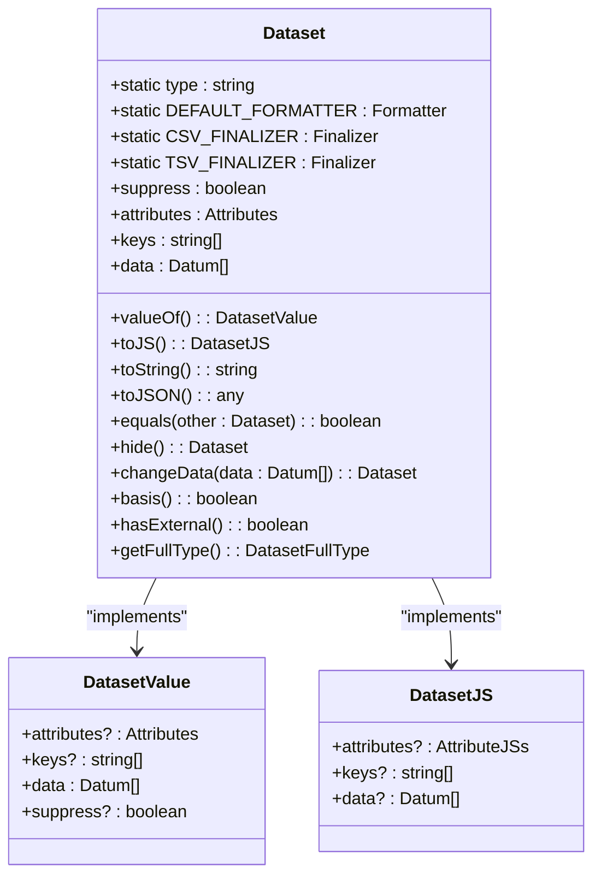
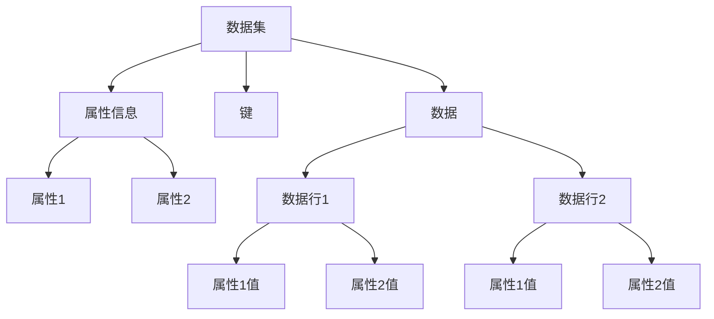
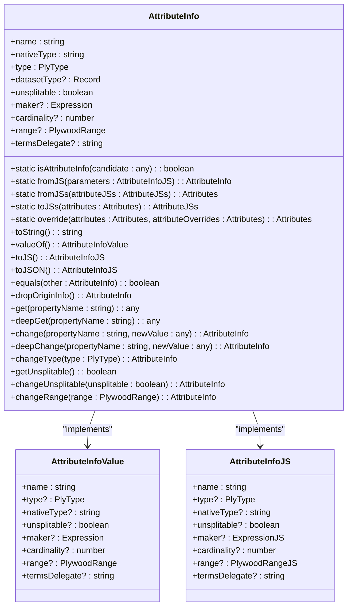
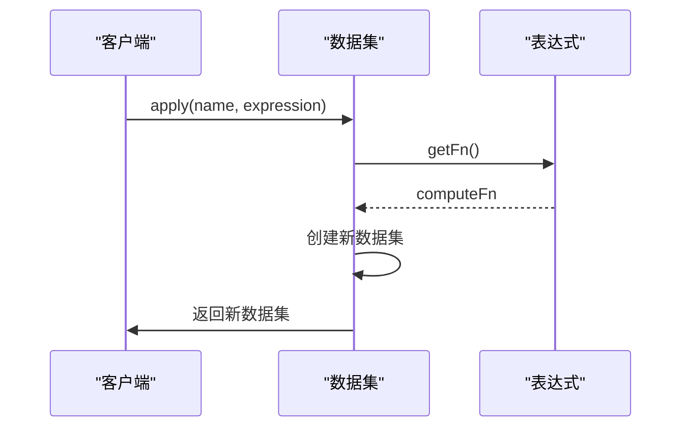
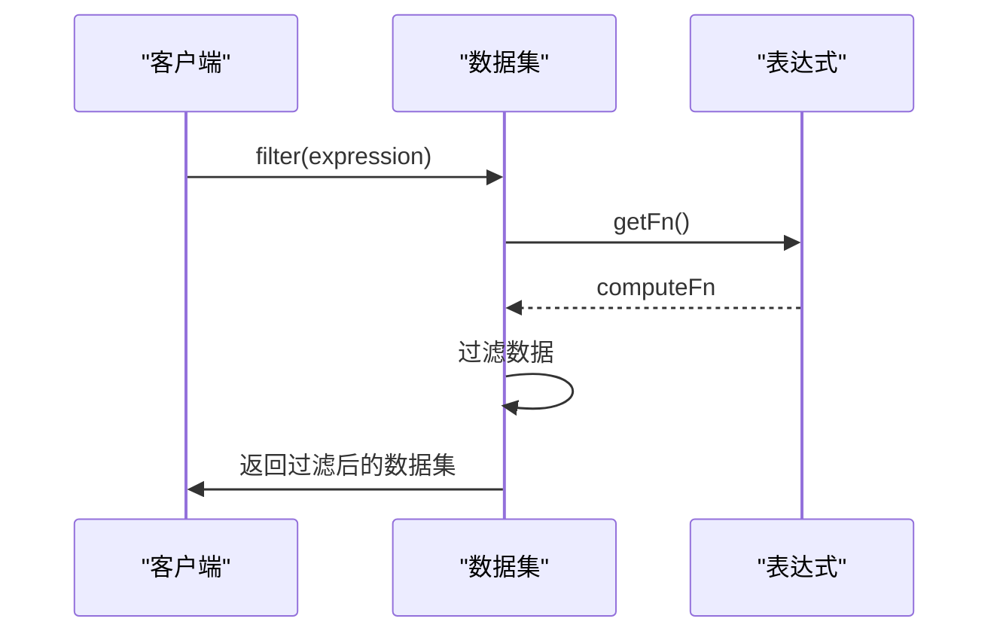
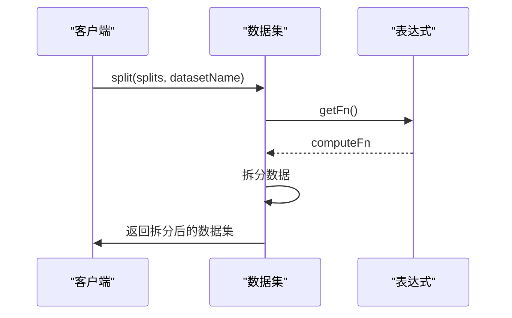
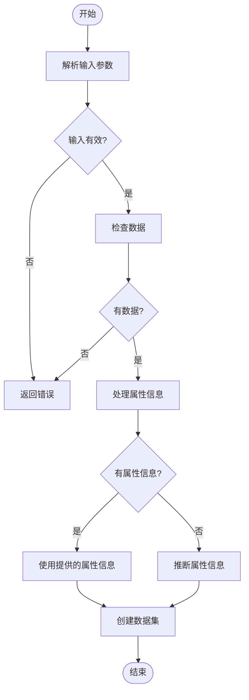
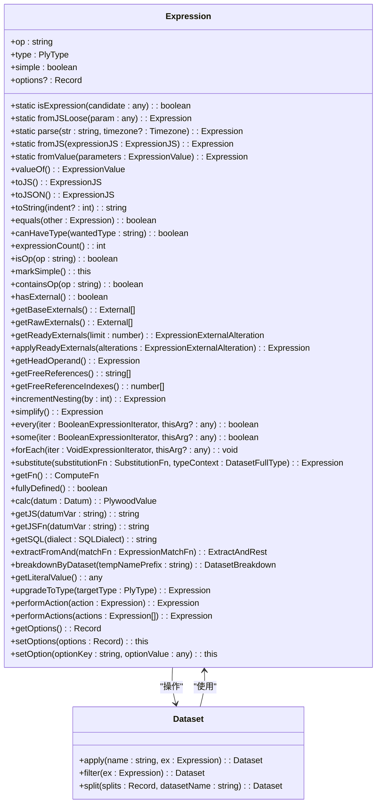
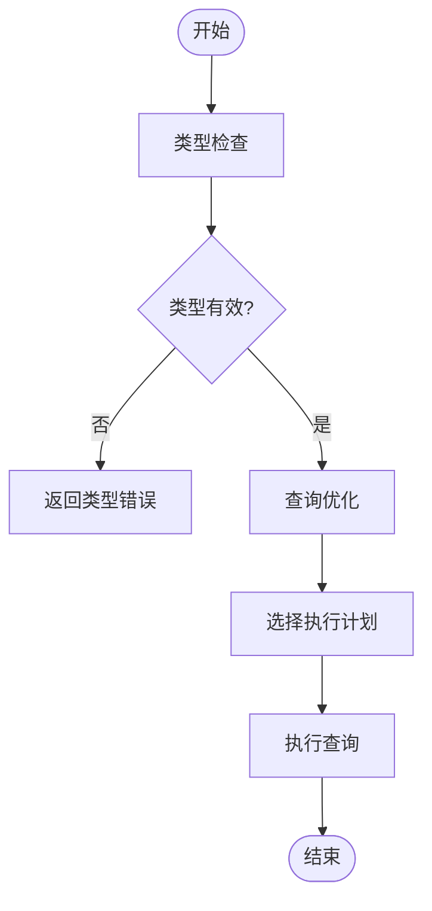

# 数据集

<cite>
**Referenced Files in This Document**   
- [dataset.ts](file://src/datatypes/dataset.ts)
- [attributeInfo.ts](file://src/datatypes/attributeInfo.ts)
- [baseExpression.ts](file://src/expressions/baseExpression.ts)
- [applyExpression.ts](file://src/expressions/applyExpression.ts)
- [filterExpression.ts](file://src/expressions/filterExpression.ts)
- [splitExpression.ts](file://src/expressions/splitExpression.ts)
- [baseExternal.ts](file://src/external/baseExternal.ts)
- [common.ts](file://src/datatypes/common.ts)
</cite>

## 目录
1. [简介](#简介)
2. [数据集结构与核心作用](#数据集结构与核心作用)
3. [数据组织方式](#数据组织方式)
4. [属性信息关联机制](#属性信息关联机制)
5. [数据集操作方法](#数据集操作方法)
6. [数据加载与构建](#数据加载与构建)
7. [表达式系统集成](#表达式系统集成)
8. [类型检查与查询优化](#类型检查与查询优化)
9. [常见问题解决方案](#常见问题解决方案)
10. [附录](#附录)

## 简介
Plywood数据集（Dataset）是该框架中的核心数据结构，作为查询结果的容器，它提供了丰富的数据操作功能。数据集以行和列的形式组织数据，并通过AttributeInfo与属性信息建立关联。通过apply、filter、split等方法，可以对数据集进行各种转换和操作。数据集与执行器和表达式系统紧密集成，在类型检查和查询优化中发挥重要作用。

**Section sources**
- [dataset.ts](file://src/datatypes/dataset.ts#L313-L1425)

## 数据集结构与核心作用
数据集（Dataset）是Plywood框架中的核心类，实现了Instance接口，用于表示和操作数据。它作为查询结果的容器，存储了数据的属性信息、键和实际数据。数据集的结构由DatasetValue定义，包含attributes、keys和data三个主要属性。其中，attributes是属性信息数组，keys是键数组，data是实际数据数组。

数据集的核心作用是作为数据操作的基础容器，支持各种数据转换和查询操作。通过getFullType方法，可以获取数据集的完整类型信息，这对于类型检查和查询优化至关重要。

**Diagram sources **
- [dataset.ts](file://src/datatypes/dataset.ts#L313-L1425)

**Section sources**
- [dataset.ts](file://src/datatypes/dataset.ts#L313-L1425)

## 数据组织方式
数据集以行和列的方式组织数据，其中每一行代表一个数据记录（Datum），每一列代表一个属性。数据集的结构由attributes属性定义，它是一个AttributeInfo数组，每个AttributeInfo对象描述了一个属性的名称、类型和其他元数据。

数据集的data属性是一个Datum数组，每个Datum对象代表一行数据。Datum是一个键值对集合，其中键是属性名，值是属性值。这种组织方式使得数据集可以灵活地表示各种结构化数据。

数据集支持嵌套结构，即一个属性的值可以是另一个数据集。这种嵌套结构通过Dataset类型实现，允许构建复杂的数据层次。通过flatten方法，可以将嵌套的数据集展平为平面结构，便于分析和处理。

**Diagram sources **
- [dataset.ts](file://src/datatypes/dataset.ts#L313-L1425)

**Section sources**
- [dataset.ts](file://src/datatypes/dataset.ts#L313-L1425)

## 属性信息关联机制
数据集通过AttributeInfo类与属性信息建立关联。AttributeInfo类定义了属性的元数据，包括名称、类型、原生类型、是否不可分割等。每个属性在数据集中都有一个对应的AttributeInfo对象，用于描述该属性的特征。

AttributeInfo类提供了fromJS和toJS方法，用于在JavaScript对象和AttributeInfo实例之间进行转换。这使得属性信息可以方便地序列化和反序列化。通过getAttributesFromData方法，数据集可以根据实际数据自动推断属性信息。

属性信息的关联机制使得数据集能够进行类型检查和查询优化。例如，在执行查询时，系统可以根据属性信息验证查询的合法性，并选择最优的执行计划。

**Diagram sources **
- [attributeInfo.ts](file://src/datatypes/attributeInfo.ts#L1-L232)

**Section sources**
- [attributeInfo.ts](file://src/datatypes/attributeInfo.ts#L1-L232)

## 数据集操作方法
数据集提供了丰富的操作方法，包括apply、filter、split等，用于对数据进行转换和处理。

### apply方法
apply方法用于在数据集上应用一个表达式，并将结果作为新列添加到数据集中。该方法接受一个名称和一个表达式作为参数，返回一个新的数据集。新列的名称由第一个参数指定，值由表达式计算得出。

**Diagram sources **
- [dataset.ts](file://src/datatypes/dataset.ts#L620-L629)
- [applyExpression.ts](file://src/expressions/applyExpression.ts#L1-L153)

### filter方法
filter方法用于根据一个布尔表达式过滤数据集中的行。该方法接受一个表达式作为参数，返回一个新的数据集，只包含满足条件的行。

**Diagram sources **
- [dataset.ts](file://src/datatypes/dataset.ts#L664-L673)
- [filterExpression.ts](file://src/expressions/filterExpression.ts#L1-L90)

### split方法
split方法用于根据一个或多个表达式将数据集拆分为子数据集。该方法接受一个拆分表达式映射和一个数据集名称作为参数，返回一个新的数据集，其中包含拆分后的子数据集。

**Diagram sources **
- [dataset.ts](file://src/datatypes/dataset.ts#L866-L883)
- [splitExpression.ts](file://src/expressions/splitExpression.ts#L1-L296)

**Section sources**
- [dataset.ts](file://src/datatypes/dataset.ts#L486-L500)

## 数据加载与构建
数据集可以通过多种方式从外部数据源加载和构建。最常用的方法是使用fromJS静态方法，它接受一个JavaScript对象或数组作为参数，并将其转换为数据集。

fromJS方法首先检查输入参数，如果是数组，则将其包装为包含data属性的对象。然后，它根据提供的属性信息或通过数据推断来确定数据集的结构。最后，它使用datumFromJS方法将每个数据行转换为Datum对象，并创建一个新的数据集实例。

除了fromJS方法，数据集还支持从JSON字符串解析数据。parseJSON方法可以处理标准JSON数组和行JSON格式，将其转换为JavaScript对象数组，然后使用fromJS方法创建数据集。

**Diagram sources **
- [dataset.ts](file://src/datatypes/dataset.ts#L354-L354)

**Section sources**
- [dataset.ts](file://src/datatypes/dataset.ts#L354-L354)

## 表达式系统集成
数据集与Plywood的表达式系统紧密集成。表达式系统提供了一种声明式的方式来描述数据操作，而数据集则是这些操作的执行目标。

数据集的许多方法，如apply、filter、split等，都接受表达式作为参数。这些表达式在执行时会被转换为计算函数（ComputeFn），然后应用于数据集的每一行。通过这种集成，用户可以使用统一的表达式语言来描述复杂的数据转换和查询。

表达式系统还支持外部表达式（ExternalExpression），允许将数据集操作委托给外部系统执行。这对于处理大规模数据集或利用特定数据库的优化功能非常有用。

**Diagram sources **
- [baseExpression.ts](file://src/expressions/baseExpression.ts#L1-L2776)

**Section sources**
- [baseExpression.ts](file://src/expressions/baseExpression.ts#L1-L2776)

## 类型检查与查询优化
数据集在类型检查和查询优化中扮演着重要角色。通过getFullType方法，可以获取数据集的完整类型信息，包括每个属性的类型和嵌套结构。

类型检查确保查询的合法性，防止类型不匹配的错误。例如，在执行apply操作时，系统会检查表达式的返回类型是否与目标列的类型兼容。如果类型不匹配，系统会抛出错误或尝试进行类型转换。

查询优化利用数据集的类型信息和结构特征，选择最优的执行计划。例如，在执行filter操作时，系统可以根据过滤条件的复杂度和数据分布，选择最有效的过滤策略。此外，数据集的键信息也可以用于优化join操作。

**Diagram sources **
- [dataset.ts](file://src/datatypes/dataset.ts#L210-L210)

**Section sources**
- [dataset.ts](file://src/datatypes/dataset.ts#L210-L210)

## 常见问题解决方案
在使用数据集时，可能会遇到一些常见问题，如处理空值、类型不匹配等。以下是一些解决方案：

### 处理空值
空值在数据集中用null表示。在进行计算或比较时，需要特别处理空值。例如，在sum操作中，空值会被视为0；在filter操作中，空值的比较结果通常为false。

### 类型不匹配
类型不匹配是常见的错误来源。解决方案包括：
1. 使用cast表达式进行显式类型转换
2. 在apply操作中指定正确的类型
3. 使用类型检查工具验证数据类型

### 性能优化
对于大规模数据集，性能优化至关重要。建议：
1. 使用filter操作尽早减少数据量
2. 避免在循环中执行昂贵的操作
3. 利用数据集的键信息优化join操作

**Section sources**
- [common.ts](file://src/datatypes/common.ts#L1-L215)

## 附录
### 数据集方法参考
| 方法 | 参数 | 返回值 | 描述 |
| --- | --- | --- | --- |
| select | attrs: string[] | Dataset | 选择指定的列 |
| apply | name: string, ex: Expression | Dataset | 应用表达式并添加新列 |
| filter | ex: Expression | Dataset | 根据条件过滤行 |
| sort | ex: Expression, direction: Direction | Dataset | 按指定表达式排序 |
| limit | limit: number | Dataset | 限制返回的行数 |
| split | splits: Record<string, Expression>, datasetName: string | Dataset | 按表达式拆分数据集 |
| join | other: Dataset | Dataset | 与其他数据集连接 |
| flatten | options: FlattenOptions | Dataset | 展平嵌套数据集 |

### 属性类型
| 类型 | 描述 |
| --- | --- |
| NULL | 空值 |
| TIME | 时间 |
| TIME_RANGE | 时间范围 |
| STRING | 字符串 |
| BOOLEAN | 布尔值 |
| NUMBER | 数字 |
| NUMBER_RANGE | 数字范围 |
| DATASET | 嵌套数据集 |