# 字符串范围

<cite>
**本文档中引用的文件**   
- [stringRange.ts](file://src/datatypes/stringRange.ts)
- [range.ts](file://src/datatypes/range.ts)
- [containsExpression.ts](file://src/expressions/containsExpression.ts)
- [matchExpression.ts](file://src/expressions/matchExpression.ts)
- [stringRange.mocha.js](file://test/datatypes/stringRange.mocha.js)
</cite>

## 目录
1. [简介](#简介)
2. [核心实现](#核心实现)
3. [创建方法](#创建方法)
4. [序列化与比较](#序列化与比较)
5. [范围操作](#范围操作)
6. [应用场景](#应用场景)
7. [与表达式的集成](#与表达式的集成)
8. [限制与替代方案](#限制与替代方案)

## 简介
字符串范围（StringRange）是Plywood中用于表示字符串类型数据范围的核心数据结构。它继承自通用的Range类，专门用于处理字符串类型的区间操作，支持字典序比较和范围包含判断。字符串范围在文本数据查询、前缀匹配和字典区间扫描等场景中发挥着重要作用。

**Section sources**
- [stringRange.ts](file://src/datatypes/stringRange.ts#L32-L95)

## 核心实现
StringRange类继承自通用的Range<string>类，实现了字符串类型范围的具体功能。其核心实现包括类型标识、类型检查、构造函数验证和成员类型验证。

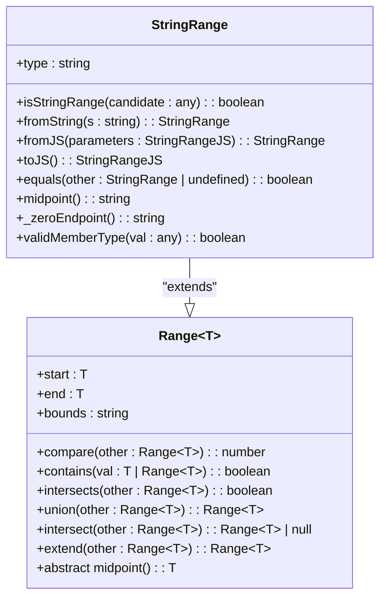

**Diagram sources **
- [stringRange.ts](file://src/datatypes/stringRange.ts#L32-L95)
- [range.ts](file://src/datatypes/range.ts#L30-L348)

**Section sources**
- [stringRange.ts](file://src/datatypes/stringRange.ts#L32-L95)
- [range.ts](file://src/datatypes/range.ts#L30-L348)

## 创建方法
字符串范围提供了多种创建方式，包括从JavaScript对象创建和从字符串直接创建。

### 从JavaScript对象创建
静态方法`fromJS`用于从JavaScript对象创建字符串范围实例。该方法接受一个包含start、end和可选bounds属性的对象参数。

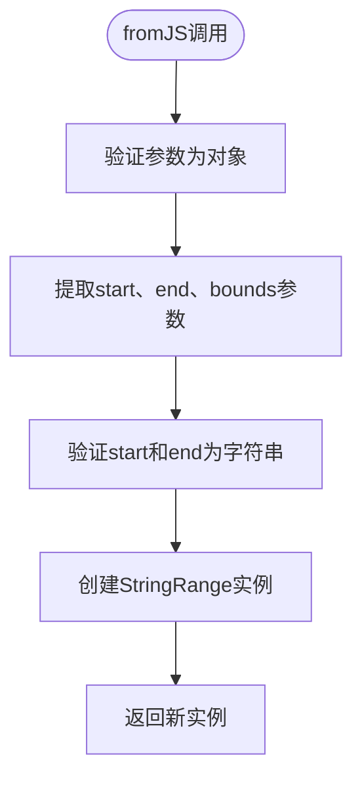

**Diagram sources **
- [stringRange.ts](file://src/datatypes/stringRange.ts#L43-L54)

### 从字符串创建
静态方法`fromString`用于从单个字符串创建字符串范围实例。该方法将输入字符串同时作为范围的起点和终点，并设置闭区间边界。

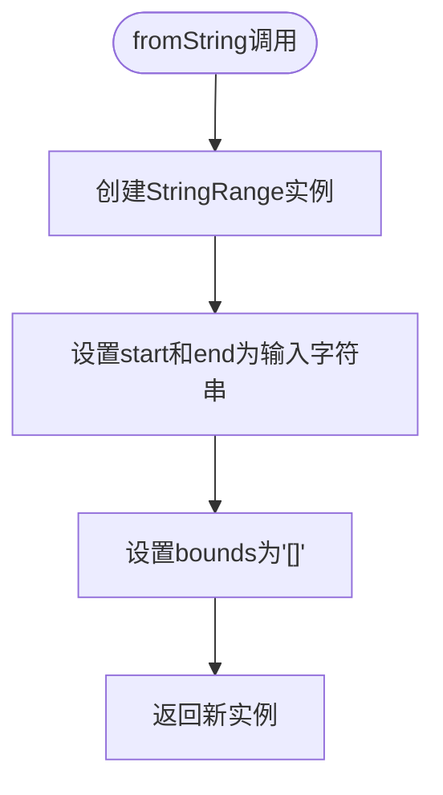

**Diagram sources **
- [stringRange.ts](file://src/datatypes/stringRange.ts#L39-L41)

**Section sources**
- [stringRange.ts](file://src/datatypes/stringRange.ts#L39-L54)

## 序列化与比较
字符串范围支持序列化为JavaScript对象以及与其他字符串范围进行比较。

### 序列化
`toJS`方法将字符串范围实例序列化为JavaScript对象。该方法会省略默认的边界值，只在边界不为默认值时包含bounds属性。

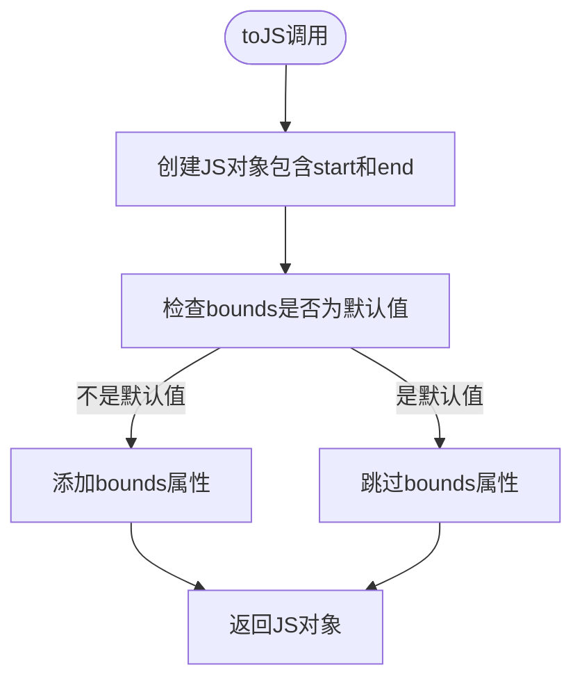

**Diagram sources **
- [stringRange.ts](file://src/datatypes/stringRange.ts#L63-L69)

### 比较逻辑
`equals`方法用于比较两个字符串范围是否相等。该方法首先检查对象类型，然后调用基类的_equalsHelper方法进行实际比较。

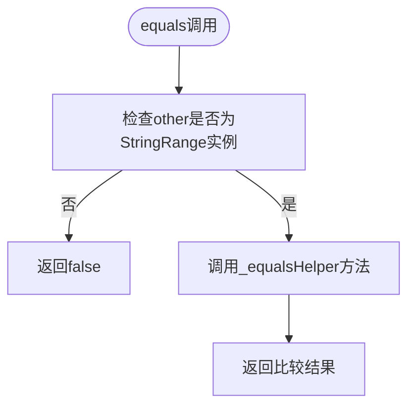

**Diagram sources **
- [stringRange.ts](file://src/datatypes/stringRange.ts#L71-L78)

**Section sources**
- [stringRange.ts](file://src/datatypes/stringRange.ts#L63-L78)

## 范围操作
字符串范围支持多种范围操作，包括扩展、并集和交集计算。

### 扩展操作
`extend`方法计算两个字符串范围的扩展范围。该方法返回包含两个范围的最小范围。

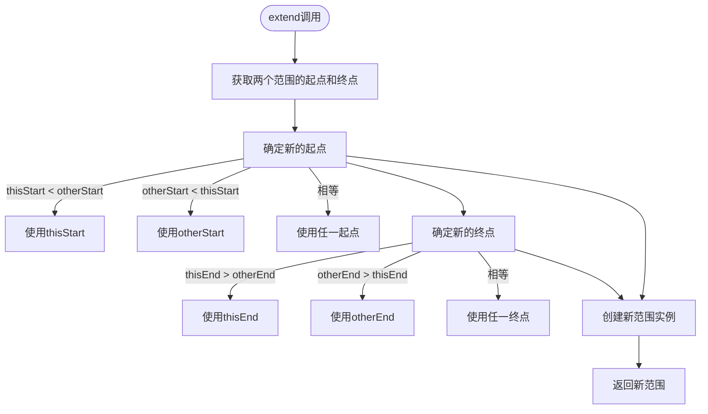

**Diagram sources **
- [range.ts](file://src/datatypes/range.ts#L260-L290)

### 并集操作
`union`方法计算两个字符串范围的并集。如果两个范围可以合并（相交或相邻），则返回合并后的范围；否则返回null。

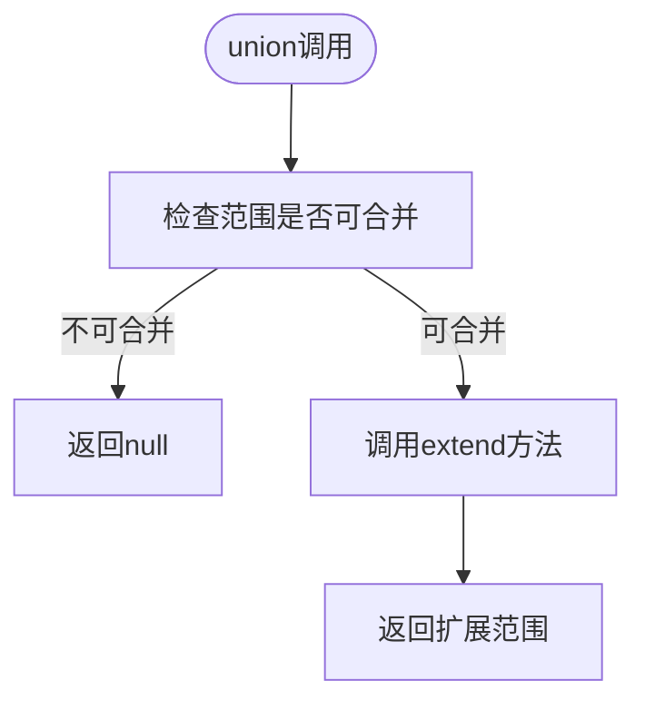

**Diagram sources **
- [range.ts](file://src/datatypes/range.ts#L235-L245)

### 交集操作
`intersect`方法计算两个字符串范围的交集。如果两个范围相交，则返回交集范围；否则返回null。

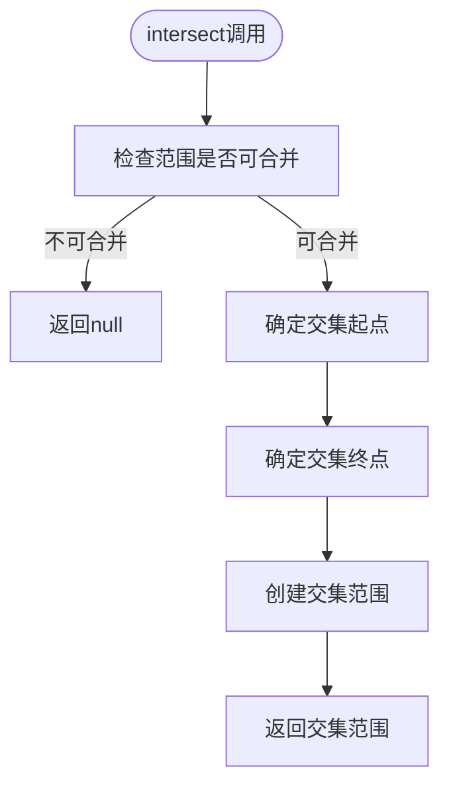

**Diagram sources **
- [range.ts](file://src/datatypes/range.ts#L300-L330)

**Section sources**
- [range.ts](file://src/datatypes/range.ts#L235-L330)
- [stringRange.mocha.js](file://test/datatypes/stringRange.mocha.js#L107-L159)

## 应用场景
字符串范围在多种数据查询场景中都有重要应用。

### 文本数据查询
字符串范围可用于查询特定字典序范围内的文本数据。例如，查询以特定字母开头的所有条目。

### 前缀匹配
通过设置适当的范围边界，字符串范围可以用于实现前缀匹配功能。例如，查找以"abc"开头的所有字符串。

### 字典区间扫描
字符串范围支持高效的字典区间扫描操作，可用于在有序字符串集合中快速定位数据。

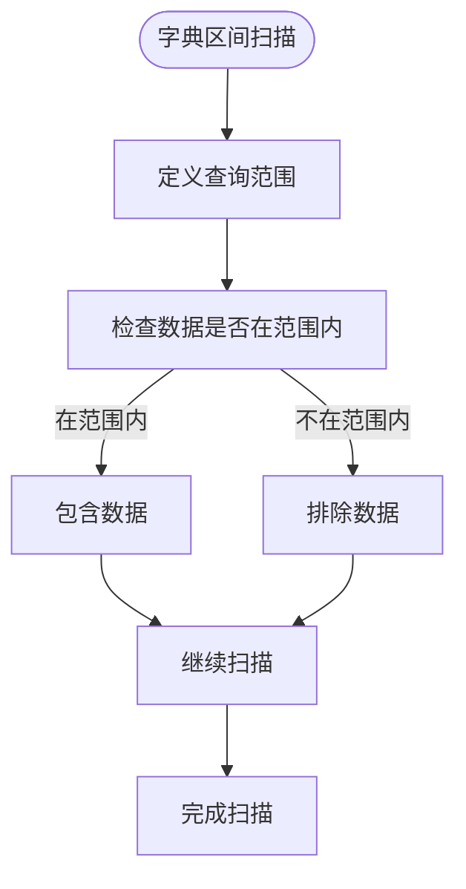

**Diagram sources **
- [stringRange.ts](file://src/datatypes/stringRange.ts#L113-L118)

**Section sources**
- [stringRange.ts](file://src/datatypes/stringRange.ts#L113-L118)

## 与表达式的集成
字符串范围与containsExpression和matchExpression等表达式类型紧密集成，支持复杂的字符串匹配操作。

### 与containsExpression集成
containsExpression用于检查一个字符串是否包含另一个字符串。它支持大小写敏感和不敏感的比较模式。

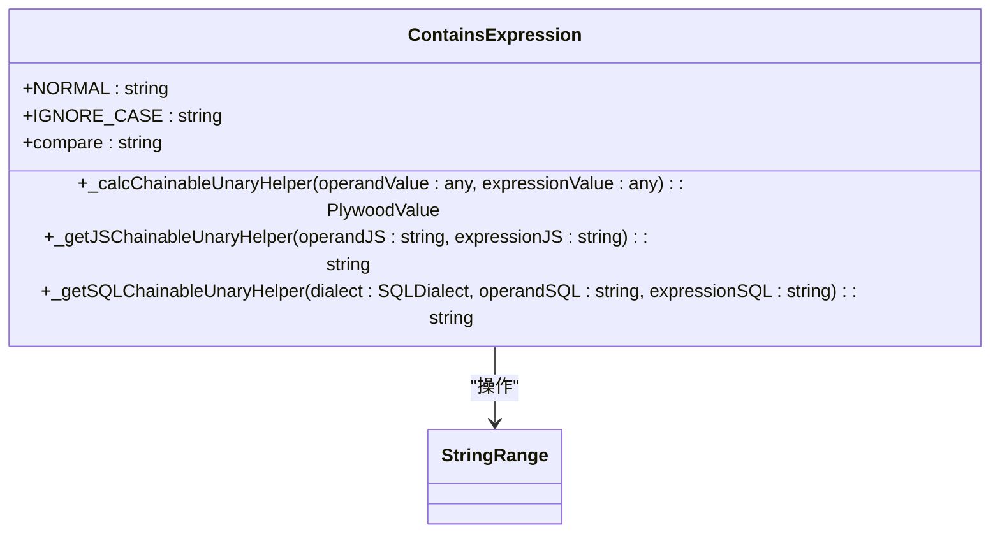

**Diagram sources **
- [containsExpression.ts](file://src/expressions/containsExpression.ts#L21-L138)

### 与matchExpression集成
matchExpression用于正则表达式匹配，支持LIKE语法到正则表达式的转换。

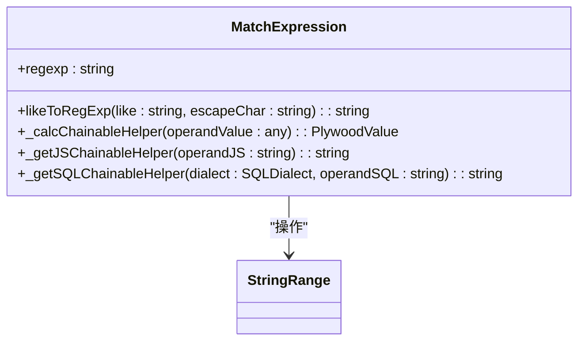

**Diagram sources **
- [matchExpression.ts](file://src/expressions/matchExpression.ts#L24-L103)

**Section sources**
- [containsExpression.ts](file://src/expressions/containsExpression.ts#L21-L138)
- [matchExpression.ts](file://src/expressions/matchExpression.ts#L24-L103)

## 限制与替代方案
字符串范围有一些特定的限制，需要了解并采取相应的替代方案。

### 不支持中点计算
字符串范围不支持中点计算，调用midpoint方法会抛出错误。

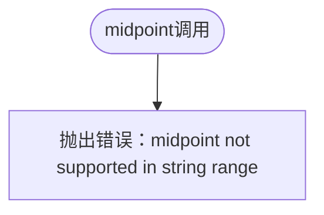

**Diagram sources **
- [stringRange.ts](file://src/datatypes/stringRange.ts#L80-L82)

### 替代方案
对于需要中点计算的场景，可以考虑以下替代方案：
1. 使用数值范围代替字符串范围
2. 实现自定义的字符串中点计算逻辑
3. 将字符串转换为数值进行计算

**Section sources**
- [stringRange.ts](file://src/datatypes/stringRange.ts#L80-L82)