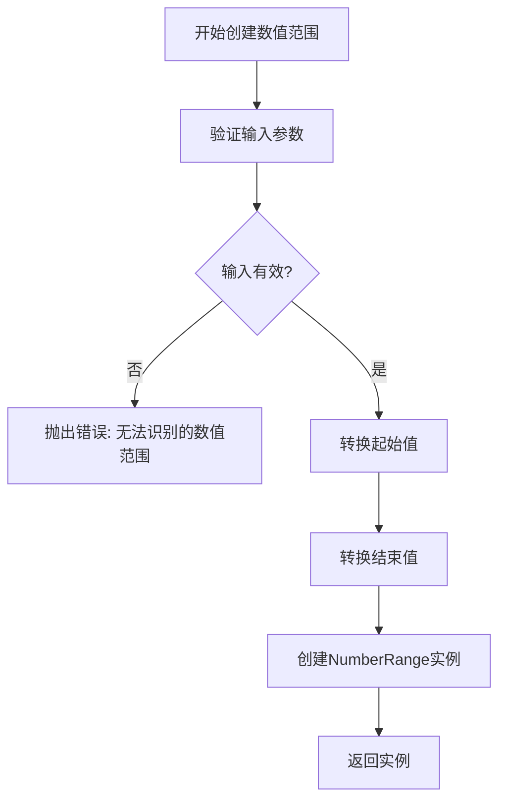
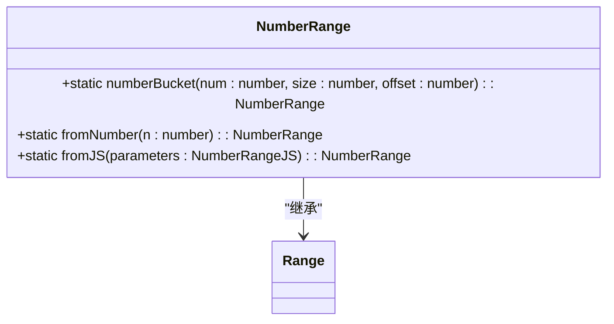
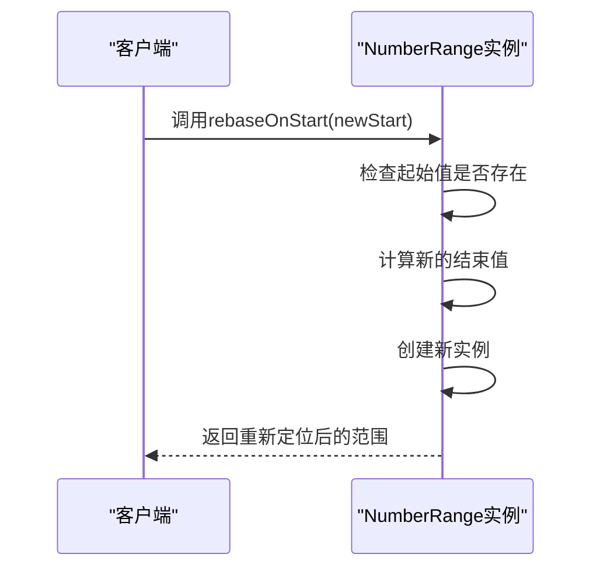
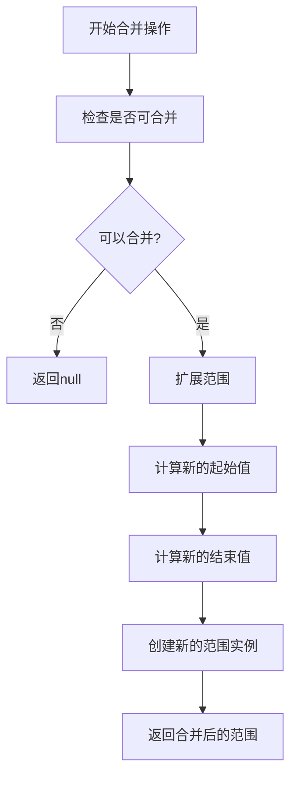
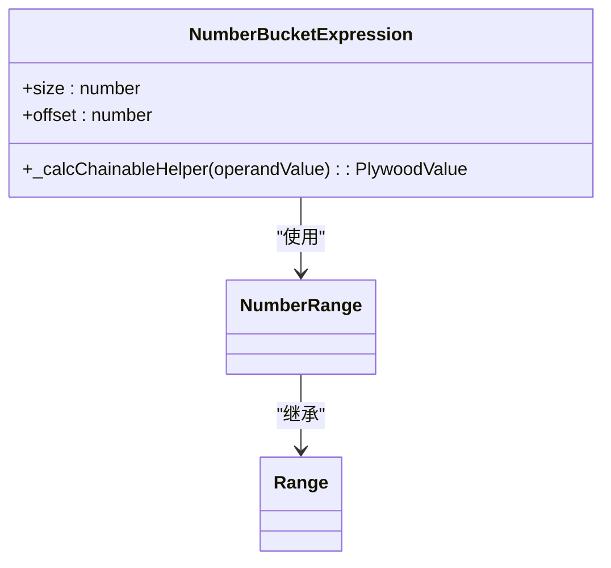

# 数值范围

<cite>
**本文档中引用的文件**
- [numberRange.ts](file://src/datatypes/numberRange.ts)
- [range.ts](file://src/datatypes/range.ts)
- [numberBucketExpression.ts](file://src/expressions/numberBucketExpression.ts)
- [utils.ts](file://src/helper/utils.ts)
</cite>

## 目录
1. [简介](#简介)
2. [核心组件](#核心组件)
3. [数值范围创建方法](#数值范围创建方法)
4. [序列化与特殊操作](#序列化与特殊操作)
5. [范围操作与检测](#范围操作与检测)
6. [应用场景](#应用场景)
7. [与numberBucketExpression的集成](#与numberbucketexpression的集成)
8. [边界与空值处理](#边界与空值处理)
9. [最佳实践](#最佳实践)

## 简介
数值范围（NumberRange）是Plywood中用于表示数值区间的重要数据结构，它继承自通用的Range类，专门用于处理number类型的范围。该类提供了丰富的创建、操作和检测方法，支持在数据分析、数据分桶和范围查询等场景中的应用。数值范围通过start和end属性定义区间边界，并通过bounds属性指定边界包含性。

## 核心组件

数值范围的核心实现位于`numberRange.ts`文件中，作为`Range<number>`的子类，它继承了范围操作的基本功能并针对数值类型进行了优化。该类实现了不可变性，确保了在各种操作中数据的一致性和安全性。

**Section sources**
- [numberRange.ts](file://src/datatypes/numberRange.ts#L37-L111)
- [range.ts](file://src/datatypes/range.ts#L30-L348)

## 数值范围创建方法

### fromJS方法
`fromJS`静态方法用于从JavaScript对象创建数值范围实例。该方法接受一个包含start、end和可选bounds属性的对象参数，对输入值进行类型验证和转换，确保创建的范围符合规范。

**Diagram sources**
- [numberRange.ts](file://src/datatypes/numberRange.ts#L53-L55)

### fromNumber方法
`fromNumber`静态方法用于从单个数值创建一个退化的数值范围（即起始值和结束值相同的范围）。这种方法常用于将离散数值转换为范围类型，便于后续的范围操作。

### numberBucket方法
`numberBucket`静态方法实现了数值分桶功能，根据指定的大小（size）和偏移量（offset）将数值分配到相应的桶中。该方法使用数学地板函数（Math.floor）计算桶的起始位置。

**Diagram sources**
- [numberRange.ts](file://src/datatypes/numberRange.ts#L44-L51)
- [numberBucketExpression.ts](file://src/expressions/numberBucketExpression.ts#L70-L72)

**Section sources**
- [numberRange.ts](file://src/datatypes/numberRange.ts#L40-L68)

## 序列化与特殊操作

### toJS方法
`toJS`实例方法用于将数值范围实例序列化为JavaScript对象。该方法返回一个包含start和end属性的对象，如果边界属性（bounds）与默认值不同，则还包括bounds属性。

### rebaseOnStart方法
`rebaseOnStart`实例方法用于将数值范围的起始点重新定位到新的起始值，同时保持范围的长度不变。该方法在数据平移和坐标系转换场景中非常有用。

**Diagram sources**
- [numberRange.ts](file://src/datatypes/numberRange.ts#L94-L96)

**Section sources**
- [numberRange.ts](file://src/datatypes/numberRange.ts#L77-L83)

## 范围操作与检测

### 包含判断
数值范围提供了`contains`方法来判断一个值或另一个范围是否完全包含在当前范围内。该方法考虑了边界包含性，能够准确处理开区间和闭区间的情况。

### 重叠检测
`intersects`方法用于检测两个数值范围是否存在重叠。该方法通过检查一个范围的边界点是否包含在另一个范围内来确定重叠关系。

### 合并操作
`union`方法用于合并两个可以合并的数值范围。两个范围可以合并的条件是它们相交或相邻。`mergeable`方法用于判断两个范围是否可以合并。

**Diagram sources**
- [range.ts](file://src/datatypes/range.ts#L113-L118)

**Section sources**
- [range.ts](file://src/datatypes/range.ts#L65-L99)

## 应用场景

### 数据分桶
数值范围在数据分桶场景中发挥着重要作用，通过`numberBucket`方法可以将连续的数值数据划分为离散的桶，便于后续的统计分析和可视化。

### 范围查询
在数据库查询和数据分析中，数值范围用于表示查询条件中的数值区间，支持高效的范围匹配和过滤操作。

### 数值分组
数值范围可用于对数值数据进行分组统计，例如按价格区间、年龄区间等对数据进行分组分析。

## 与numberBucketExpression的集成

`NumberBucketExpression`类与`NumberRange`紧密集成，提供了表达式级别的数值分桶功能。该表达式在计算时调用`NumberRange.numberBucket`方法生成相应的数值范围。

**Diagram sources**
- [numberBucketExpression.ts](file://src/expressions/numberBucketExpression.ts#L32-L83)

**Section sources**
- [numberBucketExpression.ts](file://src/expressions/numberBucketExpression.ts#L70-L72)

## 边界与空值处理

### 边界处理
数值范围通过bounds属性处理边界包含性，支持四种边界类型：'[)'（左闭右开）、'[]'（闭区间）、'()'（开区间）和'(]'（左开右闭）。当起始值和结束值相等时，会根据边界类型进行规范化处理。

### 空值处理
在创建数值范围时，系统会对null、NaN和无穷大值进行特殊处理。`finiteOrNull`辅助函数确保只有有限数值或null值被接受，其他无效值将被转换为null。

**Section sources**
- [numberRange.ts](file://src/datatypes/numberRange.ts#L32-L34)
- [utils.ts](file://src/helper/utils.ts#L102-L151)

## 最佳实践

### 浮点数精度处理
在处理浮点数范围时，建议使用`safeRange`辅助函数来避免浮点数精度问题。该函数通过缩放和舍入操作确保范围计算的准确性。

### 无穷大值处理
对于包含无穷大值的范围，应明确指定边界类型，避免产生歧义。建议在业务逻辑中对无穷大值进行特殊处理，确保数据的一致性。

### NaN值处理
NaN值在数值范围中被视为无效值，不应作为范围的边界。在数据预处理阶段应检测并处理NaN值，避免影响后续的范围操作。

**Section sources**
- [utils.ts](file://src/helper/utils.ts#L102-L151)