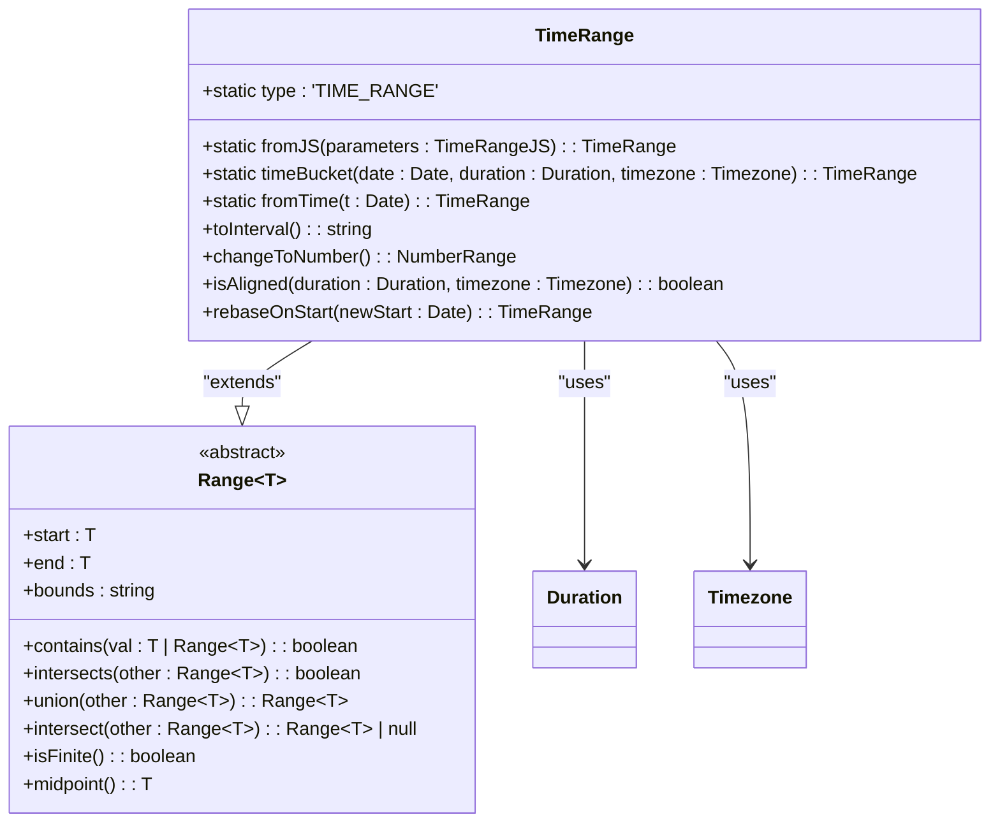
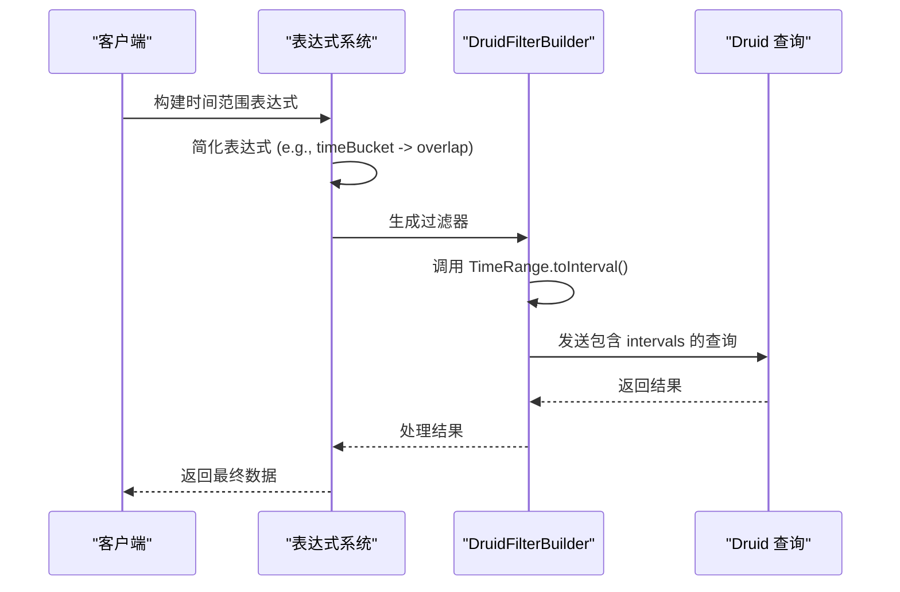

# 时间范围

<cite>
**本文档中引用的文件**   
- [timeRange.ts](file://src/datatypes/timeRange.ts)
- [range.ts](file://src/datatypes/range.ts)
- [timeRangeExpression.ts](file://src/expressions/timeRangeExpression.ts)
- [druidFilterBuilder.ts](file://src/external/utils/druidFilterBuilder.ts)
- [druidExternal.ts](file://src/external/druidExternal.ts)
</cite>

## 目录
1. [简介](#简介)
2. [核心实现](#核心实现)
3. [创建方法](#创建方法)
4. [序列化与转换](#序列化与转换)
5. [特殊操作](#特殊操作)
6. [范围操作](#范围操作)
7. [时序数据查询应用](#时序数据查询应用)
8. [边界情况与错误处理](#边界情况与错误处理)

## 简介
`TimeRange` 类是 Plywood 库中用于表示时间范围的核心数据结构，它继承自通用的 `Range<Date>` 类，专门用于处理 `Date` 类型的范围。该类在时序数据分析、数据查询和时间分桶等场景中扮演着关键角色。`TimeRange` 不仅提供了创建、序列化和操作时间范围的基本功能，还与 `chronoshift` 库中的 `Duration` 和 `Timezone` 类型深度集成，使其能够处理复杂的时序数据查询需求。此外，`TimeRange` 在与 Druid 等时序数据库的交互中也发挥着重要作用，特别是在生成查询过滤器和时间区间时。

**Section sources**
- [timeRange.ts](file://src/datatypes/timeRange.ts#L1-L20)

## 核心实现
`TimeRange` 类的实现基于 `Range<Date>` 抽象类，通过重写其抽象方法来提供针对 `Date` 类型的特定行为。其核心在于对时间范围的端点（`start` 和 `end`）以及边界（`bounds`）的管理。`bounds` 属性是一个字符串，遵循 `[)`、`[]`、`(]` 或 `()` 的格式，分别表示左闭右开、闭区间、左开右闭和开区间。类内部通过 `toDate` 函数确保输入的日期值（可以是 `Date` 对象、ISO 字符串或时间戳）被正确解析为 `Date` 对象。`_endpointEqual` 方法通过比较 `valueOf()` 的结果来判断两个日期是否相等，而 `_endpointToString` 方法则利用 `Timezone.formatDateWithTimezone` 来格式化日期字符串，支持时区转换。

**Diagram sources **
- [timeRange.ts](file://src/datatypes/timeRange.ts#L61-L184)
- [range.ts](file://src/datatypes/range.ts#L30-L348)

## 创建方法
`TimeRange` 提供了多种静态工厂方法来创建实例，以适应不同的使用场景。`fromJS` 方法是最通用的创建方式，它接受一个包含 `start`、`end` 和可选 `bounds` 的对象，其中 `start` 和 `end` 可以是 `Date` 对象、ISO 8601 字符串或时间戳，并会自动进行解析。`fromTime` 方法用于创建一个退化的（degenerate）时间范围，即开始和结束时间相同的范围，通常用于表示一个精确的时间点。`timeBucket` 方法是与 `chronoshift` 库集成的关键，它接受一个日期、一个 `Duration` 对象和一个 `Timezone` 对象，返回该日期所在时间桶的范围。例如，`timeBucket(new Date('2023-10-01T14:30:00Z'), Duration.fromJS('PT1H'), Timezone.UTC)` 会返回一个从 `2023-10-01T14:00:00Z` 到 `2023-10-01T15:00:00Z` 的时间范围。

**Section sources**
- [timeRange.ts](file://src/datatypes/timeRange.ts#L72-L84)

## 序列化与转换
`TimeRange` 类提供了 `toJS` 和 `toInterval` 方法用于序列化。`toJS` 方法返回一个与 `fromJS` 输入格式兼容的 JavaScript 对象，便于数据的序列化和传输。`toInterval` 方法则生成一个符合 Druid 查询规范的区间字符串，格式为 `start/end`。该方法会处理边界情况：如果范围是左开区间（`(`），则将开始时间增加一毫秒；如果范围是右闭区间（`]`），则将结束时间增加一毫秒，从而确保生成的区间始终是左闭右开的 `[s, e)` 格式。`changeToNumber` 方法将时间范围转换为 `NumberRange`，其端点值为原始 `Date` 对象的 `valueOf()` 结果（即时间戳），这在需要将时间范围作为数值进行处理时非常有用。

**Section sources**
- [timeRange.ts](file://src/datatypes/timeRange.ts#L113-L136)

## 特殊操作
`TimeRange` 类包含一些用于特定场景的实用方法。`isAligned` 方法检查时间范围的起始和结束时间是否与给定的 `Duration` 和 `Timezone` 对齐。这对于验证时间分桶的正确性至关重要。例如，在按天分桶的查询中，可以使用此方法确保查询的时间范围确实是从某天的开始到结束。`rebaseOnStart` 方法允许将时间范围的起点移动到一个新的日期，同时保持范围的持续时间不变。这在进行时间偏移分析（如同比分析）时非常有用。例如，将一个表示“上周”的时间范围重新定位到“上上周”。

**Section sources**
- [timeRange.ts](file://src/datatypes/timeRange.ts#L175-L183)

## 范围操作
作为 `Range` 类的子类，`TimeRange` 继承了所有标准的范围操作，包括包含判断（`contains`）、重叠检测（`intersects`）、并集（`union`）和交集（`intersect`）。`contains` 方法可以判断一个时间点或另一个时间范围是否完全包含在当前范围内。`intersects` 方法用于检测两个时间范围是否有任何重叠。`union` 方法计算两个时间范围的并集，如果它们不相交或不相邻，则返回 `null`。`intersect` 方法计算交集，如果两个范围不相交，则返回 `null`；如果它们相邻，则返回一个空范围 `[0, 0)`。这些操作是构建复杂时间查询逻辑的基础。

**Section sources**
- [range.ts](file://src/datatypes/range.ts#L113-L118)

## 时序数据查询应用
`TimeRange` 在与 Druid 等时序数据库的交互中扮演着核心角色。在 `druidFilterBuilder.ts` 中，`valueToIntervals` 函数会将 `TimeRange` 实例转换为 Druid 查询所需的 `intervals` 数组。当执行时间过滤时，`DruidFilterBuilder` 会利用 `TimeRange` 的 `toInterval` 方法生成精确的查询区间。`TimeRangeExpression` 类在表达式系统中表示一个时间范围操作，它与 `TimeBucketExpression` 等结合使用，可以构建复杂的查询条件。例如，`$('time').timeBucket('P1D', 'Etc/UTC').is(interval)` 这样的表达式会被简化为一个直接的 `overlap` 操作，从而优化查询性能。`TimeRange` 还与 `Set` 类集成，`Set` 可以包含多个 `TimeRange` 元素，用于表示不连续的时间段。

**Diagram sources **
- [timeRangeExpression.ts](file://src/expressions/timeRangeExpression.ts#L70-L117)
- [druidFilterBuilder.ts](file://src/external/utils/druidFilterBuilder.ts#L218-L236)
- [druidExternal.ts](file://src/external/druidExternal.ts#L1823-L1895)

## 边界情况与错误处理
在使用 `TimeRange` 时，需要注意一些边界情况和潜在的错误。`fromJS` 方法会对输入进行严格验证：如果 `start` 或 `end` 参数未定义，会抛出 `TypeError`；如果提供的字符串无法被解析为有效日期，会抛出 `Error`；如果 `start` 大于 `end`，构造函数会抛出 `Error`。对于空值（`null`），`start` 或 `end` 为 `null` 时，对应的边界会被强制设置为开区间（`(` 或 `)`）。在进行 `union` 或 `intersect` 操作时，如果范围不相交，`union` 会返回 `null`，而 `intersect` 也会返回 `null`。最佳实践是始终在创建 `TimeRange` 实例后检查其有效性，并在进行范围操作前使用 `intersects` 方法进行预检，以避免处理 `null` 结果。

**Section sources**
- [timeRange.ts](file://src/datatypes/timeRange.ts#L35-L48)
- [range.ts](file://src/datatypes/range.ts#L79-L126)