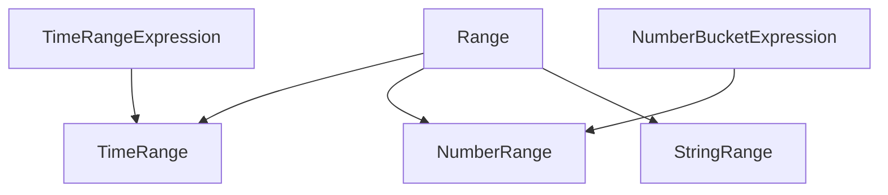
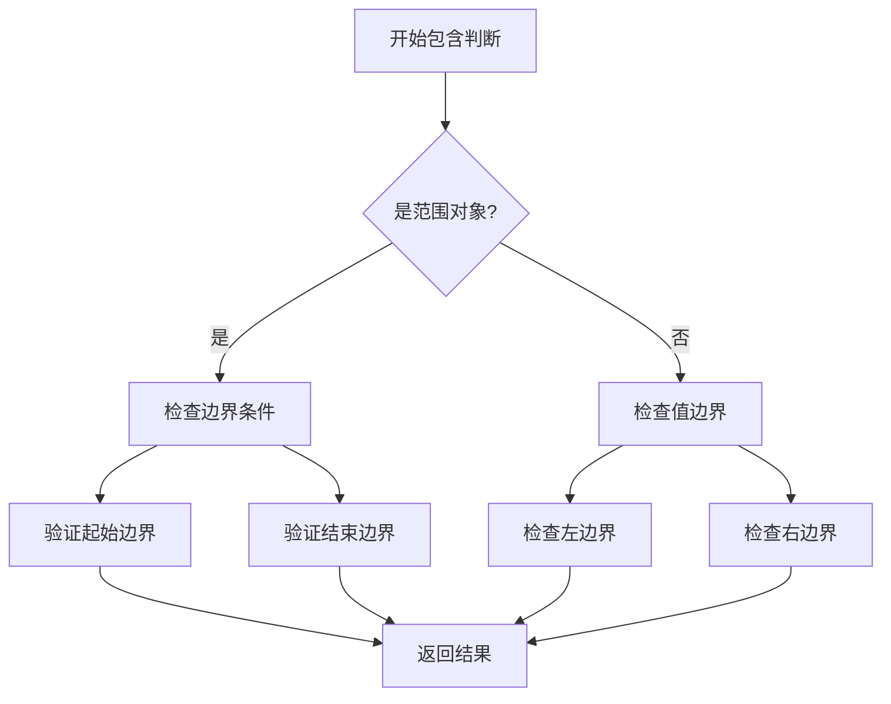
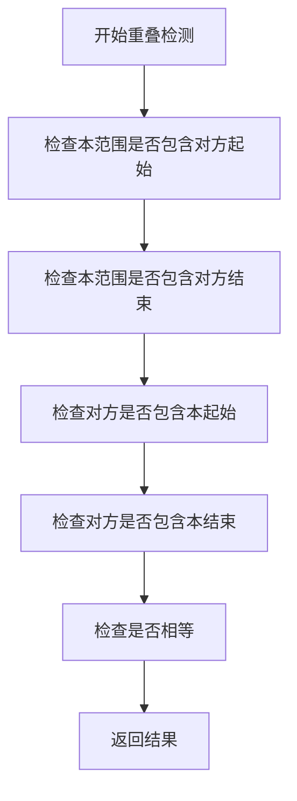
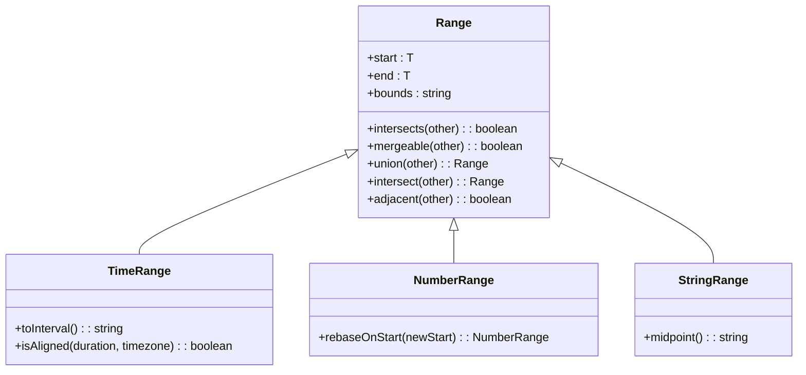
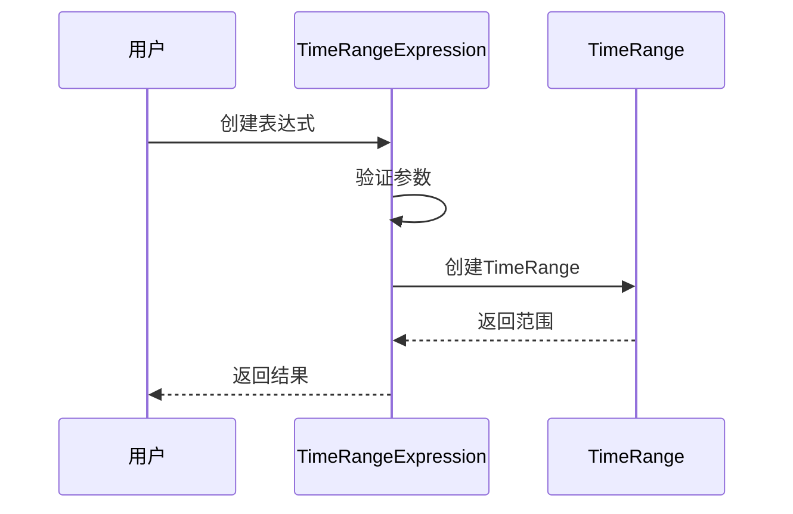
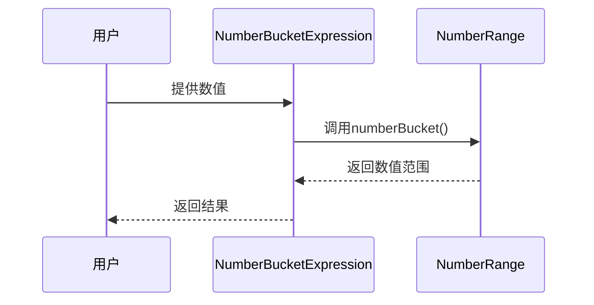
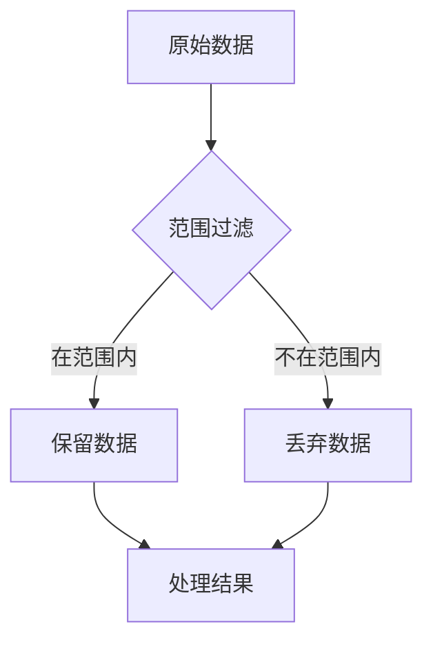
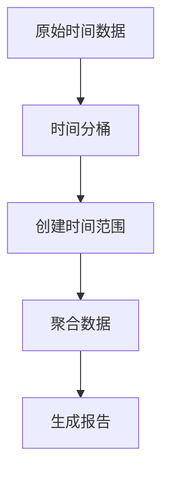
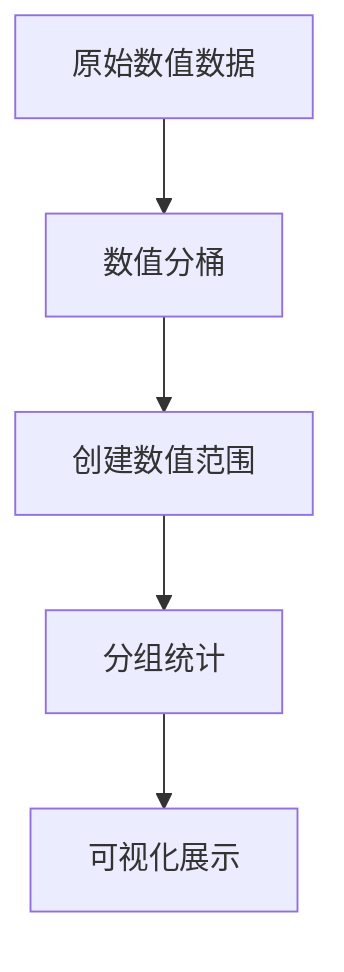
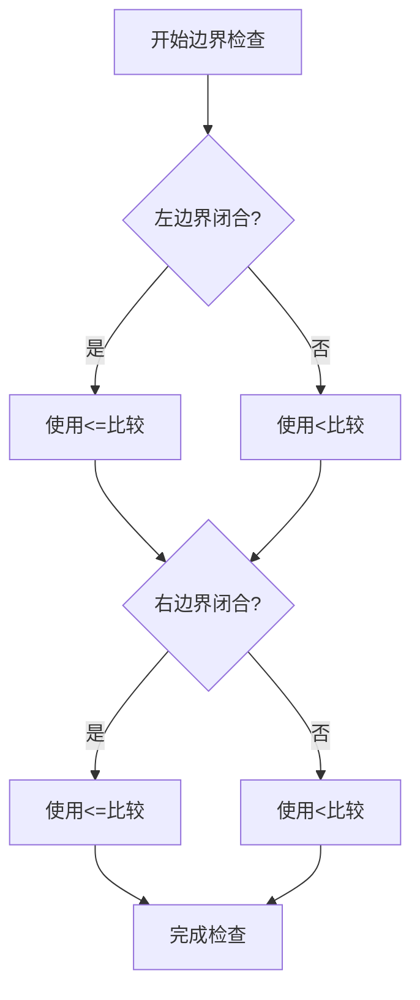

# 范围类型

<cite>
**本文档中引用的文件**   
- [range.ts](file://src/datatypes/range.ts)
- [timeRange.ts](file://src/datatypes/timeRange.ts)
- [numberRange.ts](file://src/datatypes/numberRange.ts)
- [stringRange.ts](file://src/datatypes/stringRange.ts)
- [timeRangeExpression.ts](file://src/expressions/timeRangeExpression.ts)
- [numberBucketExpression.ts](file://src/expressions/numberBucketExpression.ts)
</cite>

## 目录
1. [简介](#简介)
2. [核心架构](#核心架构)
3. [通用范围抽象](#通用范围抽象)
4. [具体实现](#具体实现)
5. [操作与方法](#操作与方法)
6. [表达式系统集成](#表达式系统集成)
7. [应用场景](#应用场景)
8. [边界情况处理](#边界情况处理)
9. [结论](#结论)

## 简介
Plywood中的范围类型提供了一套完整的类型安全机制，用于处理时间、数值和字符串范围。这些范围类型在查询过滤、数据分组和时间分桶等场景中发挥着关键作用。本文档系统性地介绍`range.ts`中定义的通用范围抽象及其在`timeRange.ts`、`numberRange.ts`和`stringRange.ts`中的具体实现。

## 核心架构
Plywood的范围类型采用分层架构设计，以`Range<T>`抽象基类为核心，为不同类型的数据提供统一的范围操作接口。这种设计模式实现了代码复用和类型安全，同时允许针对特定数据类型进行优化。



**图表来源**
- [range.ts](file://src/datatypes/range.ts#L1-L350)
- [timeRange.ts](file://src/datatypes/timeRange.ts#L61-L184)
- [numberRange.ts](file://src/datatypes/numberRange.ts#L37-L111)
- [stringRange.ts](file://src/datatypes/stringRange.ts#L32-L95)

## 通用范围抽象
`Range<T>`类作为所有范围类型的基类，定义了范围数据结构的核心概念和通用操作。它采用泛型设计，支持不同类型的数据范围。

### 数据结构
范围类型由三个核心属性组成：
- **start**: 范围的起始值
- **end**: 范围的结束值
- **bounds**: 边界表示，使用标准数学符号`[]`和`()`表示闭区间和开区间

### 边界处理
范围类支持四种边界组合：
- `[)`: 左闭右开（默认）
- `[]`: 左闭右闭
- `()`: 左开右开
- `(]`: 左开右闭

边界处理逻辑确保了范围的有效性和一致性，例如当起始值和结束值相等时，非`[]`边界的范围会被规范化为`[0, 0)`形式的空集。

**章节来源**
- [range.ts](file://src/datatypes/range.ts#L1-L350)

## 具体实现

### 时间范围
`TimeRange`类专门处理日期时间范围，继承自`Range<Date>`并实现了特定于时间的操作。

#### 特性
- 支持时区处理
- 提供时间对齐检测
- 实现时间间隔转换
- 支持时间桶操作

#### 关键方法
- `timeBucket()`: 创建时间分桶
- `toInterval()`: 转换为ISO 8601间隔格式
- `isAligned()`: 检测时间对齐
- `rebaseOnStart()`: 基于新起点重新计算范围

**章节来源**
- [timeRange.ts](file://src/datatypes/timeRange.ts#L61-L184)

### 数值范围
`NumberRange`类处理数值范围，继承自`Range<number>`并提供了数值特有的功能。

#### 特性
- 支持浮点数和整数
- 提供数值桶操作
- 实现数值对齐
- 支持算术运算

#### 关键方法
- `numberBucket()`: 创建数值分桶
- `fromNumber()`: 从单个数值创建退化范围
- `rebaseOnStart()`: 基于新起点重新计算范围

**章节来源**
- [numberRange.ts](file://src/datatypes/numberRange.ts#L37-L111)

### 字符串范围
`StringRange`类处理字符串范围，继承自`Range<string>`并实现了字符串特有的比较逻辑。

#### 特性
- 基于字典序的比较
- 支持字符串边界处理
- 实现字符串包含判断

#### 限制
- 不支持`midpoint()`方法，因为字符串没有中点概念
- 边界处理遵循字符串比较规则

**章节来源**
- [stringRange.ts](file://src/datatypes/stringRange.ts#L32-L95)

## 操作与方法

### 包含判断
范围类提供`contains()`方法来判断值或另一个范围是否被包含：



**图表来源**
- [range.ts](file://src/datatypes/range.ts#L150-L180)

### 重叠检测
`intersects()`方法用于检测两个范围是否重叠：



**图表来源**
- [range.ts](file://src/datatypes/range.ts#L185-L195)

### 合并与分割
范围类提供了一套完整的集合操作方法：

#### 合并操作
- `mergeable()`: 检测两个范围是否可合并
- `union()`: 计算两个范围的并集
- `extend()`: 计算范围的扩展

#### 分割操作
- `intersect()`: 计算两个范围的交集
- `adjacent()`: 检测两个范围是否相邻



**图表来源**
- [range.ts](file://src/datatypes/range.ts#L1-L350)
- [timeRange.ts](file://src/datatypes/timeRange.ts#L61-L184)
- [numberRange.ts](file://src/datatypes/numberRange.ts#L37-L111)
- [stringRange.ts](file://src/datatypes/stringRange.ts#L32-L95)

## 表达式系统集成
范围类型与Plywood的表达式系统深度集成，提供了声明式的范围操作方式。

### 时间范围表达式
`TimeRangeExpression`类将时间范围操作集成到表达式系统中：



**图表来源**
- [timeRangeExpression.ts](file://src/expressions/timeRangeExpression.ts#L25-L114)

### 数值分桶表达式
`NumberBucketExpression`类实现了数值分桶功能：



**图表来源**
- [numberBucketExpression.ts](file://src/expressions/numberBucketExpression.ts#L23-L81)

## 应用场景

### 查询过滤
范围类型在查询过滤中广泛应用，支持高效的范围查询：



### 时间分桶
时间范围用于时间序列数据的分桶处理：



### 数值分组
数值范围用于数值数据的分组分析：



**章节来源**
- [timeRange.ts](file://src/datatypes/timeRange.ts#L61-L184)
- [numberRange.ts](file://src/datatypes/numberRange.ts#L37-L111)

## 边界情况处理
范围类型系统性地处理各种边界情况，确保操作的健壮性。

### 开闭区间处理
系统正确处理开闭区间的边界条件：



### 空范围处理
空范围被规范化为`[0, 0)`形式，确保一致性：

```mermaid
flowchart TD
A[检测到空范围] --> B[检查边界]
B --> C{边界为[]?}
C --> |是| D[保持原样]
C --> |否| E[转换为[0, 0)]
D --> F[返回结果]
E --> F
```

### 退化范围
退化范围（起始和结束相等）被特殊处理：

```mermaid
flowchart TD
A[检测到退化范围] --> B{边界为[]?}
B --> |是| C[标记为退化]
B --> |否| D[转换为空范围]
C --> E[特殊处理]
D --> F[作为空范围处理]
```

**章节来源**
- [range.ts](file://src/datatypes/range.ts#L1-L350)

## 结论
Plywood的范围类型系统提供了一套完整、类型安全的范围操作机制。通过抽象基类和具体实现的分层设计，系统既保证了代码复用，又允许针对特定数据类型进行优化。范围类型与表达式系统的深度集成，使得复杂的范围操作可以以声明式的方式进行，提高了代码的可读性和可维护性。在处理边界情况时，系统采用规范化策略，确保了操作的一致性和可靠性。