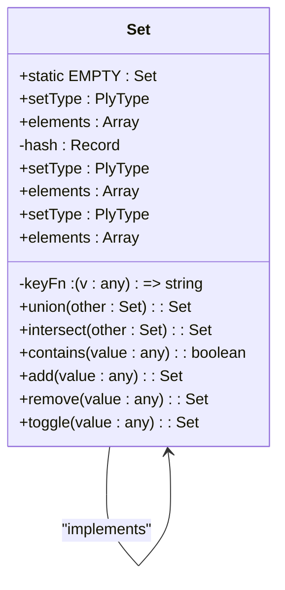
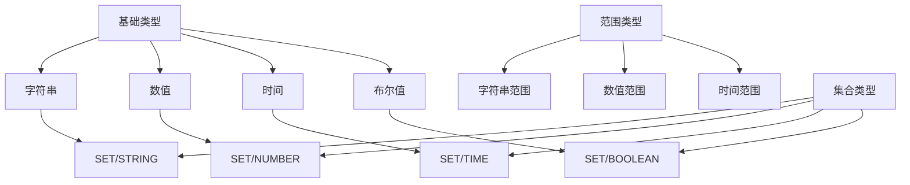
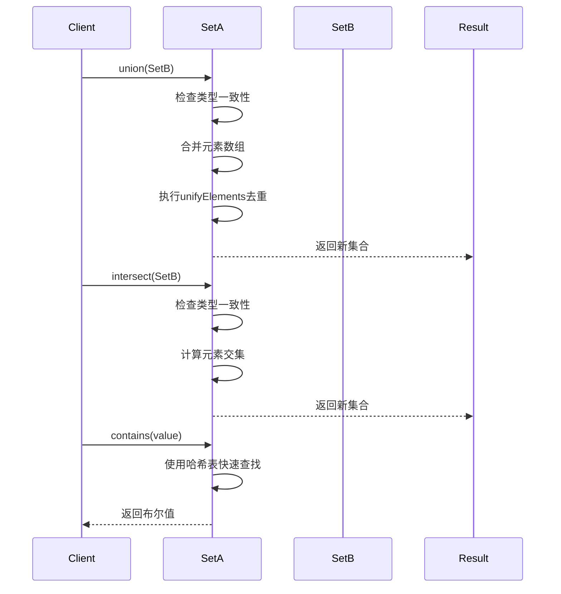
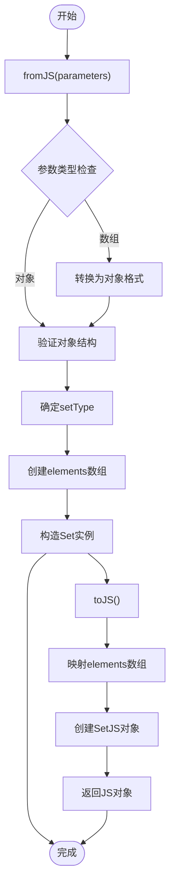
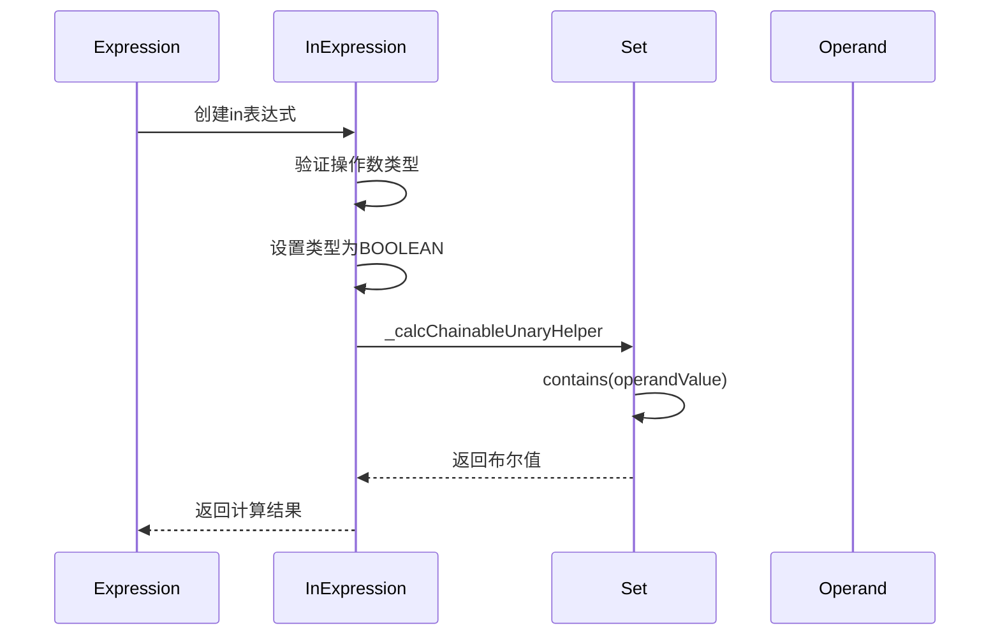
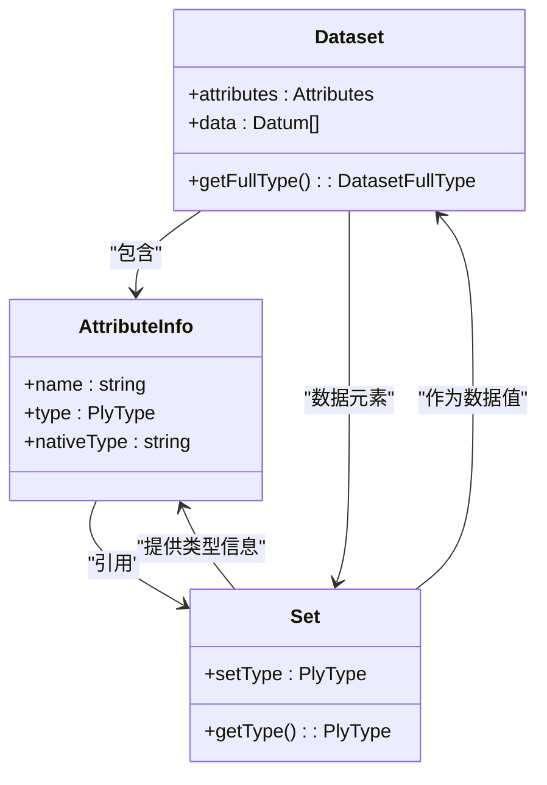
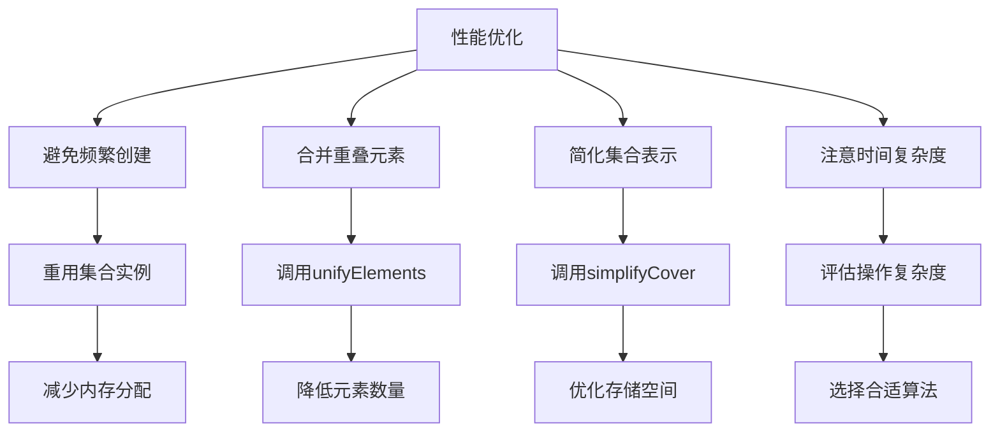

# 集合类型

<cite>
**Referenced Files in This Document**   
- [set.ts](file://src/datatypes/set.ts)
- [inExpression.ts](file://src/expressions/inExpression.ts)
- [attributeInfo.ts](file://src/datatypes/attributeInfo.ts)
- [dataset.ts](file://src/datatypes/dataset.ts)
- [set.mocha.js](file://test/datatypes/set.mocha.js)
</cite>

## 目录
1. [简介](#简介)
2. [核心实现](#核心实现)
3. [数据类型支持](#数据类型支持)
4. [集合运算](#集合运算)
5. [序列化与反序列化](#序列化与反序列化)
6. [与表达式交互](#与表达式交互)
7. [与数据集和属性信息交互](#与数据集和属性信息交互)
8. [性能优化建议](#性能优化建议)

## 简介
集合类型是Plywood中用于表示不可变元素集合的核心数据结构。它基于哈希表实现，提供高效的元素去重和查询操作。集合类型支持多种数据类型，包括字符串、数值、时间等，并提供丰富的集合运算功能，如并集、交集和差集。该数据结构在处理分类数据和维度过滤时发挥着重要作用。

**Section sources**
- [set.ts](file://src/datatypes/set.ts#L53-L475)

## 核心实现
集合类型采用基于哈希的内部实现机制，确保元素的唯一性和高效的查询性能。在构造函数中，通过`keyFn`函数为每个元素生成唯一键，并使用哈希表进行存储和去重。

**Diagram sources**
- [set.ts](file://src/datatypes/set.ts#L53-L475)

**Section sources**
- [set.ts](file://src/datatypes/set.ts#L53-L475)

## 数据类型支持
集合类型支持多种数据类型，包括字符串、数值、时间等。通过`setType`属性标识集合中元素的类型，并提供相应的类型转换和升级机制。

**Diagram sources**
- [set.ts](file://src/datatypes/set.ts#L53-L475)
- [attributeInfo.ts](file://src/datatypes/attributeInfo.ts#L0-L231)

**Section sources**
- [set.ts](file://src/datatypes/set.ts#L53-L475)
- [attributeInfo.ts](file://src/datatypes/attributeInfo.ts#L0-L231)

## 集合运算
集合类型提供丰富的集合运算功能，包括并集、交集、差集等操作。这些运算通过相应的方法实现，确保类型一致性并返回新的集合实例。

**Diagram sources**
- [set.ts](file://src/datatypes/set.ts#L53-L475)

**Section sources**
- [set.ts](file://src/datatypes/set.ts#L53-L475)

## 序列化与反序列化
集合类型提供完整的序列化和反序列化支持，通过`toJS`、`fromJS`等方法实现JavaScript对象与集合实例之间的转换。

**Diagram sources**
- [set.ts](file://src/datatypes/set.ts#L53-L475)

**Section sources**
- [set.ts](file://src/datatypes/set.ts#L53-L475)

## 与表达式交互
集合类型在表达式中扮演重要角色，特别是在`inExpression`中用于成员资格检查。通过`contains`方法实现元素包含性判断。

**Diagram sources**
- [inExpression.ts](file://src/expressions/inExpression.ts#L0-L82)
- [set.ts](file://src/datatypes/set.ts#L53-L475)

**Section sources**
- [inExpression.ts](file://src/expressions/inExpression.ts#L0-L82)
- [set.ts](file://src/datatypes/set.ts#L53-L475)

## 与数据集和属性信息交互
集合类型与数据集和属性信息紧密集成，用于描述数据结构和类型信息。在数据集处理中，集合类型用于表示分类数据和维度过滤。

**Diagram sources**
- [dataset.ts](file://src/datatypes/dataset.ts#L0-L799)
- [attributeInfo.ts](file://src/datatypes/attributeInfo.ts#L0-L231)
- [set.ts](file://src/datatypes/set.ts#L53-L475)

**Section sources**
- [dataset.ts](file://src/datatypes/dataset.ts#L0-L799)
- [attributeInfo.ts](file://src/datatypes/attributeInfo.ts#L0-L231)
- [set.ts](file://src/datatypes/set.ts#L53-L475)

## 性能优化建议
对于大规模集合操作，建议采用以下内存管理策略：
1. 避免频繁创建和销毁集合实例
2. 利用`unifyElements`方法合并重叠的范围元素
3. 在必要时使用`simplifyCover`方法简化集合表示
4. 注意集合操作的时间复杂度，特别是交集和并集运算

**Diagram sources**
- [set.ts](file://src/datatypes/set.ts#L53-L475)

**Section sources**
- [set.ts](file://src/datatypes/set.ts#L53-L475)