# ClickHouse查询方言

<cite>
**Referenced Files in This Document**   
- [clickHouseDialect.ts](file://src/dialect/clickHouseDialect.ts)
- [clickHouseExternal.ts](file://src/external/clickHouseExternal.ts)
- [baseDialect.ts](file://src/dialect/baseDialect.ts)
</cite>

## 目录
1. [简介](#简介)
2. [核心实现机制](#核心实现机制)
3. [ClickHouse特有功能支持](#clickhouse特有功能支持)
4. [查询转换逻辑](#查询转换逻辑)
5. [高级特性应用](#高级特性应用)
6. [性能优化策略](#性能优化策略)
7. [版本兼容性与差异分析](#版本兼容性与差异分析)
8. [结论](#结论)

## 简介

ClickHouse查询方言是Plywood框架中用于将Plywood表达式转换为ClickHouse SQL语句的核心组件。该文档全面阐述了`clickHouseDialect.ts`的实现机制，重点描述了Plywood表达式到ClickHouse SQL语句的转换逻辑。文档详细说明了ClickHouse特有功能的支持，包括近似计算函数、数组和嵌套类型处理、采样查询等高级特性，并通过实际示例展示高基数聚合、稀疏数据处理等场景下的查询生成。

**Section sources**
- [clickHouseDialect.ts](file://src/dialect/clickHouseDialect.ts#L1-L20)
- [clickHouseExternal.ts](file://src/external/clickHouseExternal.ts#L1-L10)

## 核心实现机制

ClickHouse方言的核心实现基于`SQLDialect`抽象类，通过继承和重写基类方法来实现ClickHouse特定的SQL语法转换。`ClickHouseDialect`类定义了多个静态映射表，用于处理时间分桶、时间部分提取和类型转换等操作。

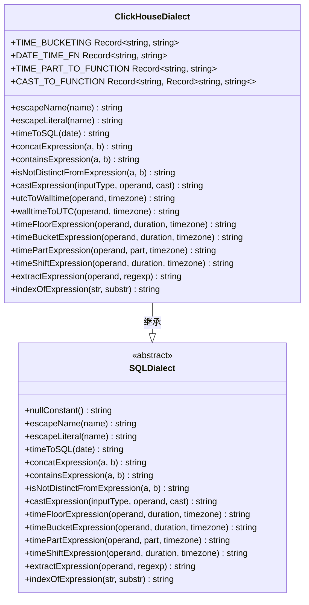

**Diagram sources**
- [clickHouseDialect.ts](file://src/dialect/clickHouseDialect.ts#L4-L161)
- [baseDialect.ts](file://src/dialect/baseDialect.ts#L43-L172)

**Section sources**
- [clickHouseDialect.ts](file://src/dialect/clickHouseDialect.ts#L4-L161)
- [baseDialect.ts](file://src/dialect/baseDialect.ts#L43-L172)

## ClickHouse特有功能支持

### 时间处理功能

ClickHouse方言提供了完善的时间处理功能，通过静态映射表实现时间分桶和时间部分提取。`TIME_BUCKETING`和`DATE_TIME_FN`映射表定义了不同时间粒度的格式化字符串和对应的ClickHouse函数。

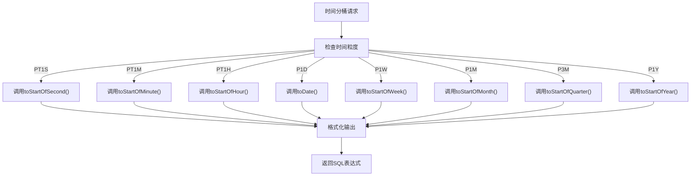

**Diagram sources**
- [clickHouseDialect.ts](file://src/dialect/clickHouseDialect.ts#L10-L33)

### 类型转换功能

ClickHouse方言通过`CAST_TO_FUNCTION`静态映射表实现类型转换功能，支持在时间、数字和字符串类型之间的相互转换。

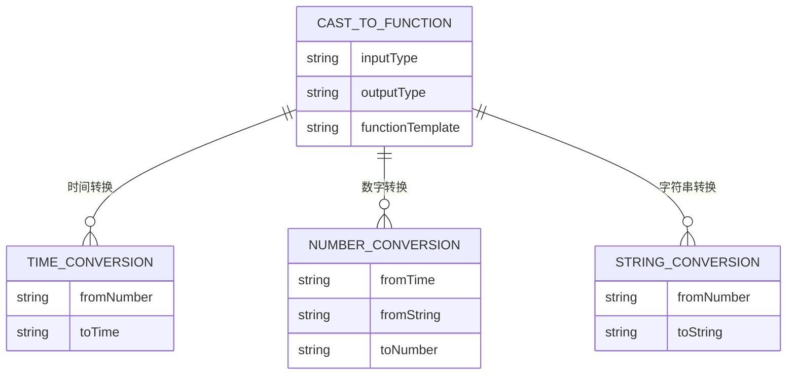

**Diagram sources**
- [clickHouseDialect.ts](file://src/dialect/clickHouseDialect.ts#L50-L58)

**Section sources**
- [clickHouseDialect.ts](file://src/dialect/clickHouseDialect.ts#L50-L58)

## 查询转换逻辑

### 表达式转换流程

Plywood表达式到ClickHouse SQL的转换流程遵循严格的处理逻辑，从基本的字符串操作到复杂的时间函数转换。

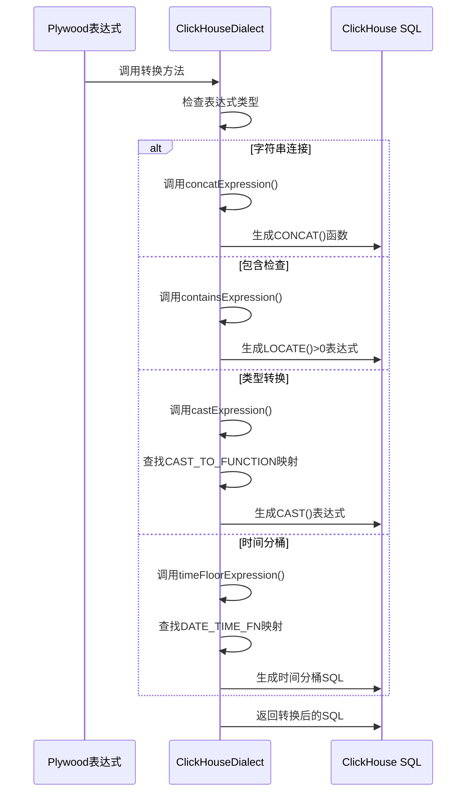

**Diagram sources**
- [clickHouseDialect.ts](file://src/dialect/clickHouseDialect.ts#L76-L135)

### 时间函数转换

时间函数的转换是ClickHouse方言的核心功能之一，通过`timePartExpression`方法实现各种时间部分的提取。

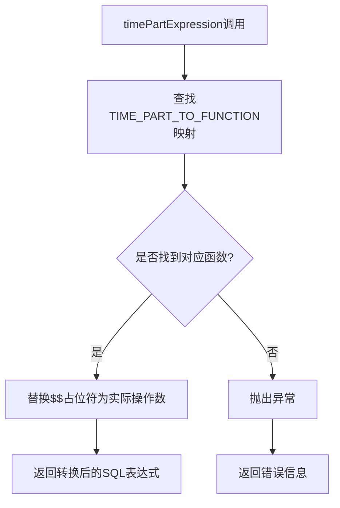

**Diagram sources**
- [clickHouseDialect.ts](file://src/dialect/clickHouseDialect.ts#L137-L148)

**Section sources**
- [clickHouseDialect.ts](file://src/dialect/clickHouseDialect.ts#L137-L148)

## 高级特性应用

### 近似计算支持

虽然当前实现中`extractExpression`方法尚未实现近似计算功能，但代码注释指明了实现方向，需要集成MySQL UDF库来支持正则表达式提取。

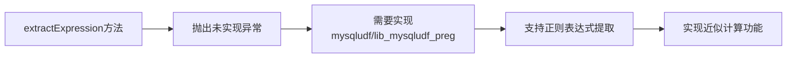

**Section sources**
- [clickHouseDialect.ts](file://src/dialect/clickHouseDialect.ts#L150-L152)

### 数组和嵌套类型处理

ClickHouse方言通过`ClickHouseExternal`类的`postProcessIntrospect`方法处理ClickHouse的原生类型，包括数组和嵌套类型。

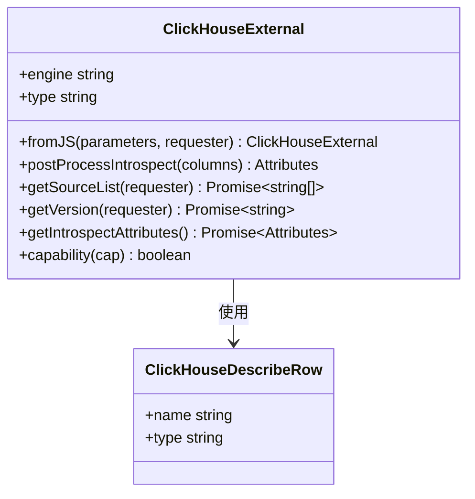

**Diagram sources**
- [clickHouseExternal.ts](file://src/external/clickHouseExternal.ts#L8-L23)

### 采样查询支持

ClickHouse方言通过`capability`方法控制查询能力，禁用了某些不支持的功能，同时启用了字符串分组功能。

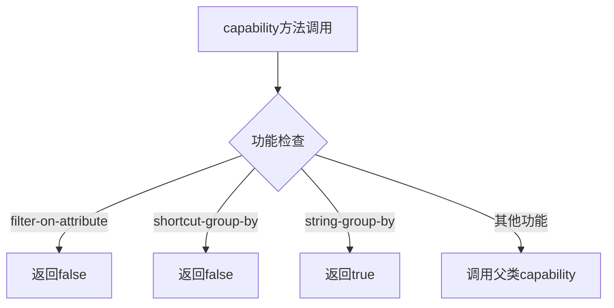

**Diagram sources**
- [clickHouseExternal.ts](file://src/external/clickHouseExternal.ts#L94-L103)

**Section sources**
- [clickHouseExternal.ts](file://src/external/clickHouseExternal.ts#L94-L103)

## 性能优化策略

### 高基数聚合处理

ClickHouse方言通过优化时间函数和类型转换来提高高基数聚合的性能。时间分桶操作使用ClickHouse内置的高效函数，避免了复杂的字符串操作。

**Section sources**
- [clickHouseDialect.ts](file://src/dialect/clickHouseDialect.ts#L20-L30)

### 稀疏数据处理

对于稀疏数据的处理，ClickHouse方言通过`isNotDistinctFromExpression`方法实现了NULL值的特殊处理，确保在稀疏数据场景下的查询准确性。

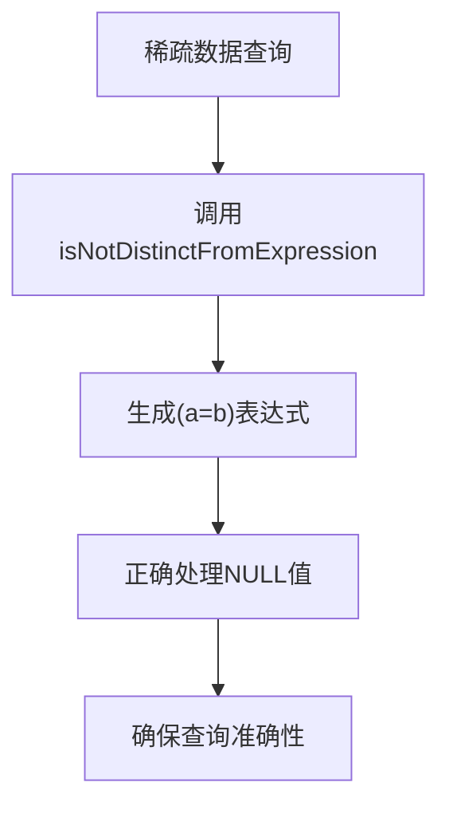

**Section sources**
- [clickHouseDialect.ts](file://src/dialect/clickHouseDialect.ts#L74-L75)

## 版本兼容性与差异分析

### 版本兼容性

ClickHouse方言通过`ClickHouseExternal`类的静态方法支持版本检查和源列表获取，确保与不同版本的ClickHouse服务器兼容。

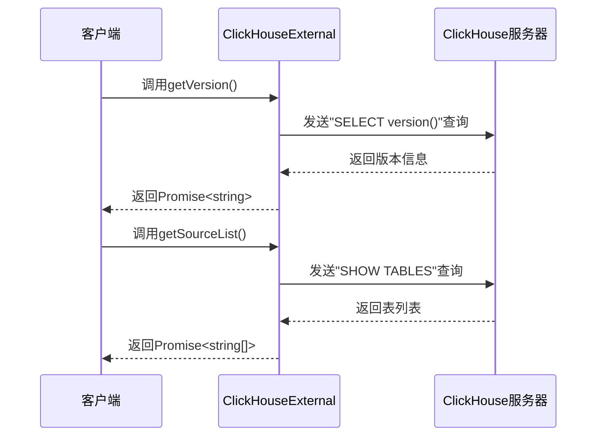

**Diagram sources**
- [clickHouseExternal.ts](file://src/external/clickHouseExternal.ts#L64-L83)

### 与其他列式数据库方言的差异

ClickHouse方言与其他列式数据库方言的主要差异体现在时间处理函数、字符串操作和类型转换上。

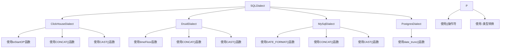

**Section sources**
- [clickHouseDialect.ts](file://src/dialect/clickHouseDialect.ts#L4-L161)
- [druidDialect.ts](file://src/dialect/druidDialect.ts#L1-L20)
- [mySqlDialect.ts](file://src/dialect/mySqlDialect.ts#L1-L20)
- [postgresDialect.ts](file://src/dialect/postgresDialect.ts#L1-L20)

## 结论

ClickHouse查询方言通过继承`SQLDialect`基类并重写特定方法，实现了Plywood表达式到ClickHouse SQL语句的高效转换。方言充分利用了ClickHouse的特有功能，如高效的时间处理函数和类型转换机制，为高基数聚合和稀疏数据处理提供了优化支持。尽管某些高级功能如近似计算尚未完全实现，但整体架构为未来功能扩展提供了良好的基础。通过与`ClickHouseExternal`类的协同工作，方言能够处理ClickHouse特有的数据类型和查询能力，确保了与ClickHouse服务器的良好兼容性。