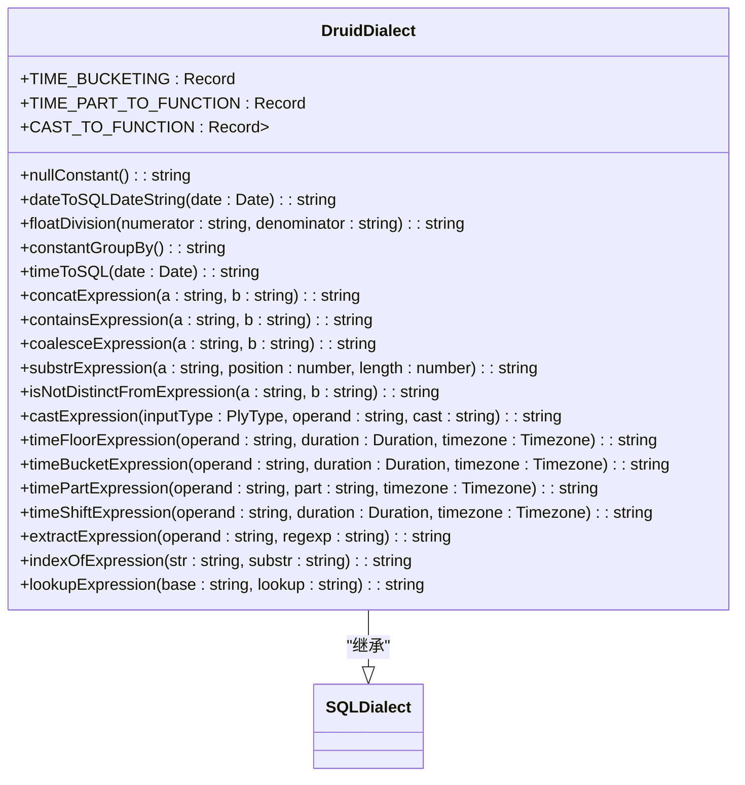
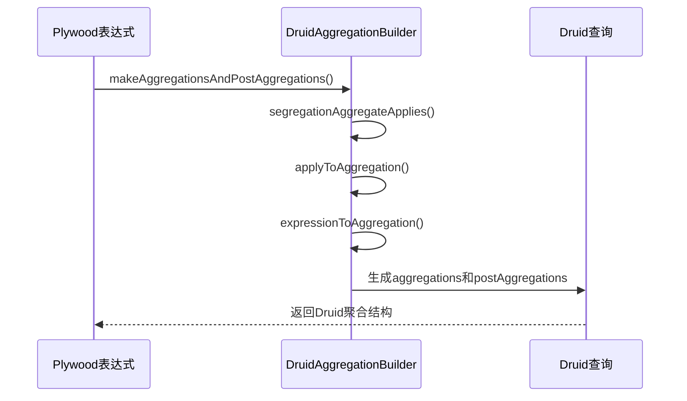
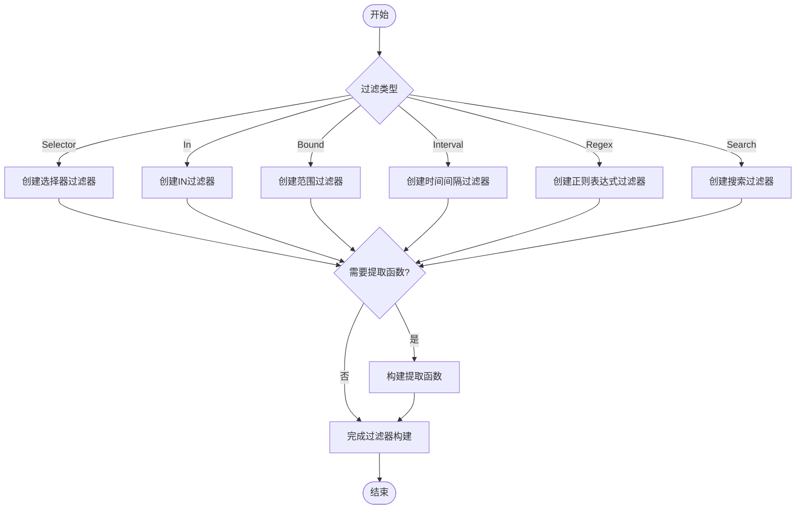
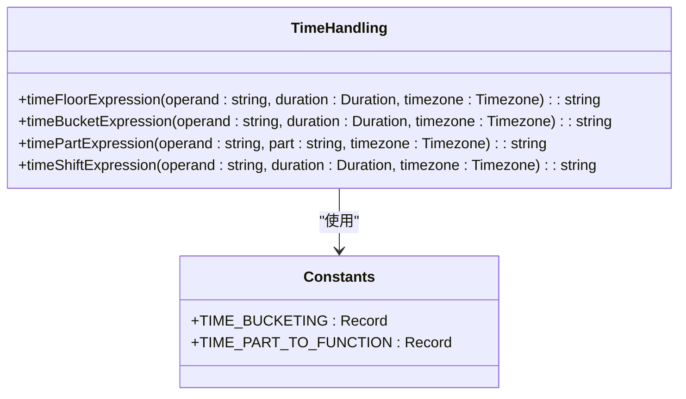
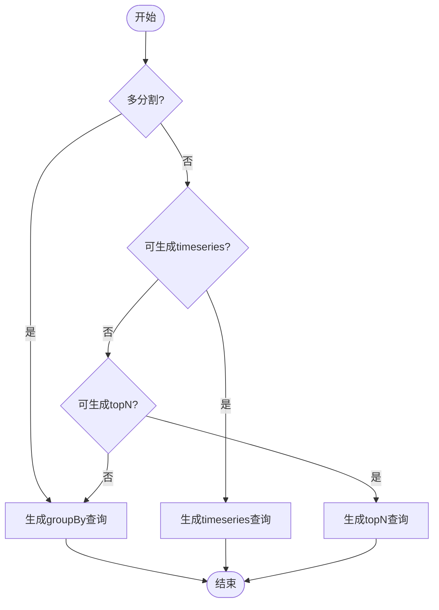
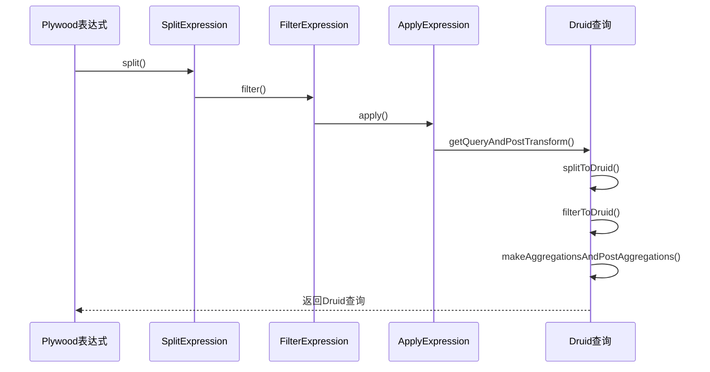
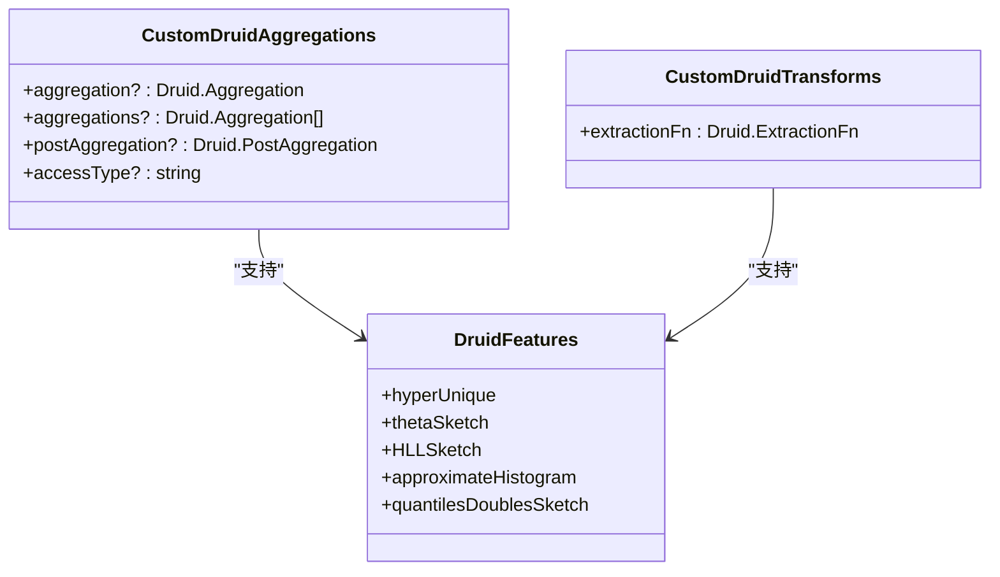

# Druid查询方言

<cite>
**本文档引用的文件**   
- [druidDialect.ts](file://src/dialect/druidDialect.ts)
- [druidAggregationBuilder.ts](file://src/external/utils/druidAggregationBuilder.ts)
- [druidFilterBuilder.ts](file://src/external/utils/druidFilterBuilder.ts)
- [druidExpressionBuilder.ts](file://src/external/utils/druidExpressionBuilder.ts)
- [druidTypes.ts](file://src/external/utils/druidTypes.ts)
- [druidExternal.ts](file://src/external/druidExternal.ts)
</cite>

## 目录
1. [简介](#简介)
2. [核心实现机制](#核心实现机制)
3. [聚合函数转换](#聚合函数转换)
4. [过滤条件处理](#过滤条件处理)
5. [时间处理逻辑](#时间处理逻辑)
6. [查询类型生成规则](#查询类型生成规则)
7. [表达式转换示例](#表达式转换示例)
8. [Druid特有功能支持](#druid特有功能支持)
9. [性能优化建议](#性能优化建议)
10. [常见问题解决方案](#常见问题解决方案)

## 简介

Druid查询方言是Plywood系统中用于将Plywood表达式转换为Druid JSON查询格式的核心组件。该方言通过`druidDialect.ts`文件实现，提供了完整的SQL方言功能，能够处理Druid特有的查询需求。系统通过一系列构建器类（如`DruidAggregationBuilder`、`DruidFilterBuilder`等）将高级表达式转换为底层的Druid查询结构。

**Section sources**
- [druidDialect.ts](file://src/dialect/druidDialect.ts#L1-L50)

## 核心实现机制

Druid查询方言的实现基于`SQLDialect`基类，通过重写各种表达式转换方法来适配Druid的查询语法。核心机制包括时间桶化、时间部分提取、类型转换等功能的实现。

**Diagram sources**
- [druidDialect.ts](file://src/dialect/druidDialect.ts#L20-L175)

**Section sources**
- [druidDialect.ts](file://src/dialect/druidDialect.ts#L20-L175)

## 聚合函数转换

聚合函数转换由`DruidAggregationBuilder`类负责，它将Plywood的聚合表达式转换为Druid的聚合和后聚合结构。系统支持多种聚合类型，包括计数、求和、最小值、最大值以及去重计数等。

**Diagram sources**
- [druidAggregationBuilder.ts](file://src/external/utils/druidAggregationBuilder.ts#L74-L741)

**Section sources**
- [druidAggregationBuilder.ts](file://src/external/utils/druidAggregationBuilder.ts#L74-L741)

## 过滤条件处理

过滤条件处理由`DruidFilterBuilder`类实现，它将Plywood的布尔表达式转换为Druid的过滤器结构。系统能够处理各种过滤类型，包括选择器过滤、范围过滤、正则表达式过滤等。

**Diagram sources**
- [druidFilterBuilder.ts](file://src/external/utils/druidFilterBuilder.ts#L54-L489)

**Section sources**
- [druidFilterBuilder.ts](file://src/external/utils/druidFilterBuilder.ts#L54-L489)

## 时间处理逻辑

时间处理逻辑是Druid查询方言的核心功能之一，包括时间桶化、时间部分提取和时间偏移等操作。这些功能通过`druidDialect.ts`中的相应方法实现。

**Diagram sources**
- [druidDialect.ts](file://src/dialect/druidDialect.ts#L20-L175)

**Section sources**
- [druidDialect.ts](file://src/dialect/druidDialect.ts#L20-L175)

## 查询类型生成规则

查询类型生成由`druidExternal.ts`中的`splitToDruid`方法负责，它根据查询条件决定生成哪种类型的Druid查询（groupBy、timeseries或topN）。

**Diagram sources**
- [druidExternal.ts](file://src/external/druidExternal.ts#L136-L2087)

**Section sources**
- [druidExternal.ts](file://src/external/druidExternal.ts#L136-L2087)

## 表达式转换示例

表达式转换过程涉及多个构建器的协作，从Plywood表达式到最终的Druid查询JSON。

**Diagram sources**
- [druidExternal.ts](file://src/external/druidExternal.ts#L136-L2087)

**Section sources**
- [druidExternal.ts](file://src/external/druidExternal.ts#L136-L2087)

## Druid特有功能支持

系统通过`CustomDruidAggregations`和`CustomDruidTransforms`接口支持Druid的特有功能，如精确去重、近似算法和流式聚合。

**Diagram sources**
- [druidTypes.ts](file://src/external/utils/druidTypes.ts#L31-L31)

**Section sources**
- [druidTypes.ts](file://src/external/utils/druidTypes.ts#L21-L31)

## 性能优化建议

1. **使用精确结果模式**：当需要精确结果时，设置`exactResultsOnly`标志，避免使用近似算法。
2. **合理选择查询类型**：根据数据特性和查询需求选择合适的查询类型（groupBy、timeseries或topN）。
3. **利用Druid原生功能**：尽可能使用Druid的原生聚合类型（如hyperUnique、thetaSketch）以获得更好的性能。
4. **避免复杂表达式**：尽量简化表达式，避免在查询中使用过于复杂的JavaScript表达式。

**Section sources**
- [druidAggregationBuilder.ts](file://src/external/utils/druidAggregationBuilder.ts#L74-L741)
- [druidExternal.ts](file://src/external/druidExternal.ts#L136-L2087)

## 常见问题解决方案

1. **查询性能低下**：检查是否使用了JavaScript聚合，尝试改用Druid原生聚合类型。
2. **结果不准确**：确认是否需要精确结果，适当调整`exactResultsOnly`设置。
3. **时间处理错误**：验证时间格式和时区设置是否正确。
4. **过滤器不生效**：检查过滤表达式是否正确转换为Druid过滤器结构。

**Section sources**
- [druidFilterBuilder.ts](file://src/external/utils/druidFilterBuilder.ts#L54-L489)
- [druidAggregationBuilder.ts](file://src/external/utils/druidAggregationBuilder.ts#L74-L741)