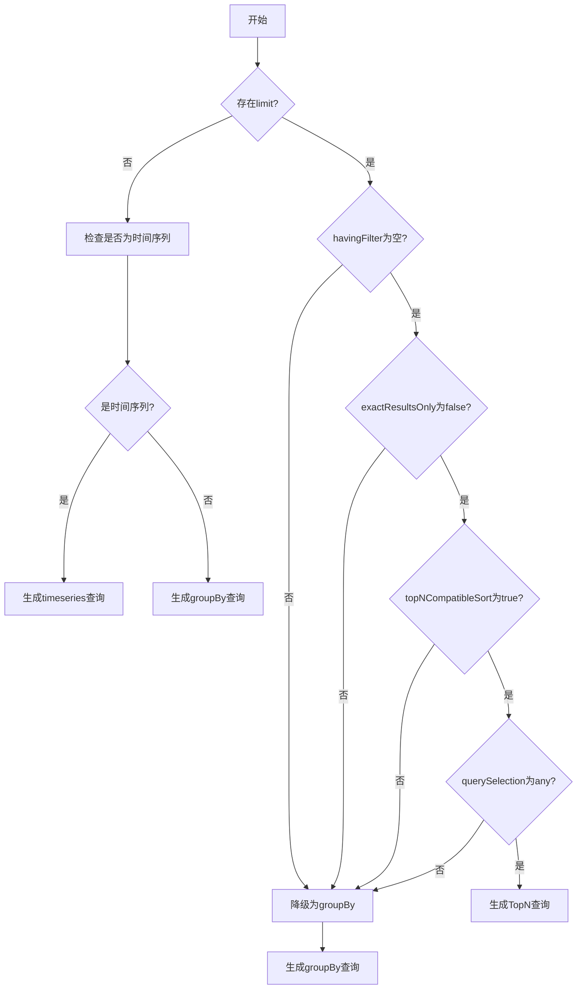
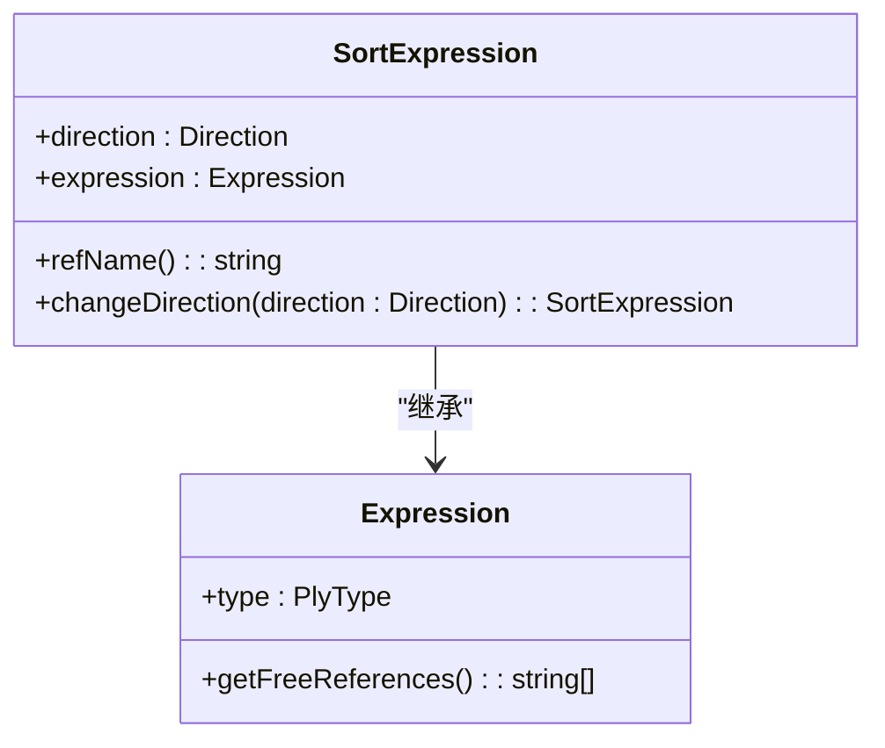
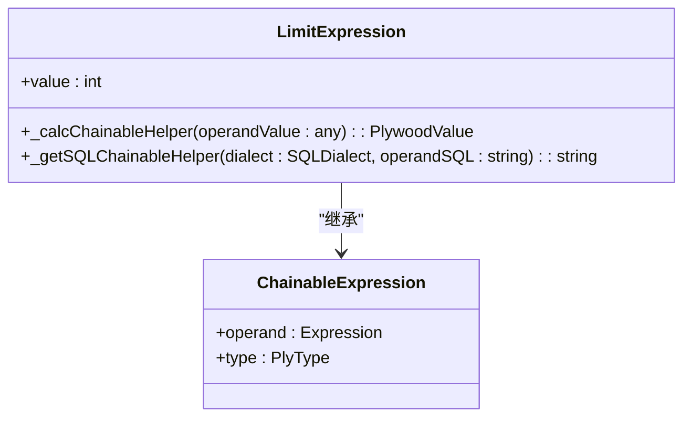
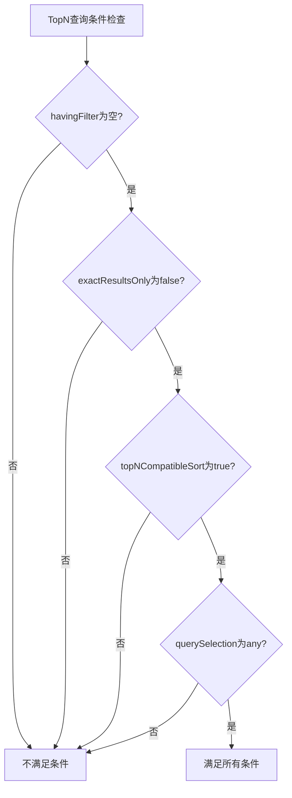
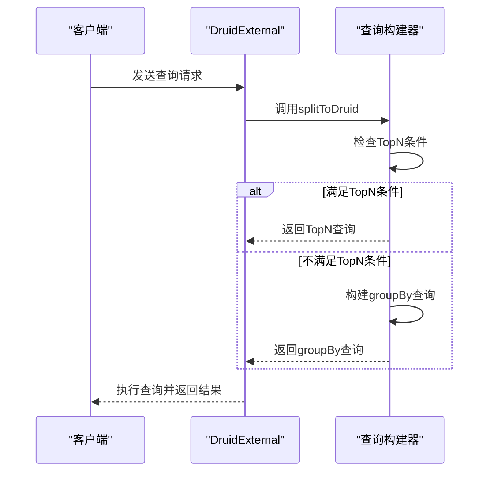

# TopN查询转换

<cite>
**Referenced Files in This Document**   
- [druidExternal.ts](file://src/external/druidExternal.ts)
- [sortExpression.ts](file://src/expressions/sortExpression.ts)
- [limitExpression.ts](file://src/expressions/limitExpression.ts)
- [druidAggregationBuilder.ts](file://src/external/utils/druidAggregationBuilder.ts)
- [druidFilterBuilder.ts](file://src/external/utils/druidFilterBuilder.ts)
- [druidTypes.ts](file://src/external/utils/druidTypes.ts)
- [baseExternal.ts](file://src/external/baseExternal.ts)
</cite>

## 目录
1. [简介](#简介)
2. [核心组件分析](#核心组件分析)
3. [TopN查询生成规则](#topn查询生成规则)
4. [TopN查询限制条件](#topn查询限制条件)
5. [降级处理策略](#降级处理策略)
6. [性能优化建议](#性能优化建议)
7. [常见问题解决方案](#常见问题解决方案)

## 简介

本文档详细阐述了Plywood系统中Plywood排序和限制表达式转换为Druid TopN查询格式的机制。文档深入分析了TopN查询的生成规则、限制条件、适用场景以及当查询不满足TopN条件时的降级处理策略。通过分析核心代码组件，本文档为开发人员提供了对TopN查询转换过程的全面理解，并提供了性能优化建议和常见问题的解决方案。

## 核心组件分析

TopN查询转换的核心逻辑主要分布在`druidExternal.ts`文件中，特别是`DruidExternal`类的`splitToDruid`方法。该方法负责将Plywood表达式转换为Druid查询格式。转换过程涉及多个关键组件的协同工作，包括排序表达式、限制表达式、维度转换器和聚合构建器。

**Section sources**
- [druidExternal.ts](file://src/external/druidExternal.ts#L899-L1028)
- [sortExpression.ts](file://src/expressions/sortExpression.ts#L23-L117)
- [limitExpression.ts](file://src/expressions/limitExpression.ts#L21-L92)

## TopN查询生成规则

TopN查询的生成遵循一系列严格的规则，这些规则确保了查询的正确性和性能。生成规则主要在`splitToDruid`方法中实现，通过一系列条件判断来决定是否可以生成TopN查询。

**Diagram sources**
- [druidExternal.ts](file://src/external/druidExternal.ts#L899-L1028)

**Section sources**
- [druidExternal.ts](file://src/external/druidExternal.ts#L899-L1028)

### 排序字段映射

排序字段的映射是TopN查询生成的关键。`sortExpression`对象定义了排序的字段和方向。在`splitToDruid`方法中，系统首先检查排序表达式是否与拆分表达式的第一列匹配。如果匹配，则可以使用该列作为TopN查询的排序依据。

**Diagram sources**
- [sortExpression.ts](file://src/expressions/sortExpression.ts#L23-L117)

**Section sources**
- [sortExpression.ts](file://src/expressions/sortExpression.ts#L23-L117)

### 排序方向处理

排序方向由`SortExpression`类的`direction`属性控制，该属性可以是`ascending`或`descending`。在生成Druid查询时，系统会根据这个方向属性设置TopN查询的排序方向。

### 返回结果数量映射

返回结果数量由`limitExpression`对象控制。`LimitExpression`类的`value`属性定义了要返回的最大结果数。在`splitToDruid`方法中，这个值被直接用于设置TopN查询的阈值。

**Diagram sources**
- [limitExpression.ts](file://src/expressions/limitExpression.ts#L21-L92)

**Section sources**
- [limitExpression.ts](file://src/expressions/limitExpression.ts#L21-L92)

## TopN查询限制条件

TopN查询的生成受到多个限制条件的约束，这些条件确保了查询的正确性和性能。主要限制条件包括：

1. **havingFilter必须为空**：TopN查询不支持having过滤器，因为having过滤器是在聚合后应用的，而TopN查询需要在聚合前进行排序和限制。
2. **exactResultsOnly必须为false**：TopN查询是近似查询，不保证精确结果。如果`exactResultsOnly`为true，则必须降级为groupBy查询。
3. **排序必须兼容**：排序表达式必须满足`topNCompatibleSort`方法的检查，确保排序不会影响TopN查询的正确性。
4. **querySelection必须为any**：查询选择策略必须允许TopN查询，如果设置为`no-top-n`或`group-by-only`，则不能生成TopN查询。

**Diagram sources**
- [druidExternal.ts](file://src/external/druidExternal.ts#L899-L1028)

**Section sources**
- [druidExternal.ts](file://src/external/druidExternal.ts#L899-L1028)

## 降级处理策略

当查询不满足TopN查询的条件时，系统会自动降级为groupBy查询。这种降级处理策略确保了查询的兼容性和正确性。降级处理主要在`splitToDruid`方法的最后部分实现。

**Diagram sources**
- [druidExternal.ts](file://src/external/druidExternal.ts#L899-L1028)

**Section sources**
- [druidExternal.ts](file://src/external/druidExternal.ts#L899-L1028)

## 性能优化建议

为了优化TopN查询的性能，建议遵循以下最佳实践：

1. **合理设置limit值**：避免设置过大的limit值，因为这会增加内存消耗和查询时间。
2. **使用合适的排序字段**：选择基数较低的字段作为排序字段，可以提高TopN查询的性能。
3. **避免复杂的having过滤**：如果可能，将having过滤条件移到where过滤中，以减少聚合后的数据量。
4. **利用Druid的近似聚合**：对于不需要精确结果的场景，使用Druid的近似聚合函数（如hyperUnique）可以显著提高性能。

## 常见问题解决方案

### 问题1：TopN查询返回结果不准确

**原因**：TopN查询是近似查询，不保证精确结果。

**解决方案**：如果需要精确结果，可以将`exactResultsOnly`设置为true，但这会导致查询降级为groupBy查询，可能影响性能。

### 问题2：查询被意外降级为groupBy

**原因**：查询可能不满足TopN查询的某个条件，如havingFilter不为空或排序不兼容。

**解决方案**：检查查询条件，确保满足TopN查询的所有限制条件。可以使用调试工具查看具体的降级原因。

### 问题3：TopN查询性能低下

**原因**：可能是由于limit值过大或排序字段基数过高。

**解决方案**：优化查询条件，减小limit值，或选择基数较低的字段作为排序字段。

**Section sources**
- [druidExternal.ts](file://src/external/druidExternal.ts#L655-L677)
- [druidExternal.ts](file://src/external/druidExternal.ts#L838-L897)
- [druidExternal.ts](file://src/external/druidExternal.ts#L679-L836)
- [baseExternal.ts](file://src/external/baseExternal.ts#L674-L722)
- [baseExternal.ts](file://src/external/baseExternal.ts#L651-L663)
- [baseExternal.ts](file://src/external/baseExternal.ts#L501-L516)
- [druidTypes.ts](file://src/external/utils/druidTypes.ts#L1-L33)