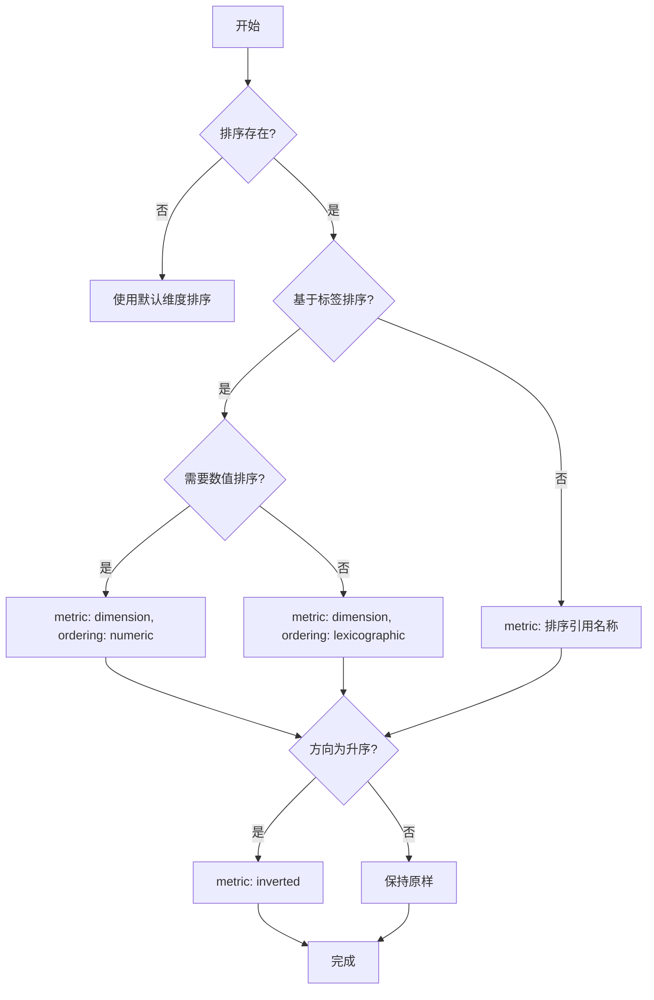
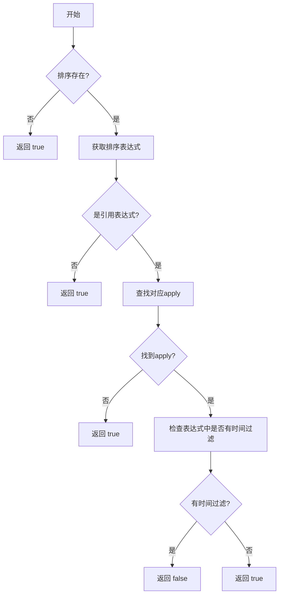
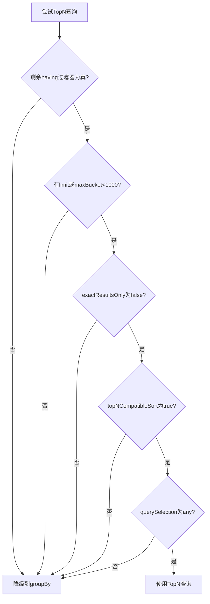

# 排序规则转换

<cite>
**本文档中引用的文件**   
- [sortExpression.ts](file://src/expressions/sortExpression.ts)
- [druidExternal.ts](file://src/external/druidExternal.ts)
- [druidTypes.ts](file://src/external/utils/druidTypes.ts)
</cite>

## 目录
1. [简介](#简介)
2. [Plywood SortExpression 结构](#plywood-sortexpression-结构)
3. [Druid TopN 查询排序规则映射](#druid-topn-查询排序规则映射)
4. [topNCompatibleSort() 方法实现逻辑](#topncompatiblesort-方法实现逻辑)
5. [降级为 GroupBy 查询的条件](#降级为-groupby-查询的条件)
6. [性能优化建议](#性能优化建议)
7. [常见排序问题解决方案](#常见排序问题解决方案)

## 简介
本文档详细解释了如何将 Plywood 的 SortExpression 转换为 Druid TopN 查询的排序规则。重点描述了升序和降序的映射方式、排序字段的合法性检查，特别是当排序字段涉及时间过滤时的兼容性问题。通过分析核心代码实现，展示了 topNCompatibleSort() 方法的逻辑，并说明了在何种情况下会降级为 groupBy 查询。最后提供了性能优化建议和常见排序问题的解决方案。

## Plywood SortExpression 结构
SortExpression 类是 Plywood 中用于表示排序操作的核心类，继承自 ChainableUnaryExpression。它包含方向属性（direction），支持升序（ascending）和降序（descending）两种排序方式。

该类确保操作符为 "sort"，检查操作数类型为 'DATASET'，并验证表达式必须是引用表达式（ref expression）。排序方向默认为升序，可通过 changeDirection() 和 toggleDirection() 方法进行修改。

**Section sources**
- [sortExpression.ts](file://src/expressions/sortExpression.ts#L23-L117)

## Druid TopN 查询排序规则映射
在将 Plywood 查询转换为 Druid 查询时，TopN 查询的排序规则需要特殊处理。当查询类型为 "topN" 时，排序规则通过 metric 属性来定义。

对于基于标签的排序（sortOnLabel），如果排序表达式需要数值排序（expressionNeedsNumericSort），则使用 numeric ordering；否则使用 lexicographic ordering。排序方向通过 inverted metric 来实现：当原始方向为降序时，不反转；当为升序时，进行反转。

**Diagram sources**
- [druidExternal.ts](file://src/external/druidExternal.ts#L1680-L1700)

## topNCompatibleSort() 方法实现逻辑
topNCompatibleSort() 方法决定了当前排序是否与 TopN 查询兼容。其核心逻辑如下：

首先检查是否存在排序，若无排序则返回 true。然后获取排序表达式，如果是引用表达式，则查找对应的 apply 操作。如果找到匹配的 apply，则检查该表达式中是否包含对时间属性的过滤。

关键的兼容性检查在于：如果排序字段的计算过程中包含对时间的过滤操作，则认为不兼容，返回 false。这是因为 TopN 查询在处理此类情况时可能产生不准确的结果。

**Diagram sources**
- [druidExternal.ts](file://src/external/druidExternal.ts#L655-L677)

**Section sources**
- [druidExternal.ts](file://src/external/druidExternal.ts#L655-L677)

## 降级为 GroupBy 查询的条件
当以下任一条件满足时，系统会降级使用 groupBy 查询而非 topN 查询：

1. 存在剩余的 having 过滤器且不为真
2. 没有设置 limit 且 split 的最大桶数超过 1000
3. exactResultsOnly 设置为 true
4. topNCompatibleSort() 返回 false
5. querySelection 设置为 "group-by-only"

这种降级机制确保了查询结果的准确性和系统的稳定性，特别是在处理复杂排序或需要精确结果的场景下。

**Diagram sources**
- [druidExternal.ts](file://src/external/druidExternal.ts#L985-L995)

## 性能优化建议
为了获得最佳性能，建议遵循以下原则：

1. 尽量使用简单的排序字段，避免在排序字段的计算中包含复杂的时间过滤逻辑
2. 当需要精确结果时，明确设置 exactResultsOnly 参数
3. 合理设置 limit 值，避免过大的结果集影响性能
4. 对于时间序列数据，优先考虑使用 timeseries 查询而非 topN 查询
5. 避免在 TopN 查询中使用复杂的 having 过滤器

这些优化措施可以帮助系统选择最优的查询策略，提高查询效率和响应速度。

## 常见排序问题解决方案
针对常见的排序问题，提供以下解决方案：

1. **排序结果不准确**：检查是否因时间过滤导致降级到 groupBy 查询，考虑调整查询结构或接受近似结果
2. **查询性能低下**：分析是否因复杂排序条件导致无法使用 TopN 查询，尝试简化排序逻辑
3. **排序方向错误**：确认前端传递的排序方向与后端处理逻辑一致，特别注意升序时的 inverted 处理
4. **内存溢出**：限制返回结果数量，避免一次性获取过多数据

通过理解底层实现机制和合理设计查询逻辑，可以有效解决大多数排序相关的问题。