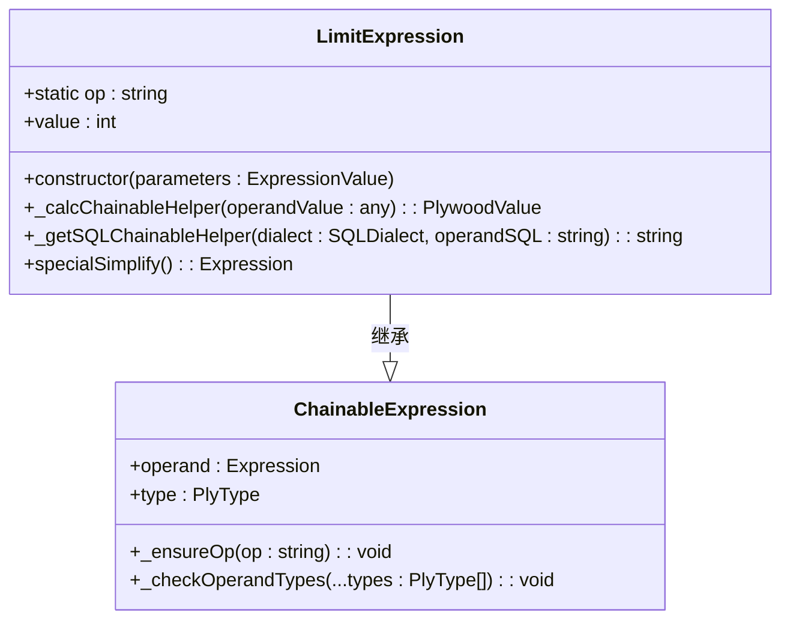
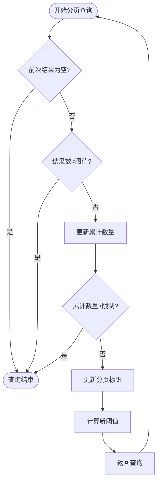
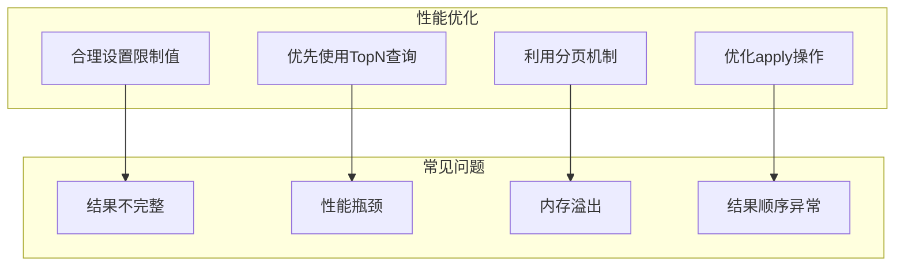

# 结果数量限制

<cite>
**本文档引用的文件**   
- [limitExpression.ts](file://src/expressions/limitExpression.ts)
- [druidExternal.ts](file://src/external/druidExternal.ts)
- [dataset.ts](file://src/datatypes/dataset.ts)
</cite>

## 目录
1. [引言](#引言)
2. [LimitExpression映射机制](#limitexpression映射机制)
3. [常量配置与分页查询](#常量配置与分页查询)
4. [性能优化与常见问题](#性能优化与常见问题)

## 引言
本文档详细阐述了Plywood中LimitExpression如何映射到Druid TopN查询的threshold参数，包括默认限制值和最大限制值的配置。通过分析核心组件和代码实现，解释SELECT_INIT_LIMIT和SELECT_MAX_LIMIT常量的作用，以及在分页查询中如何动态调整返回结果数量。同时提供处理大量数据查询时的性能优化建议和常见问题解决方案。

**Section sources**
- [druidExternal.ts](file://src/external/druidExternal.ts#L136-L2087)
- [limitExpression.ts](file://src/expressions/limitExpression.ts#L21-L92)

## LimitExpression映射机制

LimitExpression类是Plywood中用于限制查询结果数量的核心组件。该类继承自ChainableExpression，通过value属性存储限制值，并在构造函数中进行类型检查和值验证。当value为null时，默认设置为Infinity，表示无限制；当value为负数时会抛出错误。

在Druid查询中，LimitExpression通过_druidExternal类的splitToDruid方法映射到TopN查询的threshold参数。具体映射逻辑如下：当查询满足以下条件时，系统会选择TopN查询而非groupBy查询：
- 不存在limit操作
- 排序字段与时间戳兼容
- 存在limit或split范围有限
- 不需要精确结果
- 排序方式与TopN兼容
- 允许任何查询类型

**Diagram sources **
- [limitExpression.ts](file://src/expressions/limitExpression.ts#L21-L92)

**Section sources**
- [limitExpression.ts](file://src/expressions/limitExpression.ts#L21-L92)
- [druidExternal.ts](file://src/external/druidExternal.ts#L136-L2087)

## 常量配置与分页查询

Plywood定义了两个关键常量来控制查询结果的数量限制：SELECT_INIT_LIMIT和SELECT_MAX_LIMIT。SELECT_INIT_LIMIT（默认值50）表示初始查询返回的结果数量，而SELECT_MAX_LIMIT（默认值10000）表示单次查询允许返回的最大结果数量。

在分页查询中，系统通过selectNextFactory方法动态调整返回结果数量。该方法根据已获取的结果数量和总限制数量，计算下一次查询的threshold值。具体算法如下：
1. 检查前一次查询结果长度是否为0，若是则结束查询
2. 检查前一次查询结果长度是否小于threshold，若是则结束查询
3. 累计已获取的结果数量
4. 检查累计结果数量是否达到总限制，若是则结束查询
5. 更新分页标识符
6. 计算新的threshold值，取剩余数量和SELECT_MAX_LIMIT的较小值

**Diagram sources **
- [druidExternal.ts](file://src/external/druidExternal.ts#L1441-L1441)

**Section sources**
- [druidExternal.ts](file://src/external/druidExternal.ts#L149-L150)
- [druidExternal.ts](file://src/external/druidExternal.ts#L1441-L1441)

## 性能优化与常见问题

在处理大量数据查询时，需要注意以下性能优化建议：
1. 合理设置SELECT_INIT_LIMIT和SELECT_MAX_LIMIT，避免一次性获取过多数据导致内存溢出
2. 在不需要精确结果的场景下，优先使用TopN查询而非groupBy查询，以提高查询性能
3. 利用分页机制，将大查询拆分为多个小查询，减少单次查询的压力
4. 避免在limit操作前进行复杂的apply操作，以减少计算开销

常见问题及解决方案：
1. **查询结果不完整**：检查是否达到了SELECT_MAX_LIMIT限制，考虑调整分页策略或增加最大限制值
2. **性能瓶颈**：分析查询计划，确保在适当的情况下使用TopN查询，并优化排序字段的选择
3. **内存溢出**：减少单次查询的limit值，增加分页次数，或优化数据模型减少中间结果的大小
4. **结果顺序异常**：确保排序字段与TopN查询兼容，避免使用不支持的排序方式

**Diagram sources **
- [druidExternal.ts](file://src/external/druidExternal.ts#L136-L2087)
- [limitExpression.ts](file://src/expressions/limitExpression.ts#L21-L92)

**Section sources**
- [druidExternal.ts](file://src/external/druidExternal.ts#L136-L2087)
- [limitExpression.ts](file://src/expressions/limitExpression.ts#L21-L92)
- [dataset.ts](file://src/datatypes/dataset.ts#L313-L1425)