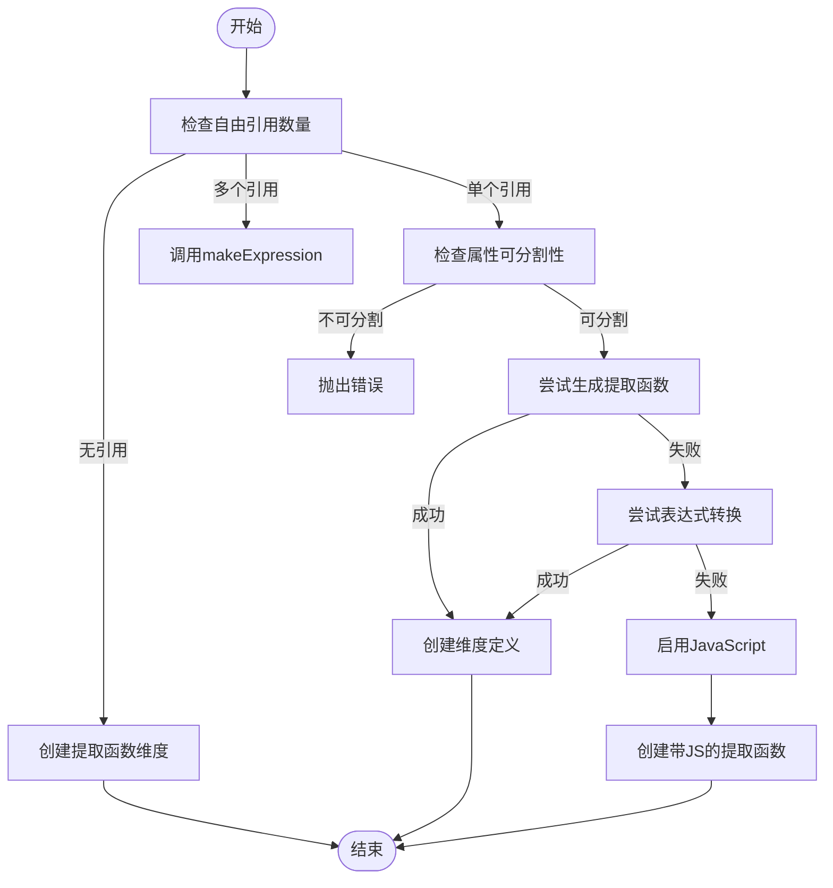
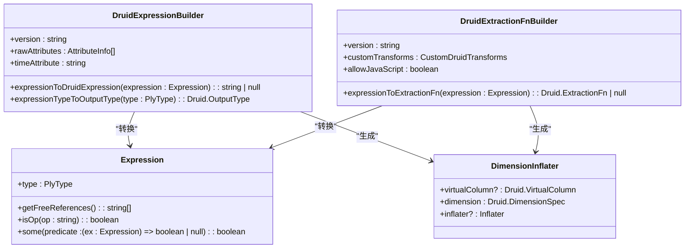
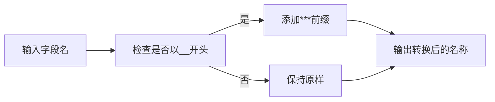

# 维度转换规则

<cite>
**本文档引用的文件**
- [druidExternal.ts](file://src/external/druidExternal.ts)
- [druidExpressionBuilder.ts](file://src/external/utils/druidExpressionBuilder.ts)
- [druidExtractionFnBuilder.ts](file://src/external/utils/druidExtractionFnBuilder.ts)
- [extractExpression.ts](file://src/expressions/extractExpression.ts)
</cite>

## 目录
1. [简介](#简介)
2. [维度转换基础](#维度转换基础)
3. [expressionToDimensionInflater方法解析](#expressiontodimensioninflater方法解析)
4. [复杂表达式到虚拟列的转换](#复杂表达式到虚拟列的转换)
5. [特殊字符与保留字段处理](#特殊字符与保留字段处理)
6. [类型映射最佳实践](#类型映射最佳实践)
7. [常见问题解决方案](#常见问题解决方案)

## 简介
本文档详细阐述了Plywood表达式系统如何转换为Druid TopN查询的维度定义。重点分析了`expressionToDimensionInflater()`方法的实现逻辑，以及如何将复杂表达式转换为虚拟列。文档通过具体代码示例展示了维度转换的完整过程，并提供了处理特殊字符、保留字段和类型映射时的最佳实践和常见问题解决方案。

## 维度转换基础
维度转换是将Plywood表达式系统中的表达式转换为Druid查询中可识别的维度定义的过程。该过程主要涉及三种维度类型：基本维度、提取函数维度和过滤维度。

**Section sources**
- [druidExternal.ts](file://src/external/druidExternal.ts#L679-L836)

## expressionToDimensionInflater方法解析
`expressionToDimensionInflater()`方法是维度转换的核心，负责将Plywood表达式转换为Druid维度定义。该方法根据表达式的复杂程度和引用情况，采用不同的转换策略。

当表达式没有自由引用时，方法会创建一个提取函数维度，使用`DruidExtractionFnBuilder`将表达式转换为提取函数。对于包含多个自由引用、包含then操作或复杂fallback表达式的复杂表达式，方法会调用`makeExpression()`函数进行处理。

对于简单表达式，方法首先检查引用的属性是否可分割，然后尝试使用`DruidExtractionFnBuilder`生成提取函数。如果提取函数生成失败，会尝试使用表达式转换，最后作为备选方案启用JavaScript支持。

**Diagram sources**
- [druidExternal.ts](file://src/external/druidExternal.ts#L679-L836)

**Section sources**
- [druidExternal.ts](file://src/external/druidExternal.ts#L679-L836)

## 复杂表达式到虚拟列的转换
对于无法通过提取函数处理的复杂表达式，系统会将其转换为虚拟列。`makeExpression()`函数负责这一转换过程，它使用`DruidExpressionBuilder`将Plywood表达式转换为Druid表达式。

转换过程包括：生成输出名称、确定输出类型、创建解压器，以及构建虚拟列定义。如果表达式不是引用表达式，会在输出名称前添加"v:"前缀作为虚拟列名称。

**Diagram sources**
- [druidExpressionBuilder.ts](file://src/external/utils/druidExpressionBuilder.ts#L69-L445)
- [druidExtractionFnBuilder.ts](file://src/external/utils/druidExtractionFnBuilder.ts#L49-L503)

**Section sources**
- [druidExternal.ts](file://src/external/druidExternal.ts#L679-L836)
- [druidExpressionBuilder.ts](file://src/external/utils/druidExpressionBuilder.ts#L69-L445)

## 特殊字符与保留字段处理
在维度转换过程中，特殊字符和保留字段需要特殊处理。`DruidExpressionBuilder`类提供了`escape()`和`escapeVariable()`方法来处理特殊字符。

对于以"__"开头的字段名，系统会自动将其转换为"***"前缀，以避免与Druid的保留字段冲突。`makeOutputName()`方法负责这一转换过程。

**Diagram sources**
- [druidExternal.ts](file://src/external/druidExternal.ts#L838-L897)

**Section sources**
- [druidExternal.ts](file://src/external/druidExternal.ts#L838-L897)

## 类型映射最佳实践
类型映射是维度转换中的关键环节。`DruidExpressionBuilder`提供了`expressionTypeToOutputType()`方法，将Plywood类型映射到Druid输出类型：

- TIME和TIME_RANGE类型映射为LONG
- NUMBER和NUMBER_RANGE类型映射为FLOAT
- 其他类型映射为STRING

对于数字类型，如果维度是时间属性，则输出类型为LONG，否则为FLOAT。这种映射策略确保了数据类型的正确性和查询性能。

**Section sources**
- [druidExpressionBuilder.ts](file://src/external/utils/druidExpressionBuilder.ts#L69-L445)

## 常见问题解决方案
在维度转换过程中可能会遇到各种问题，以下是常见问题及其解决方案：

1. **无法转换表达式到Druid表达式**：检查表达式是否包含不支持的操作或函数，确保Druid版本满足要求。

2. **引用不可分割的度量**：检查属性信息中的`unsplitable`标志，避免对已汇总的度量进行分割操作。

3. **JavaScript支持被禁用**：当`allowJavaScript`为false时，某些复杂表达式无法转换，需要启用JavaScript支持。

4. **版本兼容性问题**：确保Druid版本满足特定表达式的要求，如`checkDruid11()`和`checkDruid12()`方法所验证的。

**Section sources**
- [druidExternal.ts](file://src/external/druidExternal.ts#L679-L836)
- [druidExpressionBuilder.ts](file://src/external/utils/druidExpressionBuilder.ts#L69-L445)
- [druidExtractionFnBuilder.ts](file://src/external/utils/druidExtractionFnBuilder.ts#L49-L503)