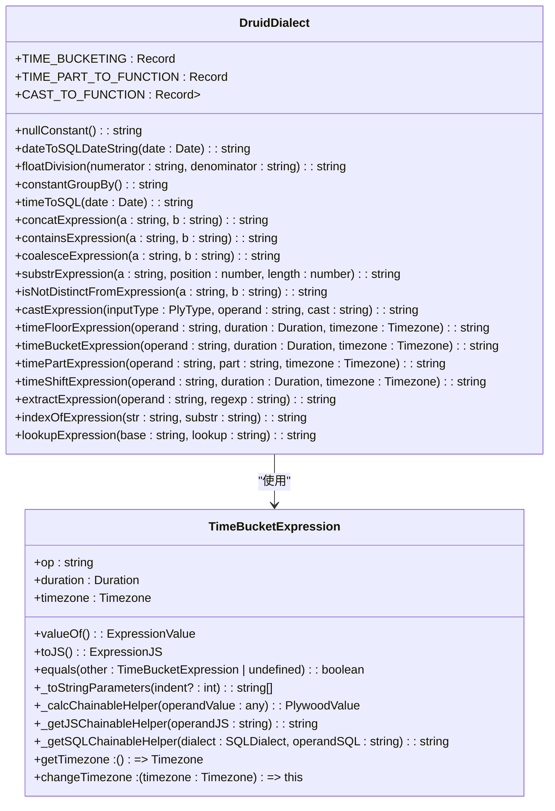
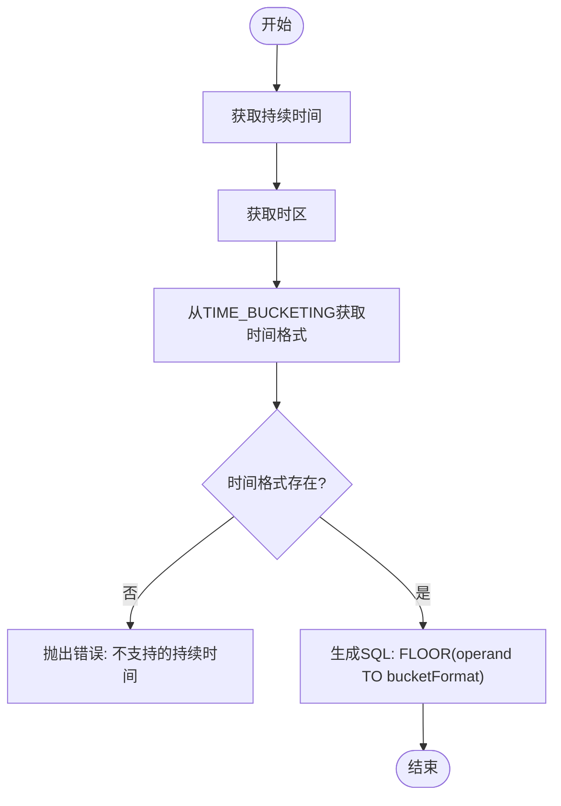
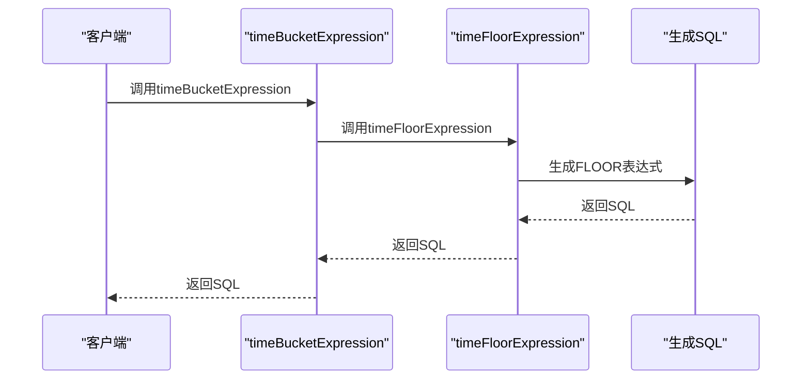
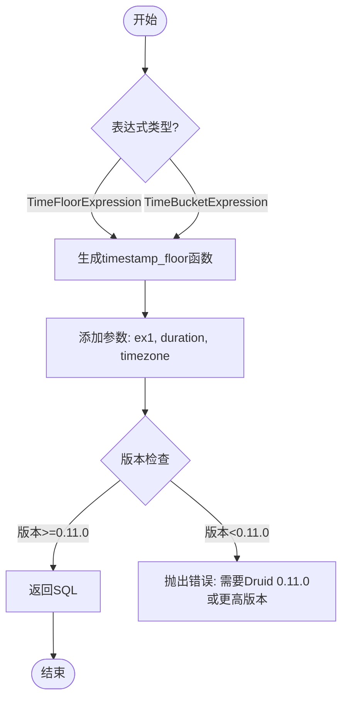

# timeBucket函数转换

<cite>
**本文档引用的文件**
- [druidDialect.ts](file://src/dialect/druidDialect.ts)
- [timeBucketExpression.ts](file://src/expressions/timeBucketExpression.ts)
- [timeFloorExpression.ts](file://src/expressions/timeFloorExpression.ts)
- [druidExpressionBuilder.ts](file://src/external/utils/druidExpressionBuilder.ts)
- [druidExtractionFnBuilder.ts](file://src/external/utils/druidExtractionFnBuilder.ts)
</cite>

## 目录
1. [简介](#简介)
2. [核心实现机制](#核心实现机制)
3. [时间间隔分桶处理](#时间间隔分桶处理)
4. [与timeFloor函数的等价关系](#与timefloor函数的等价关系)
5. [Druid SQL语句生成](#druid-sql语句生成)
6. [时间序列分析应用场景](#时间序列分析应用场景)
7. [最佳实践](#最佳实践)

## 简介
timeBucket函数是Druid方言中用于时间序列分析的重要函数，它通过将时间数据按照指定的时间间隔进行分桶处理，为数据分析提供了强大的支持。该函数在实现上依赖于timeFloorExpression方法进行转换，能够有效地处理各种时间间隔的分桶需求。本文档将详细解释timeBucket表达式在Druid方言中的实现机制，探讨其与timeFloor函数的等价关系，并通过实际代码示例展示timeBucket表达式生成的Druid SQL语句。

**Section sources**
- [druidDialect.ts](file://src/dialect/druidDialect.ts#L20-L175)
- [timeBucketExpression.ts](file://src/expressions/timeBucketExpression.ts#L24-L93)

## 核心实现机制
timeBucket函数在Druid方言中的实现机制主要通过调用timeFloorExpression方法进行转换。在DruidDialect类中，timeBucketExpression方法直接调用timeFloorExpression方法来完成时间分桶操作。这种设计体现了代码的复用性和一致性。

**Diagram sources**
- [druidDialect.ts](file://src/dialect/druidDialect.ts#L135-L137)
- [timeBucketExpression.ts](file://src/expressions/timeBucketExpression.ts#L24-L93)

**Section sources**
- [druidDialect.ts](file://src/dialect/druidDialect.ts#L135-L137)
- [timeBucketExpression.ts](file://src/expressions/timeBucketExpression.ts#L24-L93)

## 时间间隔分桶处理
timeBucket函数通过调用timeFloorExpression方法来处理时间间隔分桶。在DruidDialect类中，timeFloorExpression方法根据指定的持续时间（Duration）和时区（Timezone）来计算时间分桶。该方法首先从TIME_BUCKETING静态属性中获取对应的时间格式，然后使用FLOOR函数将时间数据向下取整到指定的时间间隔。

**Diagram sources**
- [druidDialect.ts](file://src/dialect/druidDialect.ts#L129-L133)
- [druidDialect.ts](file://src/dialect/druidDialect.ts#L20-L175)

**Section sources**
- [druidDialect.ts](file://src/dialect/druidDialect.ts#L129-L133)
- [druidDialect.ts](file://src/dialect/druidDialect.ts#L20-L175)

## 与timeFloor函数的等价关系
timeBucket函数与timeFloor函数在功能上是等价的，它们都通过调用timeFloorExpression方法来实现时间分桶。在DruidDialect类中，timeBucketExpression方法直接返回timeFloorExpression方法的调用结果，这表明两者在底层实现上完全相同。

**Diagram sources**
- [druidDialect.ts](file://src/dialect/druidDialect.ts#L135-L137)
- [druidDialect.ts](file://src/dialect/druidDialect.ts#L129-L133)

**Section sources**
- [druidDialect.ts](file://src/dialect/druidDialect.ts#L135-L137)
- [druidDialect.ts](file://src/dialect/druidDialect.ts#L129-L133)

## Druid SQL语句生成
timeBucket表达式生成的Druid SQL语句主要通过timeFloorExpression方法实现。在druidExpressionBuilder.ts文件中，当遇到TimeFloorExpression或TimeBucketExpression时，会生成相应的timestamp_floor函数调用。

**Diagram sources**
- [druidExpressionBuilder.ts](file://src/external/utils/druidExpressionBuilder.ts#L201-L231)
- [druidDialect.ts](file://src/dialect/druidDialect.ts#L129-L133)

**Section sources**
- [druidExpressionBuilder.ts](file://src/external/utils/druidExpressionBuilder.ts#L201-L231)
- [druidDialect.ts](file://src/dialect/druidDialect.ts#L129-L133)

## 时间序列分析应用场景
timeBucket函数在时间序列分析中有广泛的应用场景，包括但不限于：

1. **按小时聚合数据**：将数据按小时进行分组，便于分析每小时的趋势变化。
2. **按天聚合数据**：将数据按天进行分组，便于分析每日的趋势变化。
3. **按周聚合数据**：将数据按周进行分组，便于分析每周的趋势变化。
4. **按月聚合数据**：将数据按月进行分组，便于分析每月的趋势变化。
5. **按季度聚合数据**：将数据按季度进行分组，便于分析每季度的趋势变化。
6. **按年聚合数据**：将数据按年进行分组，便于分析每年的趋势变化。

这些应用场景在实际业务中非常常见，例如在网站流量分析、销售数据分析、用户行为分析等领域都有广泛的应用。

**Section sources**
- [druidDialect.ts](file://src/dialect/druidDialect.ts#L20-L175)
- [timeBucketExpression.ts](file://src/expressions/timeBucketExpression.ts#L24-L93)

## 最佳实践
在使用timeBucket函数时，应遵循以下最佳实践：

1. **选择合适的时间间隔**：根据业务需求选择合适的时间间隔，避免过于细粒度或过于粗粒度的分桶。
2. **考虑时区影响**：在处理跨时区数据时，应明确指定时区，避免因时区差异导致的数据偏差。
3. **性能优化**：在大数据量场景下，应考虑使用适当的索引和分区策略，以提高查询性能。
4. **错误处理**：在代码中应妥善处理可能的错误，例如不支持的持续时间或无效的时区。
5. **版本兼容性**：在使用timestamp_floor函数时，应注意Druid版本的兼容性要求，确保使用的Druid版本支持该函数。

遵循这些最佳实践，可以确保timeBucket函数在实际应用中发挥最大的效用，同时避免常见的问题和陷阱。

**Section sources**
- [druidDialect.ts](file://src/dialect/druidDialect.ts#L135-L137)
- [druidExpressionBuilder.ts](file://src/external/utils/druidExpressionBuilder.ts#L201-L231)
- [druidExtractionFnBuilder.ts](file://src/external/utils/druidExtractionFnBuilder.ts#L279-L312)