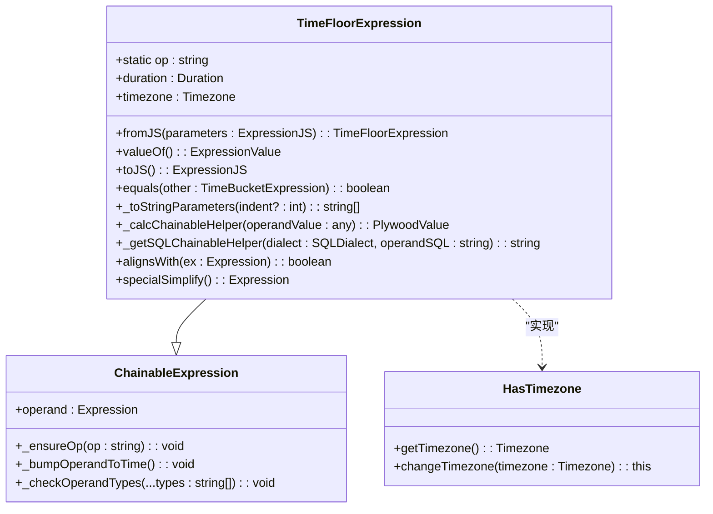
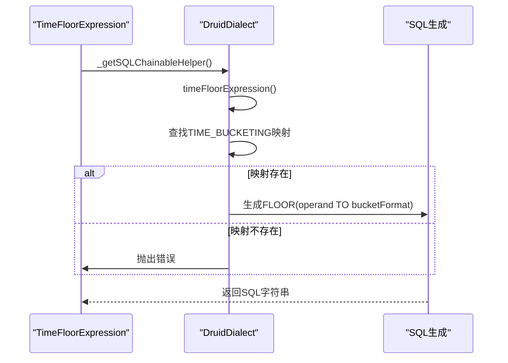
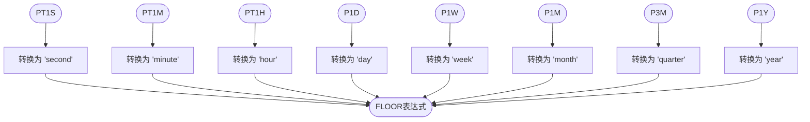
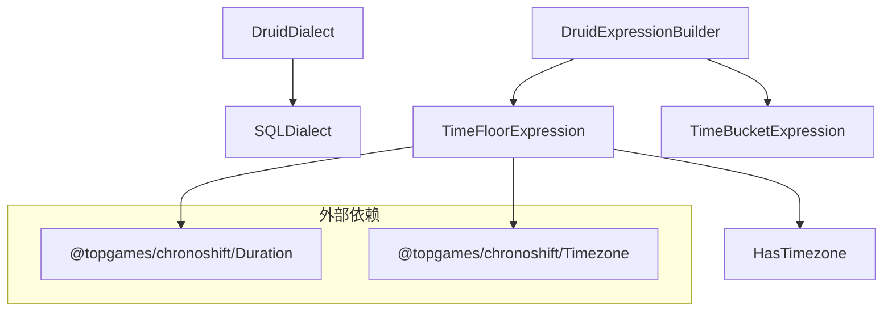

# timeFloor函数转换

<cite>
**本文档引用的文件**
- [druidDialect.ts](file://src/dialect/druidDialect.ts)
- [timeFloorExpression.ts](file://src/expressions/timeFloorExpression.ts)
- [druidExpressionBuilder.ts](file://src/external/utils/druidExpressionBuilder.ts)
</cite>

## 目录
1. [简介](#简介)
2. [核心组件](#核心组件)
3. [架构概述](#架构概述)
4. [详细组件分析](#详细组件分析)
5. [依赖分析](#依赖分析)
6. [性能考虑](#性能考虑)
7. [故障排除指南](#故障排除指南)
8. [结论](#结论)

## 简介
本文档详细介绍了Plywood中timeFloor函数在Druid方言中的转换机制。重点阐述了如何将Plywood的timeFloor表达式转换为Druid SQL的FLOOR函数调用，深入解析了ISO 8601持续时间格式到Druid时间粒度的映射规则，并提供了时区处理和性能优化的相关建议。

## 核心组件

`TimeFloorExpression`类是实现时间下取整功能的核心组件，它继承自`ChainableExpression`并实现了`HasTimezone`混入。该表达式用于将时间值按指定的持续时间进行向下取整操作，支持时区配置。`DruidDialect`类中的`timeFloorExpression`方法负责将Plywood表达式转换为Druid SQL语法。

**核心组件**
- [timeFloorExpression.ts](file://src/expressions/timeFloorExpression.ts#L25-L130)
- [druidDialect.ts](file://src/dialect/druidDialect.ts#L20-L175)

## 架构概述

Plywood的timeFloor功能通过表达式树和方言适配器的协作实现。`TimeFloorExpression`作为表达式树的节点，通过`_getSQLChainableHelper`方法调用方言的`timeFloorExpression`实现SQL生成。`DruidDialect`提供具体的SQL语法转换，将Plywood的持续时间格式映射到Druid的时间粒度。

```mermaid
graph TB
subgraph "表达式层"
TimeFloorExpression[TimeFloorExpression]
BaseExpression[baseExpression]
end
subgraph "方言层"
DruidDialect[DruidDialect]
SQLDialect[SQLDialect]
end
TimeFloorExpression --> BaseExpression
TimeFloorExpression --> DruidDialect : "调用"
DruidDialect --> SQLDialect
```

**图表来源**
- [timeFloorExpression.ts](file://src/expressions/timeFloorExpression.ts#L25-L130)
- [druidDialect.ts](file://src/dialect/druidDialect.ts#L20-L175)

## 详细组件分析

### TimeFloorExpression分析
`TimeFloorExpression`是Plywood中实现时间下取整的核心类。在构造函数中，它验证持续时间是否可下取整（通过`duration.isFloorable()`），并确保操作数类型为TIME。该表达式通过`_getSQLChainableHelper`方法委托给方言对象生成SQL。



**图表来源**
- [timeFloorExpression.ts](file://src/expressions/timeFloorExpression.ts#L25-L130)

**章节来源**
- [timeFloorExpression.ts](file://src/expressions/timeFloorExpression.ts#L25-L130)

### DruidDialect分析
`DruidDialect`类中的`timeFloorExpression`方法负责将Plywood的timeFloor表达式转换为Druid SQL语法。它使用`TIME_BUCKETING`静态映射表将ISO 8601持续时间格式转换为Druid的时间粒度。该方法还处理时区参数，确保时间计算的准确性。



**图表来源**
- [druidDialect.ts](file://src/dialect/druidDialect.ts#L129-L137)

**章节来源**
- [druidDialect.ts](file://src/dialect/druidDialect.ts#L20-L175)

### 时间粒度映射分析
`TIME_BUCKETING`静态映射表定义了ISO 8601持续时间格式与Druid时间粒度之间的对应关系。该映射确保了Plywood的持续时间规范能够正确转换为Druid SQL的时间粒度参数。



**图表来源**
- [druidDialect.ts](file://src/dialect/druidDialect.ts#L21-L30)

**章节来源**
- [druidDialect.ts](file://src/dialect/druidDialect.ts#L20-L175)

## 依赖分析

`TimeFloorExpression`依赖于`Duration`和`Timezone`类来处理时间相关的计算。`DruidDialect`依赖于`SQLDialect`基类提供的SQL生成能力。`druidExpressionBuilder`模块中的`expressionToDruidExpression`方法也依赖于`TimeFloorExpression`来生成Druid原生表达式。



**图表来源**
- [timeFloorExpression.ts](file://src/expressions/timeFloorExpression.ts#L25-L130)
- [druidDialect.ts](file://src/dialect/druidDialect.ts#L20-L175)
- [druidExpressionBuilder.ts](file://src/external/utils/druidExpressionBuilder.ts#L201-L231)

**章节来源**
- [timeFloorExpression.ts](file://src/expressions/timeFloorExpression.ts#L25-L130)
- [druidDialect.ts](file://src/dialect/druidDialect.ts#L20-L175)

## 性能考虑

在使用timeFloor函数时，应考虑以下性能优化建议：
1. 使用可下取整的持续时间（如PT1S、PT1M、PT1H等），避免使用非标准间隔
2. 尽量使用较粗的时间粒度以减少数据分组数量
3. 在可能的情况下，使用预计算的时间桶来避免实时计算
4. 考虑时区转换的开销，尽量使用UTC时区进行计算

## 故障排除指南

当遇到timeFloor函数相关问题时，可以参考以下常见问题及解决方案：
1. **不支持的持续时间**：确保使用的持续时间在`TIME_BUCKETING`映射表中定义
2. **时区问题**：验证时区参数是否正确配置
3. **类型错误**：确保操作数是时间类型
4. **性能问题**：检查是否使用了过细的时间粒度

**章节来源**
- [druidDialect.ts](file://src/dialect/druidDialect.ts#L129-L137)
- [timeFloorExpression.ts](file://src/expressions/timeFloorExpression.ts#L25-L130)

## 结论

Plywood的timeFloor函数通过`TimeFloorExpression`类和`DruidDialect`的协作，实现了将Plywood表达式转换为Druid SQL的FLOOR函数调用。`TIME_BUCKETING`静态映射表确保了ISO 8601持续时间格式到Druid时间粒度的正确转换。该实现支持时区配置，并提供了性能优化和错误处理机制。