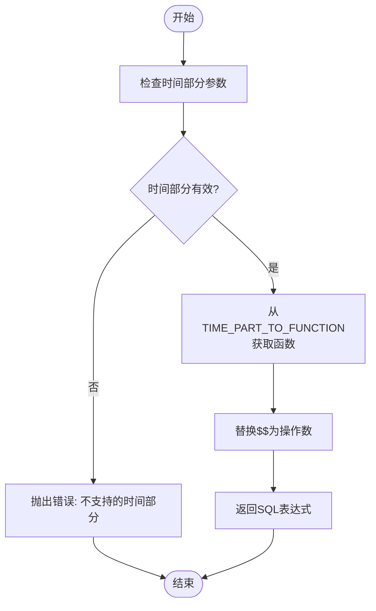
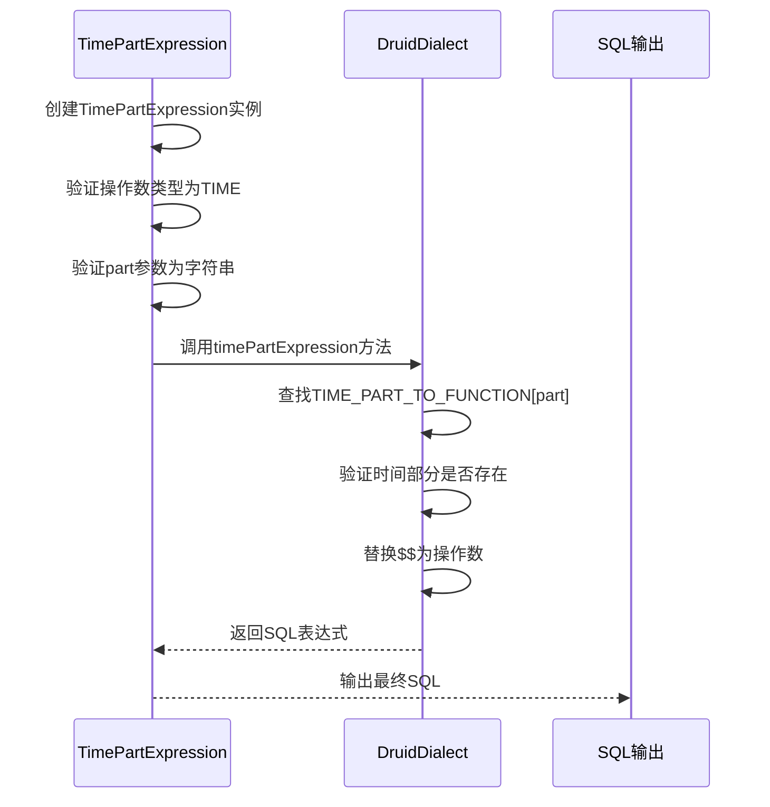

# timePart函数转换

<cite>
**Referenced Files in This Document**   
- [druidDialect.ts](file://src/dialect/druidDialect.ts)
- [timePartExpression.ts](file://src/expressions/timePartExpression.ts)
</cite>

## 目录
1. [简介](#简介)
2. [核心组件](#核心组件)
3. [TIME_PART_TO_FUNCTION映射表详解](#time_part_to_function映射表详解)
4. [时间部分转换逻辑分析](#时间部分转换逻辑分析)
5. [SQL表达式生成机制](#sql表达式生成机制)
6. [常见错误与调试技巧](#常见错误与调试技巧)

## 简介
本文档深入解析Druid方言中timePart函数的转换机制，重点分析TIME_PART_TO_FUNCTION静态映射表中各种时间部分到Druid SQL表达式的转换逻辑。文档详细说明了秒、分钟、小时、周、月、年等不同时间单位的计算公式，并通过具体示例展示timePart表达式生成的复杂SQL。

**Section sources**
- [druidDialect.ts](file://src/dialect/druidDialect.ts#L32-L60)
- [timePartExpression.ts](file://src/expressions/timePartExpression.ts#L24-L164)

## 核心组件
timePart函数转换的核心组件包括DruidDialect类中的TIME_PART_TO_FUNCTION静态映射表和timePartExpression方法。这些组件共同实现了时间部分到SQL表达式的转换逻辑。

**Section sources**
- [druidDialect.ts](file://src/dialect/druidDialect.ts#L32-L60)
- [timePartExpression.ts](file://src/expressions/timePartExpression.ts#L24-L164)

## TIME_PART_TO_FUNCTION映射表详解
TIME_PART_TO_FUNCTION静态映射表定义了各种时间部分到Druid SQL表达式的转换规则。该映射表包含了从秒到年的各种时间单位的提取逻辑。

```mermaid
classDiagram
class DruidDialect {
+static TIME_BUCKETING : Record<string, string>
+static TIME_PART_TO_FUNCTION : Record<string, string>
+static CAST_TO_FUNCTION : Record<string, Record<string, string>>
+timePartExpression(operand : string, part : string, timezone : Timezone) : string
+timeFloorExpression(operand : string, duration : Duration, timezone : Timezone) : string
+timeBucketExpression(operand : string, duration : Duration, timezone : Timezone) : string
}
class TimePartExpression {
+static op : string
+static PART_TO_FUNCTION : Record<string, (d : any) => number>
+static PART_TO_MAX_VALUES : Record<string, number>
+part : string
+timezone : Timezone
+_calcChainableHelper(operandValue : any) : PlywoodValue
+_getSQLChainableHelper(dialect : SQLDialect, operandSQL : string) : string
+maxPossibleSplitValues() : number
}
DruidDialect --> TimePartExpression : "调用"
TimePartExpression --> DruidDialect : "依赖"
```

**Diagram sources**
- [druidDialect.ts](file://src/dialect/druidDialect.ts#L32-L60)
- [timePartExpression.ts](file://src/expressions/timePartExpression.ts#L24-L164)

## 时间部分转换逻辑分析
timePart函数支持多种时间部分的提取，包括：

- **秒级单位**：SECOND_OF_MINUTE、SECOND_OF_HOUR、SECOND_OF_DAY等
- **分钟级单位**：MINUTE_OF_HOUR、MINUTE_OF_DAY、MINUTE_OF_WEEK等
- **小时级单位**：HOUR_OF_DAY、HOUR_OF_WEEK、HOUR_OF_MONTH等
- **日级单位**：DAY_OF_WEEK、DAY_OF_MONTH、DAY_OF_YEAR
- **周级单位**：WEEK_OF_YEAR
- **月级单位**：MONTH_OF_YEAR
- **年级单位**：YEAR



**Diagram sources**
- [druidDialect.ts](file://src/dialect/druidDialect.ts#L139-L143)

## SQL表达式生成机制
timePart表达式的SQL生成机制通过_druidDialect.ts_文件中的timePartExpression方法实现。该方法首先从TIME_PART_TO_FUNCTION映射表中获取对应时间部分的SQL模板，然后将模板中的$$占位符替换为实际的操作数。



**Diagram sources**
- [druidDialect.ts](file://src/dialect/druidDialect.ts#L139-L143)
- [timePartExpression.ts](file://src/expressions/timePartExpression.ts#L24-L164)

## 常见错误与调试技巧
在使用timePart函数时，可能会遇到以下常见错误：

1. **不支持的时间部分**：当指定的时间部分不在TIME_PART_TO_FUNCTION映射表中时，会抛出错误
2. **操作数类型错误**：timePart函数要求操作数类型为TIME，否则会验证失败
3. **时区处理问题**：未正确处理时区可能导致时间计算错误

调试技巧包括：
- 检查时间部分参数是否拼写正确
- 验证操作数是否为有效的时间类型
- 确认时区设置是否正确

**Section sources**
- [druidDialect.ts](file://src/dialect/druidDialect.ts#L139-L143)
- [timePartExpression.ts](file://src/expressions/timePartExpression.ts#L24-L164)