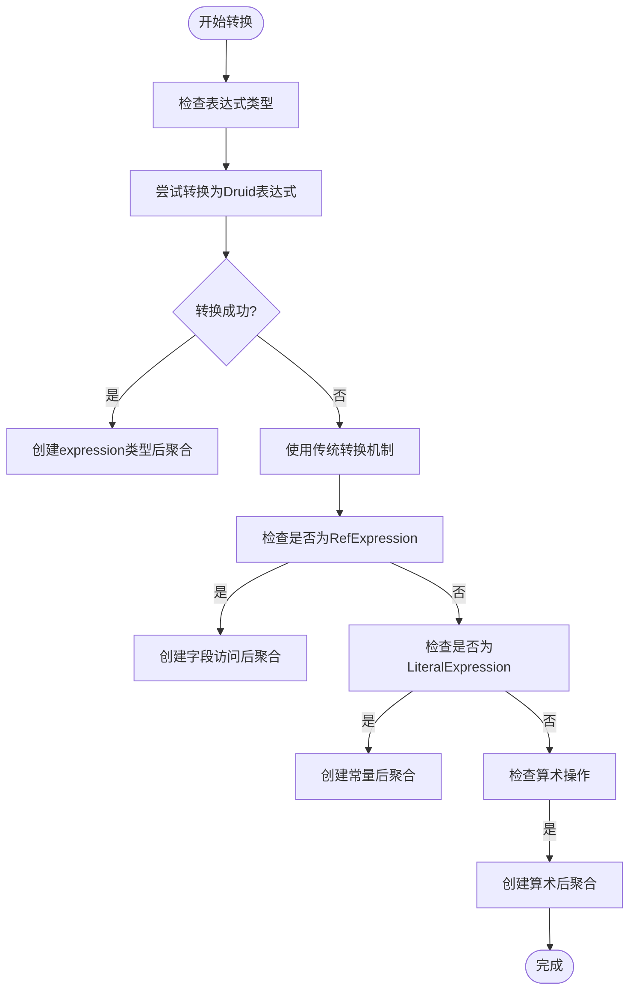
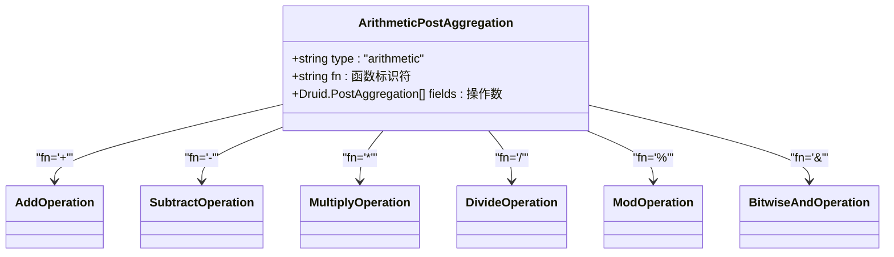
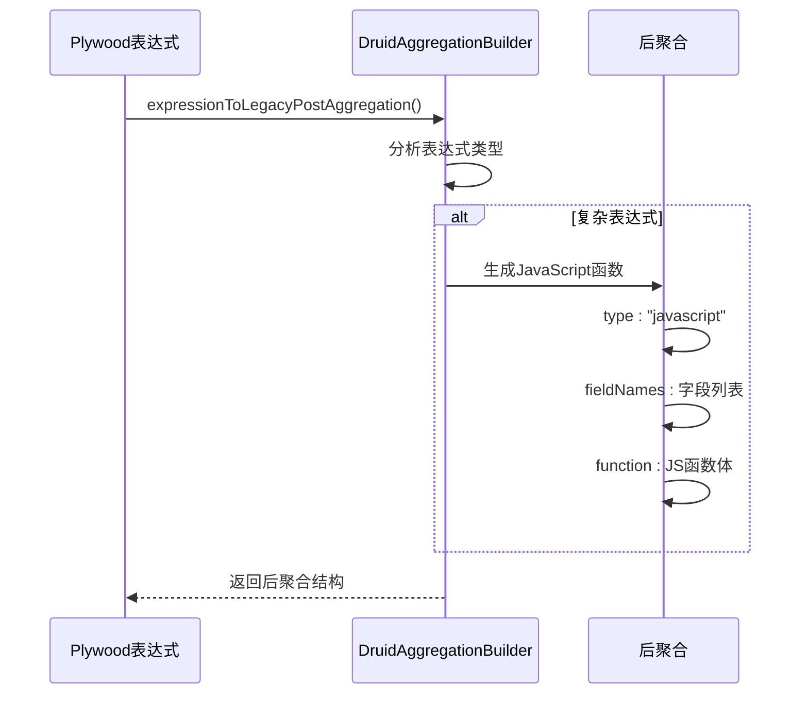
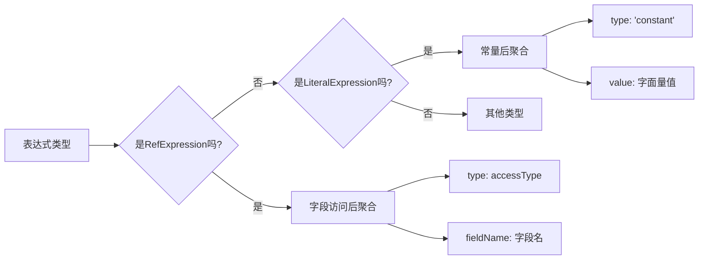
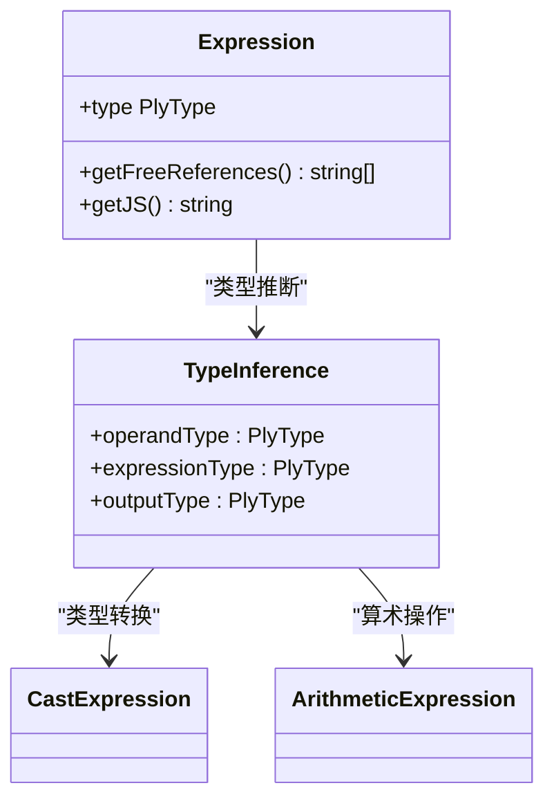
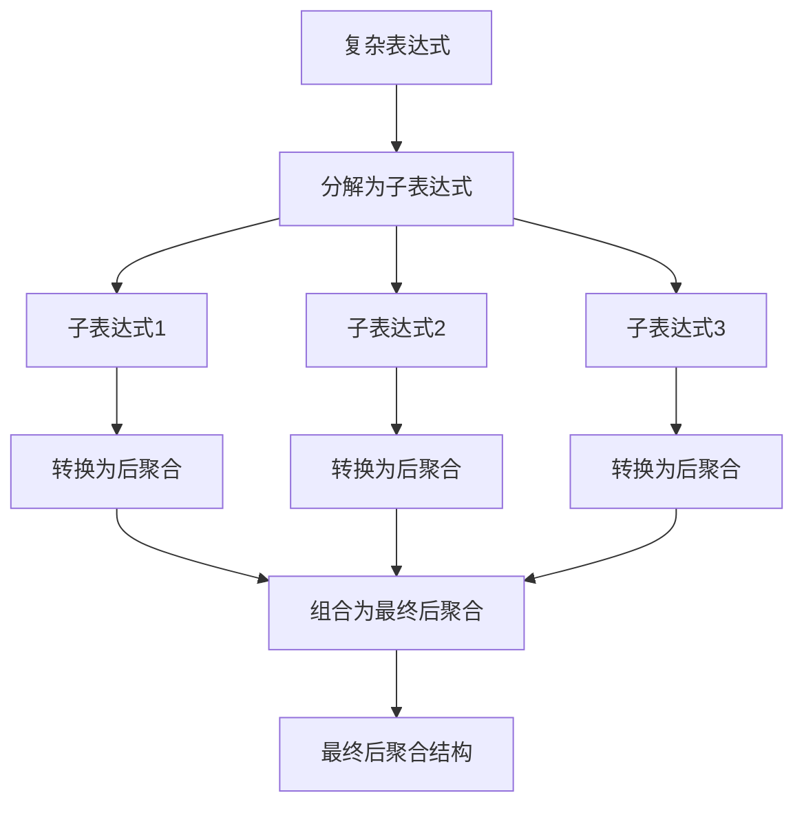
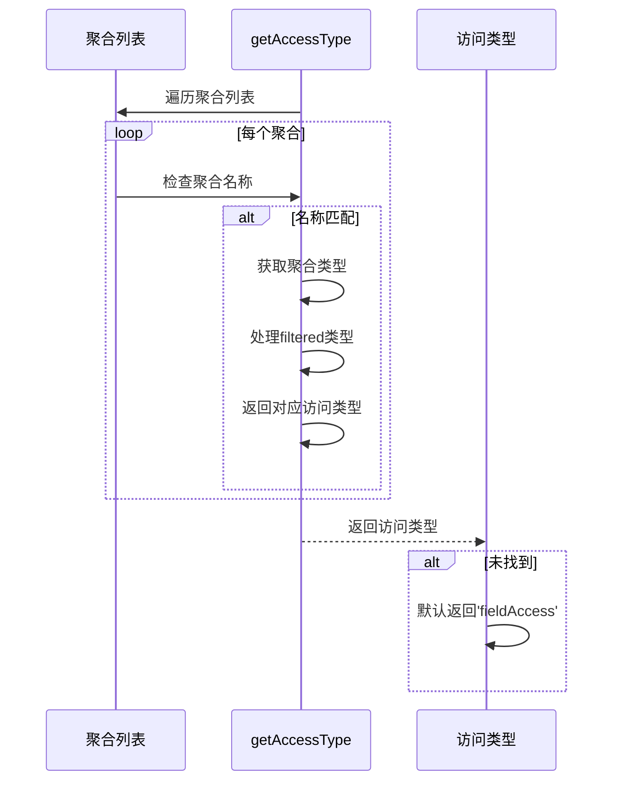
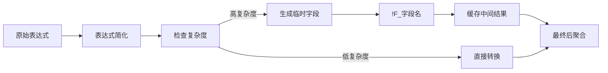

# 后聚合计算

<cite>
**本文档中引用的文件**  
- [druidAggregationBuilder.ts](file://src/external/utils/druidAggregationBuilder.ts)
- [druidExpressionBuilder.ts](file://src/external/utils/druidExpressionBuilder.ts)
- [absoluteExpression.ts](file://src/expressions/absoluteExpression.ts)
- [addExpression.ts](file://src/expressions/addExpression.ts)
- [divideExpression.ts](file://src/expressions/divideExpression.ts)
- [bitwiseAndExpression.ts](file://src/expressions/bitwiseAndExpression.ts)
- [baseExpression.ts](file://src/expressions/baseExpression.ts)
- [druidTypes.ts](file://src/external/utils/druidTypes.ts)
</cite>

## 目录
1. [简介](#简介)
2. [核心转换机制](#核心转换机制)
3. 后聚合类型生成规则
   1. [算术后聚合](#算术后聚合)
   2. [JavaScript后聚合](#javascript后聚合)
   3. [常量与字段访问](#常量与字段访问)
4. [表达式依赖与类型推断](#表达式依赖与类型推断)
5. [复杂表达式处理策略](#复杂表达式处理策略)
6. [访问类型确定机制](#访问类型确定机制)
7. [优化策略](#优化策略)

## 简介
本文档详细阐述了Plywood表达式到Druid后聚合结构的转换机制。重点分析了`expressionToPostAggregation`方法如何将Plywood表达式转换为Druid兼容的后聚合格式，涵盖了各种操作类型的生成规则、字段访问机制和类型推断策略。

**Section sources**
- [druidAggregationBuilder.ts](file://src/external/utils/druidAggregationBuilder.ts#L588-L599)

## 核心转换机制
`expressionToPostAggregation`方法是Plywood表达式转换为Druid后聚合的核心。该方法首先尝试使用`DruidExpressionBuilder`将表达式转换为Druid表达式格式。如果转换成功，则生成类型为"expression"的后聚合；如果转换失败，则回退到传统的后聚合生成机制。

**Diagram sources**
- [druidAggregationBuilder.ts](file://src/external/utils/druidAggregationBuilder.ts#L588-L599)
- [druidAggregationBuilder.ts](file://src/external/utils/druidAggregationBuilder.ts#L601-L689)

**Section sources**
- [druidAggregationBuilder.ts](file://src/external/utils/druidAggregationBuilder.ts#L588-L689)

## 后聚合类型生成规则

### 算术后聚合
算术操作（加减乘除、位运算等）通过"arithmetic"类型的后聚合实现。每种操作对应特定的函数标识符：

**Diagram sources**
- [druidAggregationBuilder.ts](file://src/external/utils/druidAggregationBuilder.ts#L645-L670)
- [addExpression.ts](file://src/expressions/addExpression.ts#L1-L64)
- [divideExpression.ts](file://src/expressions/divideExpression.ts#L1-L65)
- [bitwiseAndExpression.ts](file://src/expressions/bitwiseAndExpression.ts#L1-L58)

**Section sources**
- [druidAggregationBuilder.ts](file://src/external/utils/druidAggregationBuilder.ts#L645-L670)

### JavaScript后聚合
对于复杂的表达式操作，系统生成JavaScript后聚合。这些聚合包含完整的JavaScript函数定义，支持绝对值、类型转换等高级操作：

**Diagram sources**
- [druidAggregationBuilder.ts](file://src/external/utils/druidAggregationBuilder.ts#L615-L643)
- [absoluteExpression.ts](file://src/expressions/absoluteExpression.ts#L1-L55)

**Section sources**
- [druidAggregationBuilder.ts](file://src/external/utils/druidAggregationBuilder.ts#L615-L643)

### 常量与字段访问
基本的后聚合类型包括常量和字段访问，用于处理字面量值和直接字段引用：

**Diagram sources**
- [druidAggregationBuilder.ts](file://src/external/utils/druidAggregationBuilder.ts#L605-L613)
- [druidAggregationBuilder.ts](file://src/external/utils/druidAggregationBuilder.ts#L601-L604)

**Section sources**
- [druidAggregationBuilder.ts](file://src/external/utils/druidAggregationBuilder.ts#L601-L613)

## 表达式依赖与类型推断
系统通过分析表达式的自由引用（freeReferences）来确定其依赖的字段。类型推断基于操作数的类型和输出类型要求：

**Diagram sources**
- [baseExpression.ts](file://src/expressions/baseExpression.ts#L1-L799)
- [druidExpressionBuilder.ts](file://src/external/utils/druidExpressionBuilder.ts#L134-L380)

**Section sources**
- [baseExpression.ts](file://src/expressions/baseExpression.ts#L1-L799)

## 复杂表达式处理策略
对于包含多个操作的复杂表达式，系统采用递归分解策略，将表达式树逐层转换为后聚合结构：

**Diagram sources**
- [druidAggregationBuilder.ts](file://src/external/utils/druidAggregationBuilder.ts#L645-L689)
- [druidExpressionBuilder.ts](file://src/external/utils/druidExpressionBuilder.ts#L134-L380)

**Section sources**
- [druidAggregationBuilder.ts](file://src/external/utils/druidAggregationBuilder.ts#L645-L689)

## 访问类型确定机制
`getAccessType`方法根据前置聚合的类型确定字段的访问方式。该方法检查聚合类型并返回相应的访问类型：

**Diagram sources**
- [druidAggregationBuilder.ts](file://src/external/utils/druidAggregationBuilder.ts#L577-L586)
- [druidTypes.ts](file://src/external/utils/druidTypes.ts#L1-L34)

**Section sources**
- [druidAggregationBuilder.ts](file://src/external/utils/druidAggregationBuilder.ts#L577-L586)

## 优化策略
系统实现了多种优化策略来提高后聚合的执行效率，包括临时字段生成和表达式简化：

**Diagram sources**
- [druidAggregationBuilder.ts](file://src/external/utils/druidAggregationBuilder.ts#L615-L643)
- [druidExpressionBuilder.ts](file://src/external/utils/druidExpressionBuilder.ts#L134-L380)

**Section sources**
- [druidAggregationBuilder.ts](file://src/external/utils/druidAggregationBuilder.ts#L615-L643)