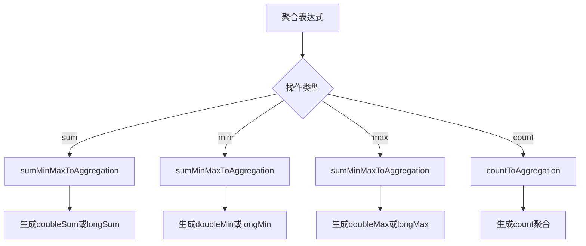
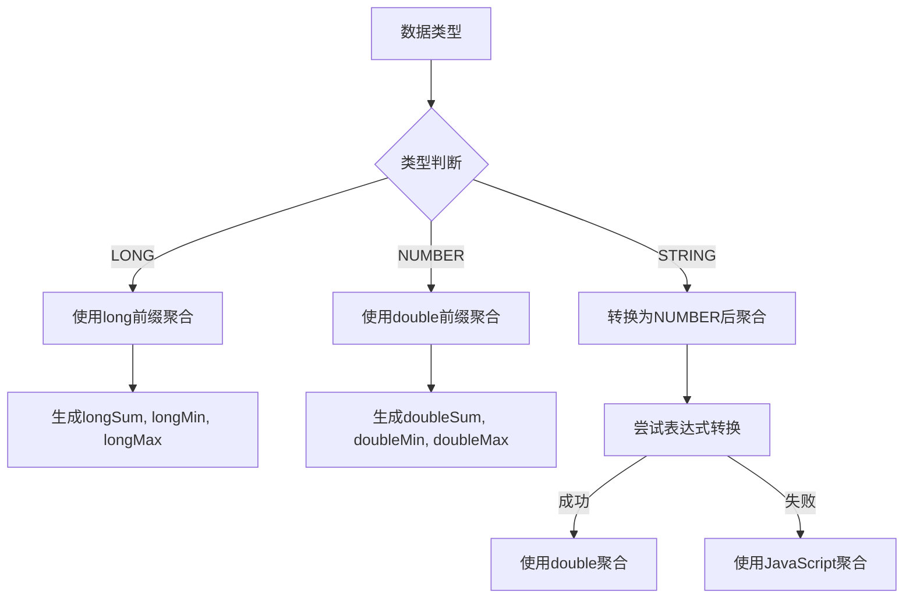
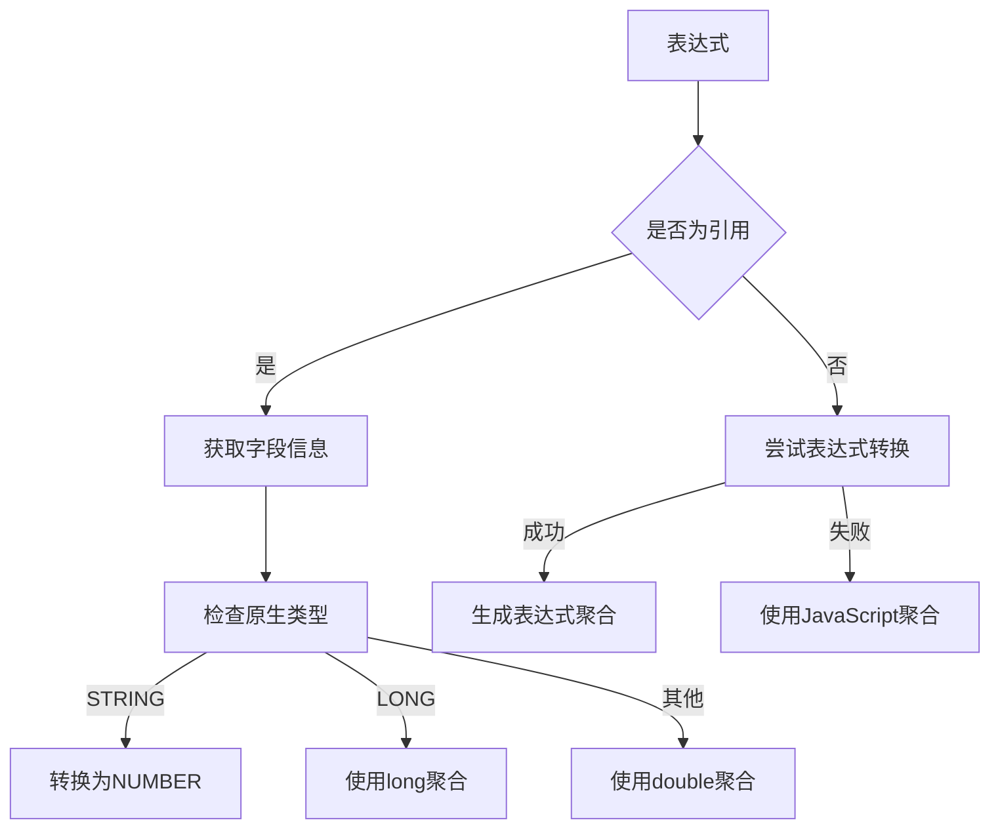
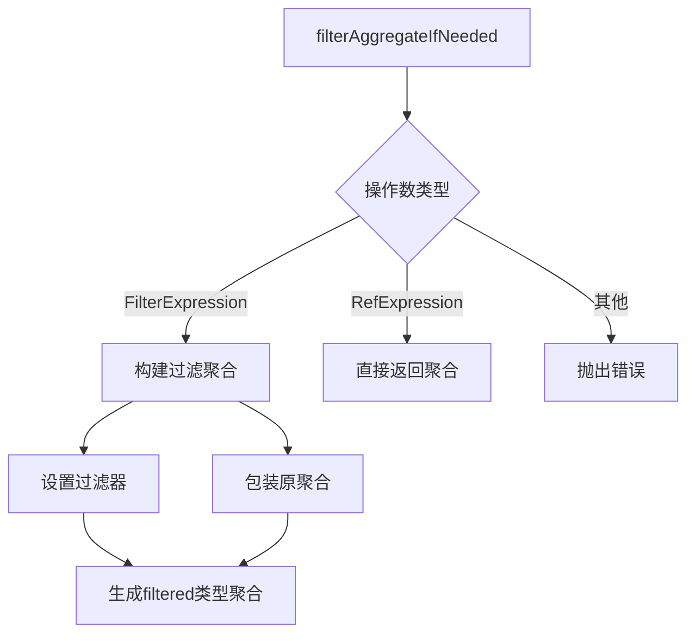
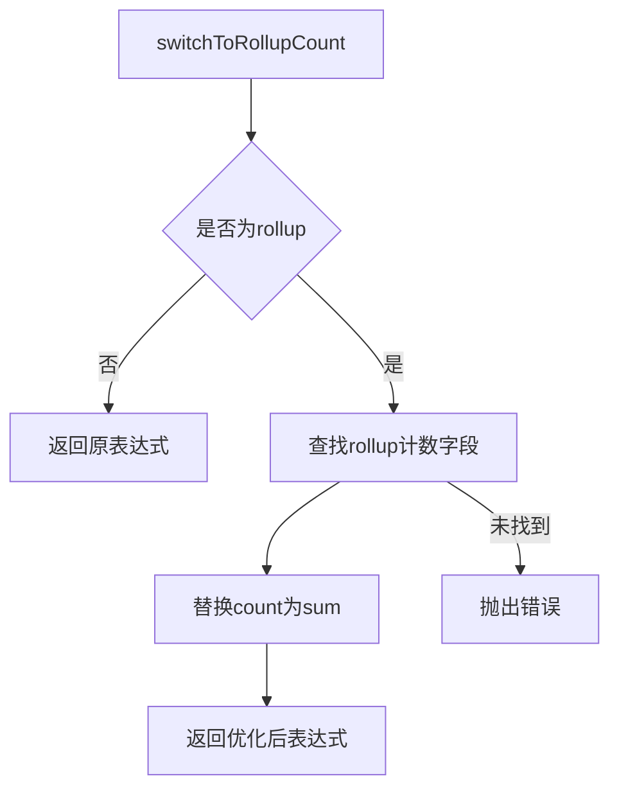

# 基本聚合转换

<cite>
**本文档引用文件**   
- [countExpression.ts](file://src/expressions/countExpression.ts)
- [sumExpression.ts](file://src/expressions/sumExpression.ts)
- [minExpression.ts](file://src/expressions/minExpression.ts)
- [maxExpression.ts](file://src/expressions/maxExpression.ts)
- [druidAggregationBuilder.ts](file://src/external/utils/druidAggregationBuilder.ts)
- [druidExternal.ts](file://src/external/druidExternal.ts)
</cite>

## 目录
1. [引言](#引言)
2. [基本聚合表达式](#基本聚合表达式)
3. [Druid聚合类型生成规则](#druid聚合类型生成规则)
4. [数据类型处理逻辑](#数据类型处理逻辑)
5. [字段引用与表达式计算](#字段引用与表达式计算)
6. [过滤器支持](#过滤器支持)
7. [Rollup场景优化](#rollup场景优化)

## 引言
本文档详细阐述了Plywood中基本聚合表达式如何转换为Druid原生聚合格式。重点分析了count、sum、min、max等基础聚合操作的转换机制，以及在不同数据类型下的处理策略。文档还深入探讨了filterAggregateIfNeeded方法如何为聚合添加过滤器支持，以及rollup场景下的count转换优化机制。

## 基本聚合表达式
Plywood提供了多种基本聚合表达式，包括count、sum、min和max等，这些表达式在执行时会被转换为相应的Druid原生聚合格式。每种聚合表达式都有其特定的转换规则和处理逻辑。

**Section sources**
- [countExpression.ts](file://src/expressions/countExpression.ts#L21-L42)
- [sumExpression.ts](file://src/expressions/sumExpression.ts#L21-L81)
- [minExpression.ts](file://src/expressions/minExpression.ts#L21-L46)
- [maxExpression.ts](file://src/expressions/maxExpression.ts#L21-L46)

## Druid聚合类型生成规则
在Plywood到Druid的转换过程中，基本聚合表达式会根据其操作类型和数据特征生成相应的Druid聚合类型。主要的聚合类型包括longSum、doubleSum、longMin、longMax、doubleMin和doubleMax。

**Diagram sources **
- [druidAggregationBuilder.ts](file://src/external/utils/druidAggregationBuilder.ts#L222-L262)
- [druidAggregationBuilder.ts](file://src/external/utils/druidAggregationBuilder.ts#L167-L183)

## 数据类型处理逻辑
聚合表达式的转换过程需要考虑数据类型的影响。对于LONG、NUMBER和STRING等不同数据类型，Plywood采用不同的处理策略来确保正确的聚合结果。

**Diagram sources **
- [druidAggregationBuilder.ts](file://src/external/utils/druidAggregationBuilder.ts#L226-L269)
- [druidAggregationBuilder.ts](file://src/external/utils/druidAggregationBuilder.ts#L284-L388)

## 字段引用与表达式计算
在处理聚合表达式时，Plywood需要正确处理字段引用和表达式计算。这包括对引用表达式的解析和对复杂表达式的计算。

**Diagram sources **
- [druidAggregationBuilder.ts](file://src/external/utils/druidAggregationBuilder.ts#L226-L269)
- [druidExpressionBuilder.ts](file://src/external/utils/druidExpressionBuilder.ts#L369-L400)

## 过滤器支持
filterAggregateIfNeeded方法负责为聚合操作添加过滤器支持。该方法检查操作数是否为过滤表达式，并相应地构建过滤聚合。

**Diagram sources **
- [druidAggregationBuilder.ts](file://src/external/utils/druidAggregationBuilder.ts#L167-L183)
- [druidAggregationBuilder.ts](file://src/external/utils/druidAggregationBuilder.ts#L127-L151)

## Rollup场景优化
在rollup场景下，count聚合会被优化为sum操作。这种优化通过switchToRollupCount方法实现，将count操作转换为对特定计数字段的sum操作。

**Diagram sources **
- [druidAggregationBuilder.ts](file://src/external/utils/druidAggregationBuilder.ts#L691-L702)
- [druidAggregationBuilder.ts](file://src/external/utils/druidAggregationBuilder.ts#L704-L711)