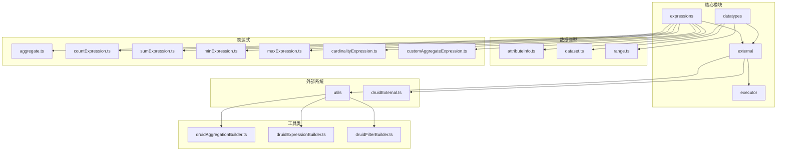
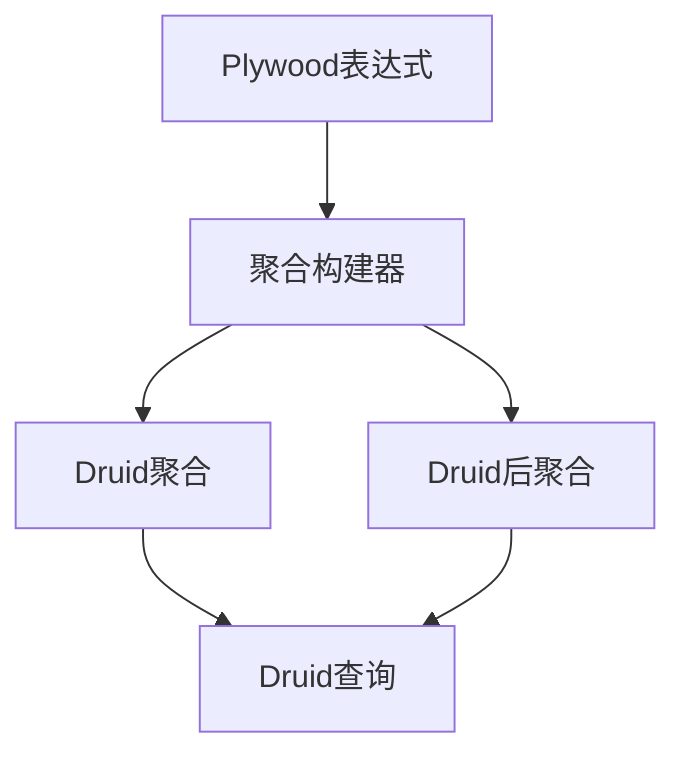
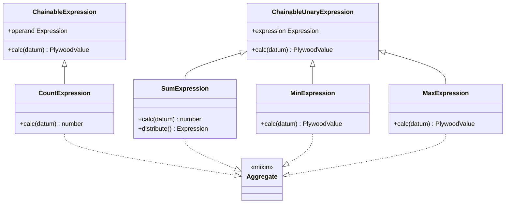
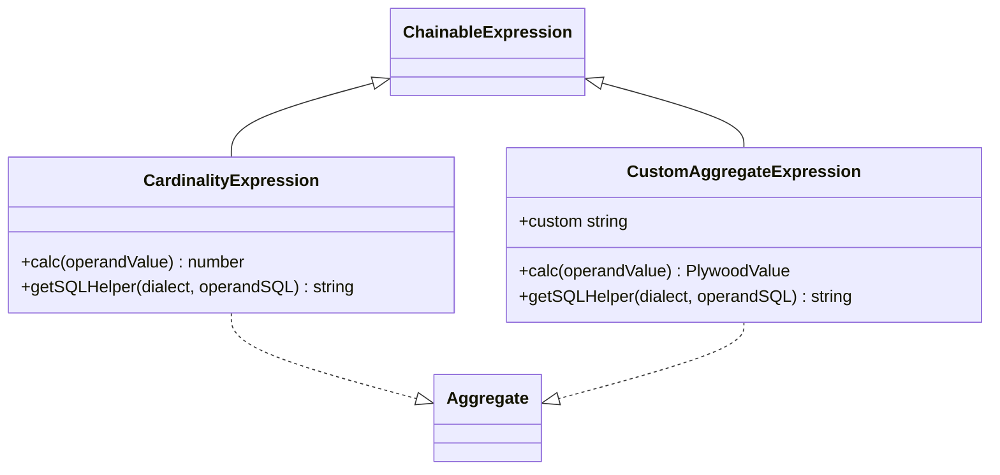
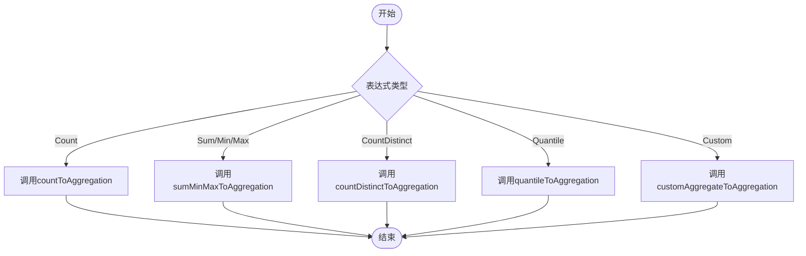
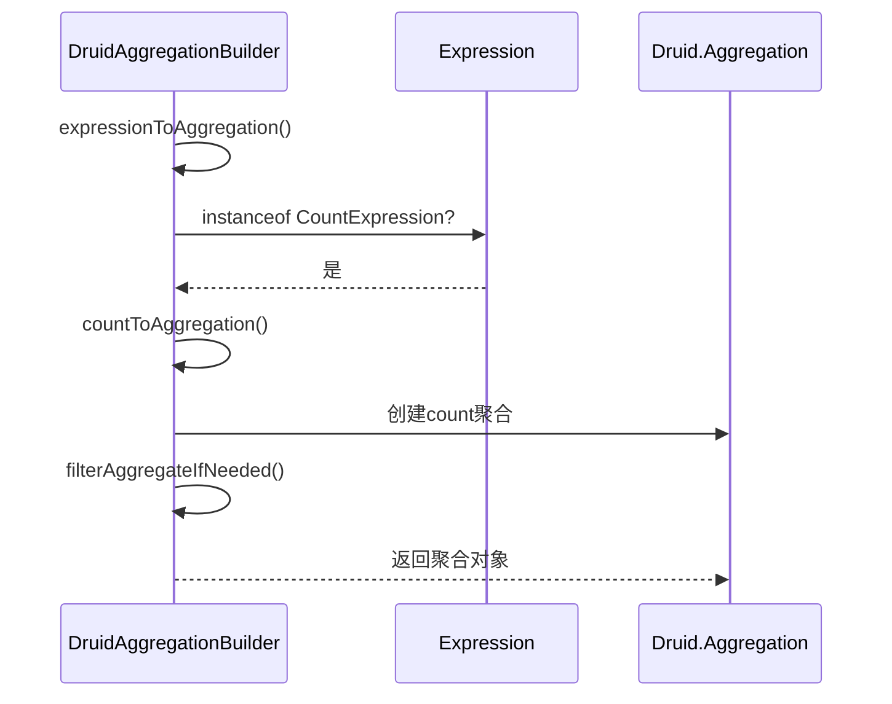
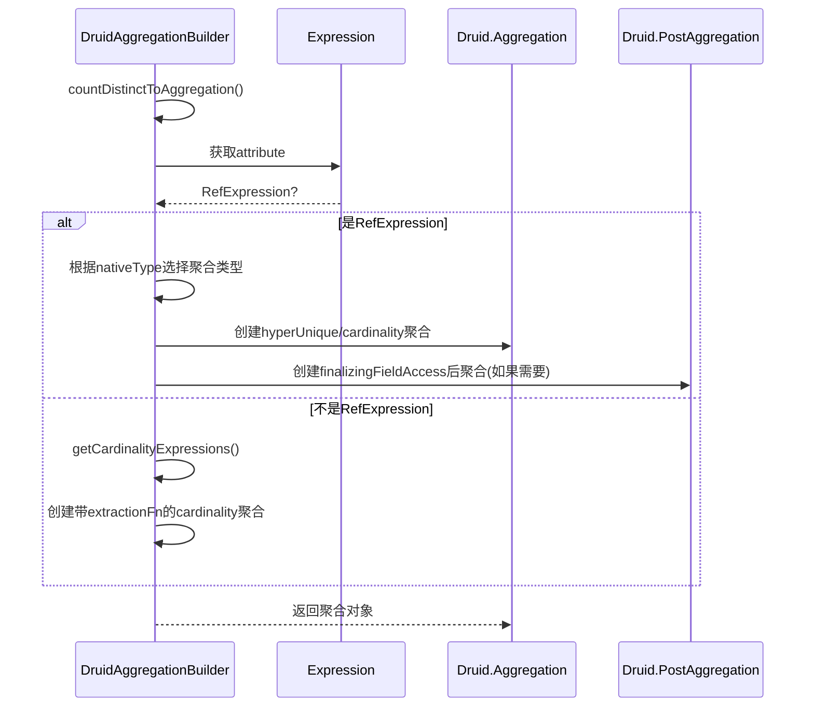
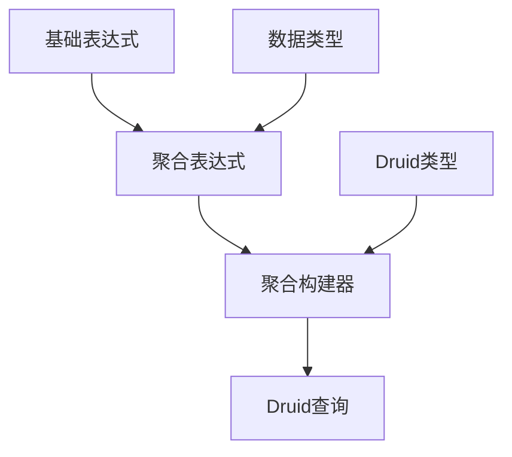

# 聚合查询转换

<cite>
**本文档中引用的文件**  
- [druidAggregationBuilder.ts](file://src/external/utils/druidAggregationBuilder.ts)
- [druidExternal.ts](file://src/external/druidExternal.ts)
- [countExpression.ts](file://src/expressions/countExpression.ts)
- [sumExpression.ts](file://src/expressions/sumExpression.ts)
- [minExpression.ts](file://src/expressions/minExpression.ts)
- [maxExpression.ts](file://src/expressions/maxExpression.ts)
- [cardinalityExpression.ts](file://src/expressions/cardinalityExpression.ts)
- [customAggregateExpression.ts](file://src/expressions/customAggregateExpression.ts)
</cite>

## 目录
1. [引言](#引言)
2. [项目结构](#项目结构)
3. [核心组件](#核心组件)
4. [架构概述](#架构概述)
5. [详细组件分析](#详细组件分析)
6. [依赖分析](#依赖分析)
7. [性能考虑](#性能考虑)
8. [故障排除指南](#故障排除指南)
9. [结论](#结论)

## 引言
本文档详细描述了如何将Plywood的聚合表达式（如count、sum、min、max等）转换为Druid的聚合查询格式。重点介绍groupBy查询中聚合函数的生成规则，包括基本聚合、近似聚合（如hyperUnique、thetaSketch）和自定义聚合函数的处理方式。通过具体代码示例展示不同聚合操作的转换过程，并说明聚合结果的后处理机制。文档涵盖性能优化建议，如精确去重与近似算法的选择策略，以及常见问题的解决方案。

## 项目结构
项目结构清晰地组织了不同功能模块，主要分为数据类型、表达式、外部系统集成和执行器等部分。核心的聚合查询转换逻辑位于`src/external/utils`目录下的`druidAggregationBuilder.ts`文件中，该文件负责将Plywood表达式转换为Druid的聚合和后聚合操作。

**图示来源**
- [druidAggregationBuilder.ts](file://src/external/utils/druidAggregationBuilder.ts)
- [druidExternal.ts](file://src/external/druidExternal.ts)

**本节来源**
- [druidAggregationBuilder.ts](file://src/external/utils/druidAggregationBuilder.ts)
- [druidExternal.ts](file://src/external/druidExternal.ts)

## 核心组件
核心组件包括聚合表达式类和聚合构建器。聚合表达式类（如CountExpression、SumExpression等）定义了各种聚合操作的语义和计算逻辑。聚合构建器（DruidAggregationBuilder）负责将这些表达式转换为Druid的聚合查询格式。

**本节来源**
- [countExpression.ts](file://src/expressions/countExpression.ts)
- [sumExpression.ts](file://src/expressions/sumExpression.ts)
- [minExpression.ts](file://src/expressions/minExpression.ts)
- [maxExpression.ts](file://src/expressions/maxExpression.ts)
- [cardinalityExpression.ts](file://src/expressions/cardinalityExpression.ts)
- [customAggregateExpression.ts](file://src/expressions/customAggregateExpression.ts)

## 架构概述
系统架构采用分层设计，上层是Plywood表达式，中层是聚合构建器，底层是Druid查询。聚合构建器作为中间层，负责将Plywood表达式转换为Druid的聚合和后聚合操作。

**图示来源**
- [druidAggregationBuilder.ts](file://src/external/utils/druidAggregationBuilder.ts)

## 详细组件分析
### 聚合表达式分析
聚合表达式类定义了各种聚合操作的语义和计算逻辑。每个聚合表达式类都继承自ChainableExpression或ChainableUnaryExpression，并实现了Aggregate混入。

#### 基本聚合表达式

**图示来源**
- [countExpression.ts](file://src/expressions/countExpression.ts)
- [sumExpression.ts](file://src/expressions/sumExpression.ts)
- [minExpression.ts](file://src/expressions/minExpression.ts)
- [maxExpression.ts](file://src/expressions/maxExpression.ts)

#### 近似聚合表达式

**图示来源**
- [cardinalityExpression.ts](file://src/expressions/cardinalityExpression.ts)
- [customAggregateExpression.ts](file://src/expressions/customAggregateExpression.ts)

### 聚合构建器分析
聚合构建器负责将Plywood表达式转换为Druid的聚合和后聚合操作。它根据表达式的类型调用相应的转换方法。

#### 聚合转换流程

**图示来源**
- [druidAggregationBuilder.ts](file://src/external/utils/druidAggregationBuilder.ts)

#### 基本聚合转换

**图示来源**
- [druidAggregationBuilder.ts](file://src/external/utils/druidAggregationBuilder.ts)

#### 近似聚合转换

**图示来源**
- [druidAggregationBuilder.ts](file://src/external/utils/druidAggregationBuilder.ts)

**本节来源**
- [druidAggregationBuilder.ts](file://src/external/utils/druidAggregationBuilder.ts)
- [countExpression.ts](file://src/expressions/countExpression.ts)
- [sumExpression.ts](file://src/expressions/sumExpression.ts)
- [minExpression.ts](file://src/expressions/minExpression.ts)
- [maxExpression.ts](file://src/expressions/maxExpression.ts)
- [cardinalityExpression.ts](file://src/expressions/cardinalityExpression.ts)
- [customAggregateExpression.ts](file://src/expressions/customAggregateExpression.ts)

## 依赖分析
系统依赖关系清晰，聚合表达式类依赖于基础表达式类和数据类型，聚合构建器依赖于表达式类和Druid类型定义。

**图示来源**
- [druidAggregationBuilder.ts](file://src/external/utils/druidAggregationBuilder.ts)
- [druidExternal.ts](file://src/external/druidExternal.ts)

**本节来源**
- [druidAggregationBuilder.ts](file://src/external/utils/druidAggregationBuilder.ts)
- [druidExternal.ts](file://src/external/druidExternal.ts)

## 性能考虑
在聚合查询转换过程中，需要考虑以下性能优化策略：
1. 使用精确聚合时，设置exactResultsOnly为true，避免使用近似算法
2. 对于高基数字段的去重计数，优先使用hyperUnique或thetaSketch等近似算法
3. 合理配置近似算法的参数，如resolution、numBuckets等
4. 避免在聚合表达式中使用复杂的衍生属性，尽量使用原始字段

## 故障排除指南
### 常见问题及解决方案
1. **问题：聚合查询返回结果不准确**
   - 检查是否使用了近似聚合算法
   - 确认exactResultsOnly配置是否正确
   - 检查数据源的rollup设置

2. **问题：聚合查询性能低下**
   - 检查是否使用了JavaScript聚合
   - 确认是否可以使用原生聚合类型
   - 优化近似算法的参数配置

3. **问题：自定义聚合函数无法识别**
   - 检查customAggregations配置
   - 确认自定义聚合名称是否正确
   - 验证自定义聚合的JSON格式

**本节来源**
- [druidAggregationBuilder.ts](file://src/external/utils/druidAggregationBuilder.ts)
- [druidExternal.ts](file://src/external/druidExternal.ts)

## 结论
本文档详细介绍了Plywood到Druid的聚合查询转换机制。通过分析核心组件和转换流程，我们了解了如何将各种聚合表达式转换为Druid的聚合查询格式。文档还提供了性能优化建议和常见问题的解决方案，为开发者提供了全面的参考。