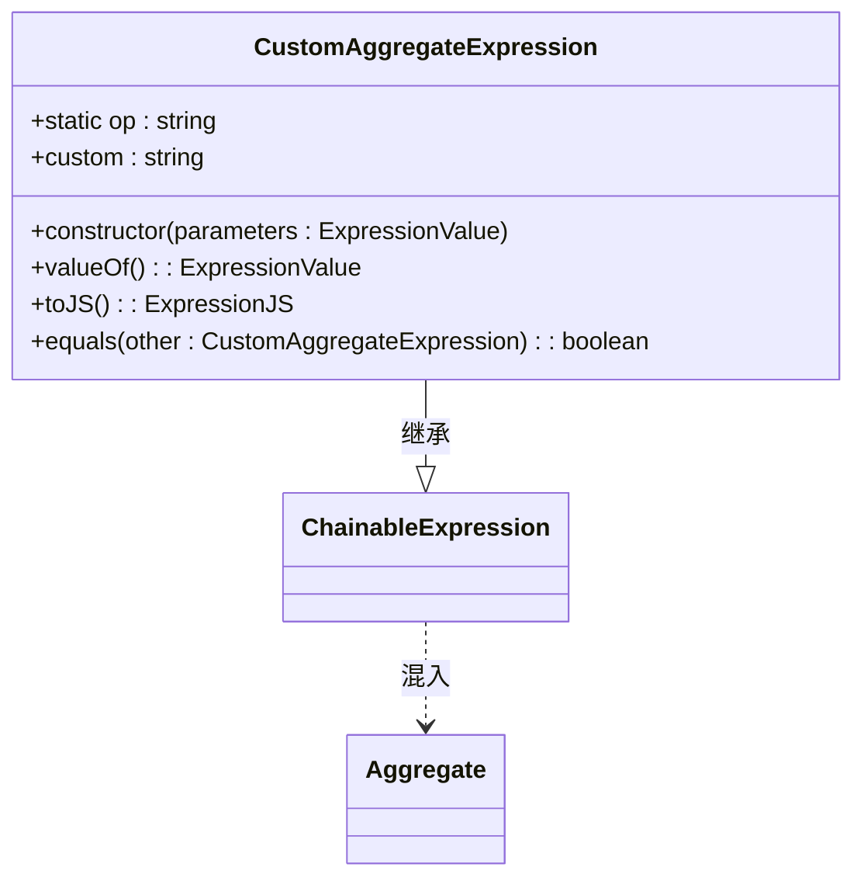
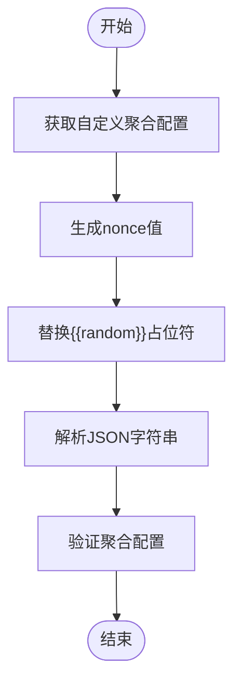
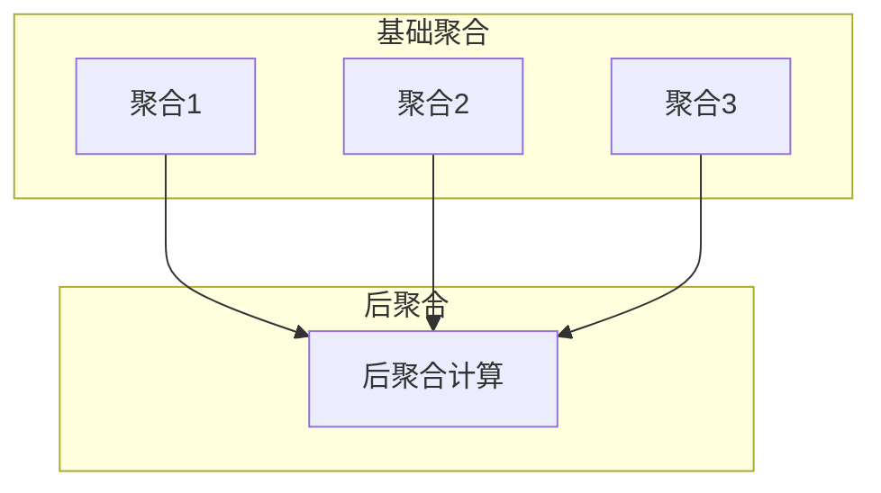
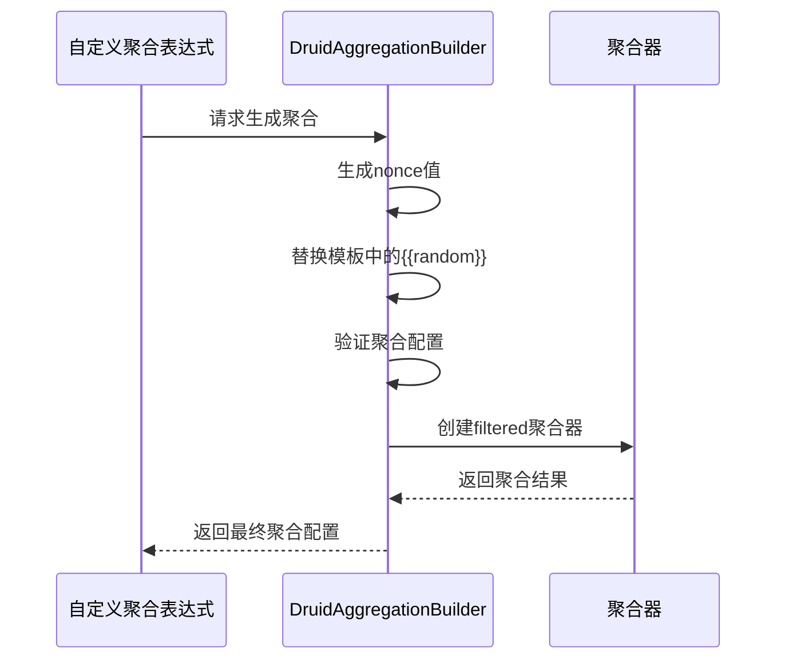

# 自定义聚合转换

<cite>
**本文档中引用的文件**  
- [customAggregateExpression.ts](file://src/expressions/customAggregateExpression.ts)
- [druidAggregationBuilder.ts](file://src/external/utils/druidAggregationBuilder.ts)
- [druidExternal.ts](file://src/external/druidExternal.ts)
- [druidTypes.ts](file://src/external/utils/druidTypes.ts)
</cite>

## 目录
1. [简介](#简介)
2. [核心组件](#核心组件)
3. [自定义聚合表达式结构](#自定义聚合表达式结构)
4. [聚合模板与占位符机制](#聚合模板与占位符机制)
5. [聚合与后聚合协同工作模式](#聚合与后聚合协同工作模式)
6. [过滤支持与nonce生成机制](#过滤支持与nonce生成机制)
7. [错误处理与配置验证](#错误处理与配置验证)

## 简介
本文档详细阐述了Druid自定义聚合转换的实现机制。重点分析了CustomAggregateExpression如何通过customAggregations配置映射到Druid的自定义聚合定义，深入解析了聚合模板的JSON结构、{{random}}占位符的替换机制，以及聚合与后聚合的协同工作模式。

**Section sources**
- [druidExternal.ts](file://src/external/druidExternal.ts#L465-L500)

## 核心组件

CustomAggregateExpression类是实现自定义聚合的核心组件，它继承自ChainableExpression并实现了Aggregate混入。该表达式专门用于处理数据集类型的聚合操作，其输出类型固定为NUMBER。

**Section sources**
- [customAggregateExpression.ts](file://src/expressions/customAggregateExpression.ts#L22-L69)

## 自定义聚合表达式结构

CustomAggregateExpression类定义了自定义聚合的基本结构。该类通过`custom`属性存储自定义聚合的名称，并在构造函数中验证操作类型为"customAggregate"，同时检查操作数类型必须为'DATASET'。

**Diagram sources**
- [customAggregateExpression.ts](file://src/expressions/customAggregateExpression.ts#L22-L69)

## 聚合模板与占位符机制

自定义聚合的配置通过CustomDruidAggregations接口定义，支持单个聚合、多个聚合或后聚合的配置。聚合模板中的{{random}}占位符通过nonce机制进行替换，确保每次生成的聚合名称唯一。

**Diagram sources**
- [druidAggregationBuilder.ts](file://src/external/utils/druidAggregationBuilder.ts#L387-L407)

## 聚合与后聚合协同工作模式

自定义聚合支持复杂的多聚合器组合和后聚合计算。当配置中包含postAggregation时，系统会将其添加到后聚合列表中，并设置正确的名称引用。这种机制允许在多个基础聚合之上进行复杂的数学运算。

**Diagram sources**
- [druidAggregationBuilder.ts](file://src/external/utils/druidAggregationBuilder.ts#L409-L439)

## 过滤支持与nonce生成机制

filterAggregateIfNeeded方法为自定义聚合添加过滤支持，当操作数为FilterExpression时，会创建filtered类型的聚合器。nonce生成机制通过Math.random()生成随机字符串，确保在并发环境下聚合名称的唯一性，避免命名冲突。

**Diagram sources**
- [druidAggregationBuilder.ts](file://src/external/utils/druidAggregationBuilder.ts#L185-L213)

## 错误处理与配置验证

系统实现了严格的错误处理和配置验证机制。当无法找到指定的自定义聚合、JSON解析失败或缺少必要的聚合/后聚合配置时，系统会抛出相应的错误。这些验证确保了自定义聚合配置的正确性和完整性。

**Section sources**
- [druidAggregationBuilder.ts](file://src/external/utils/druidAggregationBuilder.ts#L387-L439)
- [druidTypes.ts](file://src/external/utils/druidTypes.ts#L0-L31)