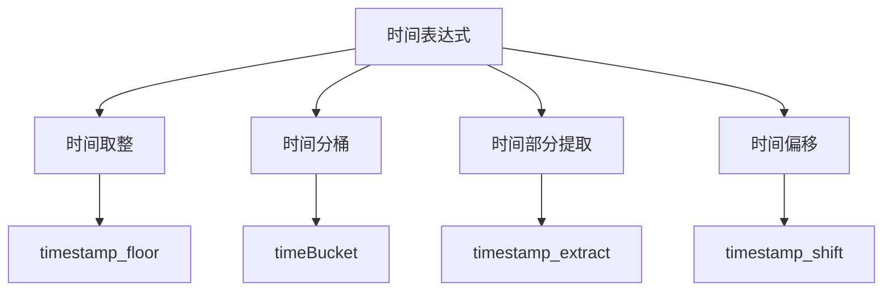
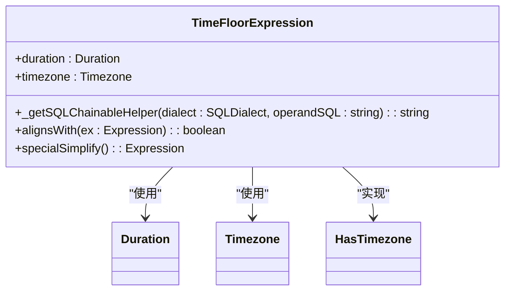
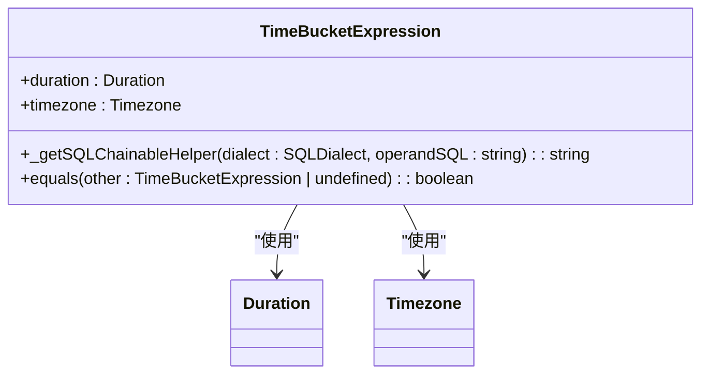
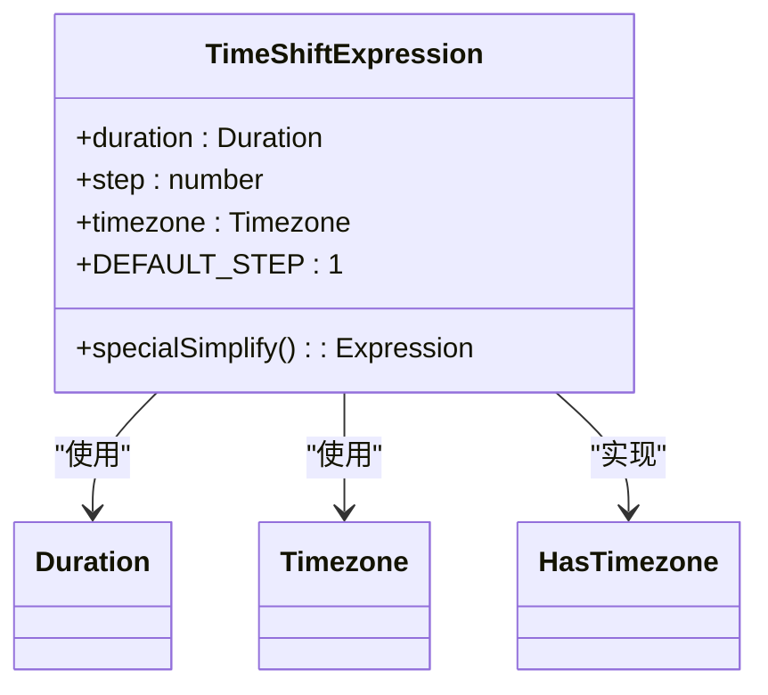
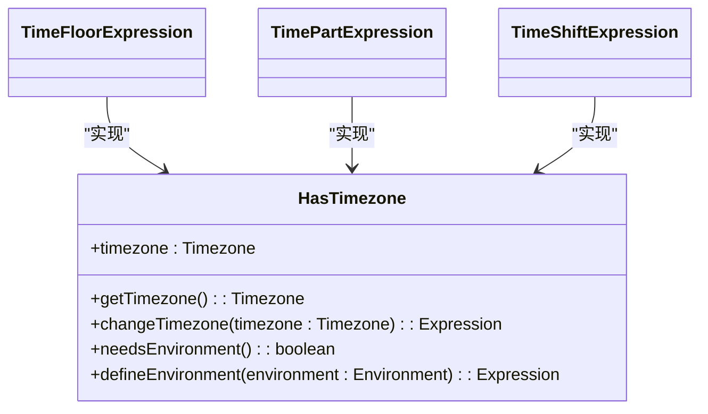
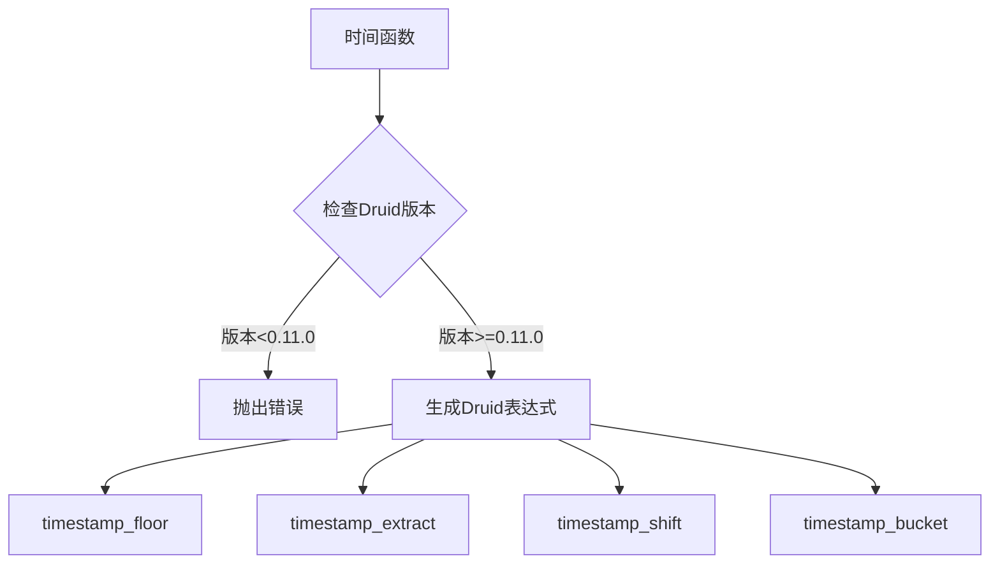
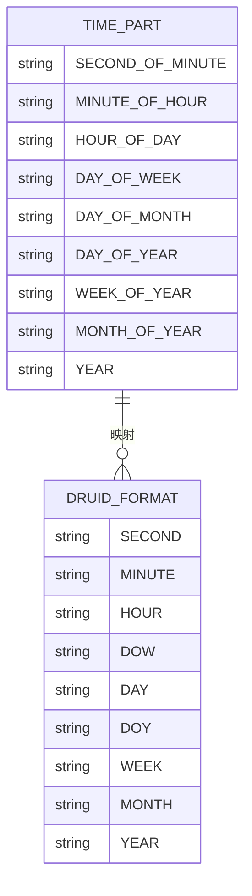

# 时间表达式转换

<cite>
**本文档中引用的文件**   
- [timeFloorExpression.ts](file://src/expressions/timeFloorExpression.ts)
- [timeBucketExpression.ts](file://src/expressions/timeBucketExpression.ts)
- [timePartExpression.ts](file://src/expressions/timePartExpression.ts)
- [timeShiftExpression.ts](file://src/expressions/timeShiftExpression.ts)
- [druidDialect.ts](file://src/dialect/druidDialect.ts)
- [druidExpressionBuilder.ts](file://src/external/utils/druidExpressionBuilder.ts)
- [hasTimezone.ts](file://src/expressions/mixins/hasTimezone.ts)
</cite>

## 目录
1. [简介](#简介)
2. [核心时间函数](#核心时间函数)
3. [时间取整函数](#时间取整函数)
4. [时间分桶函数](#时间分桶函数)
5. [时间部分提取函数](#时间部分提取函数)
6. [时间偏移函数](#时间偏移函数)
7. [时区处理](#时区处理)
8. [Druid版本依赖](#druid版本依赖)
9. [映射关系](#映射关系)
10. [性能考量](#性能考量)

## 简介
本文档全面解析Plywood中时间相关表达式在Druid中的转换规则。重点介绍时间取整（timestamp_floor）、时间分桶（timeBucket）、时间部分提取（timestamp_extract）和时间偏移（timestamp_shift）等核心功能的实现机制和使用方法。

**Section sources**
- [timeFloorExpression.ts](file://src/expressions/timeFloorExpression.ts#L1-L25)
- [timeBucketExpression.ts](file://src/expressions/timeBucketExpression.ts#L1-L24)

## 核心时间函数
Plywood提供了多种时间处理函数，这些函数在转换为Druid查询时具有特定的规则和要求。核心时间函数包括时间取整、时间分桶、时间部分提取和时间偏移，它们都依赖于Druid 0.11.0及以上版本的高级时间函数支持。



**Diagram sources**
- [timeFloorExpression.ts](file://src/expressions/timeFloorExpression.ts#L1-L130)
- [timeBucketExpression.ts](file://src/expressions/timeBucketExpression.ts#L1-L93)
- [timePartExpression.ts](file://src/expressions/timePartExpression.ts#L1-L164)
- [timeShiftExpression.ts](file://src/expressions/timeShiftExpression.ts#L1-L121)

**Section sources**
- [timeFloorExpression.ts](file://src/expressions/timeFloorExpression.ts#L1-L130)
- [timeBucketExpression.ts](file://src/expressions/timeBucketExpression.ts#L1-L93)
- [timePartExpression.ts](file://src/expressions/timePartExpression.ts#L1-L164)
- [timeShiftExpression.ts](file://src/expressions/timeShiftExpression.ts#L1-L121)

## 时间取整函数
时间取整函数用于将时间戳对齐到指定的时间间隔边界。在Plywood中，`TimeFloorExpression`类实现了这一功能，通过`duration`参数指定时间间隔，`timezone`参数指定时区。



**Diagram sources**
- [timeFloorExpression.ts](file://src/expressions/timeFloorExpression.ts#L25-L130)
- [hasTimezone.ts](file://src/expressions/mixins/hasTimezone.ts#L1-L61)

**Section sources**
- [timeFloorExpression.ts](file://src/expressions/timeFloorExpression.ts#L25-L130)

## 时间分桶函数
时间分桶函数将时间戳转换为时间范围，用于分组和聚合操作。`TimeBucketExpression`类实现了这一功能，其输出类型为`TIME_RANGE`，表示一个时间区间。



**Diagram sources**
- [timeBucketExpression.ts](file://src/expressions/timeBucketExpression.ts#L24-L93)

**Section sources**
- [timeBucketExpression.ts](file://src/expressions/timeBucketExpression.ts#L24-L93)

## 时间部分提取函数
时间部分提取函数用于从时间戳中提取特定的时间部分，如小时、星期几等。`TimePartExpression`类通过`PART_TO_FUNCTION`映射表定义了各种时间部分的提取逻辑。

```mermaid
classDiagram
class TimePartExpression {
+part : string
+timezone : Timezone
+PART_TO_FUNCTION : Record<string, (d : any) => number>
+PART_TO_MAX_VALUES : Record<string, number>
+maxPossibleSplitValues() : number
}
TimePartExpression --> HasTimezone : "实现"
```

**Diagram sources**
- [timePartExpression.ts](file://src/expressions/timePartExpression.ts#L24-L164)

**Section sources**
- [timePartExpression.ts](file://src/expressions/timePartExpression.ts#L24-L164)

## 时间偏移函数
时间偏移函数用于将时间戳向前或向后移动指定的时间间隔。`TimeShiftExpression`类通过`step`参数控制偏移的步数，正数表示向前偏移，负数表示向后偏移。



**Diagram sources**
- [timeShiftExpression.ts](file://src/expressions/timeShiftExpression.ts#L24-L121)

**Section sources**
- [timeShiftExpression.ts](file://src/expressions/timeShiftExpression.ts#L24-L121)

## 时区处理
所有时间函数都支持时区处理，通过`HasTimezone`混入（mixin）实现。时区信息在表达式计算和SQL生成过程中起着关键作用，确保时间操作在正确的时区上下文中执行。



**Diagram sources**
- [hasTimezone.ts](file://src/expressions/mixins/hasTimezone.ts#L1-L61)

**Section sources**
- [hasTimezone.ts](file://src/expressions/mixins/hasTimezone.ts#L1-L61)

## Druid版本依赖
Plywood的时间函数在转换为Druid查询时，依赖于Druid 0.11.0及以上版本的高级时间函数。`DruidExpressionBuilder`类中的`checkDruid11`方法确保了这些函数的版本兼容性。



**Diagram sources**
- [druidExpressionBuilder.ts](file://src/external/utils/druidExpressionBuilder.ts#L69-L445)

**Section sources**
- [druidExpressionBuilder.ts](file://src/external/utils/druidExpressionBuilder.ts#L69-L445)

## 映射关系
时间部分（如HOUR_OF_DAY、DAY_OF_WEEK）到Druid格式（HOUR、DOW）的映射关系由`TIME_PART_TO_FORMAT`常量定义。这种映射确保了Plywood表达式能够正确转换为Druid的SQL表达式。



**Diagram sources**
- [druidExpressionBuilder.ts](file://src/external/utils/druidExpressionBuilder.ts#L69-L445)

**Section sources**
- [druidExpressionBuilder.ts](file://src/external/utils/druidExpressionBuilder.ts#L69-L445)

## 性能考量
在使用时间函数时，需要考虑以下性能因素：
- 时间取整和分桶操作可能影响查询性能，特别是在大数据集上
- 复杂的时间部分提取可能增加计算开销
- 频繁的时间偏移操作可能导致查询计划复杂化
- 时区转换需要额外的计算资源

**Section sources**
- [timeFloorExpression.ts](file://src/expressions/timeFloorExpression.ts#L1-L130)
- [timeBucketExpression.ts](file://src/expressions/timeBucketExpression.ts#L1-L93)
- [timePartExpression.ts](file://src/expressions/timePartExpression.ts#L1-L164)
- [timeShiftExpression.ts](file://src/expressions/timeShiftExpression.ts#L1-L121)