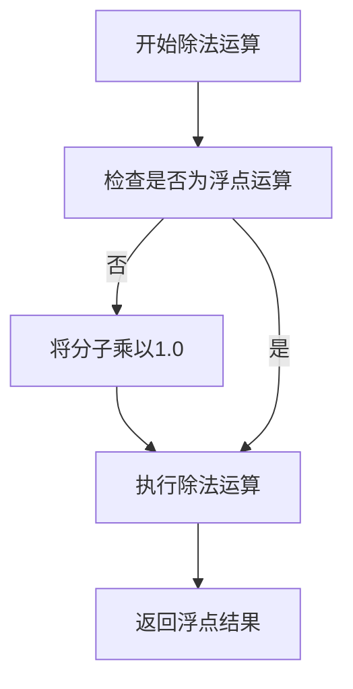
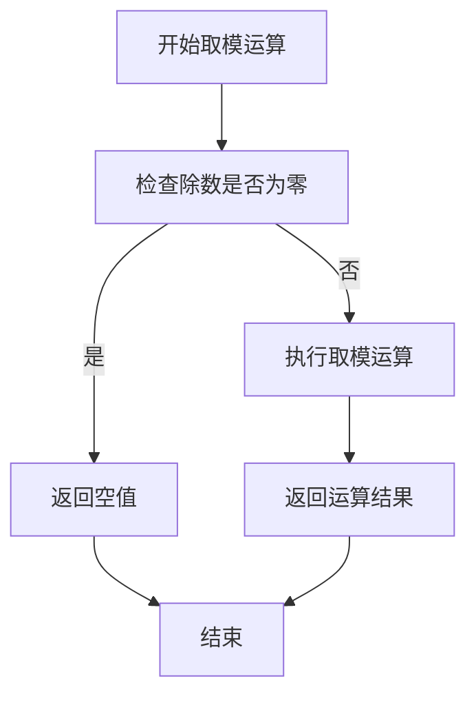
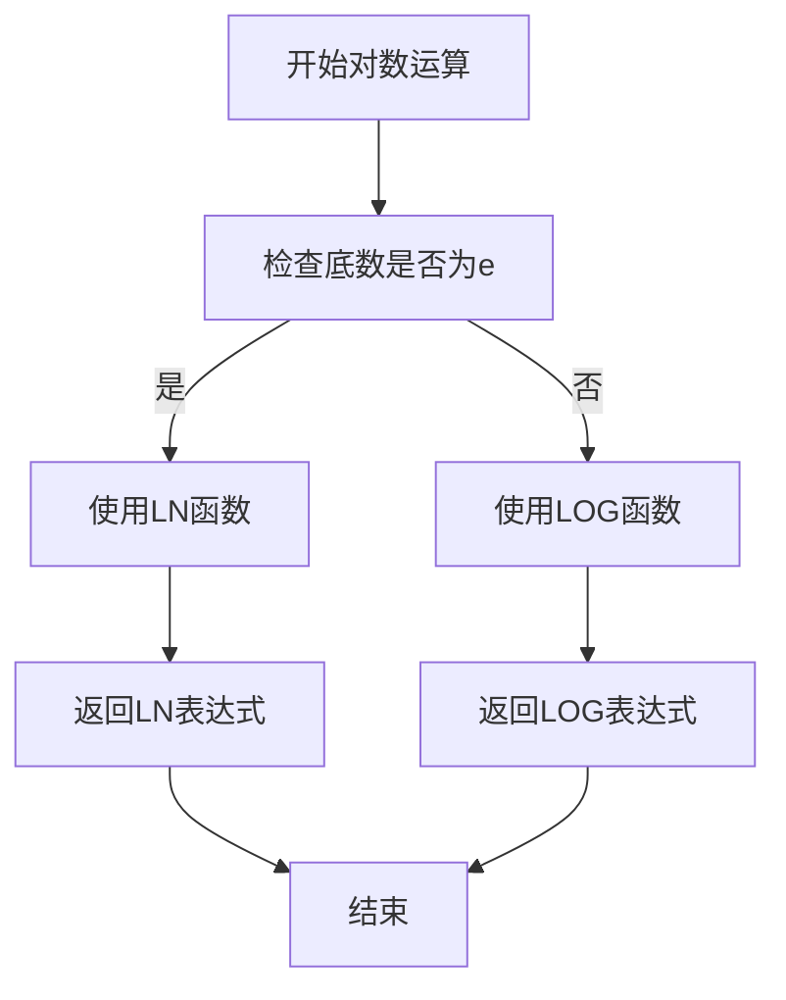
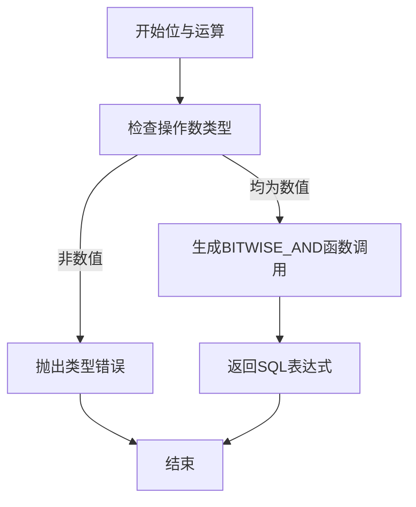

# 算术表达式转换

<cite>
**本文档中引用的文件**  
- [druidDialect.ts](file://src/dialect/druidDialect.ts)
- [divideExpression.ts](file://src/expressions/divideExpression.ts)
- [modExpression.ts](file://src/expressions/modExpression.ts)
- [powerExpression.ts](file://src/expressions/powerExpression.ts)
- [logExpression.ts](file://src/expressions/logExpression.ts)
- [bitwiseAndExpression.ts](file://src/expressions/bitwiseAndExpression.ts)
</cite>

## 目录
1. [简介](#简介)
2. [除法运算的浮点数处理](#除法运算的浮点数处理)
3. [取模运算的空值处理差异](#取模运算的空值处理差异)
4. [幂运算和对数运算的函数映射](#幂运算和对数运算的函数映射)
5. [位与运算的兼容性要求](#位与运算的兼容性要求)

## 简介
本文档详细说明Plywood中算术表达式在Druid方言中的转换规则，涵盖加、减、乘、除、取模、幂运算和对数运算的处理方式。重点分析除法运算中浮点数的特殊处理机制、取模运算在不同Druid版本中的空值行为差异，以及幂运算和对数运算的函数映射规则。同时，文档还说明了位与运算在Druid 0.22.0及以上版本的兼容性要求。

**Section sources**
- [druidDialect.ts](file://src/dialect/druidDialect.ts#L20-L175)

## 除法运算的浮点数处理
在Druid方言中，为避免整除运算导致精度丢失，除法运算需要强制转换为浮点数运算。Plywood通过`floatDivision`方法实现这一转换，该方法在分子后乘以1.0，确保结果为浮点数类型。这种处理方式保证了除法运算的精度，避免了整数除法可能产生的截断问题。

**Diagram sources**
- [druidDialect.ts](file://src/dialect/druidDialect.ts#L20-L175)

**Section sources**
- [druidDialect.ts](file://src/dialect/druidDialect.ts#L20-L175)
- [divideExpression.ts](file://src/expressions/divideExpression.ts#L20-L61)

## 取模运算的空值处理差异
取模运算在Druid 0.13.0以下版本中存在特殊的空值处理行为。当除数为零时，运算结果返回空值（null），而不是抛出异常或返回特定值。这一行为通过在`_calcChainableUnaryHelper`方法中检查除数是否为零来实现，若为零则返回null，否则执行正常的取模运算。

**Diagram sources**
- [modExpression.ts](file://src/expressions/modExpression.ts#L20-L56)

**Section sources**
- [modExpression.ts](file://src/expressions/modExpression.ts#L20-L56)

## 幂运算和对数运算的函数映射
幂运算和对数运算在Druid方言中有明确的函数映射规则。幂运算使用`POWER`函数进行转换，而对数运算根据底数的不同采用不同的函数：自然对数使用`LN`函数，其他底数的对数使用`LOG`函数。当对数的底数为自然常数e时，生成`LN(operand)`表达式；否则生成`LOG(expression,operand)`表达式。

**Diagram sources**
- [powerExpression.ts](file://src/expressions/powerExpression.ts#L20-L57)
- [logExpression.ts](file://src/expressions/logExpression.ts#L20-L58)

**Section sources**
- [powerExpression.ts](file://src/expressions/powerExpression.ts#L20-L57)
- [logExpression.ts](file://src/expressions/logExpression.ts#L20-L58)

## 位与运算的兼容性要求
位与运算在Druid 0.22.0及以上版本中通过`BITWISE_AND`函数调用实现。该运算要求操作数均为数值类型，并且运算具有交换律和结合律特性。在SQL生成过程中，位与运算被转换为`BITWISE_AND(operand, expression)`函数调用形式，确保在支持该函数的Druid版本中正确执行。

**Diagram sources**
- [bitwiseAndExpression.ts](file://src/expressions/bitwiseAndExpression.ts#L20-L54)

**Section sources**
- [bitwiseAndExpression.ts](file://src/expressions/bitwiseAndExpression.ts#L20-L54)