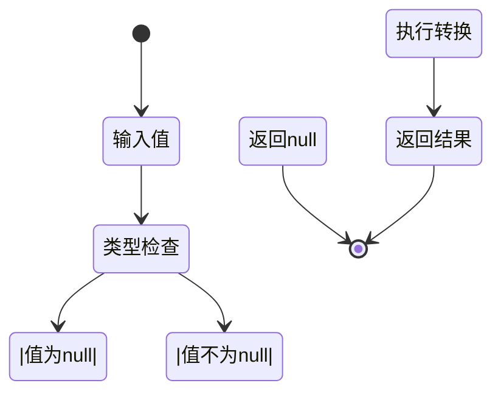
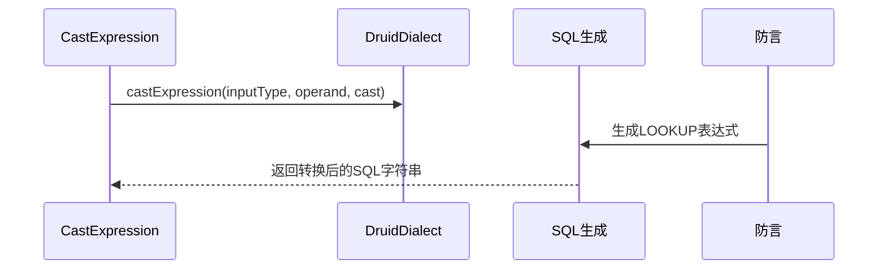
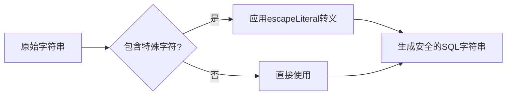

# 类型转换与特殊处理

<cite>
**本文档中引用的文件**   
- [castExpression.ts](file://src/expressions/castExpression.ts)
- [druidDialect.ts](file://src/dialect/druidDialect.ts)
- [lookupExpression.ts](file://src/expressions/lookupExpression.ts)
</cite>

## 目录
1. [介绍](#介绍)
2. [核心类型转换机制](#核心类型转换机制)
3. [Druid中的CAST函数实现](#druid中的cast函数实现)
4. [空值与空字符串处理](#空值与空字符串处理)
5. [LOOKUP维度查找函数](#lookup维度查找函数)
6. [安全字符转义机制](#安全字符转义机制)

## 介绍
本文档深入讲解Plywood表达式在Druid中进行类型转换（CAST）的机制，包括数值转时间、时间转数值、字符串与数值互转等场景的实现方式。详细描述cast函数在Druid中的使用（如cast(value,'DOUBLE')），以及不同类型（TIME、NUMBER、STRING）间的转换规则和潜在风险。

**Section sources**
- [castExpression.ts](file://src/expressions/castExpression.ts#L1-L20)
- [druidDialect.ts](file://src/dialect/druidDialect.ts#L1-L20)

## 核心类型转换机制

Plywood通过CastExpression类实现类型转换功能，支持TIME、NUMBER、STRING等类型间的相互转换。转换机制基于输入类型和输出类型的组合，通过预定义的转换函数映射表实现。

```mermaid
classDiagram
class CastExpression {
+string outputType
+_calcChainableHelper(operandValue) PlywoodValue
+_getJSChainableHelper(operandJS) string
+_getSQLChainableHelper(dialect, operandSQL) string
}
class Caster {
+TIME : { NUMBER : (n) => Date }
+NUMBER : { TIME : (d) => number, _ : (s) => number }
+STRING : { _ : (v) => string }
}
CastExpression --> Caster : "使用"
```

**Diagram sources **
- [castExpression.ts](file://src/expressions/castExpression.ts#L35-L58)
- [castExpression.ts](file://src/expressions/castExpression.ts#L60-L136)

**Section sources**
- [castExpression.ts](file://src/expressions/castExpression.ts#L35-L136)

## Druid中的CAST函数实现

Druid方言通过CAST_TO_FUNCTION静态映射表定义了特定的类型转换规则。这些规则将Plywood表达式转换为Druid兼容的SQL表达式。

```mermaid
flowchart TD
A[输入值] --> B{转换类型判断}
B --> |TIME to NUMBER| C[TO_TIMESTAMP($$::double precision / 1000)]
B --> |NUMBER to TIME| D[CAST($$ AS BIGINT)]
B --> |NUMBER to STRING| E[CAST($$ AS FLOAT)]
B --> |STRING to NUMBER| F[CAST($$ AS VARCHAR)]
C --> G[输出转换后的SQL]
D --> G
E --> G
F --> G
```

**Diagram sources **
- [druidDialect.ts](file://src/dialect/druidDialect.ts#L115-L127)
- [druidDialect.ts](file://src/dialect/druidDialect.ts#L123-L127)

**Section sources**
- [druidDialect.ts](file://src/dialect/druidDialect.ts#L115-L127)

## 空值与空字符串处理

Plywood对空值（null）和空字符串的处理遵循严格的类型安全原则。当转换操作遇到null值时，返回结果也为null，确保数据完整性。



**Diagram sources **
- [castExpression.ts](file://src/expressions/castExpression.ts#L105-L110)
- [druidDialect.ts](file://src/dialect/druidDialect.ts#L85-L87)

**Section sources**
- [castExpression.ts](file://src/expressions/castExpression.ts#L100-L115)

## LOOKUP维度查找函数

从Druid 0.11.0版本开始，Plywood集成了LOOKUP维度查找函数，用于在表达式中执行维度查找操作。



**Diagram sources **
- [lookupExpression.ts](file://src/expressions/lookupExpression.ts#L20-L74)
- [druidDialect.ts](file://src/dialect/druidDialect.ts#L171-L173)

**Section sources**
- [lookupExpression.ts](file://src/expressions/lookupExpression.ts#L20-L74)

## 安全字符转义机制

Plywood通过escapeLiteral方法实现安全字符转义，防止SQL注入攻击。UNSAFE_CHAR正则表达式用于识别需要转义的特殊字符。



**Diagram sources **
- [druidDialect.ts](file://src/dialect/druidDialect.ts#L171-L173)
- [baseDialect.ts](file://src/dialect/baseDialect.ts#L157-L159)

**Section sources**
- [druidDialect.ts](file://src/dialect/druidDialect.ts#L171-L173)