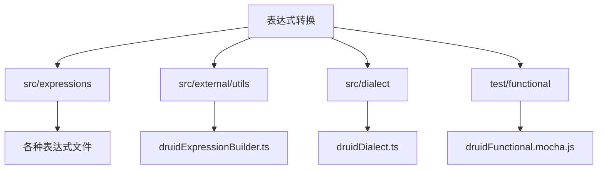
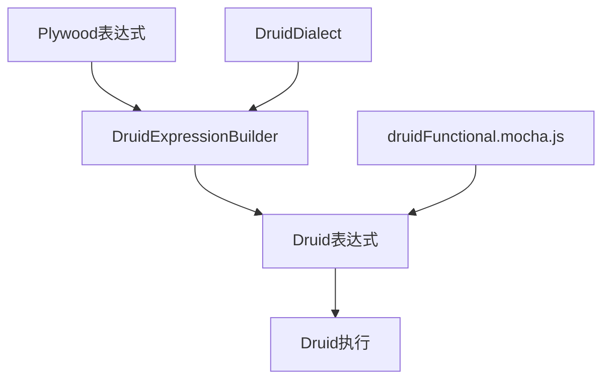
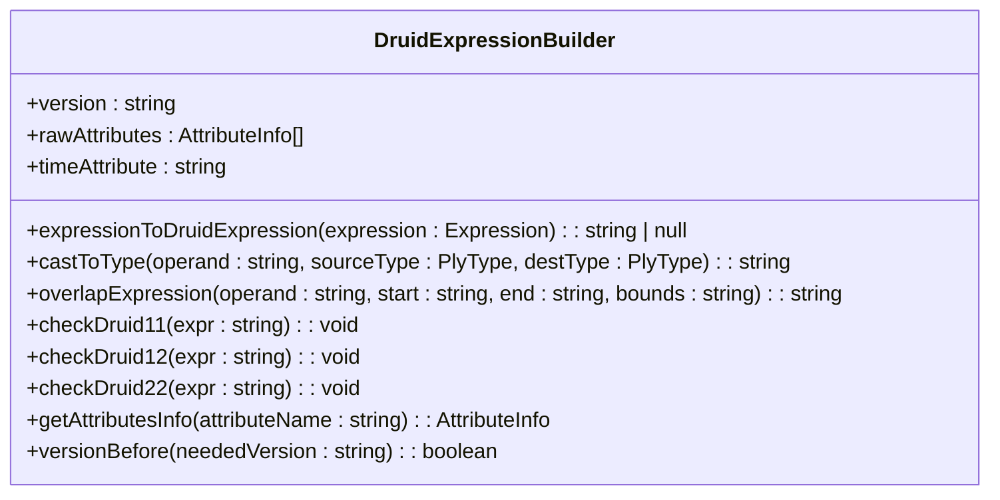
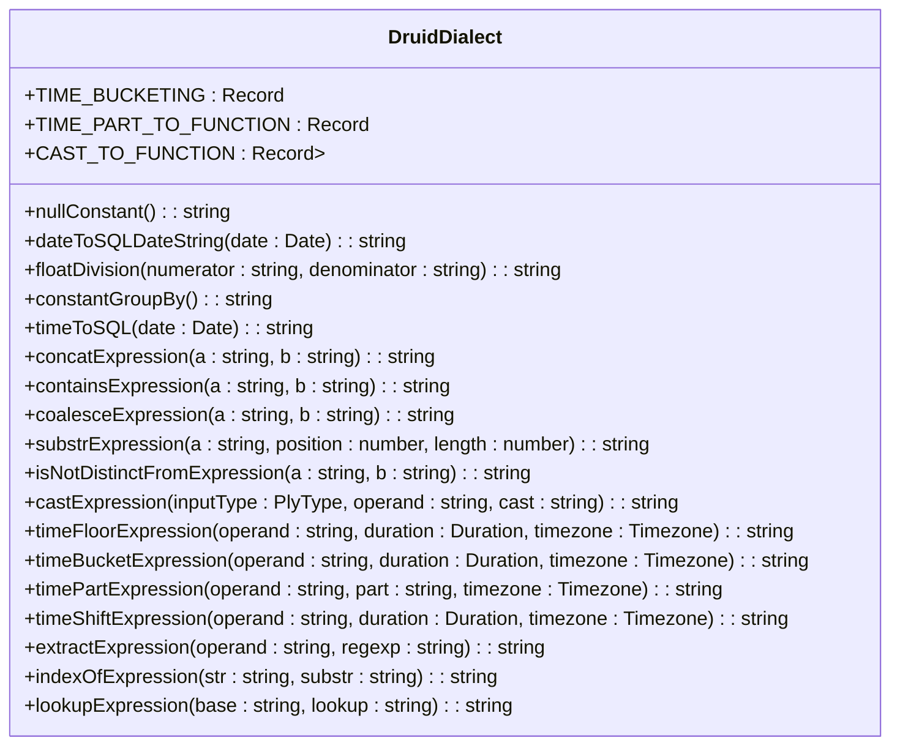
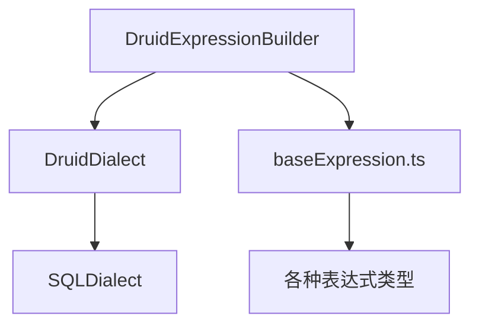

# 表达式转换

<cite>
**本文档中引用的文件**  
- [druidDialect.ts](file://src/dialect/druidDialect.ts)
- [druidExpressionBuilder.ts](file://src/external/utils/druidExpressionBuilder.ts)
- [baseExpression.ts](file://src/expressions/baseExpression.ts)
- [druidExternal.ts](file://src/external/druidExternal.ts)
- [new-expression-checklist.md](file://dev-docs/new-expression-checklist.md)
</cite>

## 目录
1. [简介](#简介)
2. [项目结构](#项目结构)
3. [核心组件](#核心组件)
4. [架构概述](#架构概述)
5. [详细组件分析](#详细组件分析)
6. [依赖分析](#依赖分析)
7. [性能考虑](#性能考虑)
8. [故障排除指南](#故障排除指南)
9. [结论](#结论)

## 简介
本文档详细阐述了如何将Plywood的表达式系统转换为Druid的表达式格式。重点描述了算术运算、字符串操作、逻辑运算等表达式的转换规则，以及版本兼容性处理（如Druid 0.11+的表达式支持）。详细说明了表达式转换中的特殊处理，如空值处理、类型转换、安全字符转义等。通过具体代码示例展示各种表达式的转换过程，并提供性能优化建议和常见问题解决方案。

## 项目结构
项目结构清晰地组织了表达式转换相关的代码。核心功能分布在`src/expressions`目录下的各个表达式文件中，而Druid特定的转换逻辑则位于`src/external/utils/druidExpressionBuilder.ts`和`src/dialect/druidDialect.ts`文件中。测试文件位于`test/functional/druidFunctional.mocha.js`，用于验证表达式转换的正确性。

**图表来源**
- [druidExpressionBuilder.ts](file://src/external/utils/druidExpressionBuilder.ts)
- [druidDialect.ts](file://src/dialect/druidDialect.ts)

**章节来源**
- [druidExpressionBuilder.ts](file://src/external/utils/druidExpressionBuilder.ts)
- [druidDialect.ts](file://src/dialect/druidDialect.ts)

## 核心组件
核心组件包括`DruidExpressionBuilder`类，负责将Plywood表达式转换为Druid表达式，以及`DruidDialect`类，提供Druid特定的SQL方言支持。这些组件协同工作，确保表达式在不同版本的Druid中正确执行。

**章节来源**
- [druidExpressionBuilder.ts](file://src/external/utils/druidExpressionBuilder.ts)
- [druidDialect.ts](file://src/dialect/druidDialect.ts)

## 架构概述
系统架构围绕表达式转换展开，`DruidExpressionBuilder`作为主要转换器，利用`DruidDialect`提供的SQL方言支持，将Plywood表达式转换为Druid可执行的表达式。测试文件`druidFunctional.mocha.js`验证转换结果的正确性。

**图表来源**
- [druidExpressionBuilder.ts](file://src/external/utils/druidExpressionBuilder.ts)
- [druidDialect.ts](file://src/dialect/druidDialect.ts)
- [druidFunctional.mocha.js](file://test/functional/druidFunctional.mocha.js)

## 详细组件分析
### DruidExpressionBuilder分析
`DruidExpressionBuilder`类是表达式转换的核心，它通过`expressionToDruidExpression`方法将Plywood表达式转换为Druid表达式。该方法处理各种表达式类型，如算术运算、字符串操作、逻辑运算等，并根据Druid版本进行兼容性检查。

#### 类图

**图表来源**
- [druidExpressionBuilder.ts](file://src/external/utils/druidExpressionBuilder.ts#L69-L445)

#### 转换流程

```mermaid
flowchart TD
Start([开始]) --> CheckType{"表达式类型"}
CheckType --> |LiteralExpression| HandleLiteral["处理字面量"]
CheckType --> |RefExpression| HandleRef["处理引用"]
CheckType --> |ChainableExpression| HandleChainable["处理链式表达式"]
HandleChainable --> CheckSubType{"子类型"}
CheckSubType --> |CastExpression| HandleCast["处理类型转换"]
CheckSubType --> |SubstrExpression| HandleSubstr["处理子字符串"]
CheckSubType --> |ExtractExpression| HandleExtract["处理提取"]
CheckSubType --> |MatchExpression| HandleMatch["处理匹配"]
CheckSubType --> |ContainsExpression| HandleContains["处理包含"]
CheckSubType --> |LengthExpression| HandleLength["处理长度"]
CheckSubType --> |NotExpression| HandleNot["处理非"]
CheckSubType --> |AbsoluteExpression| HandleAbsolute["处理绝对值"]
CheckSubType --> |NumberBucketExpression| HandleNumberBucket["处理数字桶"]
CheckSubType --> |TimePartExpression| HandleTimePart["处理时间部分"]
CheckSubType --> |TimeFloorExpression| HandleTimeFloor["处理时间向下取整"]
CheckSubType --> |TimeBucketExpression| HandleTimeBucket["处理时间桶"]
CheckSubType --> |TimeShiftExpression| HandleTimeShift["处理时间偏移"]
CheckSubType --> |LookupExpression| HandleLookup["处理查找"]
CheckSubType --> |TransformCaseExpression| HandleTransformCase["处理大小写转换"]
CheckSubType --> |ConcatExpression| HandleConcat["处理连接"]
CheckSubType --> |AddExpression| HandleAdd["处理加法"]
CheckSubType --> |SubtractExpression| HandleSubtract["处理减法"]
CheckSubType --> |MultiplyExpression| HandleMultiply["处理乘法"]
CheckSubType --> |DivideExpression| HandleDivide["处理除法"]
CheckSubType --> |ModExpression| HandleMod["处理取模"]
CheckSubType --> |BitwiseAndExpression| HandleBitwiseAnd["处理按位与"]
CheckSubType --> |PowerExpression| HandlePower["处理幂"]
CheckSubType --> |LogExpression| HandleLog["处理对数"]
CheckSubType --> |ThenExpression| HandleThen["处理条件"]
CheckSubType --> |FallbackExpression| HandleFallback["处理回退"]
CheckSubType --> |AndExpression| HandleAnd["处理与"]
CheckSubType --> |OrExpression| HandleOr["处理或"]
CheckSubType --> |IsExpression| HandleIs["处理等于"]
CheckSubType --> |OverlapExpression| HandleOverlap["处理重叠"]
CheckSubType --> |IndexOfExpression| HandleIndexOf["处理索引"]
HandleLiteral --> End([结束])
HandleRef --> End
HandleChainable --> End
HandleCast --> End
HandleSubstr --> End
HandleExtract --> End
HandleMatch --> End
HandleContains --> End
HandleLength --> End
HandleNot --> End
HandleAbsolute --> End
HandleNumberBucket --> End
HandleTimePart --> End
HandleTimeFloor --> End
HandleTimeBucket --> End
HandleTimeShift --> End
HandleLookup --> End
HandleTransformCase --> End
HandleConcat --> End
HandleAdd --> End
HandleSubtract --> End
HandleMultiply --> End
HandleDivide --> End
HandleMod --> End
HandleBitwiseAnd --> End
HandlePower --> End
HandleLog --> End
HandleThen --> End
HandleFallback --> End
HandleAnd --> End
HandleOr --> End
HandleIs --> End
HandleOverlap --> End
HandleIndexOf --> End
```

**图表来源**
- [druidExpressionBuilder.ts](file://src/external/utils/druidExpressionBuilder.ts#L134-L380)

**章节来源**
- [druidExpressionBuilder.ts](file://src/external/utils/druidExpressionBuilder.ts#L69-L445)

### DruidDialect分析
`DruidDialect`类提供了Druid特定的SQL方言支持，包括时间桶、时间部分、类型转换等操作的SQL表达式生成。

#### 类图

**图表来源**
- [druidDialect.ts](file://src/dialect/druidDialect.ts#L20-L175)

**章节来源**
- [druidDialect.ts](file://src/dialect/druidDialect.ts#L20-L175)

## 依赖分析
表达式转换依赖于`DruidExpressionBuilder`和`DruidDialect`两个核心组件。`DruidExpressionBuilder`依赖`DruidDialect`提供的SQL方言支持，同时依赖`baseExpression.ts`中定义的各种表达式类型。

**图表来源**
- [druidExpressionBuilder.ts](file://src/external/utils/druidExpressionBuilder.ts)
- [druidDialect.ts](file://src/dialect/druidDialect.ts)
- [baseExpression.ts](file://src/expressions/baseExpression.ts)

**章节来源**
- [druidExpressionBuilder.ts](file://src/external/utils/druidExpressionBuilder.ts)
- [druidDialect.ts](file://src/dialect/druidDialect.ts)
- [baseExpression.ts](file://src/expressions/baseExpression.ts)

## 性能考虑
在表达式转换过程中，应尽量减少不必要的类型转换和函数调用，以提高执行效率。对于复杂的表达式，建议使用`concat`函数而不是多次`||`操作，以减少SQL解析的开销。

## 故障排除指南
常见问题包括版本兼容性问题和表达式转换错误。对于版本兼容性问题，应检查`DruidExpressionBuilder`中的`checkDruid11`、`checkDruid12`和`checkDruid22`方法，确保使用的表达式在目标Druid版本中可用。对于表达式转换错误，应检查`expressionToDruidExpression`方法的实现，确保所有表达式类型都被正确处理。

**章节来源**
- [druidExpressionBuilder.ts](file://src/external/utils/druidExpressionBuilder.ts#L382-L445)

## 结论
本文档详细介绍了Plywood表达式到Druid表达式的转换过程，涵盖了算术运算、字符串操作、逻辑运算等表达式的转换规则，以及版本兼容性处理。通过`DruidExpressionBuilder`和`DruidDialect`两个核心组件，实现了高效、准确的表达式转换。未来的工作可以进一步优化转换性能，并扩展对更多Druid版本的支持。