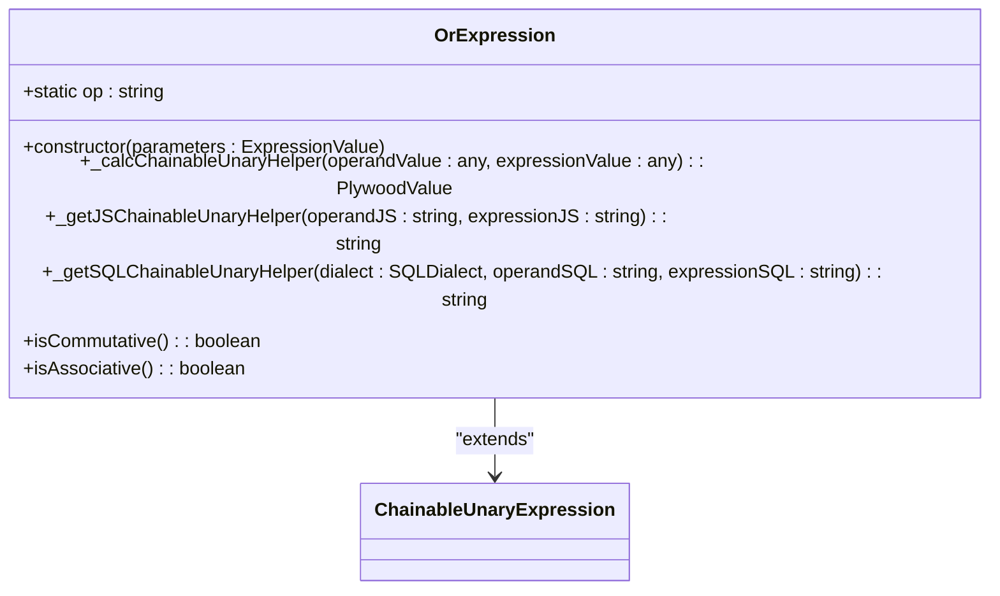
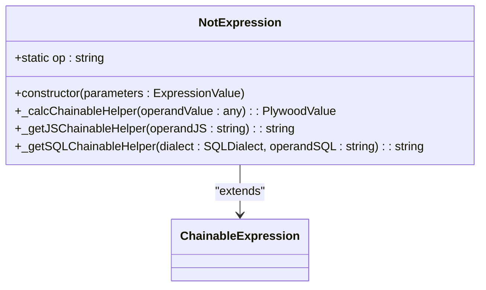
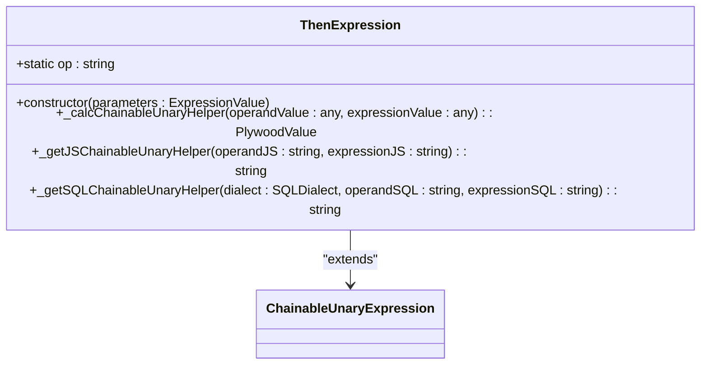
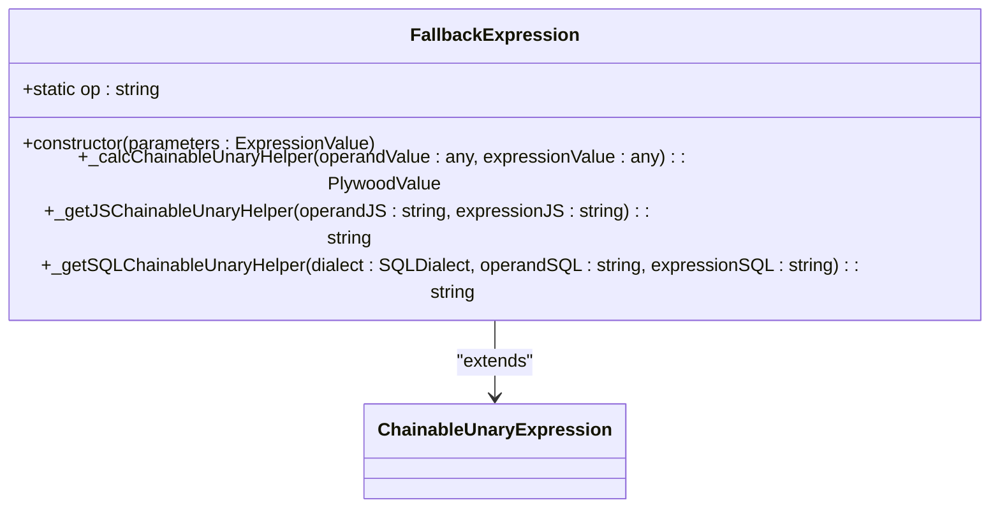
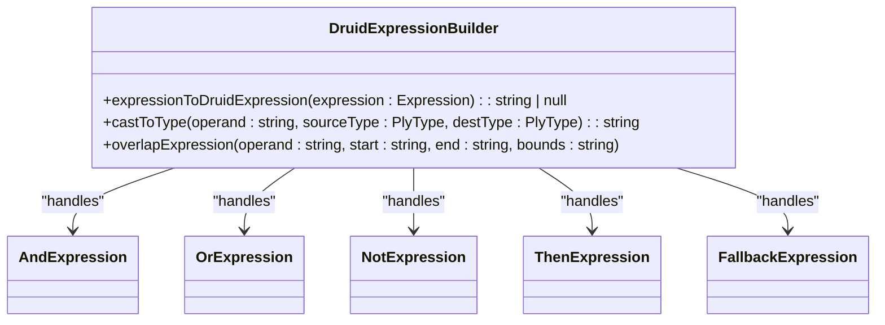

# 逻辑表达式转换

<cite>
**Referenced Files in This Document**   
- [andExpression.ts](file://src/expressions/andExpression.ts)
- [orExpression.ts](file://src/expressions/orExpression.ts)
- [notExpression.ts](file://src/expressions/notExpression.ts)
- [thenExpression.ts](file://src/expressions/thenExpression.ts)
- [fallbackExpression.ts](file://src/expressions/fallbackExpression.ts)
- [druidDialect.ts](file://src/dialect/druidDialect.ts)
- [druidExpressionBuilder.ts](file://src/external/utils/druidExpressionBuilder.ts)
</cite>

## 目录
1. [逻辑与（AND）表达式](#逻辑与and表达式)
2. [逻辑或（OR）表达式](#逻辑或or表达式)
3. [逻辑非（NOT）表达式](#逻辑非not表达式)
4. [条件判断（THEN）表达式](#条件判断then表达式)
5. [空值回退（FALLBACK）表达式](#空值回退fallback表达式)
6. [Druid SQL中的布尔值处理](#druid-sql中的布尔值处理)

## 逻辑与（AND）表达式

Plywood中的逻辑与操作通过`AndExpression`类实现，用于表示两个布尔表达式的合取。该表达式在转换为Druid SQL时，遵循标准的SQL逻辑操作符映射规则。

在代码实现中，`AndExpression`继承自`ChainableUnaryExpression`，其核心功能在`_getSQLChainableUnaryHelper`方法中定义。该方法接收SQL方言对象和两个操作数的SQL字符串，通过`AND`关键字将它们连接起来，生成标准的SQL布尔表达式。

**Diagram sources**
- [andExpression.ts](file://src/expressions/andExpression.ts#L34-L127)

**Section sources**
- [andExpression.ts](file://src/expressions/andExpression.ts#L34-L127)

## 逻辑或（OR）表达式

Plywood中的逻辑或操作通过`OrExpression`类实现，用于表示两个布尔表达式的析取。与逻辑与类似，该表达式在转换为Druid SQL时也遵循标准的SQL语法。

`OrExpression`同样继承自`ChainableUnaryExpression`，其SQL生成逻辑在`_getSQLChainableUnaryHelper`方法中实现。该方法将两个操作数的SQL字符串用`OR`关键字连接，形成标准的SQL OR表达式。

**Diagram sources**
- [orExpression.ts](file://src/expressions/orExpression.ts#L25-L96)

**Section sources**
- [orExpression.ts](file://src/expressions/orExpression.ts#L25-L96)

## 逻辑非（NOT）表达式

Plywood中的逻辑非操作通过`NotExpression`类实现，用于对布尔表达式进行取反。该表达式在转换为Druid SQL时，使用标准的`NOT`关键字。

`NotExpression`继承自`ChainableExpression`，其核心转换逻辑在`_getSQLChainableHelper`方法中定义。该方法接收操作数的SQL字符串，并在其外部包裹`NOT()`函数，生成标准的SQL取反表达式。

**Diagram sources**
- [notExpression.ts](file://src/expressions/notExpression.ts#L21-L51)

**Section sources**
- [notExpression.ts](file://src/expressions/notExpression.ts#L21-L51)

## 条件判断（THEN）表达式

Plywood中的条件判断操作通过`ThenExpression`类实现，对应于三元条件操作。该表达式在转换为Druid SQL时，通过`if`函数实现。

`ThenExpression`继承自`ChainableUnaryExpression`，其SQL生成逻辑依赖于SQL方言的`ifThenElseExpression`方法。在Druid方言中，这被转换为`if(condition, thenValue, '')`的形式，其中条件为真时返回`thenValue`，否则返回空字符串。

**Diagram sources**
- [thenExpression.ts](file://src/expressions/thenExpression.ts#L20-L63)

**Section sources**
- [thenExpression.ts](file://src/expressions/thenExpression.ts#L20-L63)

## 空值回退（FALLBACK）表达式

Plywood中的空值回退操作通过`FallbackExpression`类实现，用于在主表达式为空时提供备用值。该表达式在转换为Druid SQL时，使用`nvl`函数实现。

`FallbackExpression`继承自`ChainableUnaryExpression`，其SQL生成逻辑在`_getSQLChainableUnaryHelper`方法中定义。该方法调用SQL方言的`coalesceExpression`方法，在Druid方言中具体实现为`nvl(operand, expression)`，即当`operand`不为空时返回其值，否则返回`expression`的值。

**Diagram sources**
- [fallbackExpression.ts](file://src/expressions/fallbackExpression.ts#L20-L63)

**Section sources**
- [fallbackExpression.ts](file://src/expressions/fallbackExpression.ts#L20-L63)

## Druid SQL中的布尔值处理

在Druid SQL中，布尔值的处理通过一系列转换规则实现。逻辑与（&&）、逻辑或（||）和逻辑非（!）操作符在JavaScript层面分别映射为`&&`、`||`和`!`，而在SQL层面则转换为`AND`、`OR`和`NOT`。

对于复杂的嵌套逻辑表达式，系统通过`DruidExpressionBuilder`类进行转换。该构建器根据表达式的类型，递归地将其转换为相应的Druid表达式。例如，一个复杂的嵌套表达式`a && (b || c)`会被转换为`(a AND (b OR c))`的SQL形式。

空值处理方面，系统使用`nvl`函数来实现FALLBACK语义，这与标准的`COALESCE`函数类似，但在Druid中使用了特定的函数名。条件表达式则通过`if`函数实现，提供了一种简洁的条件判断机制。

**Diagram sources**
- [druidExpressionBuilder.ts](file://src/external/utils/druidExpressionBuilder.ts#L69-L445)
- [andExpression.ts](file://src/expressions/andExpression.ts#L34-L127)
- [orExpression.ts](file://src/expressions/orExpression.ts#L25-L96)
- [notExpression.ts](file://src/expressions/notExpression.ts#L21-L51)
- [thenExpression.ts](file://src/expressions/thenExpression.ts#L20-L63)
- [fallbackExpression.ts](file://src/expressions/fallbackExpression.ts#L20-L63)

**Section sources**
- [druidExpressionBuilder.ts](file://src/external/utils/druidExpressionBuilder.ts#L69-L445)
- [druidDialect.ts](file://src/dialect/druidDialect.ts#L20-L175)