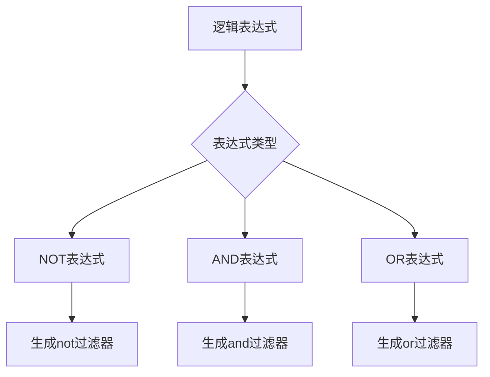
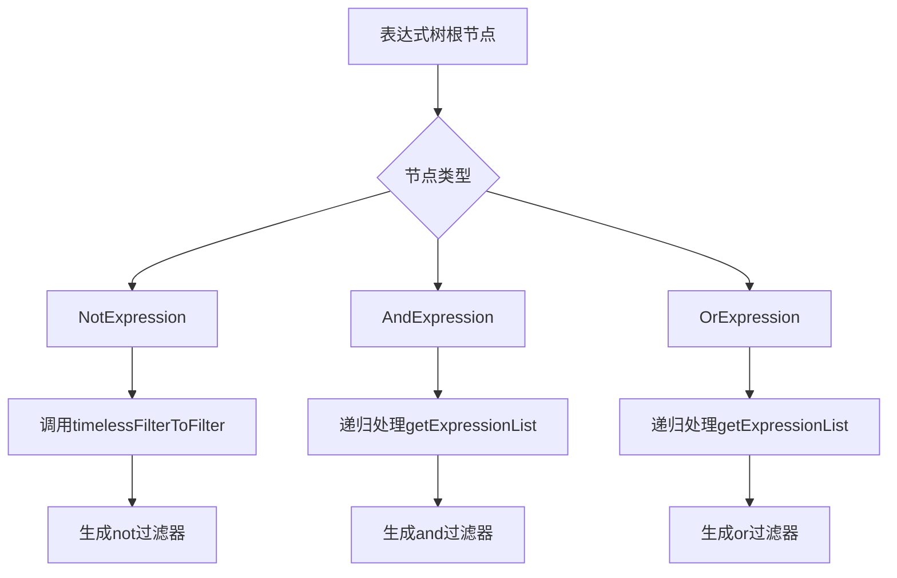
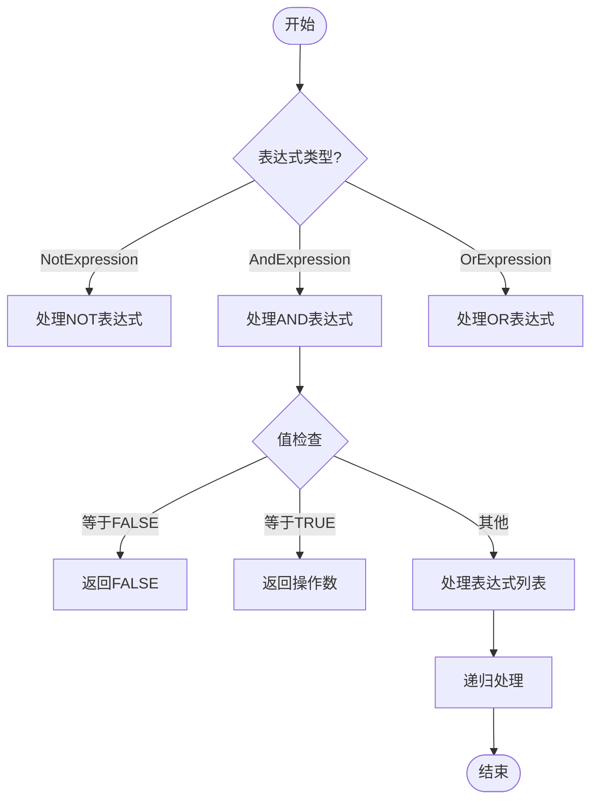
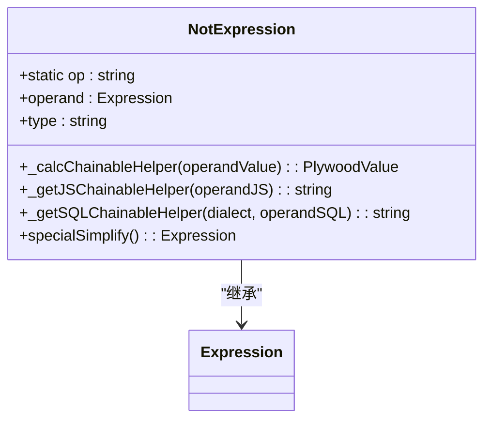
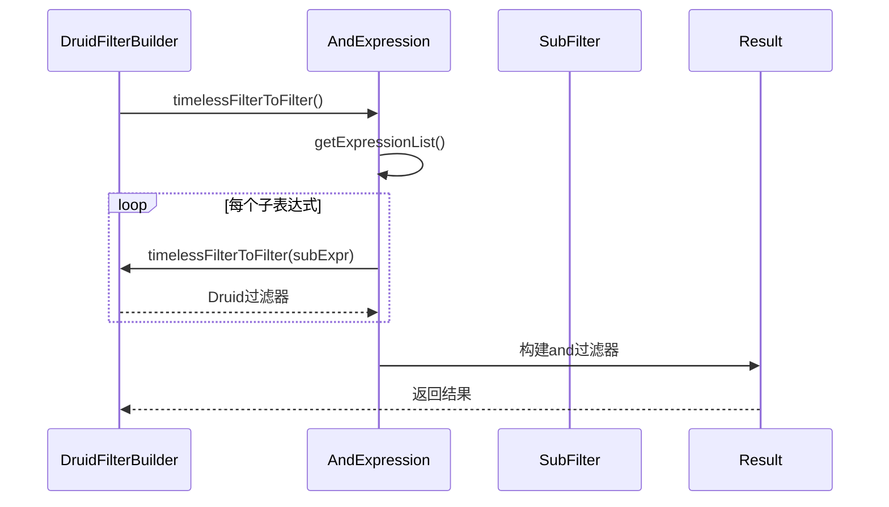
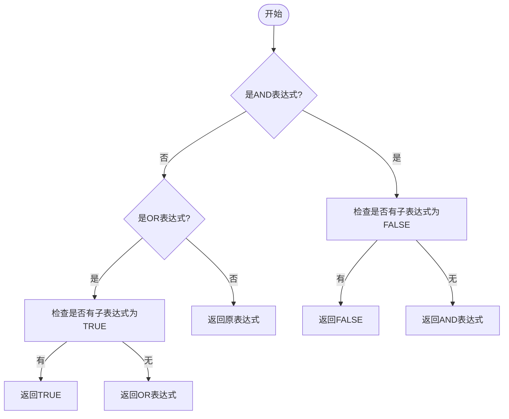
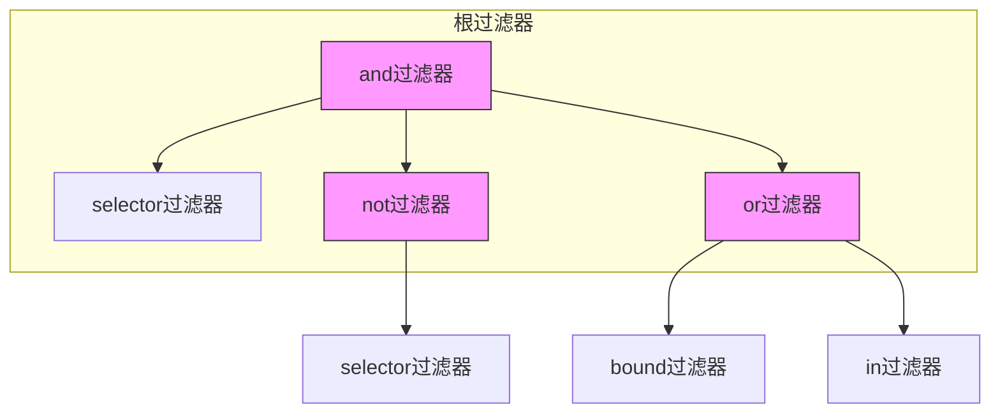

# 复杂逻辑过滤器

<cite>
**本文档中引用的文件**  
- [druidFilterBuilder.ts](file://src/external/utils/druidFilterBuilder.ts)
- [andExpression.ts](file://src/expressions/andExpression.ts)
- [orExpression.ts](file://src/expressions/orExpression.ts)
- [notExpression.ts](file://src/expressions/notExpression.ts)
- [baseExpression.ts](file://src/expressions/baseExpression.ts)
- [druidExpressionBuilder.ts](file://src/external/utils/druidExpressionBuilder.ts)
</cite>

## 目录
1. [引言](#引言)
2. [复合逻辑过滤器构建机制](#复合逻辑过滤器构建机制)
3. [逻辑表达式树转换](#逻辑表达式树转换)
4. [递归处理与空值处理](#递归处理与空值处理)
5. [not过滤器生成](#not过滤器生成)
6. [and/or过滤器字段列表构建](#andor过滤器字段列表构建)
7. [短路逻辑优化策略](#短路逻辑优化策略)
8. [复杂查询示例](#复杂查询示例)
9. [查询复杂度与性能平衡](#查询复杂度与性能平衡)
10. [结论](#结论)

## 引言
本文档深入分析Druid中AND、OR、NOT等复合逻辑过滤器的构建机制。重点解释如何将Plywood中的逻辑表达式树转换为Druid的嵌套过滤器结构，包括逻辑组合的递归处理、空值与真值的特殊处理规则。详细说明not过滤器的生成、and/or过滤器的字段列表构建过程，以及短路逻辑的优化策略。

**Section sources**
- [druidFilterBuilder.ts](file://src/external/utils/druidFilterBuilder.ts#L1-L50)
- [baseExpression.ts](file://src/expressions/baseExpression.ts#L1-L100)

## 复合逻辑过滤器构建机制
Druid复合逻辑过滤器的构建通过Plywood表达式系统实现，主要涉及AND、OR、NOT三种逻辑操作符。系统通过递归遍历表达式树，将Plywood逻辑表达式转换为Druid原生的嵌套过滤器结构。构建过程遵循严格的类型检查和优化规则，确保生成的过滤器既符合Druid语法要求，又能保持最优性能。

**Diagram sources**
- [druidFilterBuilder.ts](file://src/external/utils/druidFilterBuilder.ts#L150-L200)
- [baseExpression.ts](file://src/expressions/baseExpression.ts#L2468-L2774)

**Section sources**
- [druidFilterBuilder.ts](file://src/external/utils/druidFilterBuilder.ts#L100-L250)
- [baseExpression.ts](file://src/expressions/baseExpression.ts#L2468-L2774)

## 逻辑表达式树转换
Plywood中的逻辑表达式树通过`timelessFilterToFilter`方法转换为Druid的嵌套过滤器结构。转换过程采用递归下降方式，从根节点开始遍历表达式树，根据节点类型生成相应的Druid过滤器。对于AND和OR表达式，系统会递归处理其子表达式列表，构建嵌套的过滤器结构。

**Diagram sources**
- [druidFilterBuilder.ts](file://src/external/utils/druidFilterBuilder.ts#L150-L205)
- [andExpression.ts](file://src/expressions/andExpression.ts#L34-L127)

**Section sources**
- [druidFilterBuilder.ts](file://src/external/utils/druidFilterBuilder.ts#L150-L205)
- [andExpression.ts](file://src/expressions/andExpression.ts#L34-L127)

## 递归处理与空值处理
逻辑组合的递归处理通过`getExpressionList`方法实现，该方法返回表达式链中的所有子表达式。系统对空值和真值有特殊处理规则：当AND表达式的子表达式等于`Expression.FALSE`时，直接返回`Expression.FALSE`；当等于`Expression.TRUE`时，返回操作数本身。这种优化避免了不必要的计算。

**Diagram sources**
- [andExpression.ts](file://src/expressions/andExpression.ts#L100-L110)
- [orExpression.ts](file://src/expressions/orExpression.ts#L83-L90)

**Section sources**
- [andExpression.ts](file://src/expressions/andExpression.ts#L100-L110)
- [orExpression.ts](file://src/expressions/orExpression.ts#L83-L90)

## not过滤器生成
not过滤器的生成通过`NotExpression`类实现。当系统遇到NOT逻辑操作时，会创建`NotExpression`实例，其`timelessFilterToFilter`方法生成Druid的not过滤器结构。生成的过滤器包含type字段设置为'not'，以及field字段指向被否定的过滤器。

**Diagram sources**
- [notExpression.ts](file://src/expressions/notExpression.ts#L21-L51)
- [baseExpression.ts](file://src/expressions/baseExpression.ts#L2191-L2466)

**Section sources**
- [notExpression.ts](file://src/expressions/notExpression.ts#L21-L51)

## and/or过滤器字段列表构建
and/or过滤器的字段列表通过`getExpressionList`方法构建。系统遍历AND或OR表达式的操作链，收集所有子表达式并递归转换为Druid过滤器。构建过程保持了表达式的关联性和交换性，允许系统进行优化重组。字段列表作为fields数组嵌入到and或or过滤器结构中。

**Diagram sources**
- [druidFilterBuilder.ts](file://src/external/utils/druidFilterBuilder.ts#L170-L180)
- [andExpression.ts](file://src/expressions/andExpression.ts#L84-L105)

**Section sources**
- [druidFilterBuilder.ts](file://src/external/utils/druidFilterBuilder.ts#L170-L180)
- [andExpression.ts](file://src/expressions/andExpression.ts#L84-L105)

## 短路逻辑优化策略
系统实现了短路逻辑优化策略，通过`simplify`和`specialSimplify`方法实现。对于AND表达式，如果任何子表达式为FALSE，则整个表达式简化为FALSE；对于OR表达式，如果任何子表达式为TRUE，则整个表达式简化为TRUE。这种优化减少了不必要的计算和查询复杂度。

**Diagram sources**
- [andExpression.ts](file://src/expressions/andExpression.ts#L100-L110)
- [orExpression.ts](file://src/expressions/orExpression.ts#L83-L90)

**Section sources**
- [andExpression.ts](file://src/expressions/andExpression.ts#L100-L110)
- [orExpression.ts](file://src/expressions/orExpression.ts#L83-L90)

## 复杂查询示例
以下示例展示多层嵌套过滤器的生成结果。一个包含AND、OR、NOT的复杂逻辑表达式被转换为Druid的嵌套过滤器结构，其中AND和OR操作符形成多层嵌套，NOT操作符应用于特定条件。

**Diagram sources**
- [druidFilterBuilder.ts](file://src/external/utils/druidFilterBuilder.ts#L150-L205)
- [baseExpression.ts](file://src/expressions/baseExpression.ts#L2468-L2774)

**Section sources**
- [druidFilterBuilder.ts](file://src/external/utils/druidFilterBuilder.ts#L150-L205)

## 查询复杂度与性能平衡
在处理复杂查询时，需要平衡查询复杂度与性能。建议将高选择性的过滤条件放在AND表达式的前面，利用短路逻辑尽早排除不匹配的数据。对于OR表达式，尽量减少分支数量，或将多个OR条件合并为IN或范围查询。同时，避免过度嵌套，保持过滤器结构的简洁性。

**Section sources**
- [druidFilterBuilder.ts](file://src/external/utils/druidFilterBuilder.ts#L150-L205)
- [baseExpression.ts](file://src/expressions/baseExpression.ts#L2468-L2774)

## 结论
Druid复合逻辑过滤器的构建机制通过Plywood表达式系统实现了高效的逻辑表达式转换。系统采用递归处理方式，将Plywood中的逻辑表达式树转换为Druid的嵌套过滤器结构。通过not、and、or过滤器的生成机制和短路逻辑优化策略，系统能够在保持查询准确性的同时，最大限度地提高查询性能。在实际应用中，合理设计查询结构，平衡复杂度与性能，可以获得最佳的查询效果。