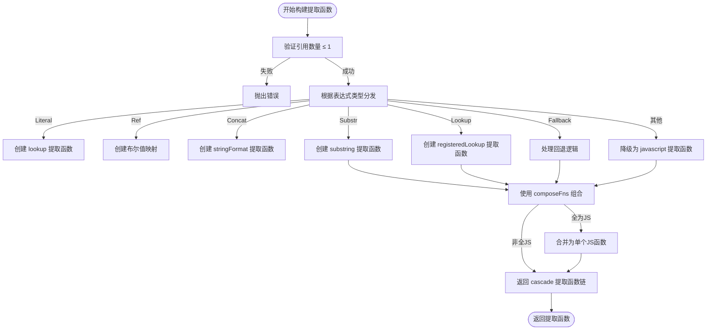
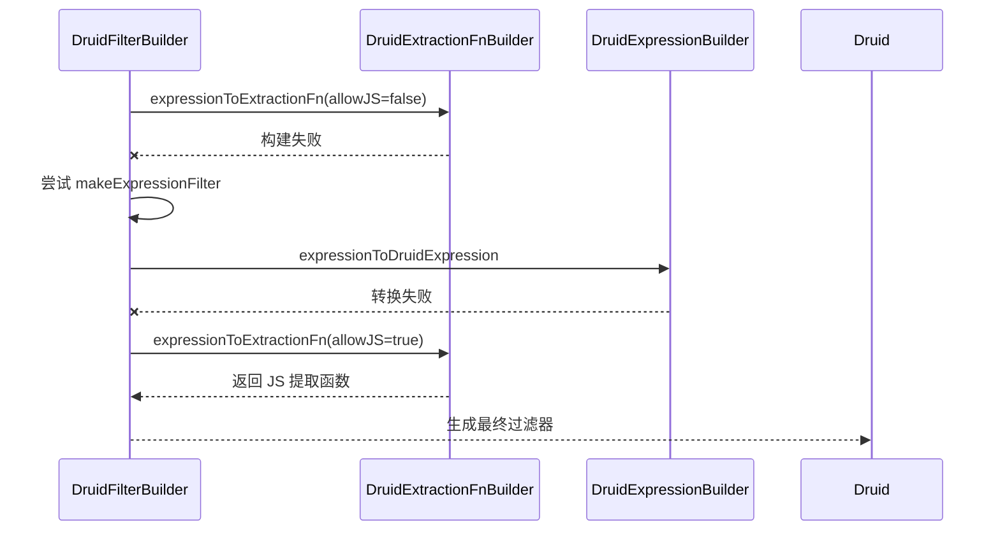

# 提取函数在过滤中的应用

<cite>
**本文档中引用的文件**  
- [druidExtractionFnBuilder.ts](file://src/external/utils/druidExtractionFnBuilder.ts)
- [druidFilterBuilder.ts](file://src/external/utils/druidFilterBuilder.ts)
- [druidTypes.ts](file://src/external/utils/druidTypes.ts)
</cite>

## 目录
1. [引言](#引言)  
2. [提取函数的构建流程](#提取函数的构建流程)  
3. [过滤器中附加提取函数的条件](#过滤器中附加提取函数的条件)  
4. [提取函数在各类过滤器中的应用](#提取函数在各类过滤器中的应用)  
5. [失败回退策略与表达式过滤器降级](#失败回退策略与表达式过滤器降级)  
6. [版本兼容性处理](#版本兼容性处理)  
7. [性能开销与使用限制](#性能开销与使用限制)  
8. [结论](#结论)

## 引言
在 Druid 查询系统中，提取函数（extractionFn）是实现维度转换、查找映射、字符串处理等操作的核心机制。它们被广泛应用于各种过滤器中，以支持对原始数据进行逻辑转换后再进行条件匹配。本文档深入解析提取函数在 Druid 过滤器中的集成机制，涵盖其构建流程、触发条件、具体应用场景、失败处理策略以及性能考量。

**Section sources**  
- [druidExtractionFnBuilder.ts](file://src/external/utils/druidExtractionFnBuilder.ts#L49-L503)  
- [druidFilterBuilder.ts](file://src/external/utils/druidFilterBuilder.ts#L54-L489)

## 提取函数的构建流程
提取函数的构建由 `DruidExtractionFnBuilder` 类负责。该类通过 `expressionToExtractionFn` 方法将 Plywood 表达式（Expression）转换为对应的 Druid 提取函数。

构建流程如下：
1. **输入验证**：检查表达式是否只引用一个维度（`freeReferences.length <= 1`），否则抛出错误。
2. **类型分发**：根据表达式的具体类型（如 `SubstrExpression`、`LookupExpression` 等），调用相应的私有方法（如 `substrToExtractionFn`、`lookupToExtractionFn`）。
3. **函数组合**：使用 `composeFns` 静态方法将多个提取函数组合成一个 `cascade` 类型的提取函数链。
4. **JavaScript 回退**：对于无法用原生提取函数表示的复杂表达式，最终会降级为 `javascript` 类型的提取函数。



**Diagram sources**  
- [druidExtractionFnBuilder.ts](file://src/external/utils/druidExtractionFnBuilder.ts#L147-L202)

## 过滤器中附加提取函数的条件
并非所有过滤器都需要附加提取函数。只有当过滤条件涉及对维度值的转换时，才需要构建并附加提取函数。主要触发场景包括：

### 维度转换
当过滤器基于维度的派生值而非原始值时，必须使用提取函数。例如：
- **字符串截取**：`$("dimension").substr(0, 3).in(["abc", "def"])`
- **大小写转换**：`$("dimension").lowerCase().is("value")`
- **正则提取**：`$("dimension").extract(/(\d+)/).is("123")`

### 查找（Lookup）
当需要通过外部映射表将维度值转换为另一个值进行过滤时，使用 `registeredLookup` 提取函数。例如：
- `$("countryCode").lookup("countryLookup").is("China")`

### 部分匹配
当需要对维度值的子串进行匹配时，使用 `substring` 提取函数。例如：
- `$("fullName").substr(0, 1).is("A")` (筛选姓氏首字母为 A 的用户)

如果过滤器直接作用于原始维度值（如 `$("dimension").is("value")`），则无需提取函数。

**Section sources**  
- [druidExtractionFnBuilder.ts](file://src/external/utils/druidExtractionFnBuilder.ts#L314-L321)  
- [druidExtractionFnBuilder.ts](file://src/external/utils/druidExtractionFnBuilder.ts#L352-L361)

## 提取函数在各类过滤器中的应用
提取函数被集成到多种 Druid 过滤器类型中，通过 `DruidFilterBuilder` 类的各个 `make*Filter` 方法实现。

### Selector 过滤器
用于精确匹配单个值。当表达式需要转换时，提取函数附加到 `selector` 过滤器上。
```mermaid
flowchart LR
A[Selector 过滤器] --> B[dimension: "原始维度名"]
A --> C[value: "匹配值"]
A --> D[extractionFn: 转换逻辑]
```
**示例**：`$("tags").substr(1, 3).is("ood")` 会生成带有 `substring` 提取函数的 `selector` 过滤器。

**Section sources**  
- [druidFilterBuilder.ts](file://src/external/utils/druidFilterBuilder.ts#L239-L270)

### In 过滤器
用于匹配一组值。其构建逻辑与 `selector` 类似，但使用 `in` 类型。
```mermaid
flowchart LR
A[In 过滤器] --> B[dimension: "原始维度名"]
A --> C[values: ["值1", "值2"]]
A --> D[extractionFn: 转换逻辑]
```
**示例**：`$("tags").substr(1, 3).in(["ood", "ood"])` 会生成带有 `substring` 提取函数的 `in` 过滤器。

**Section sources**  
- [druidFilterBuilder.ts](file://src/external/utils/druidFilterBuilder.ts#L272-L302)

### Bound 过滤器
用于范围匹配。当范围比较基于转换后的值时，附加提取函数。
```mermaid
flowchart LR
A[Bound 过滤器] --> B[dimension: "原始维度名"]
A --> C[lower: 最小值]
A --> D[upper: 最大值]
A --> E[extractionFn: 转换逻辑]
```
**示例**：`$("commentLength").numberBucket(10).in([10, 20, 30])` 会生成带有 `bucket` 提取函数的 `bound` 过滤器。

**Section sources**  
- [druidFilterBuilder.ts](file://src/external/utils/druidFilterBuilder.ts#L304-L353)

## 失败回退策略与表达式过滤器降级
在构建提取函数时，系统采用多级回退策略以确保查询的健壮性。

### 构建失败处理
`makeSelectorFilter`、`makeInFilter` 等方法在尝试构建提取函数时使用 `try-catch`：
1. **首次尝试**：使用 `allowJavaScript=false` 创建 `DruidExtractionFnBuilder`，避免生成 JavaScript 函数。
2. **第一次回退**：如果构建失败，尝试将原表达式转换为 `expression` 过滤器（`makeExpressionFilter`）。
3. **第二次回退**：如果 `expression` 过滤器也失败，则使用 `allowJavaScript=true` 强制生成 JavaScript 提取函数。



**Diagram sources**  
- [druidFilterBuilder.ts](file://src/external/utils/druidFilterBuilder.ts#L239-L270)

### Fallback 表达式处理
`FallbackExpression` 的处理逻辑在 `fallbackToExtractionFn` 方法中实现：
- **提取表达式回退**：如果主表达式是 `ExtractExpression`，则修改其 `replaceMissingValueWith` 字段。
- **查找表达式回退**：如果主表达式是 `LookupExpression`，则设置 `retainMissingValue` 为 `true`。
- **字面量回退**：直接创建一个处理空字符串的 `lookup` 提取函数。

**Section sources**  
- [druidExtractionFnBuilder.ts](file://src/external/utils/druidExtractionFnBuilder.ts#L363-L418)

## 版本兼容性处理
`DruidExtractionFnBuilder` 类通过 `versionBefore` 方法处理不同 Druid 版本的兼容性问题。该方法利用 `External.versionLessThan` 比较当前版本与目标版本，确保生成的提取函数符合目标 Druid 集群的 API 要求。例如，某些提取函数类型可能在较新版本的 Druid 中才被支持。

**Section sources**  
- [druidExtractionFnBuilder.ts](file://src/external/utils/druidExtractionFnBuilder.ts#L497-L503)

## 性能开销与使用限制
### 性能开销
- **JavaScript 提取函数**：性能开销最大，因为需要在 JVM 中执行 JS 引擎。应尽量避免。
- **Cascade 提取函数链**：虽然比 JS 快，但链式调用仍有一定开销。系统会尝试将多个 JS 函数合并为一个以减少开销。
- **原生提取函数**：如 `substring`、`registeredLookup` 等，性能最优，应优先使用。

### 使用限制
- **引用数量**：提取函数只能基于单个维度的转换（`freeReferences.length <= 1`）。
- **JavaScript 禁用**：当 `allowJavaScript=false` 时，无法构建 `javascript` 类型的提取函数。
- **数据类型**：某些提取函数（如 `bucket`）要求维度为数值类型。
- **复杂表达式**：过于复杂的表达式无法被转换，最终会降级为性能较差的 `expression` 过滤器。

**Section sources**  
- [druidExtractionFnBuilder.ts](file://src/external/utils/druidExtractionFnBuilder.ts#L135-L144)  
- [druidExtractionFnBuilder.ts](file://src/external/utils/druidExtractionFnBuilder.ts#L458-L497)

## 结论
提取函数是连接 Plywood 表达式与 Druid 原生过滤能力的桥梁。通过 `DruidExtractionFnBuilder` 和 `DruidFilterBuilder` 的协同工作，系统能够智能地将高级表达式转换为高效的 Druid 过滤器，并在失败时提供优雅的降级方案。理解其构建流程、应用场景和性能特性，对于优化 Druid 查询性能至关重要。在实际使用中，应尽量使用支持原生提取函数的表达式模式，并避免触发 JavaScript 回退。