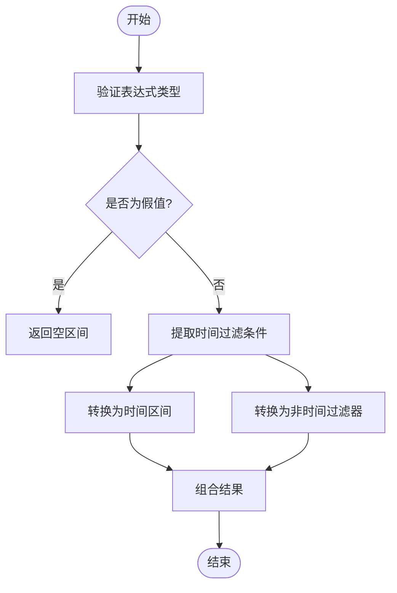
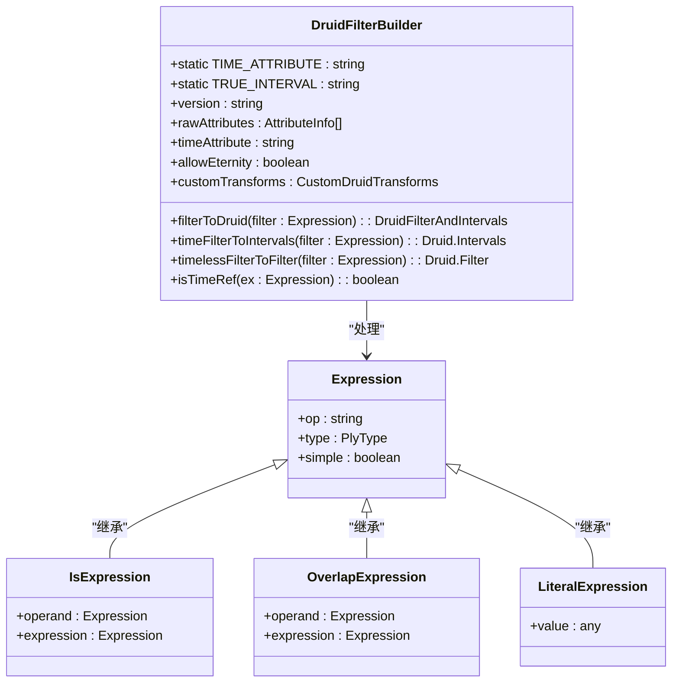
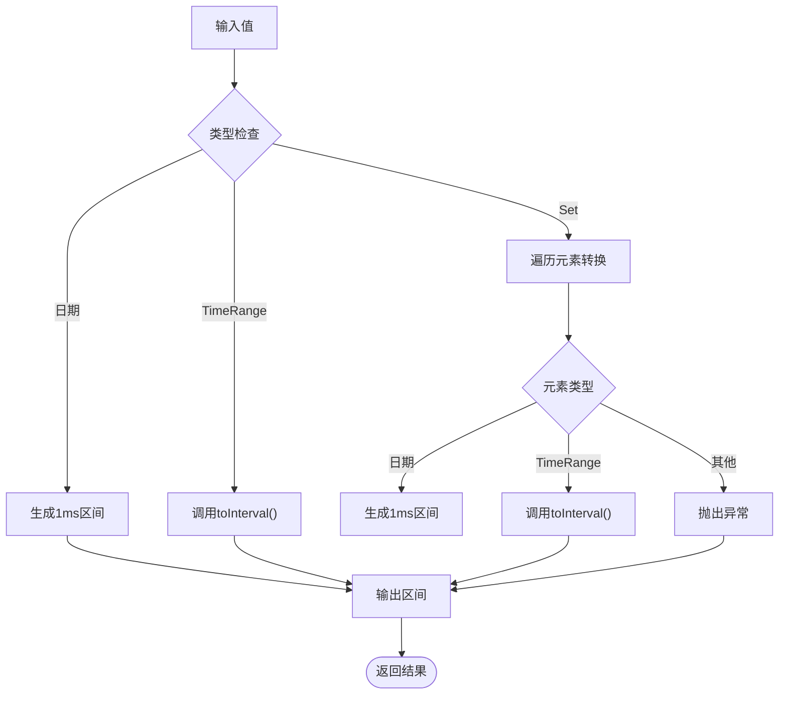
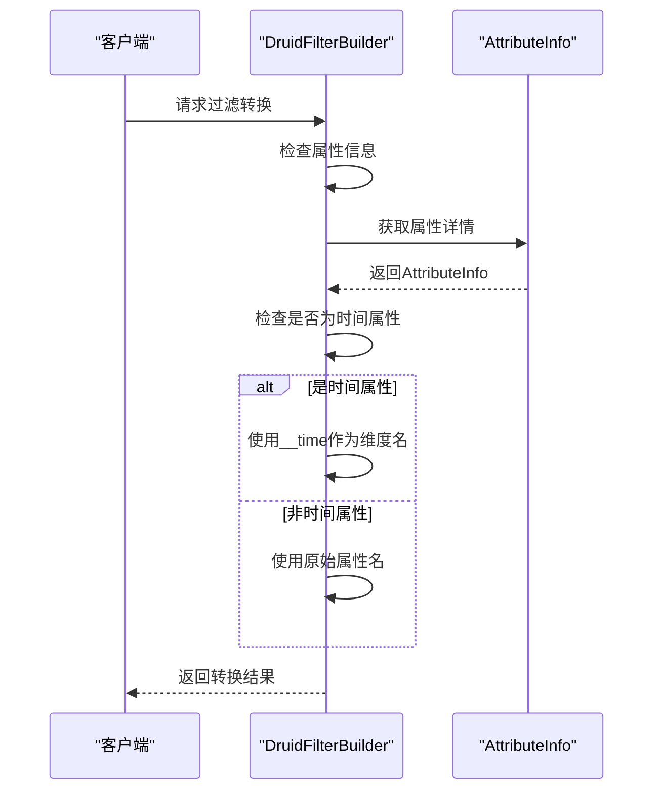
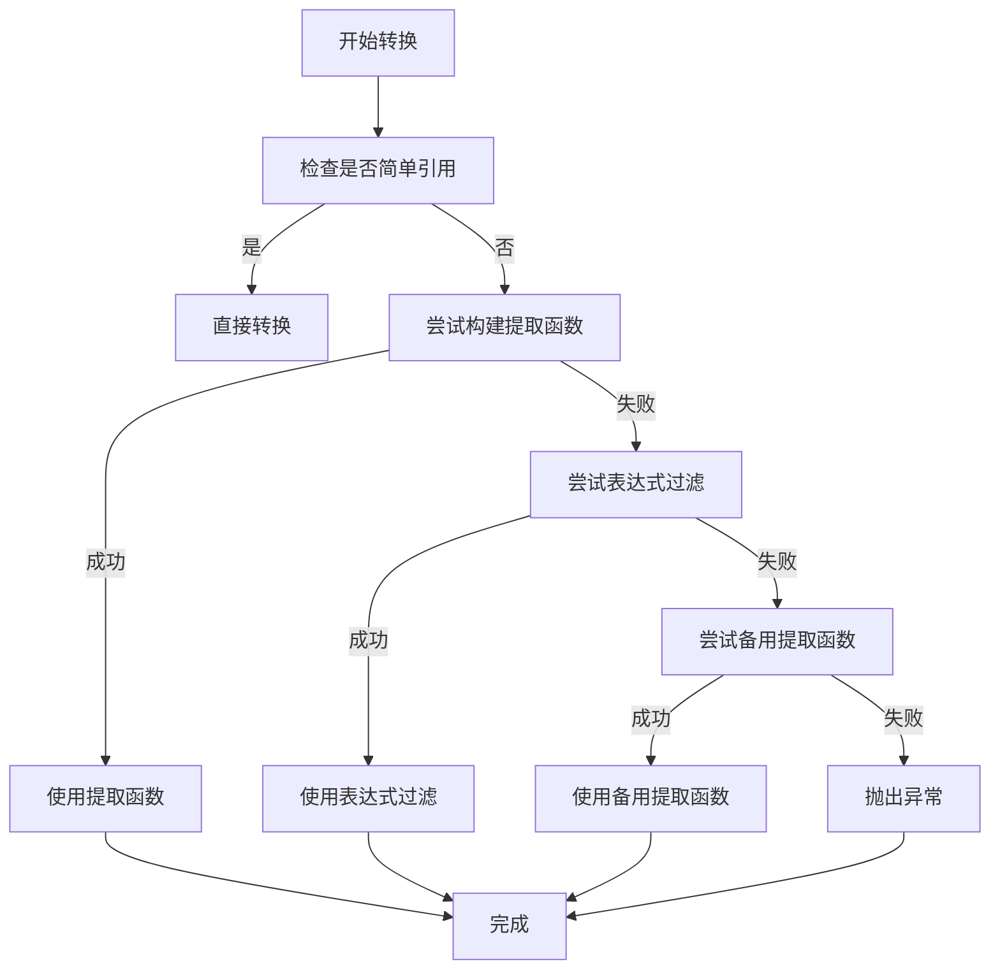
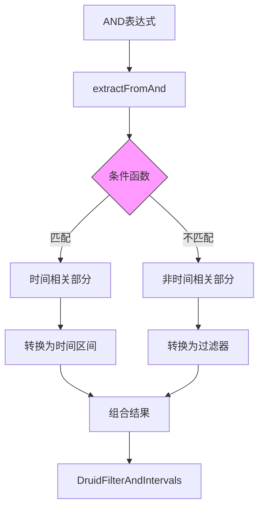

# 时间区间过滤器

<cite>
**本文档引用的文件**   
- [druidFilterBuilder.ts](file://src/external/utils/druidFilterBuilder.ts)
- [timeRange.ts](file://src/datatypes/timeRange.ts)
- [overlapExpression.ts](file://src/expressions/overlapExpression.ts)
- [isExpression.ts](file://src/expressions/isExpression.ts)
- [andExpression.ts](file://src/expressions/andExpression.ts)
</cite>

## 目录
1. [引言](#引言)
2. [时间过滤器生成机制](#时间过滤器生成机制)
3. [时间维度处理规则](#时间维度处理规则)
4. [时间区间映射规则](#时间区间映射规则)
5. [__time维度特殊处理](#__time维度特殊处理)
6. [提取函数应用场景](#提取函数应用场景)
7. [永恒区间控制策略](#永恒区间控制策略)
8. [时间与非时间过滤分离流程](#时间与非时间过滤分离流程)
9. [时间查询性能优化建议](#时间查询性能优化建议)
10. [结论](#结论)

## 引言
本文档系统阐述Druid interval过滤器的生成与时间维度处理机制。重点解释如何将Plywood中针对时间属性的等值或重叠（overlap）表达式转换为Druid的时间区间过滤器，包括单时间点、时间范围及时间集合的区间映射规则。详细说明__time维度的特殊处理、提取函数的应用场景以及永恒区间（eternity）的控制策略。

## 时间过滤器生成机制
Druid过滤器生成器通过`filterToDruid`方法将Plywood表达式转换为Druid原生过滤器结构。该过程首先验证表达式类型是否为布尔型，然后对假值表达式返回空区间。对于复合表达式，系统使用`extractFromAnd`方法分离时间相关和非时间相关部分。



**图表来源**
- [druidFilterBuilder.ts](file://src/external/utils/druidFilterBuilder.ts#L73-L91)

**本节来源**
- [druidFilterBuilder.ts](file://src/external/utils/druidFilterBuilder.ts#L73-L91)

## 时间维度处理规则
时间维度处理基于`isTimeRef`方法识别时间引用表达式。该方法检查表达式是否为引用表达式且名称匹配预设的时间属性名。系统通过`timeFilterToIntervals`方法处理时间过滤条件，支持字面量、等值和重叠表达式三种主要形式。



**图表来源**
- [druidFilterBuilder.ts](file://src/external/utils/druidFilterBuilder.ts#L41-L74)

**本节来源**
- [druidFilterBuilder.ts](file://src/external/utils/druidFilterBuilder.ts#L486-L488)

## 时间区间映射规则
时间区间映射通过`valueToIntervals`方法实现，支持三种主要输入类型：日期对象、时间范围和集合。对于单个日期，系统生成精确的1毫秒区间；对于时间范围，直接转换为Druid区间格式；对于集合，则将每个元素转换为相应区间后合并。



**图表来源**
- [druidFilterBuilder.ts](file://src/external/utils/druidFilterBuilder.ts#L218-L236)
- [timeRange.ts](file://src/datatypes/timeRange.ts#L100-L120)

**本节来源**
- [druidFilterBuilder.ts](file://src/external/utils/druidFilterBuilder.ts#L218-L236)

## __time维度特殊处理
__time维度在Druid中具有特殊地位，系统通过`getDimensionNameForAttributeInfo`方法进行特殊处理。当属性名匹配预设时间属性时，强制使用`__time`作为维度名称。这种处理确保了时间过滤器能正确作用于Druid的内置时间列。



**图表来源**
- [druidFilterBuilder.ts](file://src/external/utils/druidFilterBuilder.ts#L414-L421)

**本节来源**
- [druidFilterBuilder.ts](file://src/external/utils/druidFilterBuilder.ts#L414-L421)

## 提取函数应用场景
提取函数在复杂表达式处理中发挥关键作用。当表达式涉及多个引用或不可分割指标时，系统尝试构建提取函数。若直接转换失败，则回退到表达式过滤器。这种机制支持对派生时间属性的过滤，如时间桶、时间偏移等复杂操作。



**图表来源**
- [druidFilterBuilder.ts](file://src/external/utils/druidFilterBuilder.ts#L240-L280)

**本节来源**
- [druidFilterBuilder.ts](file://src/external/utils/druidFilterBuilder.ts#L240-L280)

## 永恒区间控制策略
永恒区间通过`allowEternity`标志位进行控制。当过滤器为真值字面量且未设置该标志时，系统抛出异常，强制要求时间过滤。TRUE_INTERVAL常量"1000/3000"表示从公元1000年到3000年的超长区间，作为永恒区间的实际表示。

```mermaid
stateDiagram-v2
[*] --> Initial
Initial --> CheckEternity{"allowEternity启用?"}
CheckEternity --> |否| CheckLiteral{"是否为真值字面量?"}
CheckEternity --> |是| ReturnTrueInterval
CheckLiteral --> |是| ThrowError["抛出异常"]
CheckLiteral --> |否| ProcessNormally["正常处理"]
ReturnTrueInterval --> [*]
ThrowError --> [*]
ProcessNormally --> [*]
```

**图表来源**
- [druidFilterBuilder.ts](file://src/external/utils/druidFilterBuilder.ts#L85-L89)

**本节来源**
- [druidFilterBuilder.ts](file://src/external/utils/druidFilterBuilder.ts#L85-L89)

## 时间与非时间过滤分离流程
系统通过`extractFromAnd`方法实现时间与非时间过滤的分离。该方法遍历AND表达式的各个部分，根据预设条件函数判断是否为时间相关过滤。时间相关部分被提取用于区间生成，其余部分则转换为常规过滤器。



**图表来源**
- [druidFilterBuilder.ts](file://src/external/utils/druidFilterBuilder.ts#L73-L91)
- [andExpression.ts](file://src/expressions/andExpression.ts#L107-L126)

**本节来源**
- [druidFilterBuilder.ts](file://src/external/utils/druidFilterBuilder.ts#L73-L91)

## 时间查询性能优化建议
1. **优先使用时间区间过滤**：尽量将时间过滤条件表达为区间形式，避免使用表达式过滤
2. **合理设置allowEternity**：生产环境应禁用永恒区间，确保查询始终有时间边界
3. **简化时间集合**：对时间集合进行合并和简化，减少区间数量
4. **避免复杂提取函数**：尽量使用简单的时间引用，减少提取函数的使用
5. **批量处理时间范围**：将多个时间范围合并为单个OR表达式，提高查询效率

```mermaid
erDiagram
FILTER ||--o{ INTERVAL : "包含"
FILTER ||--o{ EXPRESSION : "包含"
INTERVAL ||--o{ TIME_RANGE : "映射"
EXPRESSION ||--o{ EXTRACTION_FN : "可能使用"
TIME_RANGE }|--|| DATE : "由...组成"
class FILTER "过滤器"
class INTERVAL "时间区间"
class EXPRESSION "表达式"
class EXTRACTION_FN "提取函数"
class TIME_RANGE "时间范围"
class DATE "日期"
```

**图表来源**
- [druidFilterBuilder.ts](file://src/external/utils/druidFilterBuilder.ts#L355-L380)
- [timeRange.ts](file://src/datatypes/timeRange.ts#L100-L120)

**本节来源**
- [druidFilterBuilder.ts](file://src/external/utils/druidFilterBuilder.ts#L355-L380)

## 结论
Druid时间区间过滤器的生成机制通过分离时间与非时间过滤条件，实现了高效的查询优化。系统充分利用Druid原生的时间区间功能，将Plywood中的时间表达式精确转换为最优的查询格式。通过合理的控制策略和性能优化建议，可以显著提升时间查询的效率和可靠性。