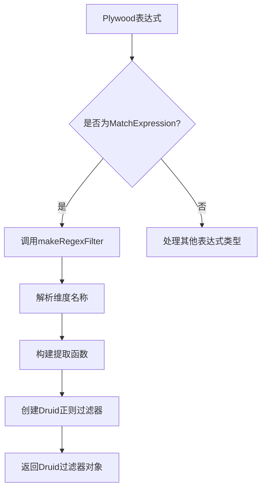
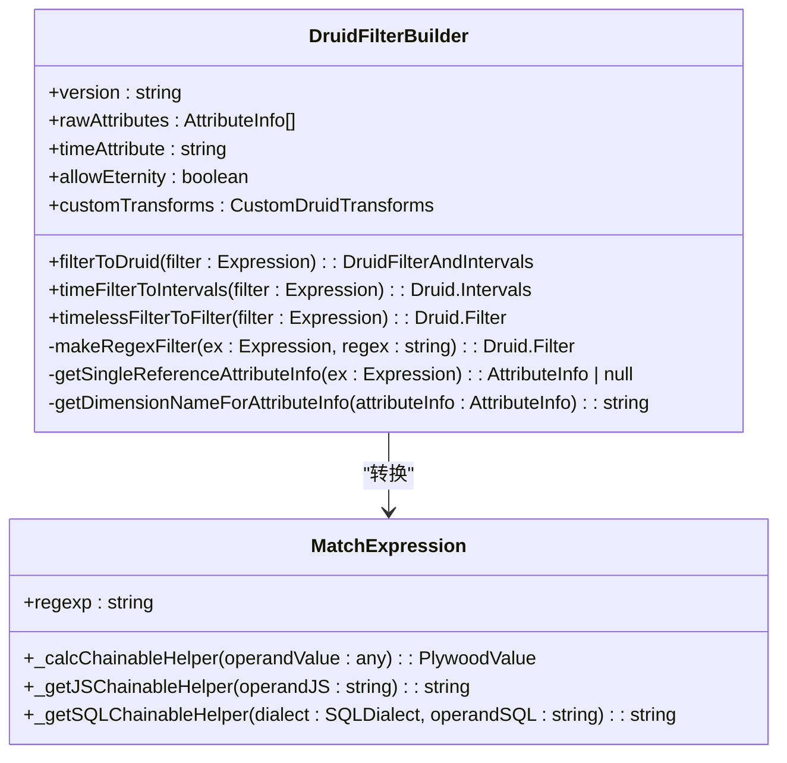
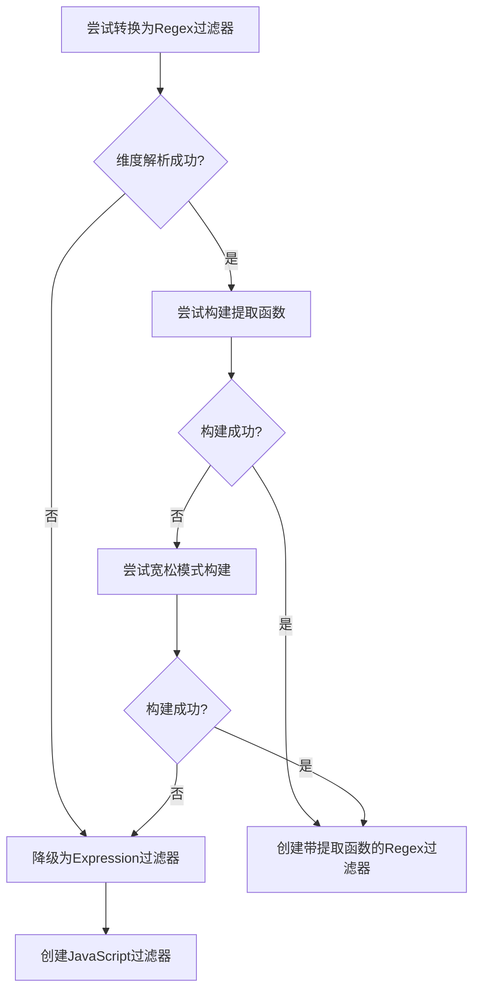

# 正则表达式过滤器

<cite>
**Referenced Files in This Document**   
- [matchExpression.ts](file://src/expressions/matchExpression.ts)
- [druidFilterBuilder.ts](file://src/external/utils/druidFilterBuilder.ts)
- [druidDialect.ts](file://src/dialect/druidDialect.ts)
- [baseExpression.ts](file://src/expressions/baseExpression.ts)
- [set.ts](file://src/datatypes/set.ts)
- [matchExpression.mocha.js](file://test/expression/matchExpression.mocha.js)
</cite>

## 目录
1. [简介](#简介)
2. [Plywood Match表达式到Druid正则过滤器的转换](#plywood-match表达式到druid正则过滤器的转换)
3. [维度名称解析与提取函数集成](#维度名称解析与提取函数集成)
4. [复杂表达式降级为JavaScript过滤器](#复杂表达式降级为javascript过滤器)
5. [正则模式生成示例](#正则模式生成示例)
6. [Regex过滤器与Search过滤器的适用场景对比](#regex过滤器与search过滤器的适用场景对比)
7. [正则表达式性能影响、安全风险及优化策略](#正则表达式性能影响安全风险及优化策略)
8. [结论](#结论)

## 简介
本文档详细说明了Plywood中`match`表达式如何转换为Druid的正则表达式（regex）过滤器。文档涵盖了从Plywood表达式到Druid查询的完整转换流程，包括维度名称解析、提取函数（extraction function）的集成，以及当无法直接转换时降级为JavaScript过滤器的条件判断。通过实际代码示例，展示了正则模式的生成过程，并对比了regex过滤器与search过滤器的适用场景。最后，提供了关于正则表达式性能影响、安全风险及优化策略的指导。

**Section sources**
- [matchExpression.ts](file://src/expressions/matchExpression.ts#L1-L107)
- [druidFilterBuilder.ts](file://src/external/utils/druidFilterBuilder.ts#L1-L491)

## Plywood Match表达式到Druid正则过滤器的转换

Plywood中的`match`表达式用于执行正则表达式匹配，其核心实现位于`matchExpression.ts`文件中。该表达式继承自`ChainableExpression`，并定义了`regexp`属性来存储正则表达式模式。

转换过程由`druidFilterBuilder.ts`中的`DruidFilterBuilder`类驱动。当Plywood表达式树被遍历到`MatchExpression`节点时，`timelessFilterToFilter`方法会识别该节点并调用`makeRegexFilter`方法进行转换。



**Diagram sources**
- [matchExpression.ts](file://src/expressions/matchExpression.ts#L24-L103)
- [druidFilterBuilder.ts](file://src/external/utils/druidFilterBuilder.ts#L186-L216)

**Section sources**
- [matchExpression.ts](file://src/expressions/matchExpression.ts#L24-L103)
- [druidFilterBuilder.ts](file://src/external/utils/druidFilterBuilder.ts#L186-L216)

## 维度名称解析与提取函数集成

在转换过程中，`makeRegexFilter`方法首先通过`getSingleReferenceAttributeInfo`解析维度名称。此方法检查表达式是否引用了单一的、可过滤的维度。如果表达式涉及多个引用或不可过滤的度量（如rollup指标），则无法直接转换。



**Diagram sources**
- [druidFilterBuilder.ts](file://src/external/utils/druidFilterBuilder.ts#L21-L491)
- [matchExpression.ts](file://src/expressions/matchExpression.ts#L24-L103)

**Section sources**
- [druidFilterBuilder.ts](file://src/external/utils/druidFilterBuilder.ts#L382-L413)
- [druidFilterBuilder.ts](file://src/external/utils/druidFilterBuilder.ts#L420-L440)

如果维度解析成功，系统会尝试构建一个提取函数（`extractionFn`）。这通过`DruidExtractionFnBuilder`实现，用于处理对维度的复杂操作（如字符串提取、大小写转换等）。如果提取函数构建成功，它将被附加到最终的Druid过滤器上。

## 复杂表达式降级为JavaScript过滤器

当`match`表达式无法直接转换为Druid的原生`regex`过滤器时，系统会降级为使用`javascript`过滤器。这通常发生在以下情况：
1.  **表达式引用了多个维度或复杂的计算**：`getSingleReferenceAttributeInfo`返回`null`。
2.  **提取函数构建失败**：`DruidExtractionFnBuilder`无法为表达式生成有效的提取函数。

降级过程在`makeRegexFilter`方法中实现。首先尝试使用`false`标志构建提取函数，如果失败，则尝试使用`true`标志（更宽松的构建模式）。如果两种方式都失败，则调用`makeExpressionFilter`，该方法最终会生成一个`javascript`类型的过滤器。



**Diagram sources**
- [druidFilterBuilder.ts](file://src/external/utils/druidFilterBuilder.ts#L382-L413)
- [druidFilterBuilder.ts](file://src/external/utils/druidFilterBuilder.ts#L450-L470)

**Section sources**
- [druidFilterBuilder.ts](file://src/external/utils/druidFilterBuilder.ts#L382-L413)

## 正则模式生成示例

以下是一个实际的代码示例，展示了`match`表达式的使用和转换：

```typescript
// 创建一个过滤表达式，匹配language维度以'en'开头并后跟一个或多个字符
let ex = $('wiki').filter($("language").match('en+'));

// 经过解析、解析和简化后，生成的Druid查询过滤器如下
expect(druidExternal.getQueryAndPostTransform().query.filter).to.deep.equal({
  "dimension": "language",
  "pattern": "en+",
  "type": "regex"
});
```

此示例来自`druidExternal.mocha.js`测试文件，它验证了Plywood表达式`$("language").match('en+')`被正确转换为Druid的`regex`过滤器，其中`dimension`为`"language"`，`pattern`为`"en+"`。

**Section sources**
- [druidExternal.mocha.js](file://test/external/druidExternal.mocha.js#L1021-L1061)
- [druidExternalNullType.mocha.js](file://test/external/druidExternalNullType.mocha.js#L882-L913)

## Regex过滤器与Search过滤器的适用场景对比

Druid提供了多种文本过滤方式，其中`regex`和`search`是最常用的两种。

| 特性 | Regex过滤器 | Search过滤器 |
| :--- | :--- | :--- |
| **类型** | `type: "regex"` | `type: "search"` |
| **匹配模式** | `pattern: "en+"` | `query: { type: "contains", value: "en" }` |
| **主要用途** | 复杂的模式匹配（如开始、结束、分组） | 简单的子字符串、前缀、后缀匹配 |
| **性能** | 通常较慢，因为需要编译和执行正则引擎 | 通常较快，特别是对于简单的包含查询 |
| **适用场景** | 验证数据格式（邮箱、电话）、提取特定模式 | 搜索关键词、模糊匹配 |
| **生成条件** | 来自Plywood的`.match()`表达式 | 来自Plywood的`.contains()`表达式 |

`search`过滤器在内部使用`contains`、`insensitive_contains`等查询类型，更适合于全文搜索场景。而`regex`过滤器提供了更强大的模式匹配能力，但代价是更高的计算开销。

**Section sources**
- [druidFilterBuilder.ts](file://src/external/utils/druidFilterBuilder.ts#L382-L413)
- [druidFilterBuilder.ts](file://src/external/utils/druidFilterBuilder.ts#L415-L445)

## 正则表达式性能影响、安全风险及优化策略

### 性能影响
正则表达式过滤器是计算密集型操作。复杂的正则模式（如包含大量回溯的模式）会显著增加查询延迟和CPU使用率。在高吞吐量的数据集上，应避免使用过于复杂的正则表达式。

### 安全风险
使用`javascript`过滤器（作为降级方案）存在安全风险，因为它允许执行任意JavaScript代码。这可能导致代码注入攻击，尤其是在处理用户输入的正则表达式时。应严格验证和清理所有用户提供的正则模式。

### 优化策略
1.  **优先使用简单过滤器**：对于简单的包含、前缀或后缀匹配，使用`.contains()`、`.startsWith()`或`.endsWith()`，它们会生成更高效的`search`或`selector`过滤器。
2.  **简化正则表达式**：避免使用可能导致灾难性回溯的正则模式。使用非捕获组`(?:...)`和原子组`?>...`来优化性能。
3.  **预处理数据**：如果可能，通过提取函数（`extractionFn`）在查询前对数据进行预处理，例如将复杂字符串分解为更易查询的字段。
4.  **使用索引**：确保被过滤的维度在Druid中已正确索引，以加速过滤过程。
5.  **避免降级**：设计数据模型和查询逻辑，尽量使`match`表达式能够直接转换为原生`regex`过滤器，避免降级到性能较差的`javascript`过滤器。

**Section sources**
- [druidFilterBuilder.ts](file://src/external/utils/druidFilterBuilder.ts#L382-L413)
- [druidFilterBuilder.ts](file://src/external/utils/druidFilterBuilder.ts#L450-L470)

## 结论
Plywood到Druid的`match`表达式转换是一个健壮且分层的过程。它首先尝试生成高效的原生Druid `regex`过滤器，利用维度解析和提取函数来处理复杂逻辑。当直接转换不可行时，系统会优雅地降级到`javascript`过滤器，确保功能的完整性。理解`regex`和`search`过滤器之间的区别对于优化查询性能至关重要。在实践中，应优先考虑使用更简单、更高效的过滤器类型，并谨慎使用复杂的正则表达式，以平衡功能需求与系统性能。