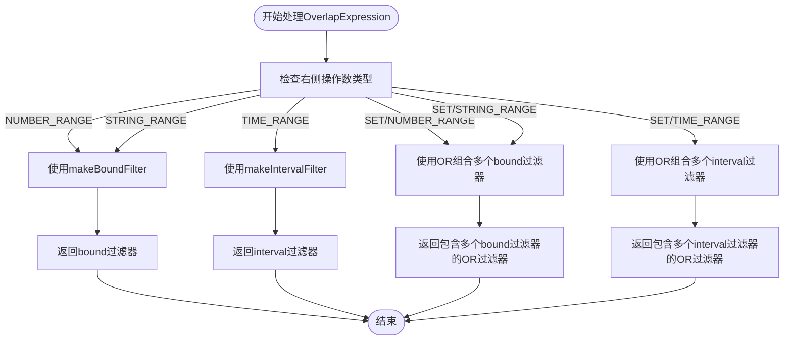
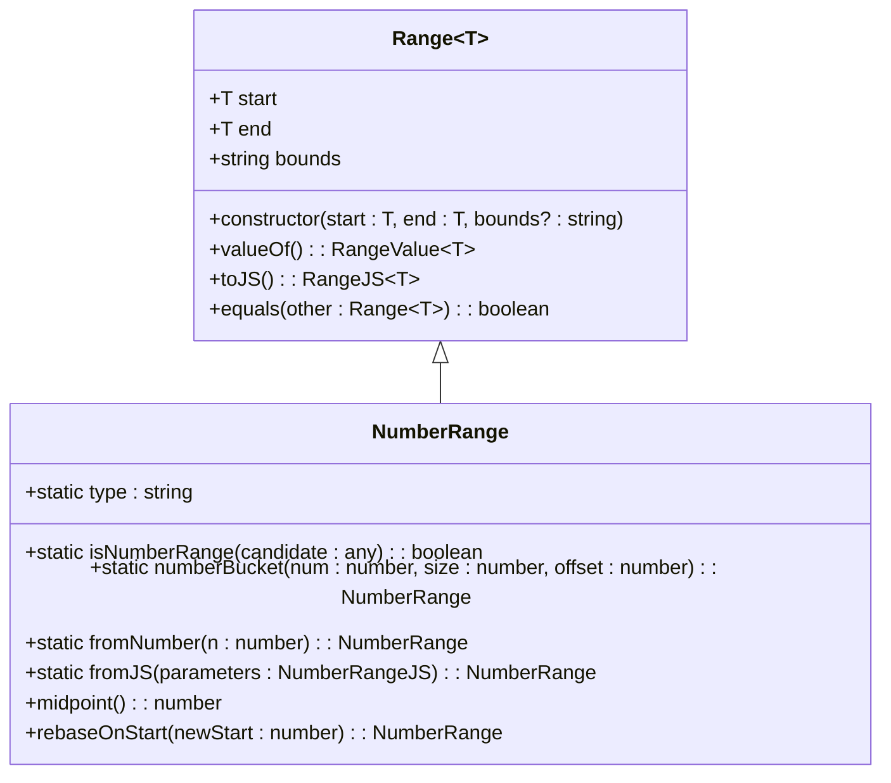
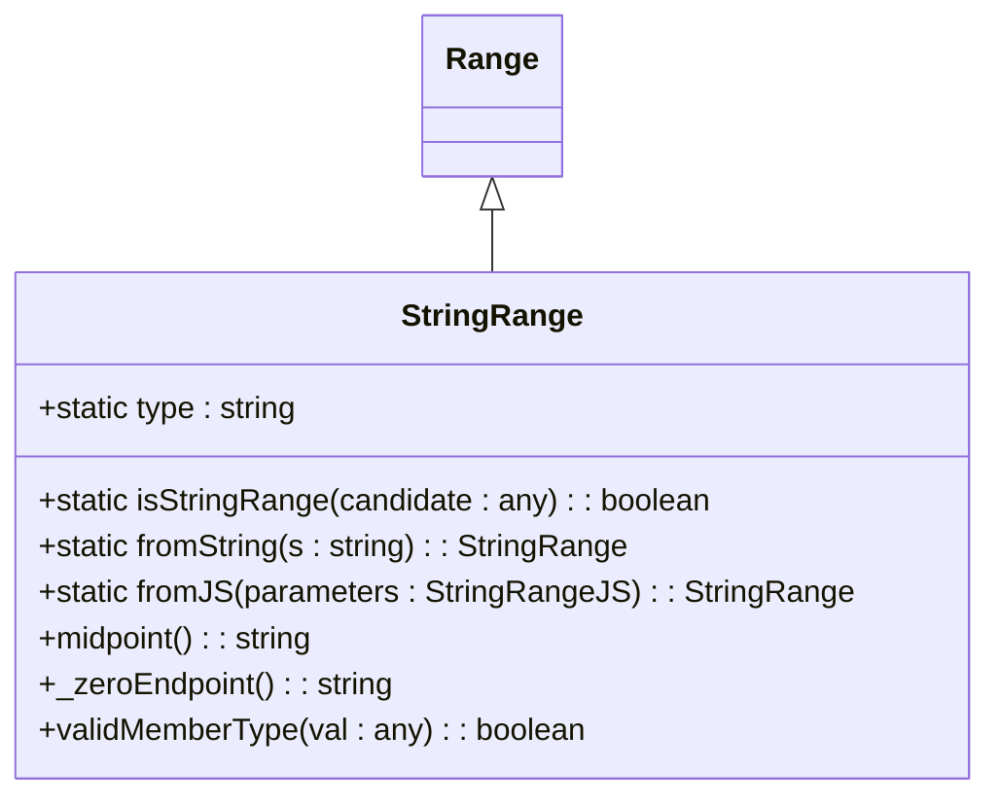
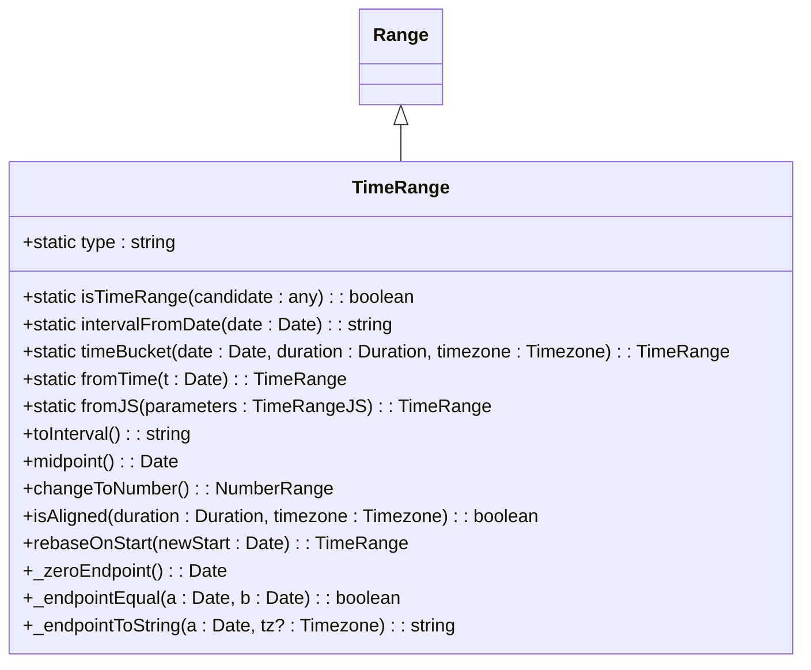
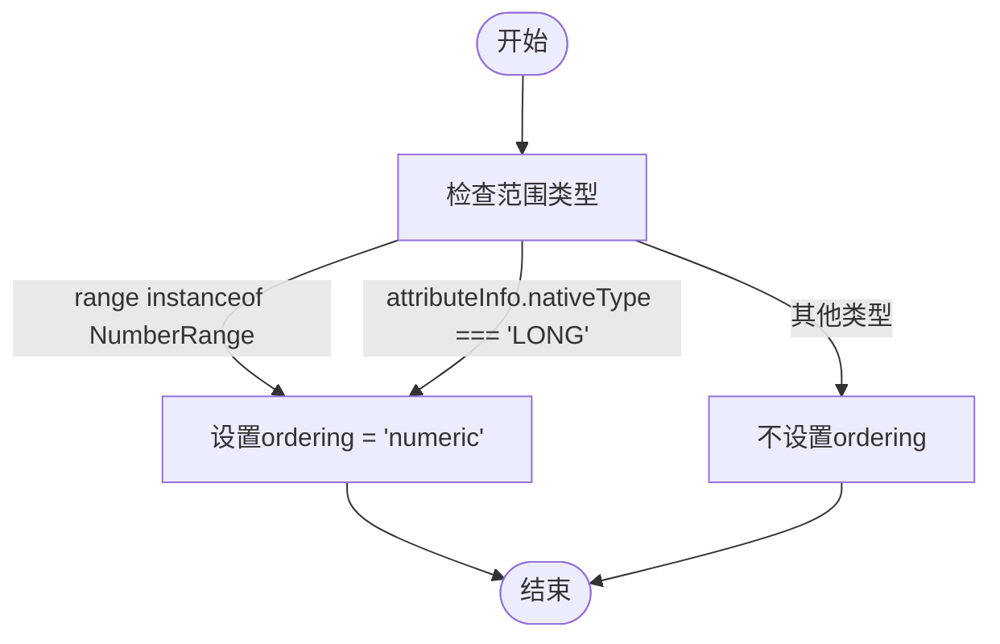

# 边界过滤器

<cite>
**Referenced Files in This Document**   
- [druidFilterBuilder.ts](file://src/external/utils/druidFilterBuilder.ts)
- [numberRange.ts](file://src/datatypes/numberRange.ts)
- [stringRange.ts](file://src/datatypes/stringRange.ts)
- [timeRange.ts](file://src/datatypes/timeRange.ts)
</cite>

## 目录
1. [简介](#简介)
2. [核心组件](#核心组件)
3. [边界过滤器构建过程](#边界过滤器构建过程)
4. [范围类型处理差异](#范围类型处理差异)
5. [边界严格性与排序类型](#边界严格性与排序类型)
6. [提取函数集成](#提取函数集成)
7. [转换逻辑示例](#转换逻辑示例)
8. [兼容性最佳实践](#兼容性最佳实践)

## 简介
本文档全面介绍Druid bound过滤器的构建过程，重点描述如何将Plywood中的范围比较（如大于、小于、区间）转换为Druid的bound过滤器。文档涵盖了数值范围、时间范围和字符串范围的处理差异，详细说明了边界严格性（lowerStrict/upperStrict）、排序类型（ordering）的确定规则，以及提取函数在范围过滤中的集成方式。

## 核心组件

Plywood系统通过`DruidFilterBuilder`类实现从Plywood表达式到Druid原生过滤器的转换。该类负责处理各种过滤操作，包括范围比较、相等性检查、正则表达式匹配等。当遇到范围比较操作时，系统会根据操作类型和数据类型选择适当的过滤器构建方法。

**Section sources**
- [druidFilterBuilder.ts](file://src/external/utils/druidFilterBuilder.ts#L54-L489)

## 边界过滤器构建过程

### 范围比较的转换机制
在Plywood中，范围比较操作（如大于、小于、区间）通过`OverlapExpression`来表示。当`DruidFilterBuilder`处理这种表达式时，会根据右侧操作数的类型来决定使用哪种过滤器。



**Diagram sources**
- [druidFilterBuilder.ts](file://src/external/utils/druidFilterBuilder.ts#L154-L189)

### 转换流程
转换流程从`timelessFilterToFilter`方法开始，该方法是处理所有非时间过滤器的主要入口点。当遇到`OverlapExpression`时，系统会检查右侧操作数的类型，并根据类型调用相应的过滤器构建方法。

**Section sources**
- [druidFilterBuilder.ts](file://src/external/utils/druidFilterBuilder.ts#L122-L205)

## 范围类型处理差异

### 数值范围处理
数值范围由`NumberRange`类表示，该类继承自通用的`Range`基类。数值范围的处理需要特别注意排序类型（ordering）的设置。



**Diagram sources**
- [numberRange.ts](file://src/datatypes/numberRange.ts#L30-L111)

### 字符串范围处理
字符串范围由`StringRange`类表示，与数值范围类似，但有一些特定的实现差异。



**Diagram sources**
- [stringRange.ts](file://src/datatypes/stringRange.ts#L30-L95)

### 时间范围处理
时间范围由`TimeRange`类表示，具有特殊的序列化和格式化方法。



**Diagram sources**
- [timeRange.ts](file://src/datatypes/timeRange.ts#L60-L184)

## 边界严格性与排序类型

### 边界严格性规则
边界严格性通过`bounds`属性来确定，该属性是一个包含两个字符的字符串，表示区间的开闭状态：

- `[` 表示闭区间（包含边界）
- `]` 表示闭区间（包含边界）
- `(` 表示开区间（不包含边界）
- `)` 表示开区间（不包含边界）

在`makeBoundFilter`方法中，系统会根据`bounds`属性的值来设置`lowerStrict`和`upperStrict`标志：

```mermaid
flowchart TD
Start([开始]) --> CheckLower["检查下界符号"]
CheckLower --> |bounds[0] == '('| SetLowerStrict["设置lowerStrict = true"]
CheckLower --> |bounds[0] == '['| SkipLower["不设置lowerStrict"]
SetLowerStrict --> CheckUpper["检查上界符号"]
SkipLower --> CheckUpper
CheckUpper --> |bounds[1] == ')'| SetUpperStrict["设置upperStrict = true"]
CheckUpper --> |bounds[1] == ']'| SkipUpper["不设置upperStrict"]
SetUpperStrict --> End([结束])
SkipUpper --> End
```

**Diagram sources**
- [druidFilterBuilder.ts](file://src/external/utils/druidFilterBuilder.ts#L304-L353)

### 排序类型确定
排序类型（ordering）的确定规则如下：

1. 如果范围是`NumberRange`实例，或者属性的原生类型为'LONG'，则排序类型为'numeric'
2. 对于字符串范围，使用默认的字典序排序
3. 对于时间范围，通常使用interval过滤器而不是bound过滤器



**Section sources**
- [druidFilterBuilder.ts](file://src/external/utils/druidFilterBuilder.ts#L328-L330)

## 提取函数集成

### 提取函数的作用
提取函数（extraction function）在范围过滤中扮演重要角色，它允许在过滤前对维度值进行转换。系统会尝试为表达式构建提取函数，如果构建失败，则会回退到使用表达式过滤器。

```mermaid
sequenceDiagram
participant FilterBuilder as DruidFilterBuilder
participant ExtractionFnBuilder as DruidExtractionFnBuilder
participant Expression as Expression
FilterBuilder->>ExtractionFnBuilder : expressionToExtractionFn(ex)
ExtractionFnBuilder-->>FilterBuilder : extractionFn 或异常
alt 构建成功
FilterBuilder->>FilterBuilder : 将extractionFn添加到bound过滤器
else 构建失败
FilterBuilder->>FilterBuilder : 尝试makeExpressionFilter(ex.overlap(range))
alt 再次失败
FilterBuilder->>ExtractionFnBuilder : expressionToExtractionFn(ex) with allowJavaScript=true
ExtractionFnBuilder-->>FilterBuilder : extractionFn
FilterBuilder->>FilterBuilder : 将extractionFn添加到bound过滤器
end
end
FilterBuilder-->> : 返回bound过滤器
```

**Section sources**
- [druidFilterBuilder.ts](file://src/external/utils/druidFilterBuilder.ts#L312-L325)

## 转换逻辑示例

### 开闭区间转换
对于开闭区间，系统会根据边界符号设置相应的严格性标志：

- `[a,b]`（闭区间）：不设置`lowerStrict`和`upperStrict`
- `(a,b)`（开区间）：设置`lowerStrict=true`和`upperStrict=true`
- `[a,b)`（左闭右开）：只设置`upperStrict=true`
- `(a,b]`（左开右闭）：只设置`lowerStrict=true`

### 半开区间转换
半开区间的转换逻辑与开闭区间类似，系统会根据具体的边界符号来决定是否设置严格性标志。

**Section sources**
- [druidFilterBuilder.ts](file://src/external/utils/druidFilterBuilder.ts#L344-L353)

## 兼容性最佳实践

### 数值范围最佳实践
1. 对于数值类型的维度，确保设置正确的`nativeType`为'LONG'以启用数值排序
2. 使用`NumberRange`类来表示数值范围，确保边界值的正确性
3. 在处理浮点数时，注意精度问题

### 字符串范围最佳实践
1. 字符串范围使用字典序进行比较
2. 注意大小写敏感性，必要时使用提取函数进行大小写转换
3. 避免在字符串范围中使用特殊字符，除非明确需要

### 时间范围最佳实践
1. 对于时间范围，优先使用`interval`过滤器而不是`bound`过滤器
2. 确保时间值的时区设置正确
3. 使用`TimeRange`类提供的`toInterval`方法来生成正确的区间格式

**Section sources**
- [druidFilterBuilder.ts](file://src/external/utils/druidFilterBuilder.ts#L355-L380)
- [timeRange.ts](file://src/datatypes/timeRange.ts#L140-L160)