# 过滤条件转换

<cite>
**本文档引用的文件**   
- [druidFilterBuilder.ts](file://src/external/utils/druidFilterBuilder.ts)
- [druidExtractionFnBuilder.ts](file://src/external/utils/druidExtractionFnBuilder.ts)
- [filterExpression.ts](file://src/expressions/filterExpression.ts)
- [druidDialect.ts](file://src/dialect/druidDialect.ts)
- [druidExternal.mocha.js](file://test/external/druidExternal.mocha.js)
</cite>

## 目录
1. [简介](#简介)
2. [过滤条件转换架构](#过滤条件转换架构)
3. [时间过滤与非时间过滤处理](#时间过滤与非时间过滤处理)
4. [基本过滤类型生成规则](#基本过滤类型生成规则)
5. [复杂过滤条件转换逻辑](#复杂过滤条件转换逻辑)
6. [提取函数在过滤中的应用](#提取函数在过滤中的应用)
7. [性能优化建议](#性能优化建议)
8. [常见问题解决方案](#常见问题解决方案)

## 简介
本文档详细阐述了如何将Plywood的过滤表达式转换为Druid的过滤条件格式。重点分析了各种过滤类型（如selector、in、regex、bound等）的生成规则，以及时间过滤与非时间过滤的处理差异。文档深入探讨了复杂过滤条件（如AND、OR、NOT逻辑组合）的转换逻辑，以及提取函数（extractionFn）在过滤中的应用。通过具体代码示例展示不同过滤操作的转换过程，并提供性能优化建议和常见问题解决方案。

**Section sources**
- [druidFilterBuilder.ts](file://src/external/utils/druidFilterBuilder.ts#L54-L489)

## 过滤条件转换架构
Plywood到Druid的过滤条件转换主要通过`DruidFilterBuilder`类实现，该类负责将Plywood表达式转换为Druid查询所需的过滤格式。转换过程分为两个主要部分：时间过滤和非时间过滤。

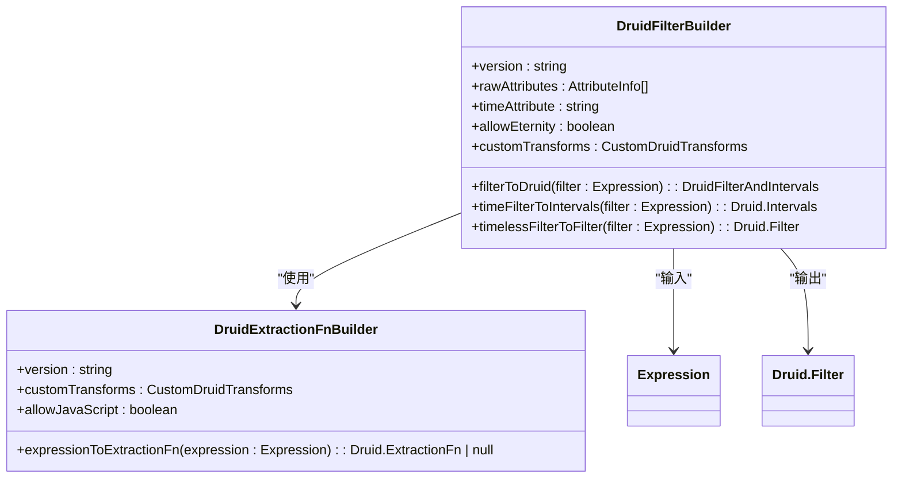

**Diagram sources **
- [druidFilterBuilder.ts](file://src/external/utils/druidFilterBuilder.ts#L54-L489)
- [druidExtractionFnBuilder.ts](file://src/external/utils/druidExtractionFnBuilder.ts#L49-L503)

**Section sources**
- [druidFilterBuilder.ts](file://src/external/utils/druidFilterBuilder.ts#L54-L489)
- [druidExtractionFnBuilder.ts](file://src/external/utils/druidExtractionFnBuilder.ts#L49-L503)

## 时间过滤与非时间过滤处理
在Druid过滤条件转换中，时间过滤和非时间过滤的处理方式有显著差异。时间过滤主要通过`timeFilterToIntervals`方法处理，而非时间过滤则通过`timelessFilterToFilter`方法处理。

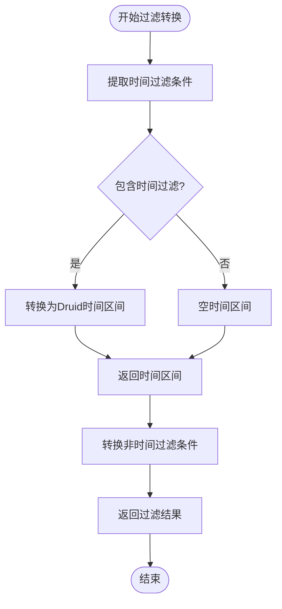

**Diagram sources **
- [druidFilterBuilder.ts](file://src/external/utils/druidFilterBuilder.ts#L93-L120)
- [druidFilterBuilder.ts](file://src/external/utils/druidFilterBuilder.ts#L122-L205)

**Section sources**
- [druidFilterBuilder.ts](file://src/external/utils/druidFilterBuilder.ts#L93-L205)

## 基本过滤类型生成规则
Plywood支持多种基本过滤类型，每种类型都有特定的Druid过滤条件生成规则。这些规则主要在`DruidFilterBuilder`类的`timelessFilterToFilter`方法中实现。

### Selector过滤
Selector过滤用于精确匹配单个值，当过滤表达式为`is`操作且右侧为字面量时生成。

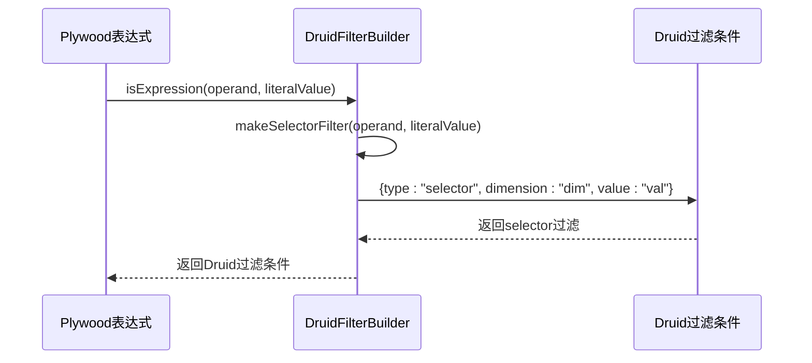

**Diagram sources **
- [druidFilterBuilder.ts](file://src/external/utils/druidFilterBuilder.ts#L238-L278)

### In过滤
In过滤用于匹配值集合，当过滤表达式为`is`操作且右侧为集合时生成。

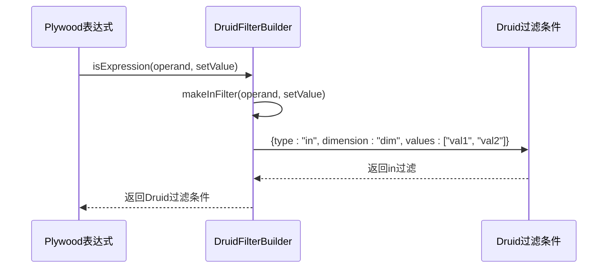

**Diagram sources **
- [druidFilterBuilder.ts](file://src/external/utils/druidFilterBuilder.ts#L280-L308)

### Bound过滤
Bound过滤用于范围匹配，当过滤表达式为`overlap`操作且右侧为数值范围、时间范围或字符串范围时生成。

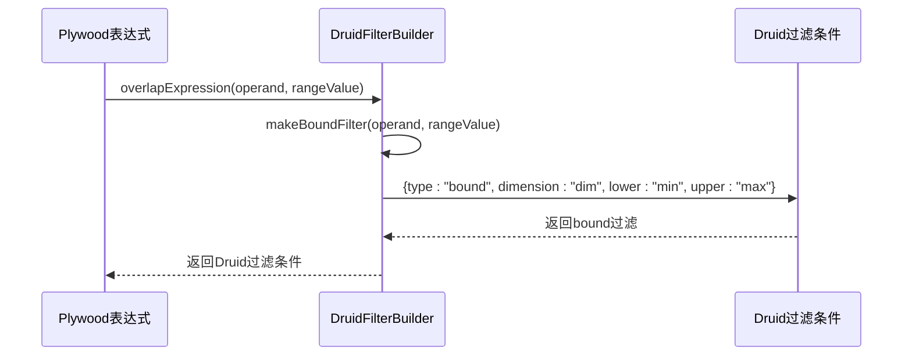

**Diagram sources **
- [druidFilterBuilder.ts](file://src/external/utils/druidFilterBuilder.ts#L310-L368)

### Interval过滤
Interval过滤专门用于时间范围匹配，当`overlap`操作的左侧是时间引用且右侧是时间范围时生成。

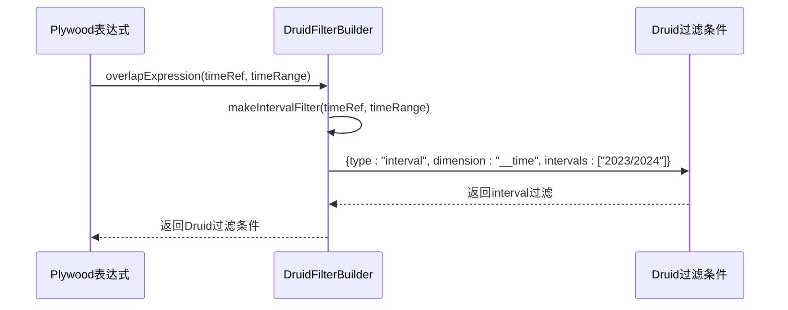

**Diagram sources **
- [druidFilterBuilder.ts](file://src/external/utils/druidFilterBuilder.ts#L370-L397)

### Regex过滤
Regex过滤用于正则表达式匹配，当过滤表达式为`match`操作时生成。

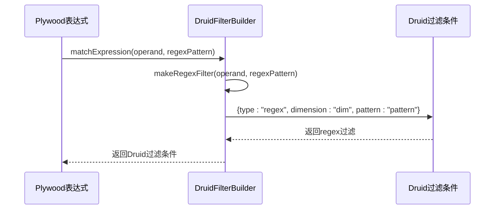

**Diagram sources **
- [druidFilterBuilder.ts](file://src/external/utils/druidFilterBuilder.ts#L399-L424)

### Contains过滤
Contains过滤用于子字符串匹配，当过滤表达式为`contains`操作时生成。

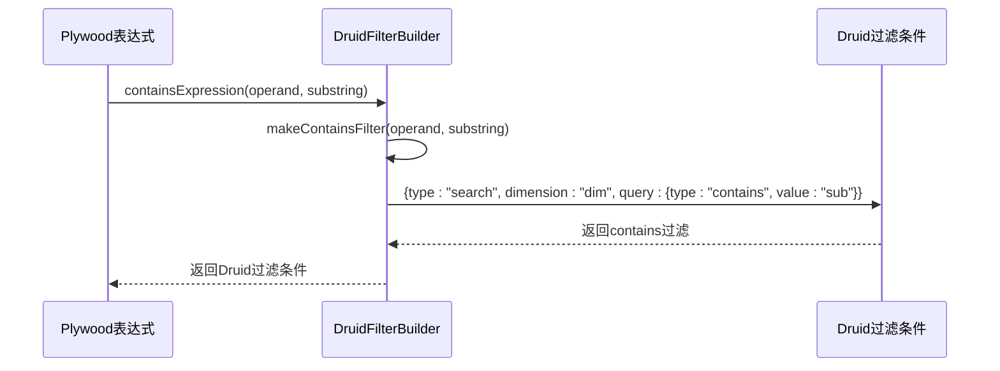

**Diagram sources **
- [druidFilterBuilder.ts](file://src/external/utils/druidFilterBuilder.ts#L426-L468)

**Section sources**
- [druidFilterBuilder.ts](file://src/external/utils/druidFilterBuilder.ts#L238-L468)

## 复杂过滤条件转换逻辑
复杂过滤条件由多个基本过滤条件通过逻辑操作符组合而成，包括AND、OR和NOT操作。

### AND逻辑组合
AND逻辑组合将多个过滤条件合并为一个`and`类型的Druid过滤，所有条件必须同时满足。

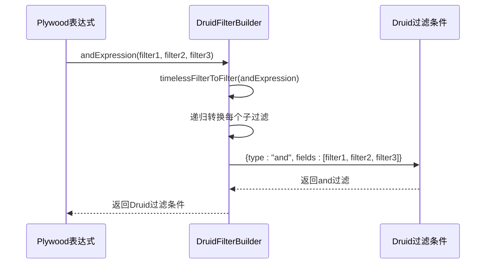

**Diagram sources **
- [druidFilterBuilder.ts](file://src/external/utils/druidFilterBuilder.ts#L146-L153)

### OR逻辑组合
OR逻辑组合将多个过滤条件合并为一个`or`类型的Druid过滤，任一条件满足即可。

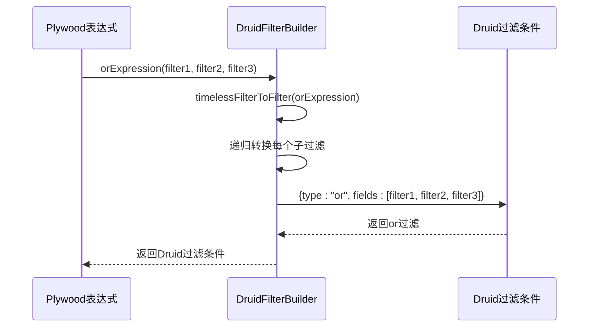

**Diagram sources **
- [druidFilterBuilder.ts](file://src/external/utils/druidFilterBuilder.ts#L155-L162)

### NOT逻辑组合
NOT逻辑组合将一个过滤条件转换为`not`类型的Druid过滤，表示条件不成立。

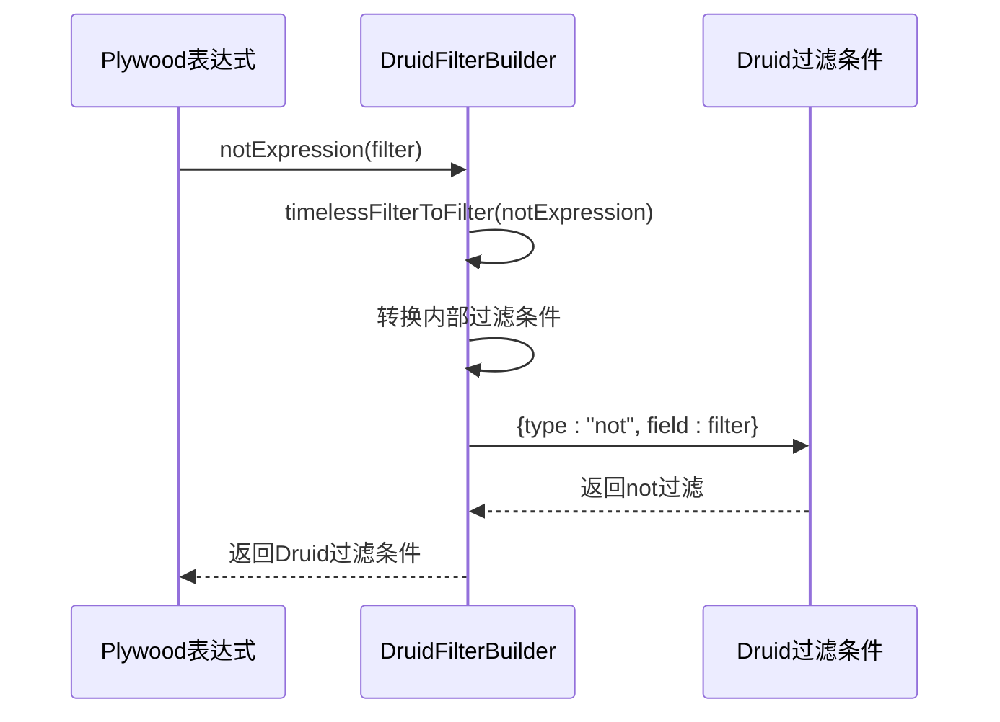

**Diagram sources **
- [druidFilterBuilder.ts](file://src/external/utils/druidFilterBuilder.ts#L138-L144)

**Section sources**
- [druidFilterBuilder.ts](file://src/external/utils/druidFilterBuilder.ts#L138-L162)

## 提取函数在过滤中的应用
提取函数（extractionFn）在过滤中扮演重要角色，允许在过滤前对维度值进行转换或计算。

### 提取函数构建器
`DruidExtractionFnBuilder`类负责将Plywood表达式转换为Druid提取函数，支持多种转换操作。

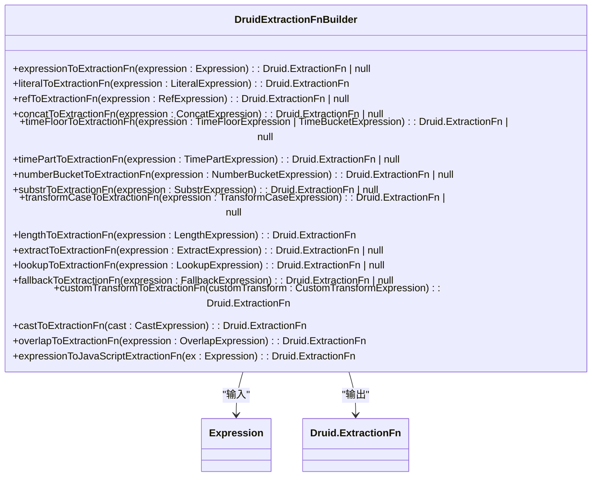

**Diagram sources **
- [druidExtractionFnBuilder.ts](file://src/external/utils/druidExtractionFnBuilder.ts#L49-L503)

### 提取函数应用场景
提取函数在多种过滤场景中应用，包括时间粒度转换、字符串处理、数值分桶等。

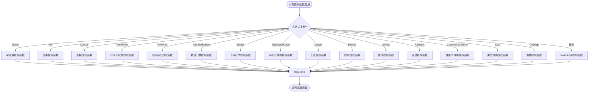

**Diagram sources **
- [druidExtractionFnBuilder.ts](file://src/external/utils/druidExtractionFnBuilder.ts#L165-L218)

**Section sources**
- [druidExtractionFnBuilder.ts](file://src/external/utils/druidExtractionFnBuilder.ts#L49-L503)

## 性能优化建议
在进行过滤条件转换时，遵循以下性能优化建议可以提高查询效率：

1. **避免JavaScript过滤**：尽可能使用原生Druid过滤类型，避免使用JavaScript过滤，因为JavaScript过滤性能较差。
2. **合理使用提取函数**：提取函数会增加计算开销，只在必要时使用。
3. **优化时间过滤**：将时间过滤作为独立条件处理，利用Druid的时间区间优化。
4. **减少复杂表达式**：尽量简化过滤表达式，避免过于复杂的嵌套逻辑。
5. **利用索引**：确保经常用于过滤的维度有适当的索引。

**Section sources**
- [druidFilterBuilder.ts](file://src/external/utils/druidFilterBuilder.ts#L54-L489)
- [druidExtractionFnBuilder.ts](file://src/external/utils/druidExtractionFnBuilder.ts#L49-L503)

## 常见问题解决方案
### 无法过滤的度量
当尝试过滤一个标记为`unsplitable`的度量时，会抛出错误。

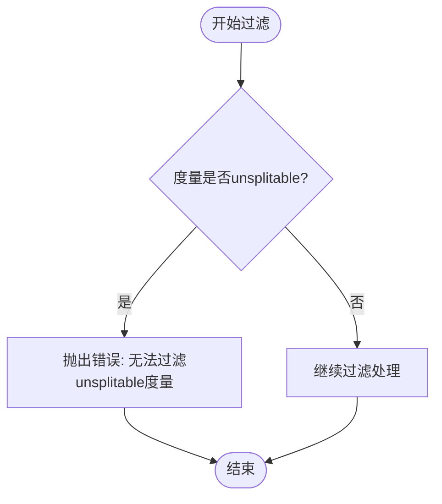

**Diagram sources **
- [druidFilterBuilder.ts](file://src/external/utils/druidFilterBuilder.ts#L258-L263)

### 时间过滤配置
当没有设置`allowEternity`标志且没有时间过滤时，会抛出错误。

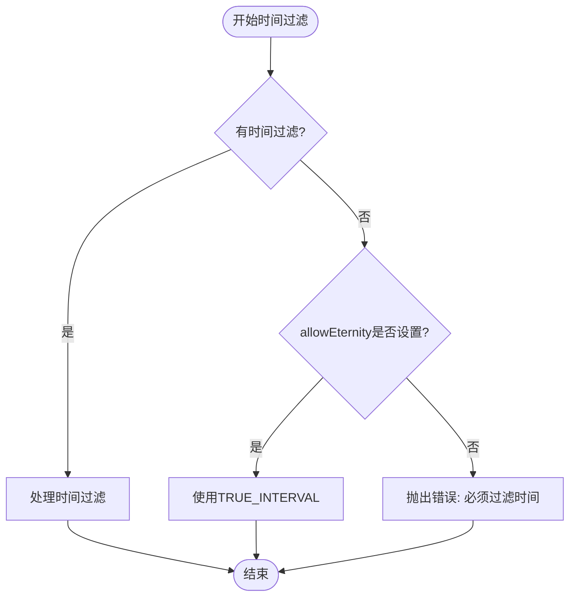

**Diagram sources **
- [druidFilterBuilder.ts](file://src/external/utils/druidFilterBuilder.ts#L100-L103)

**Section sources**
- [druidFilterBuilder.ts](file://src/external/utils/druidFilterBuilder.ts#L93-L120)
- [druidFilterBuilder.ts](file://src/external/utils/druidFilterBuilder.ts#L258-L263)