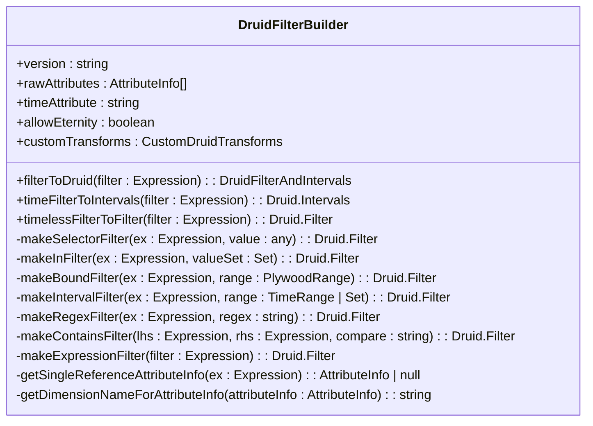
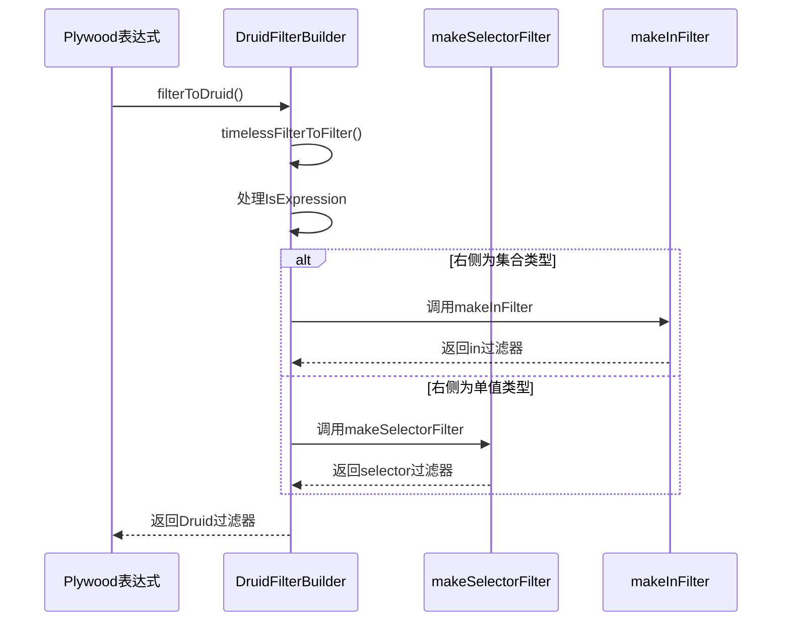
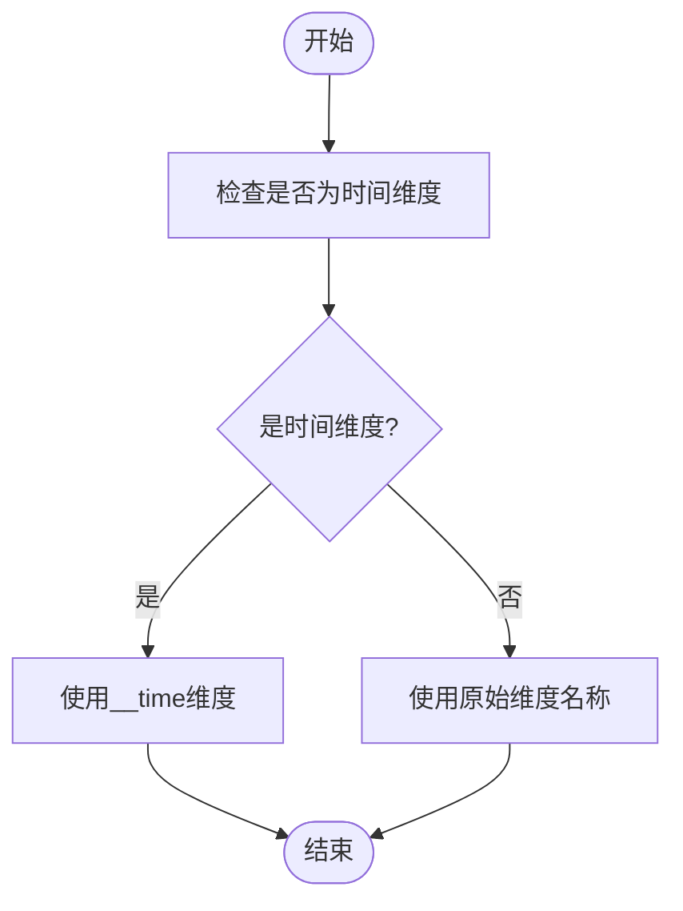
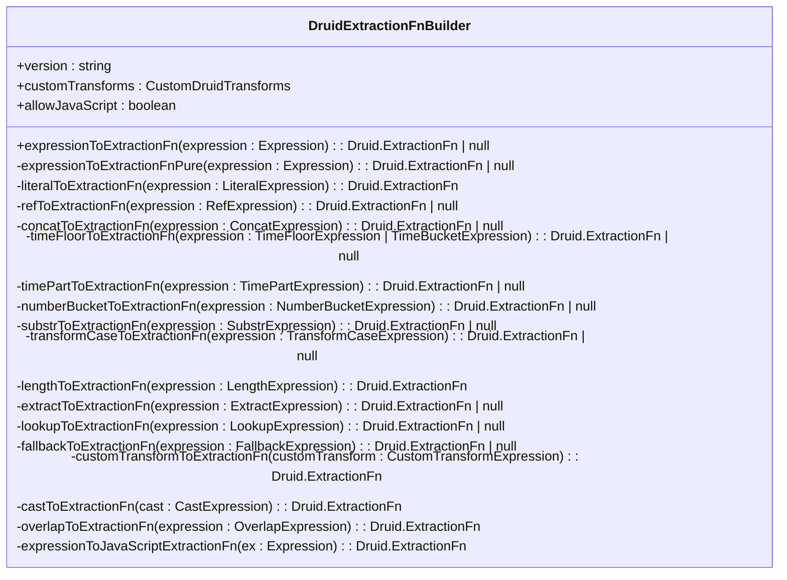
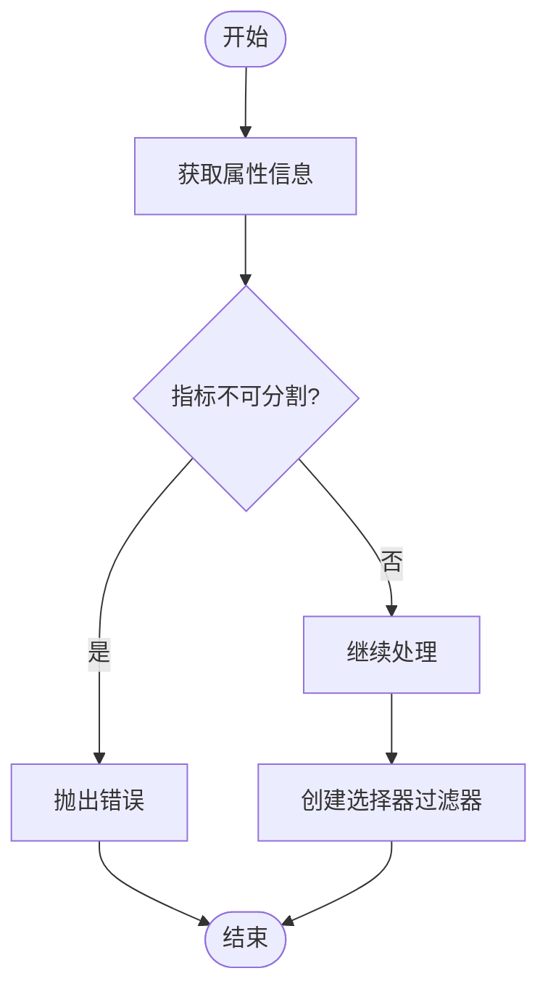
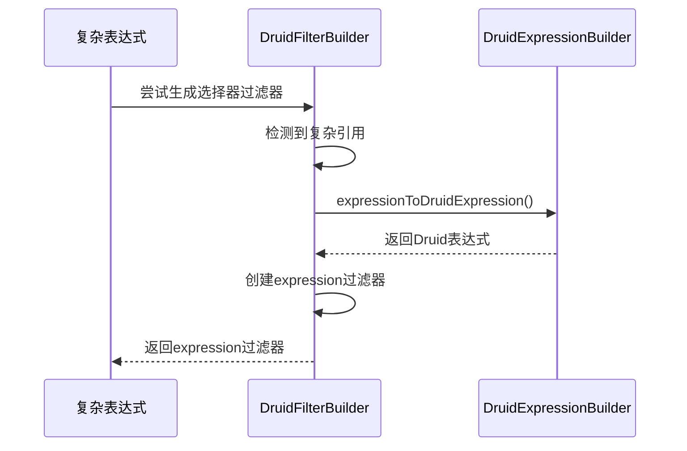
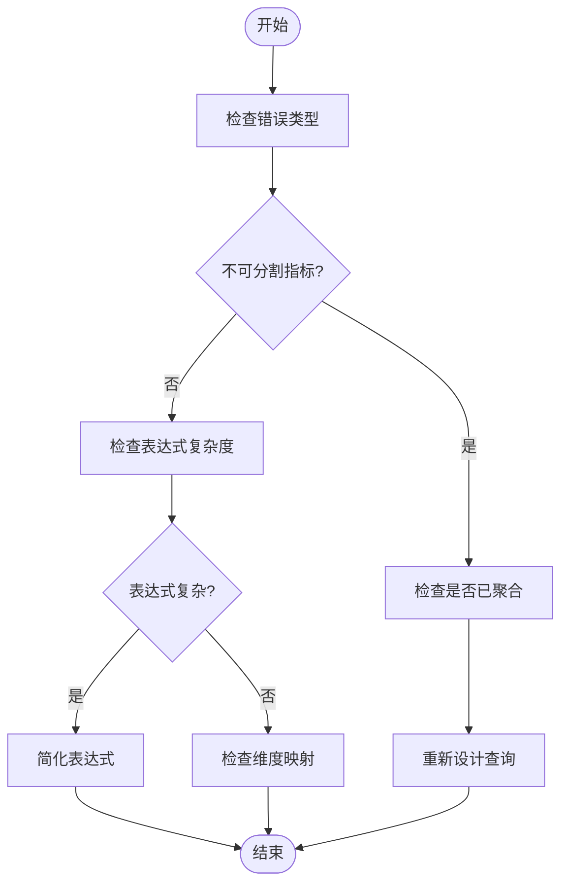

# 选择器过滤器

<cite>
**本文档中引用的文件**  
- [druidFilterBuilder.ts](file://src/external/utils/druidFilterBuilder.ts)
- [isExpression.ts](file://src/expressions/isExpression.ts)
- [druidDialect.ts](file://src/dialect/druidDialect.ts)
- [druidExternal.ts](file://src/external/druidExternal.ts)
</cite>

## 目录
1. [引言](#引言)
2. [选择器过滤器实现机制](#选择器过滤器实现机制)
3. [等值比较表达式转换](#等值比较表达式转换)
4. [维度名称映射](#维度名称映射)
5. [提取函数应用](#提取函数应用)
6. [不可分割指标处理](#不可分割指标处理)
7. [复杂引用降级处理](#复杂引用降级处理)
8. [性能优化建议](#性能优化建议)
9. [常见错误排查](#常见错误排查)

## 引言
选择器过滤器是Plywood与Druid集成中的关键组件，负责将Plywood表达式转换为Druid查询过滤器。该机制通过druidFilterBuilder实现，支持多种过滤器类型，包括选择器、区间、正则表达式等。选择器过滤器在数据查询过程中起到精确筛选数据的作用，其性能直接影响查询效率。

**选择器过滤器**的核心功能是将Plywood中的布尔表达式转换为Druid原生过滤器结构，同时处理时间维度、维度映射和提取函数等复杂场景。该转换过程需要考虑Druid的查询限制和数据模型特性。

## 选择器过滤器实现机制
选择器过滤器的实现基于DruidFilterBuilder类，该类负责将Plywood表达式转换为Druid过滤器。转换过程分为时间过滤器和非时间过滤器两部分处理。

**图源**  
- [druidFilterBuilder.ts](file://src/external/utils/druidFilterBuilder.ts#L54-L489)

**本节来源**  
- [druidFilterBuilder.ts](file://src/external/utils/druidFilterBuilder.ts#L54-L489)

## 等值比较表达式转换
等值比较表达式通过IsExpression类实现，该类处理Plywood中的等值比较操作。转换过程首先检查表达式类型，然后根据右侧表达式的类型决定生成何种过滤器。

**图源**  
- [druidFilterBuilder.ts](file://src/external/utils/druidFilterBuilder.ts#L122-L205)
- [isExpression.ts](file://src/expressions/isExpression.ts#L26-L133)

**本节来源**  
- [druidFilterBuilder.ts](file://src/external/utils/druidFilterBuilder.ts#L122-L205)
- [isExpression.ts](file://src/expressions/isExpression.ts#L26-L133)

## 维度名称映射
维度名称映射通过getDimensionNameForAttributeInfo方法实现，该方法处理时间维度的特殊映射。当维度名称与时间属性匹配时，将其映射为Druid的__time维度。

**图源**  
- [druidFilterBuilder.ts](file://src/external/utils/druidFilterBuilder.ts#L473-L475)

**本节来源**  
- [druidFilterBuilder.ts](file://src/external/utils/druidFilterBuilder.ts#L473-L475)

## 提取函数应用
提取函数通过DruidExtractionFnBuilder类应用，该类将Plywood表达式转换为Druid提取函数。提取函数用于在过滤前对维度值进行转换，支持时间格式化、字符串处理等操作。

**图源**  
- [druidExtractionFnBuilder.ts](file://src/external/utils/druidExtractionFnBuilder.ts#L49-L503)

**本节来源**  
- [druidExtractionFnBuilder.ts](file://src/external/utils/druidExtractionFnBuilder.ts#L49-L503)

## 不可分割指标处理
不可分割指标的处理在makeSelectorFilter方法中实现，当指标被标记为unsplitable时，系统会抛出错误。这种处理方式防止对已聚合的指标进行过滤操作。

**图源**  
- [druidFilterBuilder.ts](file://src/external/utils/druidFilterBuilder.ts#L239-L270)

**本节来源**  
- [druidFilterBuilder.ts](file://src/external/utils/druidFilterBuilder.ts#L239-L270)

## 复杂引用降级处理
当表达式涉及复杂引用时，系统会降级使用expression filter。这种降级处理通过makeExpressionFilter方法实现，将Plywood表达式转换为Druid表达式过滤器。

**图源**  
- [druidFilterBuilder.ts](file://src/external/utils/druidFilterBuilder.ts#L454-L464)
- [druidExpressionBuilder.ts](file://src/external/utils/druidExpressionBuilder.ts#L69-L445)

**本节来源**  
- [druidFilterBuilder.ts](file://src/external/utils/druidFilterBuilder.ts#L454-L464)
- [druidExpressionBuilder.ts](file://src/external/utils/druidExpressionBuilder.ts#L69-L445)

## 性能优化建议
选择器过滤器的性能优化主要集中在减少expression filter的使用。应尽量使用简单的维度引用和等值比较，避免复杂的表达式组合。对于时间维度，应优先使用时间区间过滤而非表达式过滤。

| 优化策略 | 说明 | 适用场景 |
|--------|------|--------|
| 避免复杂表达式 | 使用简单维度引用而非复杂表达式 | 所有过滤场景 |
| 优先使用选择器 | 选择器过滤器性能优于表达式过滤器 | 等值比较 |
| 合理使用提取函数 | 减少不必要的提取函数嵌套 | 字符串处理 |
| 时间维度优化 | 使用时间区间而非表达式 | 时间过滤 |
| 避免JavaScript | JavaScript过滤器性能较差 | 复杂逻辑 |

**本节来源**  
- [druidFilterBuilder.ts](file://src/external/utils/druidFilterBuilder.ts#L54-L489)
- [druidExternal.ts](file://src/external/druidExternal.ts#L1322-L1720)

## 常见错误排查
常见错误主要包括不可分割指标过滤、复杂表达式转换失败等。错误排查应首先检查指标的unsplitable属性，然后验证表达式的复杂度。

**图源**  
- [druidFilterBuilder.ts](file://src/external/utils/druidFilterBuilder.ts#L239-L270)
- [druidExternal.ts](file://src/external/druidExternal.ts#L1322-L1720)

**本节来源**  
- [druidFilterBuilder.ts](file://src/external/utils/druidFilterBuilder.ts#L239-L270)
- [druidExternal.ts](file://src/external/druidExternal.ts#L1322-L1720)