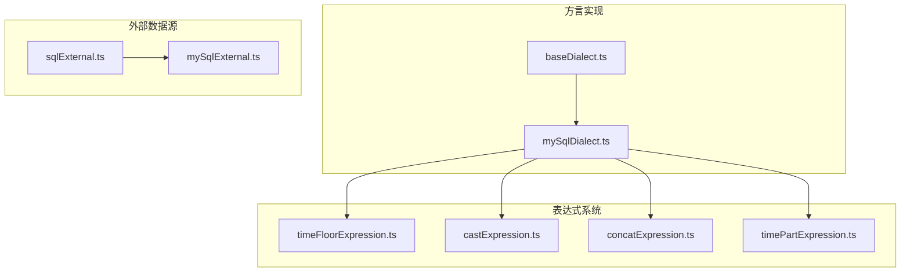
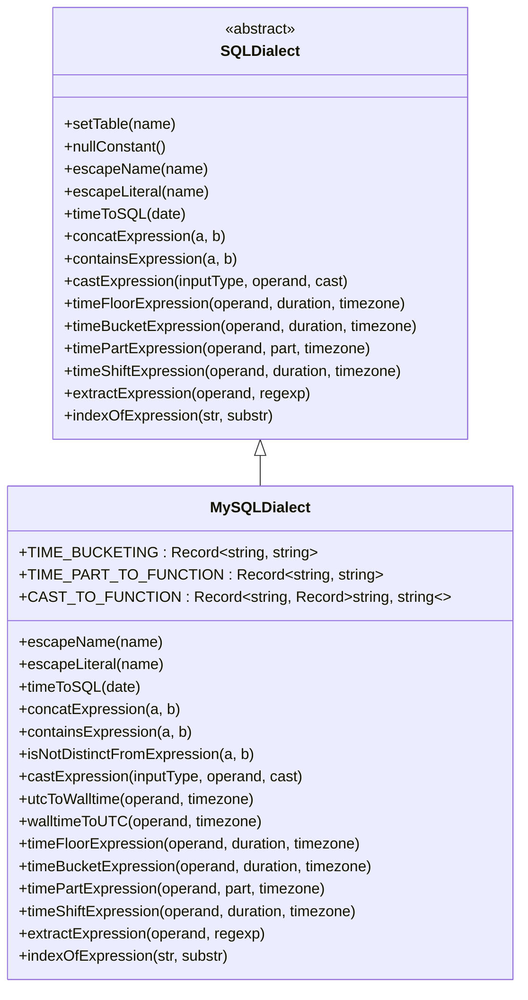
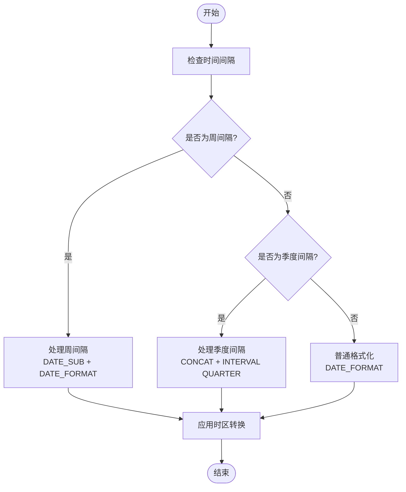
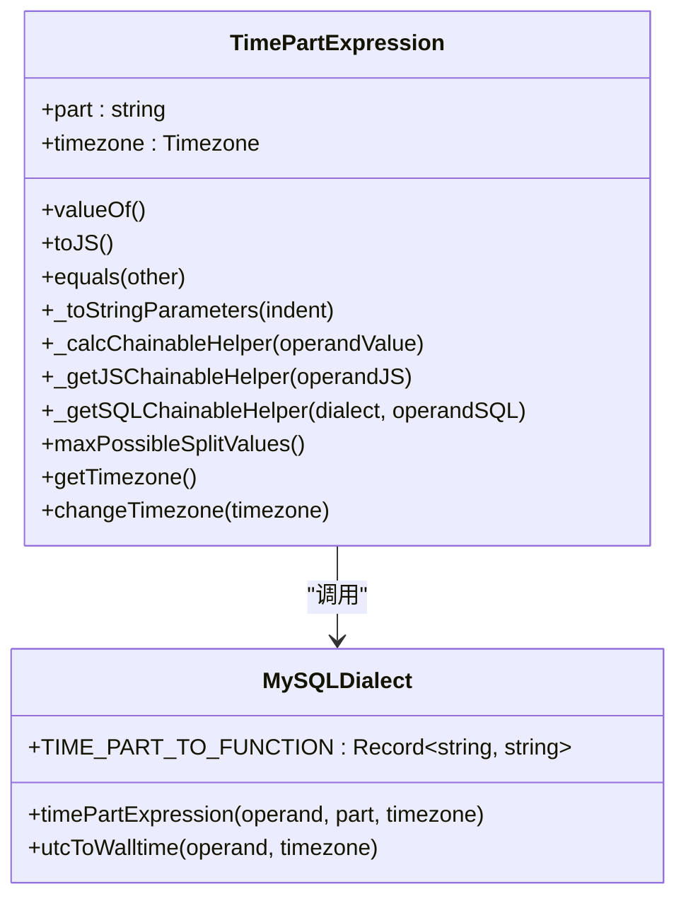
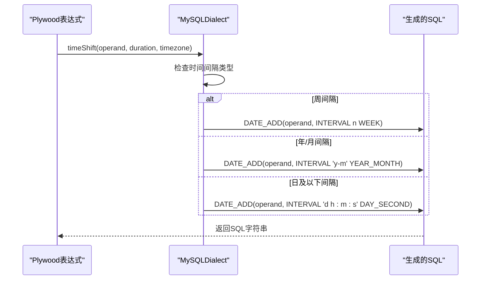
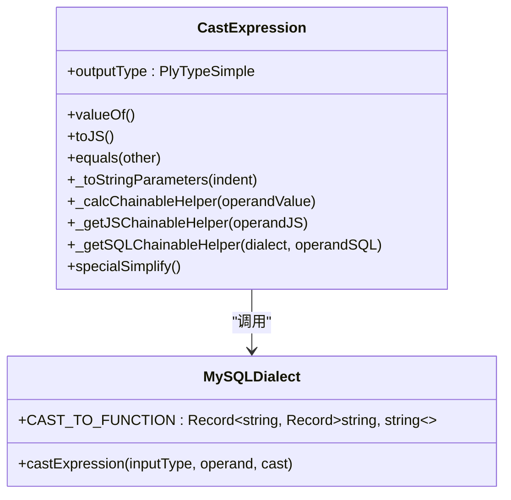
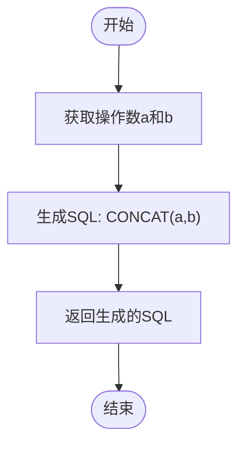
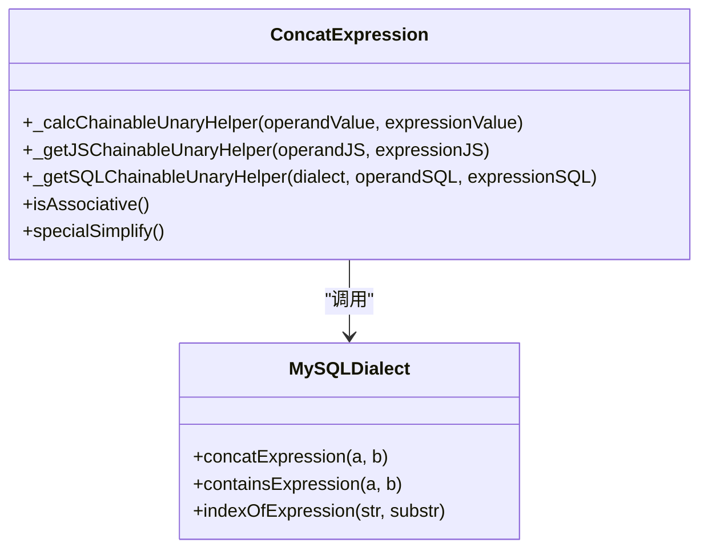
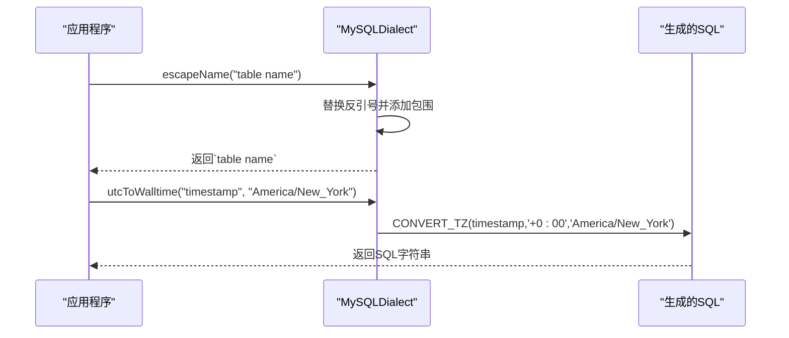
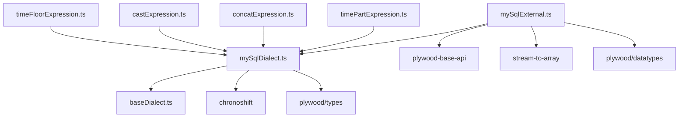

# MySQL查询方言

<cite>
**本文档引用的文件**   
- [mySqlDialect.ts](file://src/dialect/mySqlDialect.ts)
- [baseDialect.ts](file://src/dialect/baseDialect.ts)
- [timeFloorExpression.ts](file://src/expressions/timeFloorExpression.ts)
- [castExpression.ts](file://src/expressions/castExpression.ts)
- [concatExpression.ts](file://src/expressions/concatExpression.ts)
- [timePartExpression.ts](file://src/expressions/timePartExpression.ts)
- [mySqlExternal.ts](file://src/external/mySqlExternal.ts)
</cite>

## 目录
1. [简介](#简介)
2. [项目结构](#项目结构)
3. [核心组件](#核心组件)
4. [架构概述](#架构概述)
5. [详细组件分析](#详细组件分析)
6. [依赖分析](#依赖分析)
7. [性能考虑](#性能考虑)
8. [故障排除指南](#故障排除指南)
9. [结论](#结论)
10. [附录](#附录) (如有必要)

## 简介
本文档全面介绍了Plywood中MySQL查询方言的实现细节，重点阐述了Plywood表达式到MySQL SQL语句的转换机制。文档详细描述了SELECT、WHERE、GROUP BY、HAVING等SQL子句的生成逻辑，以及MySQL特有函数和数据类型的处理方式。通过实际示例展示了算术运算、字符串操作、时间函数等在MySQL中的具体实现。文档还包含了MySQL版本兼容性说明、性能优化建议以及与标准SQL的差异处理。

## 项目结构
Plywood项目的MySQL查询方言实现主要位于`src/dialect/`目录下，核心文件为`mySqlDialect.ts`。该文件继承自`baseDialect.ts`中的`SQLDialect`抽象类，实现了MySQL特定的SQL生成逻辑。相关的外部数据源处理逻辑位于`src/external/`目录下的`mySqlExternal.ts`文件中。

**图表来源**
- [mySqlDialect.ts](file://src/dialect/mySqlDialect.ts#L1-L20)
- [baseDialect.ts](file://src/dialect/baseDialect.ts#L1-L20)
- [mySqlExternal.ts](file://src/external/mySqlExternal.ts#L1-L20)

**章节来源**
- [mySqlDialect.ts](file://src/dialect/mySqlDialect.ts#L1-L50)
- [project_structure](file://PROJECT_STRUCTURE.md#L1-L10)

## 核心组件
MySQL查询方言的核心组件包括时间处理、类型转换、字符串操作等功能。`mySqlDialect.ts`文件中的`MySQLDialect`类实现了这些功能，通过重写`SQLDialect`基类中的抽象方法来提供MySQL特定的SQL生成逻辑。该类处理了时间取整、时间分桶、时间部分提取、时区转换等复杂的时间操作，以及数值、字符串和时间类型之间的转换。

**章节来源**
- [mySqlDialect.ts](file://src/dialect/mySqlDialect.ts#L21-L50)
- [baseDialect.ts](file://src/dialect/baseDialect.ts#L1-L20)

## 架构概述
MySQL查询方言的架构基于继承模式，`MySQLDialect`类继承自`SQLDialect`抽象基类。这种设计模式允许Plywood系统支持多种数据库方言，同时保持核心查询逻辑的一致性。当Plywood表达式需要转换为SQL语句时，系统会根据配置选择相应的方言实现，然后调用相应的方法生成符合目标数据库语法的SQL语句。

**图表来源**
- [mySqlDialect.ts](file://src/dialect/mySqlDialect.ts#L21-L172)
- [baseDialect.ts](file://src/dialect/baseDialect.ts#L1-L20)

## 详细组件分析

### 时间处理组件分析
MySQL方言中的时间处理组件提供了丰富的时间操作功能，包括时间取整、时间分桶、时间部分提取和时间偏移等。这些功能通过`timeFloorExpression`、`timeBucketExpression`、`timePartExpression`和`timeShiftExpression`等方法实现。

#### 时间取整和分桶
时间取整和分桶功能在MySQL方言中通过`timeFloorExpression`方法实现。该方法首先检查特殊的时间间隔（如周和季度），然后使用`DATE_FORMAT`和`DATE_SUB`函数进行格式化处理。对于周间隔，需要先减去星期几减1的天数，以确保取整到周一。对于季度间隔，则需要使用`QUARTER`函数计算当前季度，然后添加相应的季度间隔。

**图表来源**
- [mySqlDialect.ts](file://src/dialect/mySqlDialect.ts#L123-L135)
- [timeFloorExpression.ts](file://src/expressions/timeFloorExpression.ts#L1-L20)

#### 时间部分提取
时间部分提取功能通过`timePartExpression`方法实现，该方法使用`TIME_PART_TO_FUNCTION`静态映射表来查找对应的时间部分函数。支持的时间部分包括秒、分钟、小时、天、周、月和年等。对于每个时间部分，都有相应的MySQL函数表达式，如`SECOND($$)`、`MINUTE($$)`、`HOUR($$)`等。

**图表来源**
- [mySqlDialect.ts](file://src/dialect/mySqlDialect.ts#L141-L145)
- [timePartExpression.ts](file://src/expressions/timePartExpression.ts#L1-L20)

#### 时间偏移
时间偏移功能通过`timeShiftExpression`方法实现，该方法使用`DATE_ADD`函数来增加指定的时间间隔。根据时间间隔的不同（周、年/月、日/小时/分钟/秒），生成不同的INTERVAL表达式。对于周间隔，直接使用WEEK单位；对于年和月间隔，使用YEAR_MONTH复合单位；对于日及以下的间隔，使用DAY_SECOND复合单位。

**图表来源**
- [mySqlDialect.ts](file://src/dialect/mySqlDialect.ts#L147-L163)
- [timeShiftExpression.ts](file://src/expressions/timeShiftExpression.ts#L1-L20)

### 类型转换组件分析
类型转换组件通过`castExpression`方法实现，该方法使用`CAST_TO_FUNCTION`静态映射表来查找对应的类型转换函数。支持的类型转换包括时间、数值和字符串之间的相互转换。

#### 类型转换映射
`CAST_TO_FUNCTION`静态映射表定义了不同类型之间的转换规则：
- 时间到数值：`UNIX_TIMESTAMP($$) * 1000`
- 数值到时间：`FROM_UNIXTIME($$ / 1000)`
- 字符串到数值：`CAST($$ AS SIGNED)`
- 数值到字符串：`CAST($$ AS CHAR)`

**图表来源**
- [mySqlDialect.ts](file://src/dialect/mySqlDialect.ts#L107-L111)
- [castExpression.ts](file://src/expressions/castExpression.ts#L1-L20)

### 字符串操作组件分析
字符串操作组件提供了字符串连接、包含检查、索引查找等常用字符串操作功能。

#### 字符串连接
字符串连接功能通过`concatExpression`方法实现，该方法使用MySQL的`CONCAT`函数来连接两个字符串。与某些数据库使用`||`操作符不同，MySQL使用`CONCAT`函数进行字符串连接。

**图表来源**
- [mySqlDialect.ts](file://src/dialect/mySqlDialect.ts#L95-L97)
- [concatExpression.ts](file://src/expressions/concatExpression.ts#L1-L20)

#### 字符串包含检查
字符串包含检查功能通过`containsExpression`方法实现，该方法使用`LOCATE`函数来检查一个字符串是否包含另一个字符串。`LOCATE`函数返回子字符串在主字符串中的位置，如果返回值大于0，则表示包含。

#### 字符串索引查找
字符串索引查找功能通过`indexOfExpression`方法实现，该方法同样使用`LOCATE`函数，但需要减去1以符合从0开始的索引约定。

**图表来源**
- [mySqlDialect.ts](file://src/dialect/mySqlDialect.ts#L95-L111)
- [concatExpression.ts](file://src/expressions/concatExpression.ts#L1-L20)

### 其他功能组件
除了上述主要功能外，MySQL方言还实现了其他一些实用功能。

#### 名称转义
名称转义功能通过`escapeName`方法实现，该方法使用反引号(`)来转义MySQL中的标识符名称。这与标准SQL使用双引号(")不同，是MySQL特有的标识符引用方式。

#### 文字转义
文字转义功能通过`escapeLiteral`方法实现，该方法使用`JSON.stringify`来转义字符串文字，并处理null值的特殊情况。

#### 时区转换
时区转换功能通过`utcToWalltime`和`walltimeToUTC`方法实现，这两个方法使用MySQL的`CONVERT_TZ`函数来进行时区转换。`CONVERT_TZ`函数需要指定源时区和目标时区，对于UTC时区使用'+0:00'表示。

**图表来源**
- [mySqlDialect.ts](file://src/dialect/mySqlDialect.ts#L85-L105)
- [baseDialect.ts](file://src/dialect/baseDialect.ts#L1-L20)

**章节来源**
- [mySqlDialect.ts](file://src/dialect/mySqlDialect.ts#L85-L172)
- [baseDialect.ts](file://src/dialect/baseDialect.ts#L1-L20)

## 依赖分析
MySQL查询方言的实现依赖于多个核心组件和外部库。主要依赖关系如下：

**图表来源**
- [mySqlDialect.ts](file://src/dialect/mySqlDialect.ts#L1-L20)
- [mySqlExternal.ts](file://src/external/mySqlExternal.ts#L1-L20)
- [package.json](file://package.json#L1-L20)

**章节来源**
- [mySqlDialect.ts](file://src/dialect/mySqlDialect.ts#L1-L20)
- [mySqlExternal.ts](file://src/external/mySqlExternal.ts#L1-L20)

## 性能考虑
在使用MySQL查询方言时，需要注意以下性能考虑：

1. **时间函数性能**：MySQL的时间函数如`DATE_FORMAT`、`CONVERT_TZ`等可能会对性能产生影响，特别是在处理大量数据时。建议在可能的情况下，尽量在应用程序层面处理时间格式化和时区转换。

2. **字符串操作性能**：`CONCAT`函数和`LOCATE`函数在处理长字符串时可能会比较慢。如果需要频繁进行字符串操作，考虑使用全文索引或其他优化技术。

3. **类型转换开销**：频繁的类型转换（如`CAST`函数）会产生额外的计算开销。建议在数据模型设计时尽量保持数据类型的统一，减少运行时的类型转换。

4. **索引使用**：确保在经常用于查询条件的列上创建适当的索引，特别是时间列和用于连接的列。

5. **查询优化**：利用MySQL的查询优化器特性，如查询缓存、执行计划优化等，来提高查询性能。

## 故障排除指南
在使用MySQL查询方言时，可能会遇到以下常见问题：

1. **时间间隔不支持**：如果遇到"unsupported duration"错误，检查`TIME_BUCKETING`映射表中是否包含所需的时间间隔。目前支持的时间间隔包括秒(PT1S)、分钟(PT1M)、小时(PT1H)、天(P1D)、周(P1W)、月(P1M)、季度(P3M)和年(P1Y)。

2. **类型转换错误**：如果遇到"unsupported cast"错误，检查`CAST_TO_FUNCTION`映射表中是否包含所需的类型转换组合。目前支持的时间、数值和字符串之间的相互转换。

3. **时区转换问题**：如果时区转换结果不正确，检查时区名称是否正确，并确保MySQL服务器的时区表已正确配置。

4. **SQL语法错误**：如果生成的SQL语句有语法错误，检查`escapeName`和`escapeLiteral`方法是否正确处理了特殊字符。

5. **性能问题**：如果查询性能不佳，检查是否可以优化时间函数的使用，或者是否需要添加适当的索引。

**章节来源**
- [mySqlDialect.ts](file://src/dialect/mySqlDialect.ts#L1-L20)
- [mySqlExternal.ts](file://src/external/mySqlExternal.ts#L1-L20)

## 结论
MySQL查询方言为Plywood系统提供了完整的MySQL数据库支持，通过继承`SQLDialect`基类并实现MySQL特定的方法，实现了从Plywood表达式到MySQL SQL语句的高效转换。该实现充分利用了MySQL特有的函数和语法特性，如`CONCAT`函数、`LOCATE`函数、`CONVERT_TZ`函数等，同时保持了与其他数据库方言的一致性接口。通过合理使用这些功能，可以构建高效、可靠的MySQL查询。

## 附录

### MySQL版本兼容性
MySQL查询方言主要针对MySQL 5.5及以上版本设计，利用了该版本引入的一些时间函数特性。对于更早的MySQL版本，某些功能可能无法正常工作。

### 与标准SQL的差异
1. **标识符引用**：MySQL使用反引号(`)而不是双引号(")来引用标识符。
2. **字符串连接**：MySQL使用`CONCAT`函数而不是`||`操作符进行字符串连接。
3. **时间函数**：MySQL提供了独特的`DATE_FORMAT`、`CONVERT_TZ`等时间函数。
4. **NULL安全比较**：MySQL使用`<=>`操作符进行NULL安全比较。

### 未来改进方向
1. 实现`extractExpression`方法，支持正则表达式提取功能。
2. 完善`WEEK_OF_MONTH`时间部分的支持。
3. 添加对MySQL 8.0新特性的支持，如窗口函数等。
4. 优化时间函数的性能，减少不必要的计算。