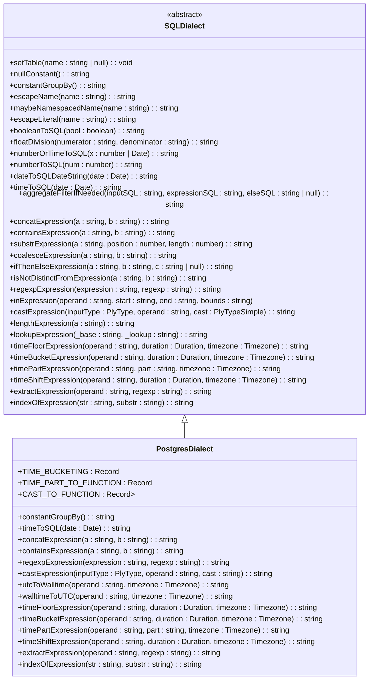
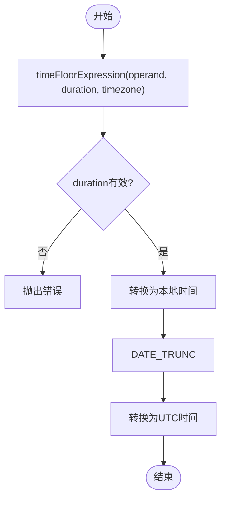
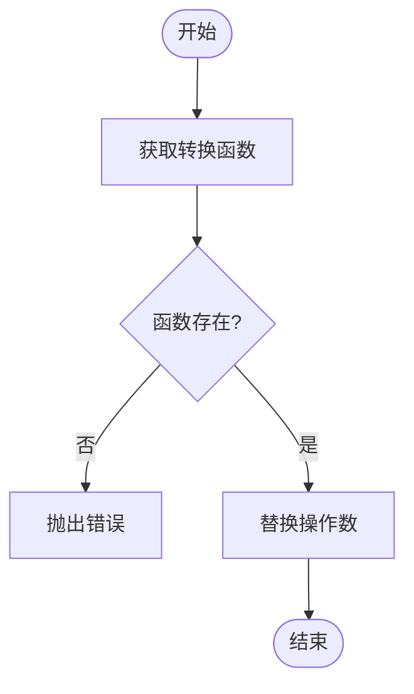
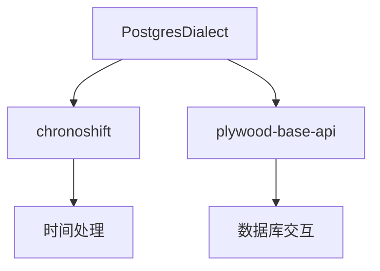

# PostgreSQL查询方言

<cite>
**本文档引用的文件**
- [postgresDialect.ts](file://src/dialect/postgresDialect.ts)
- [baseDialect.ts](file://src/dialect/baseDialect.ts)
- [postgresExternal.ts](file://src/external/postgresExternal.ts)
</cite>

## 目录
1. [简介](#简介)
2. [核心组件](#核心组件)
3. [架构概述](#架构概述)
4. [详细组件分析](#详细组件分析)
5. [依赖分析](#依赖分析)
6. [性能考虑](#性能考虑)
7. [故障排除指南](#故障排除指南)
8. [结论](#结论)

## 简介
PostgreSQL查询方言是Plywood库中的一个重要组成部分，负责将Plywood表达式转换为PostgreSQL SQL语句。该文档深入解析了`postgresDialect.ts`的实现原理，重点说明了Plywood表达式到PostgreSQL SQL语句的转换策略。

## 核心组件

PostgreSQL查询方言的核心组件包括`PostgresDialect`类和`PostgresExternal`类。`PostgresDialect`类继承自`SQLDialect`类，实现了PostgreSQL特定的SQL生成逻辑。`PostgresExternal`类则负责与PostgreSQL数据库的交互。

**Section sources**
- [postgresDialect.ts](file://src/dialect/postgresDialect.ts#L20-L158)
- [postgresExternal.ts](file://src/external/postgresExternal.ts#L31-L136)

## 架构概述

PostgreSQL查询方言的架构基于继承和多态的设计模式。`PostgresDialect`类继承自`SQLDialect`类，重写了基类中的抽象方法，以实现PostgreSQL特定的SQL生成逻辑。

**Diagram sources**
- [baseDialect.ts](file://src/dialect/baseDialect.ts#L20-L174)
- [postgresDialect.ts](file://src/dialect/postgresDialect.ts#L20-L158)

## 详细组件分析

### PostgresDialect分析

`PostgresDialect`类是PostgreSQL查询方言的核心，负责生成PostgreSQL特定的SQL语句。它通过重写基类中的抽象方法，实现了PostgreSQL特定的SQL生成逻辑。

#### 时间处理
`PostgresDialect`类提供了丰富的时间处理功能，包括时间截断、时间桶、时间部分提取等。这些功能通过`timeFloorExpression`、`timeBucketExpression`和`timePartExpression`方法实现。

**Diagram sources**
- [postgresDialect.ts](file://src/dialect/postgresDialect.ts#L100-L124)

#### 类型转换
`PostgresDialect`类通过`castExpression`方法实现了类型转换功能。该方法根据输入类型和目标类型，选择合适的转换函数。

**Diagram sources**
- [postgresDialect.ts](file://src/dialect/postgresDialect.ts#L96-L100)

**Section sources**
- [postgresDialect.ts](file://src/dialect/postgresDialect.ts#L20-L158)

## 依赖分析

PostgreSQL查询方言依赖于`chronoshift`库来处理时间相关的操作，依赖于`plywood-base-api`库来与PostgreSQL数据库进行交互。

**Diagram sources**
- [postgresDialect.ts](file://src/dialect/postgresDialect.ts#L1-L10)
- [postgresExternal.ts](file://src/external/postgresExternal.ts#L1-L10)

**Section sources**
- [package.json](file://package.json#L1-L10)

## 性能考虑

PostgreSQL查询方言在设计时考虑了性能因素。例如，`timeFloorExpression`方法通过`DATE_TRUNC`函数实现了高效的时间截断操作。`castExpression`方法通过预定义的转换函数表，避免了运行时的字符串拼接操作。

## 故障排除指南

在使用PostgreSQL查询方言时，可能会遇到一些常见问题。例如，时间处理函数不支持某些时间间隔，类型转换函数不支持某些类型转换等。这些问题通常可以通过检查输入参数的有效性来解决。

**Section sources**
- [postgresDialect.ts](file://src/dialect/postgresDialect.ts#L100-L124)
- [postgresDialect.ts](file://src/dialect/postgresDialect.ts#L96-L100)

## 结论

PostgreSQL查询方言是Plywood库中的一个重要组成部分，它通过继承和多态的设计模式，实现了PostgreSQL特定的SQL生成逻辑。该文档详细解析了`PostgresDialect`类的实现原理，重点说明了Plywood表达式到PostgreSQL SQL语句的转换策略。