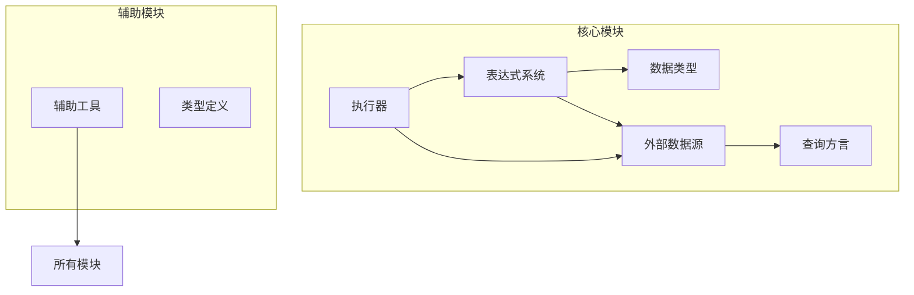
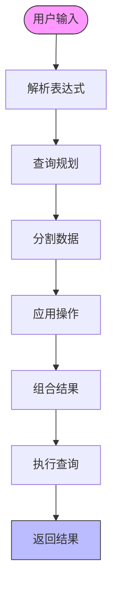
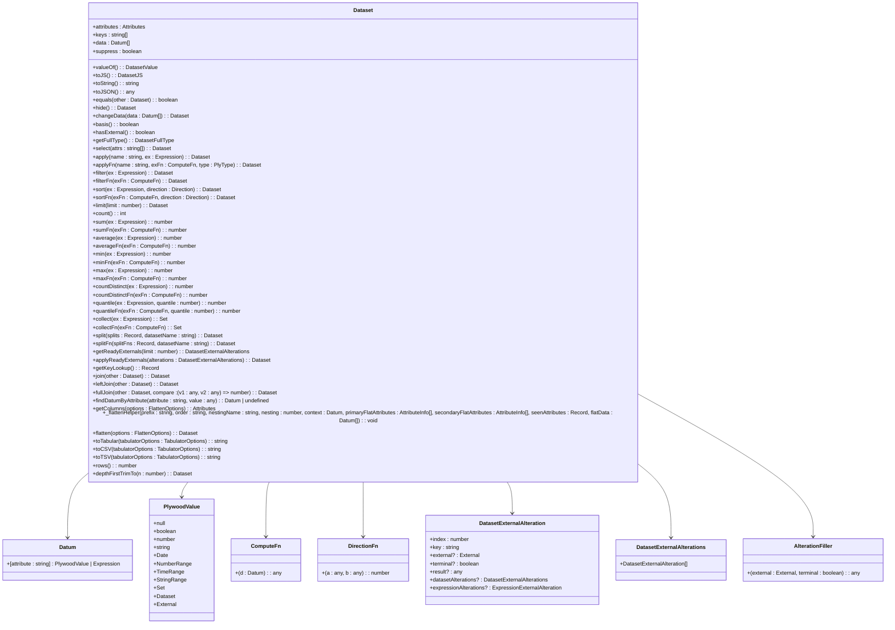
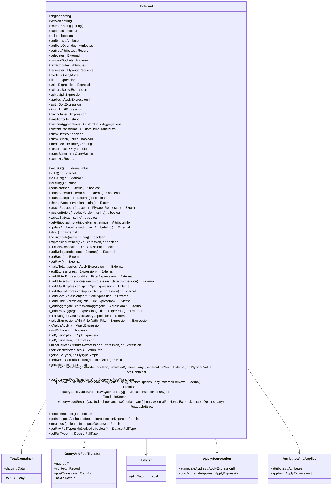
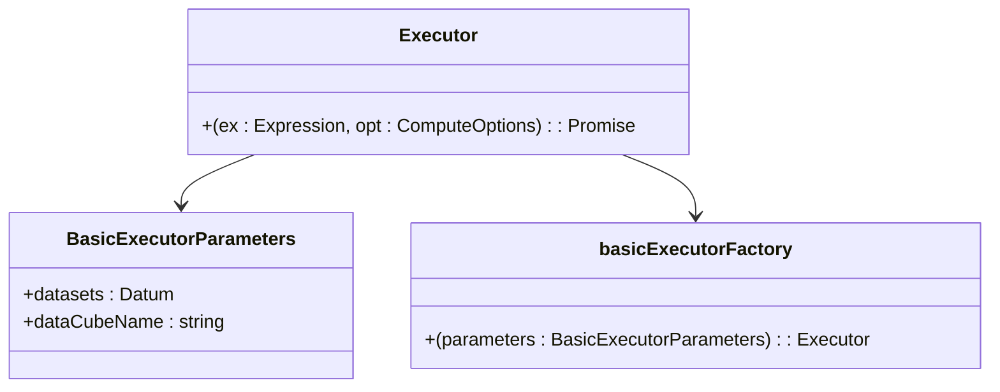
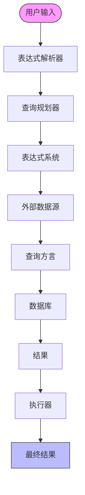

# 核心架构

<cite>
**本文档中引用的文件**   
- [baseExpression.ts](file://src/expressions/baseExpression.ts)
- [dataset.ts](file://src/datatypes/dataset.ts)
- [baseExternal.ts](file://src/external/baseExternal.ts)
- [baseDialect.ts](file://src/dialect/baseDialect.ts)
- [basicExecutor.ts](file://src/executor/basicExecutor.ts)
- [index.ts](file://src/index.ts)
</cite>

## 目录
1. [简介](#简介)
2. [项目结构](#项目结构)
3. [核心组件](#核心组件)
4. [Split-Apply-Combine模式](#split-apply-combine模式)
5. [表达式系统](#表达式系统)
6. [数据类型](#数据类型)
7. [外部数据源](#外部数据源)
8. [查询方言](#查询方言)
9. [执行器](#执行器)
10. [系统架构](#系统架构)
11. [技术决策](#技术决策)
12. [结论](#结论)

## 简介
Plywood是一个用于查询规划和执行的库，其核心设计理念是Split-Apply-Combine模式。该模式贯穿整个系统，使得复杂的数据分析操作能够被分解为可管理的步骤。本文档旨在为开发者提供一个清晰的系统全景图，以便理解代码库的组织方式和各组件之间的交互关系。

## 项目结构
Plywood的项目结构清晰地反映了其模块化设计。主要组件包括表达式系统、数据类型、外部数据源、查询方言和执行器。每个组件都有其特定的职责，并通过明确定义的接口与其他组件交互。

**Diagram sources**
- [src/index.ts](file://src/index.ts#L1-L27)

**Section sources**
- [src/index.ts](file://src/index.ts#L1-L27)

## 核心组件
Plywood的核心组件包括表达式系统、数据类型、外部数据源、查询方言和执行器。这些组件共同构成了一个强大的查询规划和执行框架。

**Section sources**
- [src/index.ts](file://src/index.ts#L1-L27)

## Split-Apply-Combine模式
Split-Apply-Combine模式是Plywood的核心设计理念。该模式将数据分析过程分解为三个步骤：分割（Split）、应用（Apply）和组合（Combine）。这种模式使得复杂的数据分析操作能够被分解为可管理的步骤。

**Diagram sources**
- [baseExpression.ts](file://src/expressions/baseExpression.ts#L0-L799)
- [dataset.ts](file://src/datatypes/dataset.ts#L0-L799)

**Section sources**
- [baseExpression.ts](file://src/expressions/baseExpression.ts#L0-L799)
- [dataset.ts](file://src/datatypes/dataset.ts#L0-L799)

## 表达式系统
表达式系统是Plywood的骨干，提供了表达算术运算、聚合和数据库操作的方式。表达式可以是JSON格式，也可以通过提供的操作符组合而成。

```mermaid
classDiagram
class Expression {
+op : string
+type : PlyType
+simple : boolean
+options : Record<string, any>
+equals(other : Expression) : boolean
+canHaveType(wantedType : string) : boolean
+expressionCount() : int
+isOp(op : string) : boolean
+containsOp(op : string) : boolean
+hasExternal() : boolean
+getBaseExternals() : External[]
+getRawExternals() : External[]
+getReadyExternals(limit : number) : ExpressionExternalAlteration
+applyReadyExternals(alterations : ExpressionExternalAlteration) : Expression
+getFreeReferences() : string[]
+getFreeReferenceIndexes() : number[]
+incrementNesting(by : int) : Expression
+simplify() : Expression
+every(iter : BooleanExpressionIterator, thisArg : any) : boolean
+some(iter : BooleanExpressionIterator, thisArg : any) : boolean
+forEach(iter : VoidExpressionIterator, thisArg : any) : void
+substitute(substitutionFn : SubstitutionFn, typeContext : DatasetFullType) : Expression
+getFn() : ComputeFn
+fullyDefined() : boolean
+calc(datum : Datum) : PlywoodValue
+getJS(datumVar : string) : string
+getJSFn(datumVar : string) : string
+getSQL(dialect : SQLDialect) : string
+extractFromAnd(matchFn : ExpressionMatchFn) : ExtractAndRest
+breakdownByDataset(tempNamePrefix : string) : DatasetBreakdown
+getLiteralValue() : any
+upgradeToType(targetType : PlyType) : Expression
+performAction(action : Expression) : Expression
+performActions(actions : Expression[]) : Expression
+getOptions() : Record<string, any>
+setOptions(options : Record<string, any>) : this
+setOption(optionKey : string, optionValue : any) : this
}
class ChainableExpression {
+operand : Expression
+expression : Expression
+argumentsResolved() : boolean
+argumentsResolvedWithoutExternals() : boolean
+getHeadOperand() : Expression
+_headExternal() : any
}
class ChainableUnaryExpression {
+operand : Expression
+expression : Expression
+argumentsResolved() : boolean
+argumentsResolvedWithoutExternals() : boolean
+getHeadOperand() : Expression
+_headExternal() : any
}
Expression <|-- ChainableExpression
Expression <|-- ChainableUnaryExpression
ChainableExpression <|-- FilterExpression
ChainableExpression <|-- SelectExpression
ChainableExpression <|-- SortExpression
ChainableExpression <|-- LimitExpression
ChainableExpression <|-- SplitExpression
ChainableUnaryExpression <|-- ApplyExpression
ChainableUnaryExpression <|-- TimeBucketExpression
ChainableUnaryExpression <|-- TimeFloorExpression
ChainableUnaryExpression <|-- TimeShiftExpression
ChainableUnaryExpression <|-- TimeRangeExpression
ChainableUnaryExpression <|-- TimePartExpression
ChainableUnaryExpression <|-- ExtractExpression
ChainableUnaryExpression <|-- IndexOfExpression
ChainableUnaryExpression <|-- LookupExpression
ChainableUnaryExpression <|-- TransformCaseExpression
ChainableUnaryExpression <|-- CustomTransformExpression
ChainableUnaryExpression <|-- NumberBucketExpression
ChainableUnaryExpression <|-- AbsoluteExpression
ChainableUnaryExpression <|-- LengthExpression
ChainableUnaryExpression <|-- CardinalityExpression
ChainableUnaryExpression <|-- CastExpression
ChainableUnaryExpression <|-- FallbackExpression
ChainableUnaryExpression <|-- ThenExpression
ChainableUnaryExpression <|-- NotExpression
ChainableUnaryExpression <|-- AndExpression
ChainableUnaryExpression <|-- OrExpression
ChainableUnaryExpression <|-- AddExpression
ChainableUnaryExpression <|-- SubtractExpression
ChainableUnaryExpression <|-- MultiplyExpression
ChainableUnaryExpression <|-- DivideExpression
ChainableUnaryExpression <|-- ModExpression
ChainableUnaryExpression <|-- BitwiseAndExpression
ChainableUnaryExpression <|-- PowerExpression
ChainableUnaryExpression <|-- LogExpression
ChainableUnaryExpression <|-- IsExpression
ChainableUnaryExpression <|-- LessThanExpression
ChainableUnaryExpression <|-- LessThanOrEqualExpression
ChainableUnaryExpression <|-- GreaterThanExpression
ChainableUnaryExpression <|-- GreaterThanOrEqualExpression
ChainableUnaryExpression <|-- ContainsExpression
ChainableUnaryExpression <|-- MatchExpression
ChainableUnaryExpression <|-- InExpression
ChainableUnaryExpression <|-- OverlapExpression
ChainableUnaryExpression <|-- QuantileExpression
ChainableUnaryExpression <|-- CollectExpression
ChainableUnaryExpression <|-- CountDistinctExpression
ChainableUnaryExpression <|-- CountExpression
ChainableUnaryExpression <|-- SumExpression
ChainableUnaryExpression <|-- MinExpression
ChainableUnaryExpression <|-- MaxExpression
ChainableUnaryExpression <|-- AverageExpression
ChainableUnaryExpression <|-- CustomAggregateExpression
ChainableUnaryExpression <|-- SubtotalsSpecQueryBuilder
ChainableUnaryExpression <|-- SubtotalsSpecExecutor
ChainableUnaryExpression <|-- SubtotalsSpecResultProcessor
```

**Diagram sources**
- [baseExpression.ts](file://src/expressions/baseExpression.ts#L0-L799)

**Section sources**
- [baseExpression.ts](file://src/expressions/baseExpression.ts#L0-L799)

## 数据类型
数据类型模块定义了Plywood中使用的各种数据结构，包括Dataset、Datum、PlywoodValue等。这些数据类型为表达式系统和外部数据源提供了基础支持。

**Diagram sources**
- [dataset.ts](file://src/datatypes/dataset.ts#L0-L799)

**Section sources**
- [dataset.ts](file://src/datatypes/dataset.ts#L0-L799)

## 外部数据源
外部数据源模块负责与各种外部数据存储系统进行交互，如Druid、MySQL、PostgreSQL等。它提供了统一的接口来处理不同数据源的查询和结果。

**Diagram sources**
- [baseExternal.ts](file://src/external/baseExternal.ts#L0-L799)

**Section sources**
- [baseExternal.ts](file://src/external/baseExternal.ts#L0-L799)

## 查询方言
查询方言模块负责将Plywood表达式转换为特定数据库的SQL查询。它支持多种数据库，包括ClickHouse、Druid、MySQL和PostgreSQL。

```mermaid
classDiagram
class SQLDialect {
+escapedTableName : string | null
+setTable(name : string | null) : void
+nullConstant() : string
+constantGroupBy() : string
+escapeName(name : string) : string
+maybeNamespacedName(name : string) : string
+escapeLiteral(name : string) : string
+booleanToSQL(bool : boolean) : string
+floatDivision(numerator : string, denominator : string) : string
+numberOrTimeToSQL(x : number | Date) : string
+numberToSQL(num : number) : string
+dateToSQLDateString(date : Date) : string
+timeToSQL(date : Date) : string
+aggregateFilterIfNeeded(inputSQL : string, expressionSQL : string, elseSQL : string) : string
+concatExpression(a : string, b : string) : string
+containsExpression(a : string, b : string) : string
+substrExpression(a : string, position : number, length : number) : string
+coalesceExpression(a : string, b : string) : string
+ifThenElseExpression(a : string, b : string, c : string) : string
+isNotDistinctFromExpression(a : string, b : string) : string
+regexpExpression(expression : string, regexp : string) : string
+inExpression(operand : string, start : string, end : string, bounds : string) : string
+castExpression(inputType : PlyType, operand : string, cast : PlyTypeSimple) : string
+lengthExpression(a : string) : string
+lookupExpression(_base : string, _lookup : string) : string
+timeFloorExpression(operand : string, duration : Duration, timezone : Timezone) : string
+timeBucketExpression(operand : string, duration : Duration, timezone : Timezone) : string
+timePartExpression(operand : string, part : string, timezone : Timezone) : string
+timeShiftExpression(operand : string, duration : Duration, timezone : Timezone) : string
+extractExpression(operand : string, regexp : string) : string
+indexOfExpression(str : string, substr : string) : string
}
class ClickHouseDialect {
+timeToSQL(date : Date) : string
+concatExpression(a : string, b : string) : string
+containsExpression(a : string, b : string) : string
+timeFloorExpression(operand : string, duration : Duration, timezone : Timezone) : string
+timeBucketExpression(operand : string, duration : Duration, timezone : Timezone) : string
+timePartExpression(operand : string, part : string, timezone : Timezone) : string
+timeShiftExpression(operand : string, duration : Duration, timezone : Timezone) : string
+extractExpression(operand : string, regexp : string) : string
+indexOfExpression(str : string, substr : string) : string
+castExpression(inputType : PlyType, operand : string, cast : PlyTypeSimple) : string
}
class DruidDialect {
+timeToSQL(date : Date) : string
+concatExpression(a : string, b : string) : string
+containsExpression(a : string, b : string) : string
+timeFloorExpression(operand : string, duration : Duration, timezone : Timezone) : string
+timeBucketExpression(operand : string, duration : Duration, timezone : Timezone) : string
+timePartExpression(operand : string, part : string, timezone : Timezone) : string
+timeShiftExpression(operand : string, duration : Duration, timezone : Timezone) : string
+extractExpression(operand : string, regexp : string) : string
+indexOfExpression(str : string, substr : string) : string
+castExpression(inputType : PlyType, operand : string, cast : PlyTypeSimple) : string
}
class MySqlDialect {
+timeToSQL(date : Date) : string
+concatExpression(a : string, b : string) : string
+containsExpression(a : string, b : string) : string
+timeFloorExpression(operand : string, duration : Duration, timezone : Timezone) : string
+timeBucketExpression(operand : string, duration : Duration, timezone : Timezone) : string
+timePartExpression(operand : string, part : string, timezone : Timezone) : string
+timeShiftExpression(operand : string, duration : Duration, timezone : Timezone) : string
+extractExpression(operand : string, regexp : string) : string
+indexOfExpression(str : string, substr : string) : string
+castExpression(inputType : PlyType, operand : string, cast : PlyTypeSimple) : string
}
class PostgresDialect {
+timeToSQL(date : Date) : string
+concatExpression(a : string, b : string) : string
+containsExpression(a : string, b : string) : string
+timeFloorExpression(operand : string, duration : Duration, timezone : Timezone) : string
+timeBucketExpression(operand : string, duration : Duration, timezone : Timezone) : string
+timePartExpression(operand : string, part : string, timezone : Timezone) : string
+timeShiftExpression(operand : string, duration : Duration, timezone : Timezone) : string
+extractExpression(operand : string, regexp : string) : string
+indexOfExpression(str : string, substr : string) : string
+castExpression(inputType : PlyType, operand : string, cast : PlyTypeSimple) : string
}
SQLDialect <|-- ClickHouseDialect
SQLDialect <|-- DruidDialect
SQLDialect <|-- MySqlDialect
SQLDialect <|-- PostgresDialect
```

**Diagram sources**
- [baseDialect.ts](file://src/dialect/baseDialect.ts#L0-L174)

**Section sources**
- [baseDialect.ts](file://src/dialect/baseDialect.ts#L0-L174)

## 执行器
执行器模块负责执行Plywood表达式并返回结果。它使用基本执行器工厂来创建执行器实例。

**Diagram sources**
- [basicExecutor.ts](file://src/executor/basicExecutor.ts#L0-L43)

**Section sources**
- [basicExecutor.ts](file://src/executor/basicExecutor.ts#L0-L43)

## 系统架构
Plywood的系统架构遵循Split-Apply-Combine模式，从用户输入到结果返回的整个数据流清晰明了。

**Diagram sources**
- [baseExpression.ts](file://src/expressions/baseExpression.ts#L0-L799)
- [dataset.ts](file://src/datatypes/dataset.ts#L0-L799)
- [baseExternal.ts](file://src/external/baseExternal.ts#L0-L799)
- [baseDialect.ts](file://src/dialect/baseDialect.ts#L0-L174)
- [basicExecutor.ts](file://src/executor/basicExecutor.ts#L0-L43)

**Section sources**
- [baseExpression.ts](file://src/expressions/baseExpression.ts#L0-L799)
- [dataset.ts](file://src/datatypes/dataset.ts#L0-L799)
- [baseExternal.ts](file://src/external/baseExternal.ts#L0-L799)
- [baseDialect.ts](file://src/dialect/baseDialect.ts#L0-L174)
- [basicExecutor.ts](file://src/executor/basicExecutor.ts#L0-L43)

## 技术决策
Plywood的技术决策包括使用TypeScript带来的类型安全优势，以及不可变数据结构（immutable-class）的设计权衡。这些决策确保了代码的健壮性和可维护性。

**Section sources**
- [baseExpression.ts](file://src/expressions/baseExpression.ts#L0-L799)
- [dataset.ts](file://src/datatypes/dataset.ts#L0-L799)
- [baseExternal.ts](file://src/external/baseExternal.ts#L0-L799)

## 结论
Plywood通过Split-Apply-Combine模式提供了一个强大而灵活的查询规划和执行框架。其模块化设计和清晰的组件交互使得复杂的数据分析操作变得简单易懂。开发者可以利用这个系统来构建高效的数据查询和分析应用。