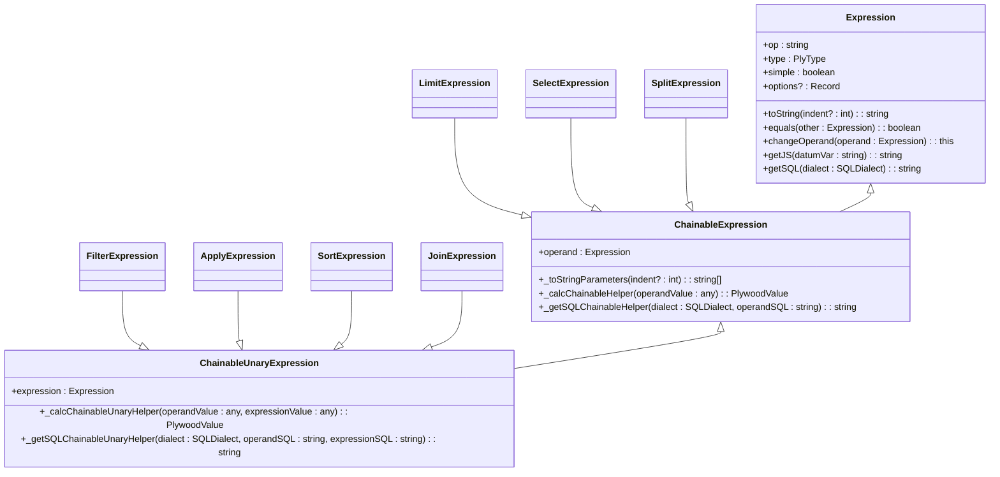
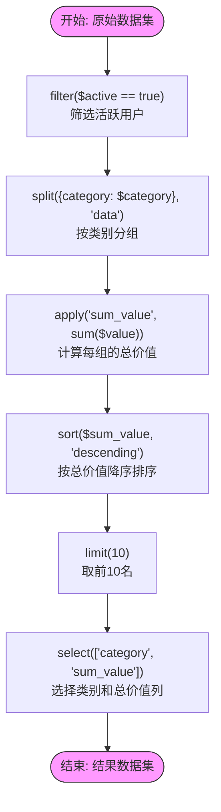

# 可链式表达式

<cite>
**本文档引用的文件**   
- [baseExpression.ts](file://src/expressions/baseExpression.ts)
- [filterExpression.ts](file://src/expressions/filterExpression.ts)
- [splitExpression.ts](file://src/expressions/splitExpression.ts)
- [applyExpression.ts](file://src/expressions/applyExpression.ts)
- [sortExpression.ts](file://src/expressions/sortExpression.ts)
- [limitExpression.ts](file://src/expressions/limitExpression.ts)
- [selectExpression.ts](file://src/expressions/selectExpression.ts)
- [joinExpression.ts](file://src/expressions/joinExpression.ts)
- [dataset.ts](file://src/datatypes/dataset.ts)
- [baseExternal.ts](file://src/external/baseExternal.ts)
</cite>

## 目录
1. [简介](#简介)
2. [核心数据操作表达式](#核心数据操作表达式)
3. [方法链式调用与表达式树](#方法链式调用与表达式树)
4. [查询规划与优化策略](#查询规划与优化策略)
5. [数据分析工作流示例](#数据分析工作流示例)
6. [高级分析到数据库查询的转换](#高级分析到数据库查询的转换)

## 简介
Plywood 是一个用于构建复杂数据分析流水线的库，其核心是可链式表达式（Chainable Expressions）。这些表达式允许用户通过类似 `filter($active).split($category).apply(sum($value))` 的方法链式调用，来描述数据的过滤、分组、应用、排序、限制、选择和连接等操作。这些操作共同构成了 Split-Apply-Combine 算法的核心。本文档将深入解析这些可链式表达式的实现机制，探讨其在查询规划中的优化策略，并说明它们如何将高级分析需求高效地转换为底层数据库查询。

## 核心数据操作表达式
Plywood 的可链式表达式系统围绕 `Expression` 基类构建，通过继承和方法链式调用实现各种数据操作。每个操作都对应一个特定的表达式类，这些类在执行时会构建一个表达式树，并最终被解析为高效的数据库查询。

### 过滤 (Filter)
`filter` 操作用于根据布尔表达式筛选数据集中的行。它由 `FilterExpression` 类实现。该表达式接收一个布尔类型的子表达式作为参数，该表达式定义了筛选条件。在执行时，`FilterExpression` 会调用其操作数（operand）的 `filter` 方法，并传入筛选条件。在 SQL 生成中，`filter` 操作通常被转换为 `WHERE` 子句。

**Section sources**
- [filterExpression.ts](file://src/expressions/filterExpression.ts#L25-L87)
- [dataset.ts](file://src/datatypes/dataset.ts#L664-L673)

### 分组 (Split)
`split` 操作是 Split-Apply-Combine 算法中的 "Split" 阶段，用于根据一个或多个维度对数据集进行分组。它由 `SplitExpression` 类实现。该表达式接收一个 `splits` 对象，该对象的键是分组后的维度名称，值是用于分组的表达式。`SplitExpression` 会更新其类型上下文（type context），为每个分组维度创建新的属性类型，并将原始数据集类型作为子数据集的类型。在 SQL 生成中，`split` 操作被转换为 `GROUP BY` 子句。

**Section sources**
- [splitExpression.ts](file://src/expressions/splitExpression.ts#L35-L292)
- [dataset.ts](file://src/datatypes/dataset.ts#L866-L883)

### 应用 (Apply)
`apply` 操作是 Split-Apply-Combine 算法中的 "Apply" 阶段，用于在每个分组或整个数据集上应用一个聚合或计算函数。它由 `ApplyExpression` 类实现。该表达式接收一个名称和一个表达式，该表达式的结果将被记录在数据集中。`ApplyExpression` 会更新其类型上下文，将新应用的表达式类型添加到数据集的属性类型中。在 SQL 生成中，`apply` 操作被转换为 `SELECT` 子句中的一个计算列。

**Section sources**
- [applyExpression.ts](file://src/expressions/applyExpression.ts#L26-L150)
- [dataset.ts](file://src/datatypes/dataset.ts#L620-L629)

### 排序 (Sort)
`sort` 操作用于根据指定的表达式对数据集进行排序。它由 `SortExpression` 类实现。该表达式接收一个用于排序的表达式和一个方向（升序或降序）。在执行时，`SortExpression` 会调用其操作数的 `sort` 方法。在 SQL 生成中，`sort` 操作被转换为 `ORDER BY` 子句。

**Section sources**
- [sortExpression.ts](file://src/expressions/sortExpression.ts#L23-L117)
- [dataset.ts](file://src/datatypes/dataset.ts#L681-L690)

### 限制 (Limit)
`limit` 操作用于限制返回结果的行数。它由 `LimitExpression` 类实现。该表达式接收一个数值，表示要返回的最大行数。在执行时，`LimitExpression` 会调用其操作数的 `limit` 方法。在 SQL 生成中，`limit` 操作被转换为 `LIMIT` 子句。

**Section sources**
- [limitExpression.ts](file://src/expressions/limitExpression.ts#L21-L92)
- [dataset.ts](file://src/datatypes/dataset.ts#L701-L707)

### 选择 (Select)
`select` 操作用于从数据集中选择指定的属性列。它由 `SelectExpression` 类实现。该表达式接收一个属性名称数组。`SelectExpression` 会更新其类型上下文，只保留被选择的属性类型。在 SQL 生成中，`select` 操作直接对应 `SELECT` 子句。

**Section sources**
- [selectExpression.ts](file://src/expressions/selectExpression.ts#L22-L104)
- [dataset.ts](file://src/datatypes/dataset.ts#L590-L618)

### 连接 (Join)
`join` 操作用于将两个数据集根据某些条件连接在一起。它由 `JoinExpression` 类实现。该表达式接收另一个数据集表达式作为参数。`JoinExpression` 会更新其类型上下文，合并两个数据集的属性类型。在 SQL 生成中，`join` 操作通常被转换为 `JOIN` 子句。

**Section sources**
- [joinExpression.ts](file://src/expressions/joinExpression.ts#L23-L67)
- [dataset.ts](file://src/datatypes/dataset.ts#L1103-L1105)

## 方法链式调用与表达式树
Plywood 的核心优势在于其流畅的链式调用语法。这种语法的实现依赖于 `ChainableExpression` 基类。该类定义了所有可链式操作的通用行为。



**Diagram sources**
- [baseExpression.ts](file://src/expressions/baseExpression.ts#L441-L2189)
- [filterExpression.ts](file://src/expressions/filterExpression.ts#L25-L87)
- [applyExpression.ts](file://src/expressions/applyExpression.ts#L26-L150)
- [sortExpression.ts](file://src/expressions/sortExpression.ts#L23-L117)
- [limitExpression.ts](file://src/expressions/limitExpression.ts#L21-L92)
- [selectExpression.ts](file://src/expressions/selectExpression.ts#L22-L104)
- [joinExpression.ts](file://src/expressions/joinExpression.ts#L23-L67)
- [splitExpression.ts](file://src/expressions/splitExpression.ts#L35-L292)

当用户调用如 `dataset.filter(...)` 时，`dataset` 对象（其类型为 `Expression`）的 `filter` 方法会被调用。这个方法会创建一个新的 `FilterExpression` 实例，将其 `operand` 设置为当前的 `dataset`，并将传入的筛选条件作为 `expression`。关键在于，`FilterExpression` 的构造函数会将其 `type` 设置为 `'DATASET'`，这使得返回的新表达式对象仍然具有 `filter`, `split`, `apply` 等方法。因此，可以继续在返回的表达式上进行链式调用，如 `.split(...)`。每一次调用都会在表达式树中增加一个新的节点，最终形成一个从左到右的链式结构，其中最左边的操作是根节点。

## 查询规划与优化策略
Plywood 不仅构建表达式树，还通过一系列优化策略来简化和优化这个树，以生成更高效的查询。这些优化主要在 `simplify()` 和 `specialSimplify()` 方法中实现。

### 谓词下推 (Predicate Pushdown)
谓词下推是一种重要的优化技术，它将过滤条件尽可能地“下推”到数据源，以减少需要处理的数据量。例如，`X.split(splits, dataName).filter(expression)` 这个表达式可以通过 `specialSimplify()` 方法被优化。`SplitExpression` 的 `specialSimplify` 会检查其操作数是否为 `FilterExpression`，如果是，则会尝试将过滤条件转换为分组表达式的一部分，从而在分组前就进行过滤，减少分组操作的数据量。

### 投影剪裁 (Projection Pruning)
投影剪裁是指移除查询中不需要的列，以减少数据传输和处理的开销。`SelectExpression` 的 `specialSimplify` 方法实现了这种优化。例如，`X.apply('foo', _).select(<not foo>)` 这个表达式会被简化为 `X.select(<not foo>)`，因为 `apply` 操作添加的列 `'foo'` 在后续的 `select` 操作中被明确排除，因此这个 `apply` 操作是多余的，可以被安全地移除。

### 排序消除 (Sort Elimination)
排序消除是指在某些情况下移除不必要的排序操作。`SortExpression` 的 `specialSimplify` 方法可以处理 `X.sort(Y, d1).sort(Y, d2)` 这种情况。如果对同一个表达式 `Y` 进行了两次排序，那么第一次排序是多余的，可以被消除，只保留最后一次排序。

**Section sources**
- [baseExpression.ts](file://src/expressions/baseExpression.ts#L441-L2189)
- [filterExpression.ts](file://src/expressions/filterExpression.ts#L39-L41)
- [splitExpression.ts](file://src/expressions/splitExpression.ts#L144-L150)
- [applyExpression.ts](file://src/expressions/applyExpression.ts#L91-L95)
- [sortExpression.ts](file://src/expressions/sortExpression.ts#L76-L78)
- [limitExpression.ts](file://src/expressions/limitExpression.ts#L65-L67)
- [selectExpression.ts](file://src/expressions/selectExpression.ts#L77-L79)

## 数据分析工作流示例
以下是一个典型的数据分析工作流，展示了如何使用可链式表达式构建复杂的数据处理流水线：



**Diagram sources**
- [baseExpression.ts](file://src/expressions/baseExpression.ts#L441-L2189)

这个工作流 `filter($active).split($category).apply(sum($value)).sort($sum, "descending")` 的执行过程如下：
1.  **过滤 (Filter)**: 首先，`filter($active)` 表达式被创建，其 `operand` 是原始数据集，`expression` 是 `$active`。这会生成一个只包含活跃用户的新数据集。
2.  **分组 (Split)**: 接着，`split($category)` 被调用。新的 `SplitExpression` 将上一步的 `FilterExpression` 作为其 `operand`，并将 `$category` 作为分组表达式。这会生成一个按类别分组的嵌套数据集。
3.  **应用 (Apply)**: 然后，`apply(sum($value))` 被调用。`ApplyExpression` 将 `SplitExpression` 作为其 `operand`，并将 `sum($value)` 作为应用的表达式。这会为每个分组计算 `$value` 字段的总和，并将结果记录在一个新列中。
4.  **排序 (Sort)**: `sort($sum, "descending")` 被调用。`SortExpression` 将 `ApplyExpression` 作为其 `operand`，并指定按 `$sum` 列降序排序。
5.  **限制 (Limit)**: `limit(10)` 被调用。`LimitExpression` 将 `SortExpression` 作为其 `operand`，并限制结果只返回前10行。
6.  **选择 (Select)**: 最后，`select(...)` 被调用，只选择最终需要的列。

## 高级分析到数据库查询的转换
Plywood 的最终目标是将这些高级的、声明式的分析表达式转换为高效的底层数据库查询（如 SQL 或 Druid 查询）。这个转换过程由 `External` 类和 `SQLDialect` 类协同完成。

`External` 类代表一个外部数据源（如数据库表）。当一个表达式树的 `operand` 是一个 `External` 时，Plywood 会尝试将整个表达式树“推入”到外部数据源中执行。这通过 `getReadyExternals` 和 `applyReadyExternals` 等方法实现。系统会遍历表达式树，收集所有需要在外部执行的“准备就绪”的操作，并将它们打包成一个查询请求。

`SQLDialect` 类是一个抽象基类，定义了如何将 Plywood 表达式转换为特定数据库的 SQL 语法。不同的数据库（如 MySQL, PostgreSQL, ClickHouse）会有各自的 `Dialect` 实现。例如，`timeBucketExpression` 方法在 `PostgresDialect` 和 `MySqlDialect` 中会有不同的实现，以生成符合各自数据库语法的日期时间分桶函数。

通过这种机制，Plywood 能够将复杂的链式表达式，如 `filter($active).split($category).apply(sum($value))`，最终转换为一个高效的 SQL 查询，例如：
```sql
SELECT 
  category, 
  SUM(value) AS sum_value 
FROM 
  my_table 
WHERE 
  active = TRUE 
GROUP BY 
  category 
ORDER BY 
  sum_value DESC 
LIMIT 10;
```
这使得用户可以使用直观的 JavaScript/TypeScript API 进行数据分析，而无需关心底层数据库查询的复杂性。

**Section sources**
- [baseExternal.ts](file://src/external/baseExternal.ts#L318-L318)
- [baseDialect.ts](file://src/dialect/baseDialect.ts#L21-L172)
- [dataset.ts](file://src/datatypes/dataset.ts#L313-L1425)