# 字符串表达式

<cite>
**本文档引用的文件**
- [concatExpression.ts](file://src/expressions/concatExpression.ts)
- [substrExpression.ts](file://src/expressions/substrExpression.ts)
- [lengthExpression.ts](file://src/expressions/lengthExpression.ts)
- [transformCaseExpression.ts](file://src/expressions/transformCaseExpression.ts)
- [containsExpression.ts](file://src/expressions/containsExpression.ts)
- [matchExpression.ts](file://src/expressions/matchExpression.ts)
- [indexOfExpression.ts](file://src/expressions/indexOfExpression.ts)
- [baseDialect.ts](file://src/dialect/baseDialect.ts)
- [postgresDialect.ts](file://src/dialect/postgresDialect.ts)
- [clickHouseDialect.ts](file://src/dialect/clickHouseDialect.ts)
- [mySqlDialect.ts](file://src/dialect/mySqlDialect.ts)
- [druidDialect.ts](file://src/dialect/druidDialect.ts)
</cite>

## 目录
1. [简介](#简介)
2. [字符串操作实现机制](#字符串操作实现机制)
3. [字符串处理链构建](#字符串处理链构建)
4. [数据库方言差异](#数据库方言差异)
5. [性能优化建议](#性能优化建议)
6. [结论](#结论)

## 简介
Plywood字符串表达式提供了一套完整的文本数据处理和转换功能，支持字符串连接、子串提取、长度计算、大小写转换、正则匹配、包含判断和索引查找等操作。这些表达式在数据清洗和特征提取场景中发挥着重要作用，能够有效处理复杂的文本数据处理需求。

## 字符串操作实现机制

### 字符串连接
字符串连接操作通过`concatExpression`类实现，支持将多个字符串表达式连接成一个字符串。该操作在JavaScript和SQL中的实现方式不同，但在语义上保持一致。

**字符串连接实现**
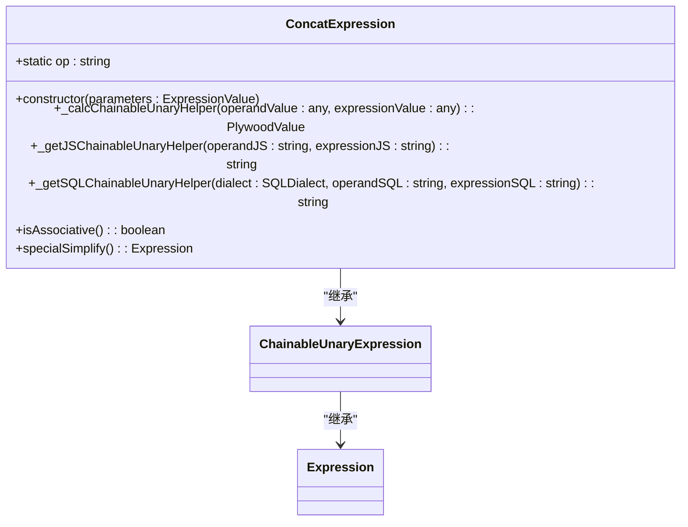

**图示来源**
- [concatExpression.ts](file://src/expressions/concatExpression.ts#L20-L62)

**本节来源**
- [concatExpression.ts](file://src/expressions/concatExpression.ts#L20-L62)

### 子串提取
子串提取功能由`substrExpression`类提供，允许从字符串中提取指定位置和长度的子串。该操作在不同数据库方言中有不同的SQL实现方式。

**子串提取实现**
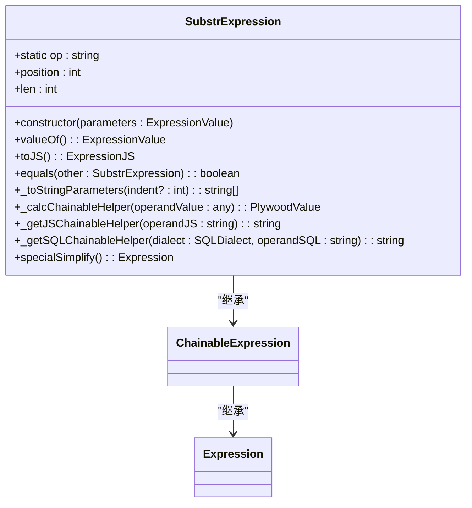

**图示来源**
- [substrExpression.ts](file://src/expressions/substrExpression.ts#L20-L89)

**本节来源**
- [substrExpression.ts](file://src/expressions/substrExpression.ts#L20-L89)

### 长度计算
字符串长度计算通过`lengthExpression`类实现，返回字符串的字符长度。该操作在不同环境下的实现方式保持一致。

**长度计算实现**
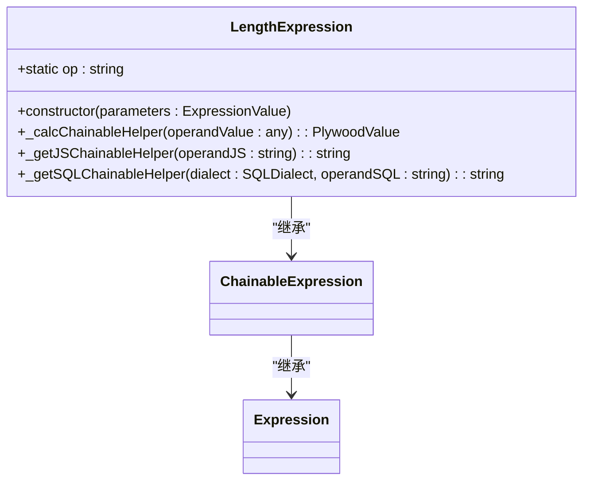

**图示来源**
- [lengthExpression.ts](file://src/expressions/lengthExpression.ts#L21-L45)

**本节来源**
- [lengthExpression.ts](file://src/expressions/lengthExpression.ts#L21-L45)

### 大小写转换
大小写转换功能由`transformCaseExpression`类提供，支持将字符串转换为大写或小写形式。

**大小写转换实现**
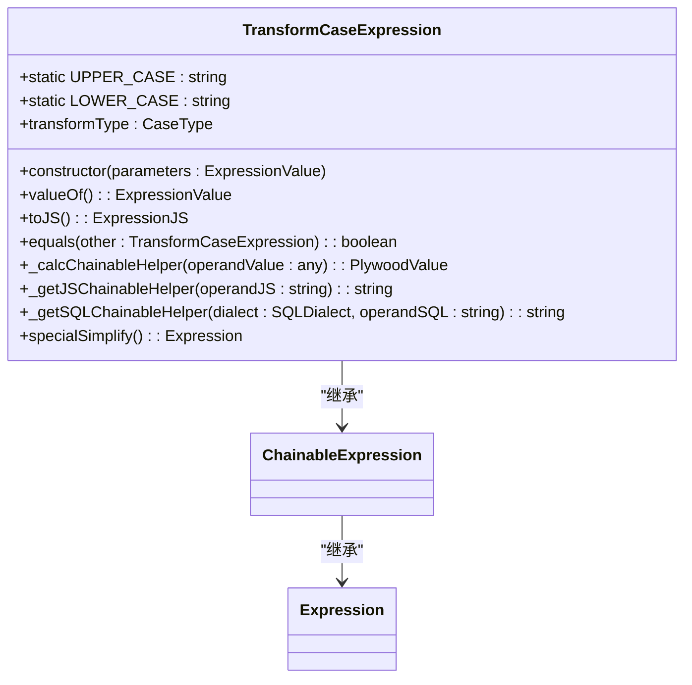

**图示来源**
- [transformCaseExpression.ts](file://src/expressions/transformCaseExpression.ts#L20-L84)

**本节来源**
- [transformCaseExpression.ts](file://src/expressions/transformCaseExpression.ts#L20-L84)

### 正则匹配
正则匹配功能通过`matchExpression`类实现，支持使用正则表达式进行模式匹配。

**正则匹配实现**
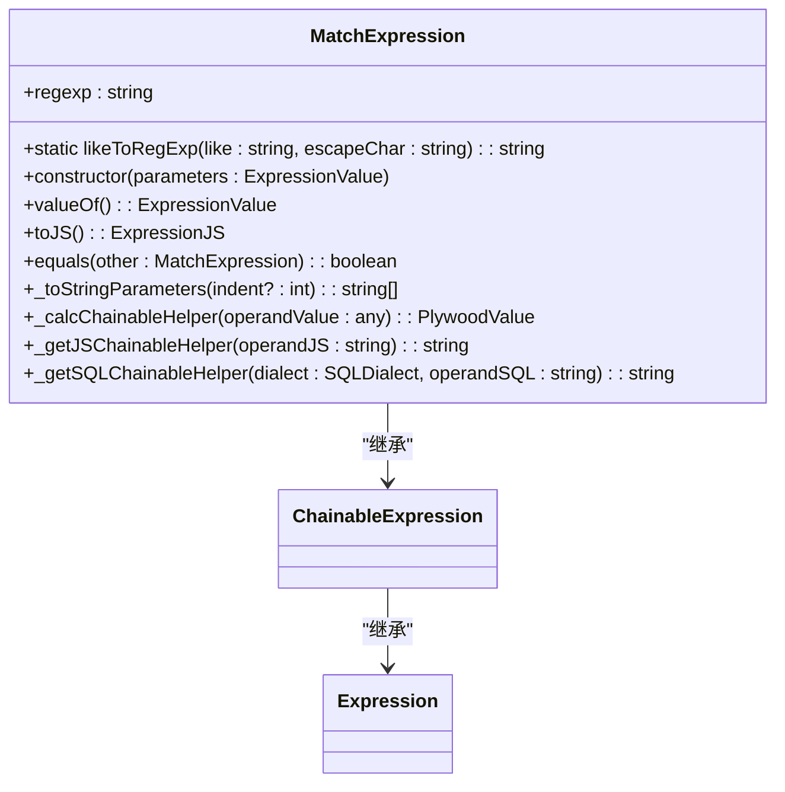

**图示来源**
- [matchExpression.ts](file://src/expressions/matchExpression.ts#L24-L103)

**本节来源**
- [matchExpression.ts](file://src/expressions/matchExpression.ts#L24-L103)

### 包含判断
包含判断功能由`containsExpression`类提供，支持判断一个字符串是否包含另一个字符串，可选择是否忽略大小写。

**包含判断实现**
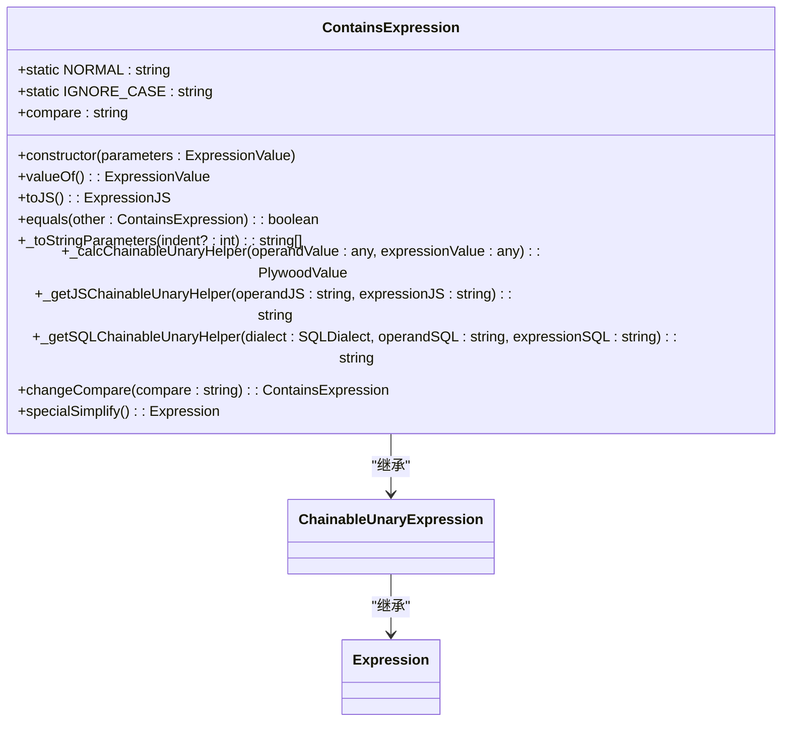

**图示来源**
- [containsExpression.ts](file://src/expressions/containsExpression.ts#L21-L138)

**本节来源**
- [containsExpression.ts](file://src/expressions/containsExpression.ts#L21-L138)

### 索引查找
索引查找功能通过`indexOfExpression`类实现，返回子串在字符串中的位置。

**索引查找实现**
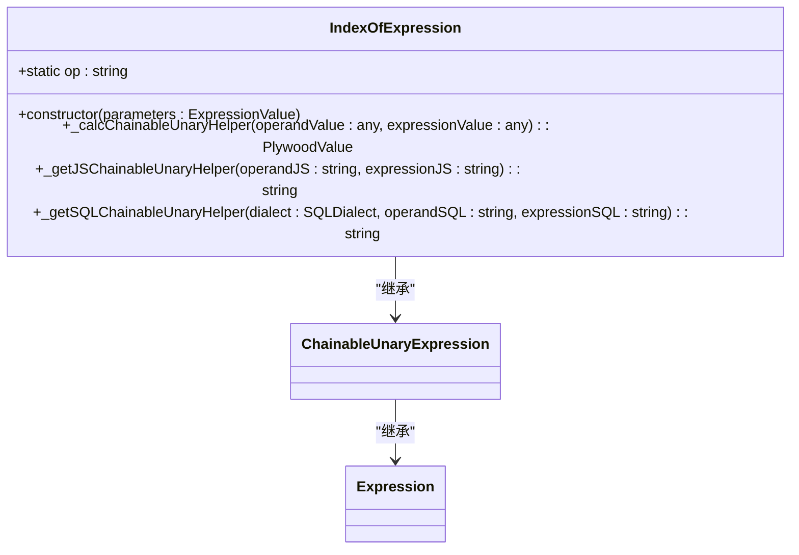

**图示来源**
- [indexOfExpression.ts](file://src/expressions/indexOfExpression.ts#L21-L46)

**本节来源**
- [indexOfExpression.ts](file://src/expressions/indexOfExpression.ts#L21-L46)

## 字符串处理链构建
Plywood支持构建复杂的字符串处理链，如`$name.substr(0, 10).transformCase("upperCase")`这样的表达式。这些处理链可以组合多个字符串操作，实现复杂的文本转换逻辑。

**字符串处理链示例**
```mermaid
flowchart LR
A[原始字符串] --> B[substr(0, 10)]
B --> C[transformCase("upperCase")]
C --> D[结果字符串]
```

**本节来源**
- [substrExpression.ts](file://src/expressions/substrExpression.ts#L20-L89)
- [transformCaseExpression.ts](file://src/expressions/transformCaseExpression.ts#L20-L84)

## 数据库方言差异
不同的数据库系统对字符串函数的支持存在差异，Plywood通过方言适配器模式处理这些差异。

### PostgreSQL方言
PostgreSQL使用`||`操作符进行字符串连接，`POSITION`函数进行子串查找。

**PostgreSQL字符串函数实现**
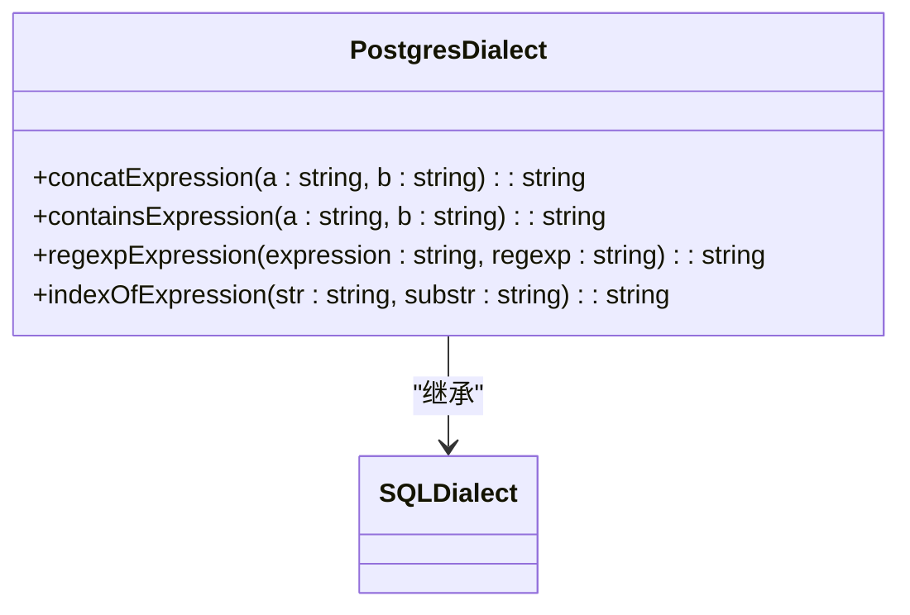

**图示来源**
- [postgresDialect.ts](file://src/dialect/postgresDialect.ts#L88-L94)

**本节来源**
- [postgresDialect.ts](file://src/dialect/postgresDialect.ts#L88-L94)

### ClickHouse方言
ClickHouse使用`CONCAT`函数进行字符串连接，`LOCATE`函数进行子串查找。

**ClickHouse字符串函数实现**
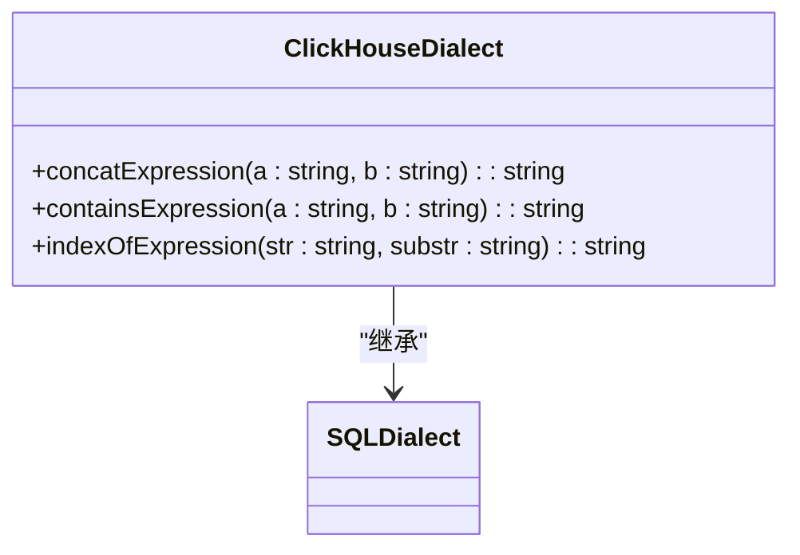

**图示来源**
- [clickHouseDialect.ts](file://src/dialect/clickHouseDialect.ts#L91-L97)

**本节来源**
- [clickHouseDialect.ts](file://src/dialect/clickHouseDialect.ts#L91-L97)

### MySQL方言
MySQL使用`CONCAT`函数进行字符串连接，`LOCATE`函数进行子串查找。

**MySQL字符串函数实现**
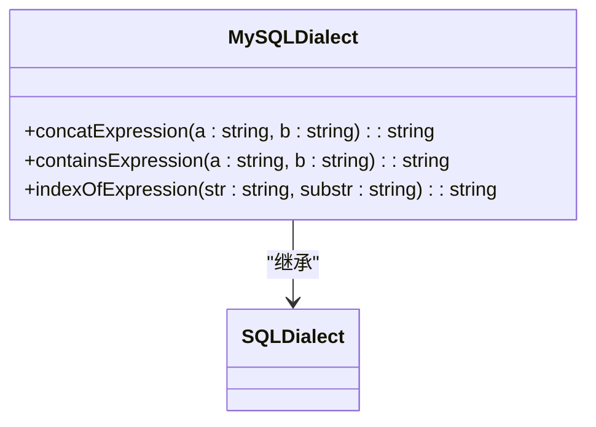

**图示来源**
- [mySqlDialect.ts](file://src/dialect/mySqlDialect.ts#L95-L101)

**本节来源**
- [mySqlDialect.ts](file://src/dialect/mySqlDialect.ts#L95-L101)

### Druid方言
Druid使用`||`操作符进行字符串连接，`POSITION`函数进行子串查找。

**Druid字符串函数实现**
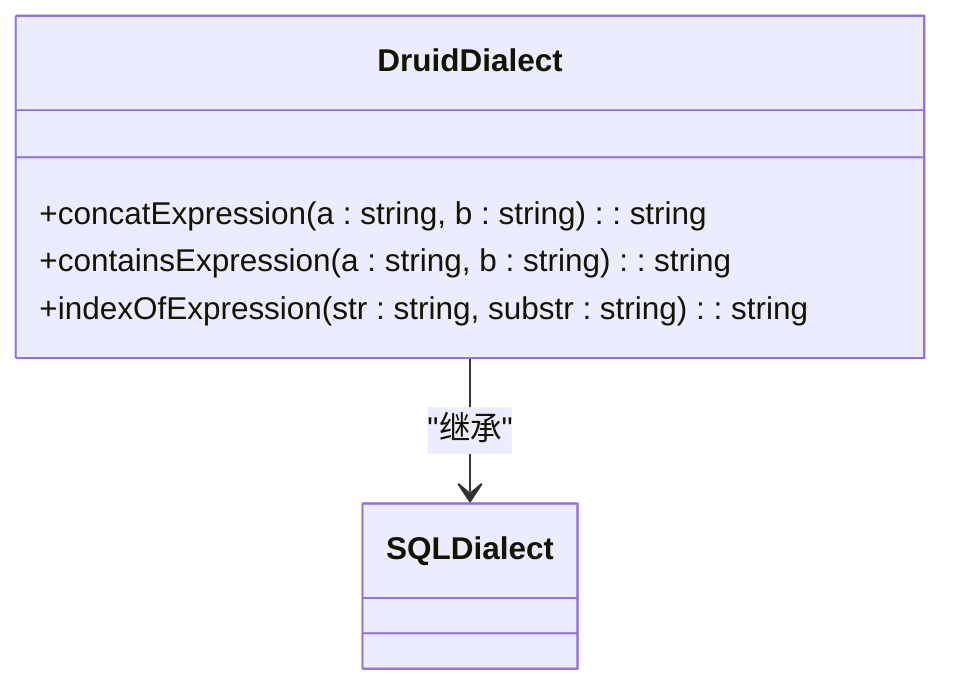

**图示来源**
- [druidDialect.ts](file://src/dialect/druidDialect.ts#L103-L109)

**本节来源**
- [druidDialect.ts](file://src/dialect/druidDialect.ts#L103-L109)

## 性能优化建议
在性能敏感场景下使用字符串表达式时，需要注意以下优化建议：

1. **避免在大文本字段上使用复杂正则**：复杂正则表达式在大文本上的匹配性能较差，应尽量避免。
2. **合理使用字符串连接**：对于大量字符串连接操作，应考虑使用更高效的批量处理方式。
3. **缓存频繁使用的字符串操作结果**：对于重复执行的字符串操作，可以考虑缓存结果以提高性能。
4. **选择合适的数据库函数**：不同数据库的字符串函数性能可能有差异，应根据具体场景选择最合适的实现。

**本节来源**
- [concatExpression.ts](file://src/expressions/concatExpression.ts#L20-L62)
- [matchExpression.ts](file://src/expressions/matchExpression.ts#L24-L103)

## 结论
Plywood字符串表达式提供了一套完整且灵活的文本处理功能，支持多种字符串操作和复杂的处理链构建。通过方言适配器模式，能够在不同数据库系统上生成相应的字符串函数，确保功能的一致性。在使用时应注意性能优化，特别是在处理大文本数据时。