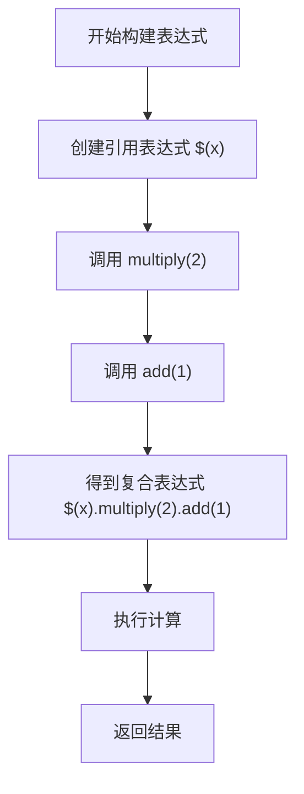
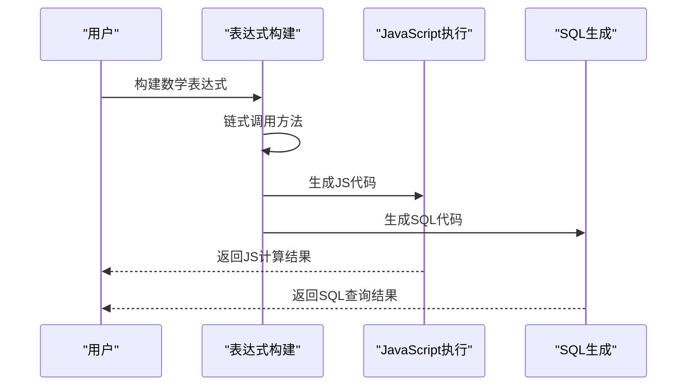
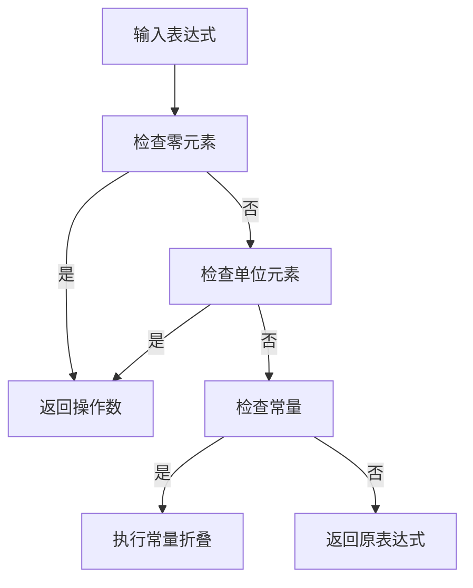
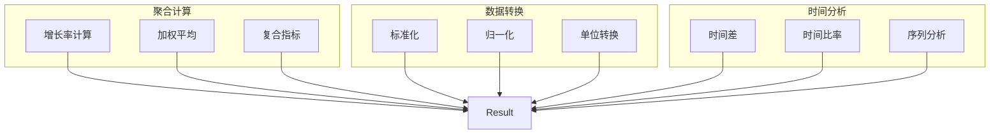

# 数学表达式

<cite>
**本文档中引用的文件**  
- [absoluteExpression.ts](file://src/expressions/absoluteExpression.ts)
- [addExpression.ts](file://src/expressions/addExpression.ts)
- [subtractExpression.ts](file://src/expressions/subtractExpression.ts)
- [multiplyExpression.ts](file://src/expressions/multiplyExpression.ts)
- [divideExpression.ts](file://src/expressions/divideExpression.ts)
- [modExpression.ts](file://src/expressions/modExpression.ts)
- [powerExpression.ts](file://src/expressions/powerExpression.ts)
- [baseExpression.ts](file://src/expressions/baseExpression.ts)
- [baseDialect.ts](file://src/dialect/baseDialect.ts)
</cite>

## 目录
1. [简介](#简介)
2. [数学表达式类型](#数学表达式类型)
3. [方法链式调用机制](#方法链式调用机制)
4. [运行时计算逻辑](#运行时计算逻辑)
5. [类型检查规则](#类型检查规则)
6. [简化与优化策略](#简化与优化策略)
7. [数据库方言中的SQL生成差异](#数据库方言中的sql生成差异)
8. [应用场景](#应用场景)
9. [结论](#结论)

## 简介
Plywood中的数学表达式系统提供了一套完整的算术运算能力，包括加法、减法、乘法、除法、取模、幂运算和绝对值等操作。这些表达式通过方法链式调用的方式构建复杂的数学公式，并在运行时进行高效计算。本文档详细解释这些数学表达式的实现机制、优化策略以及在不同场景下的应用模式。

## 数学表达式类型

### 加法表达式
加法表达式通过`add`方法实现，支持数值类型的运算。该表达式具有交换律和结合律特性，在简化时会自动处理与零相加的恒等情况。

**数学表达式类型来源**
- [addExpression.ts](file://src/expressions/addExpression.ts#L20-L60)

### 减法表达式
减法表达式通过`subtract`方法实现，仅支持数值类型运算。当减数为零时，表达式会被简化为被减数本身。

**数学表达式类型来源**
- [subtractExpression.ts](file://src/expressions/subtractExpression.ts#L20-L57)

### 乘法表达式
乘法表达式通过`multiply`方法实现，支持数值类型运算。该表达式具有交换律和结合律特性，并实现了多种简化规则：
- 任何数乘以0等于0
- 任何数乘以1等于其本身

**数学表达式类型来源**
- [multiplyExpression.ts](file://src/expressions/multiplyExpression.ts#L22-L68)

### 除法表达式
除法表达式通过`divide`方法实现，支持数值类型运算。系统对除法运算进行了特殊处理以避免除零错误：
- 0除以任何数等于0
- 任何数除以0返回最大安全整数
- 任何数除以1等于其本身

**数学表达式类型来源**
- [divideExpression.ts](file://src/expressions/divideExpression.ts#L20-L61)

### 取模表达式
取模表达式通过`mod`方法实现，支持数值类型运算。系统对取模运算进行了边界情况处理：
- 任何数对0取模返回null
- 任何数对1取模返回0

**数学表达式类型来源**
- [modExpression.ts](file://src/expressions/modExpression.ts#L20-L56)

### 幂运算表达式
幂运算表达式通过`power`方法实现，支持数值类型运算。系统实现了以下简化规则：
- 任何数的0次幂等于1
- 任何数的1次幂等于其本身

**数学表达式类型来源**
- [powerExpression.ts](file://src/expressions/powerExpression.ts#L20-L57)

### 绝对值表达式
绝对值表达式通过`absolute`方法实现，支持数值类型运算。系统实现了特殊简化规则：连续的绝对值运算会被简化为单次运算。

**数学表达式类型来源**
- [absoluteExpression.ts](file://src/expressions/absoluteExpression.ts#L20-L51)

## 方法链式调用机制
数学表达式通过方法链式调用的方式构建复杂的数学公式。每个数学运算方法返回一个新的表达式实例，从而支持连续调用。

**图示来源**
- [baseExpression.ts](file://src/expressions/baseExpression.ts#L100-L200)

## 运行时计算逻辑
数学表达式的运行时计算逻辑分为JavaScript环境和SQL环境两种实现方式。

### JavaScript环境计算
在JavaScript环境中，系统使用原生的JavaScript运算符和Math函数进行计算：
- 加法：`a + b`
- 减法：`a - b`
- 乘法：`a * b`
- 除法：`a / b`（包含除零保护）
- 取模：`a % b`（包含除零保护）
- 幂运算：`Math.pow(a, b)`
- 绝对值：`Math.abs(a)`

### SQL环境计算
在SQL环境中，系统根据不同数据库方言生成相应的SQL表达式：
- 加法：`(a+b)`
- 减法：`(a-b)`
- 乘法：`(a*b)`
- 除法：使用方言特定的浮点除法函数
- 取模：`(a%b)`
- 幂运算：`POWER(a,b)`
- 绝对值：`ABS(a)`

**图示来源**
- [baseExpression.ts](file://src/expressions/baseExpression.ts#L500-L600)
- [baseDialect.ts](file://src/dialect/baseDialect.ts#L100-L150)

## 类型检查规则
数学表达式系统实施严格的类型检查规则，确保运算的类型安全性：

1. **操作数类型检查**：所有数学运算的操作数必须为数值类型（NUMBER）
2. **结果类型推断**：运算结果的类型由操作数类型决定
3. **集合运算支持**：支持集合与集合、集合与标量之间的交叉二元运算
4. **空值处理**：任何操作数为null时，结果也为null

系统在表达式构造时通过`_checkOperandTypes`和`_checkExpressionTypes`方法强制执行类型检查。

**运行时计算逻辑来源**
- [baseExpression.ts](file://src/expressions/baseExpression.ts#L800-L900)

## 简化与优化策略
数学表达式系统实现了多种简化与优化策略，以提高计算效率和表达式可读性。

### 常量折叠
系统在表达式构建阶段自动执行常量折叠优化，将常量表达式直接计算为结果值。

### 代数简化
系统实现了基于代数定律的表达式简化：
- **零元素简化**：`X + 0 = X`，`X * 0 = 0`
- **单位元素简化**：`X * 1 = X`，`X / 1 = X`
- **幂运算简化**：`X^0 = 1`，`X^1 = X`
- **绝对值简化**：`| |X| | = |X|`

### 结合律与交换律优化
对于满足结合律和交换律的运算（如加法和乘法），系统可以重新排列运算顺序以优化计算性能。

**简化与优化策略来源**
- [baseExpression.ts](file://src/expressions/baseExpression.ts#L1000-L1100)

## 数据库方言中的SQL生成差异
不同的数据库方言在数学运算的SQL生成上存在一些差异，系统通过SQLDialect抽象层处理这些差异。

### 浮点除法处理
不同数据库对浮点除法的处理方式不同：
- 通用实现：`(a/b)`
- 特定方言可能重写此方法以适应其语法

### 函数名称差异
某些数学函数在不同数据库中的名称可能不同：
- 幂运算：标准为`POWER(a,b)`，某些方言可能使用`POW(a,b)`
- 绝对值：标准为`ABS(a)`，所有支持的方言保持一致

### 操作符支持
不同数据库对数学操作符的支持程度不同：
- 加减乘除：所有方言都支持标准操作符
- 取模：使用`%`操作符，所有方言保持一致

系统通过`SQLDialect`基类和具体方言实现类来管理这些差异。

**数据库方言中的sql生成差异来源**
- [baseDialect.ts](file://src/dialect/baseDialect.ts#L50-L100)

## 应用场景

### 聚合计算
数学表达式广泛应用于聚合计算中，如：
- 计算增长率：`(current - previous) / previous`
- 计算加权平均：`sum(value * weight) / sum(weight)`
- 计算复合指标：`price * quantity * (1 - discount)`

### 数据转换
在数据转换过程中，数学表达式用于：
- 标准化：`(value - min) / (max - min)`
- 归一化：`value / total`
- 单位转换：`value * conversion_rate`

### 与时间表达式结合使用
数学表达式可以与时间表达式结合，实现复杂的时间计算：
- 计算时间差：`time_end - time_start`
- 计算时间比率：`duration / total_duration`
- 时间序列分析：`value[t] / value[t-1]`

**应用场景来源**
- [baseExpression.ts](file://src/expressions/baseExpression.ts#L1200-L1300)

## 结论
Plywood的数学表达式系统提供了一套强大而灵活的算术运算能力。通过方法链式调用机制，用户可以轻松构建复杂的数学公式。系统实现了完善的类型检查、优化策略和跨数据库兼容性，确保了计算的准确性和高效性。这些数学表达式在聚合计算、数据转换和时间序列分析等场景中发挥着重要作用，为数据分析提供了坚实的基础。