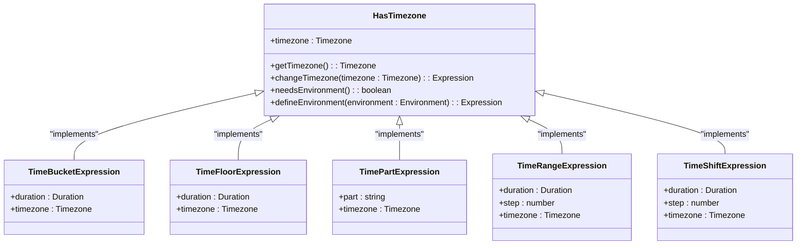
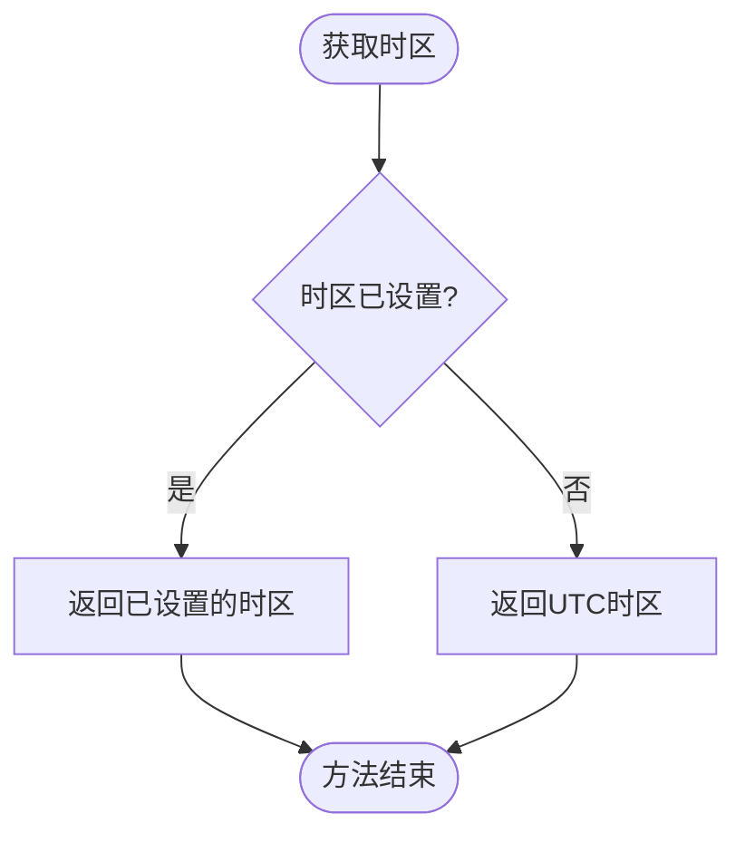
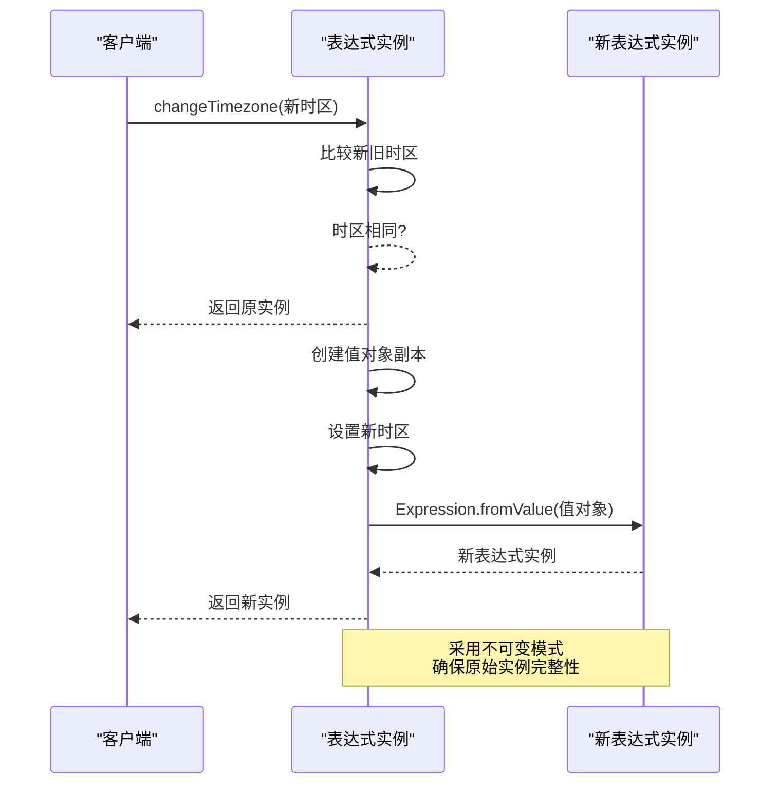
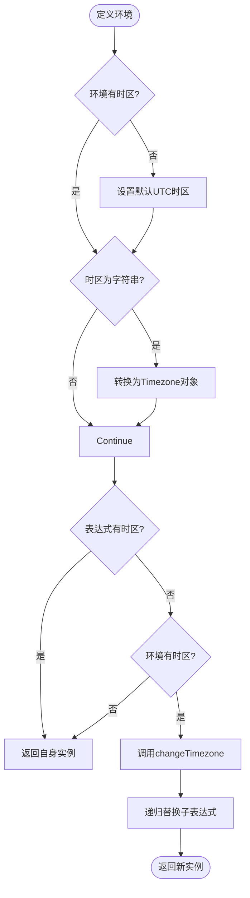
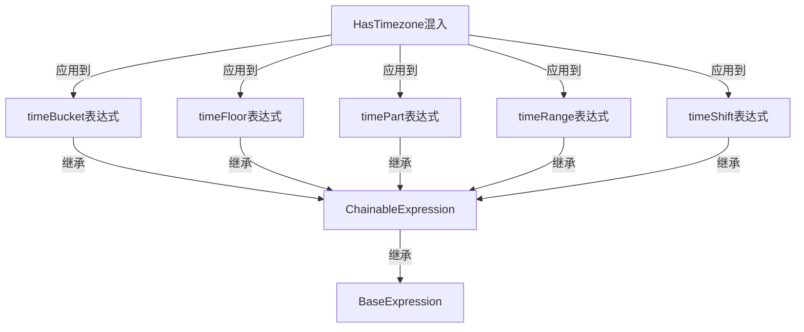
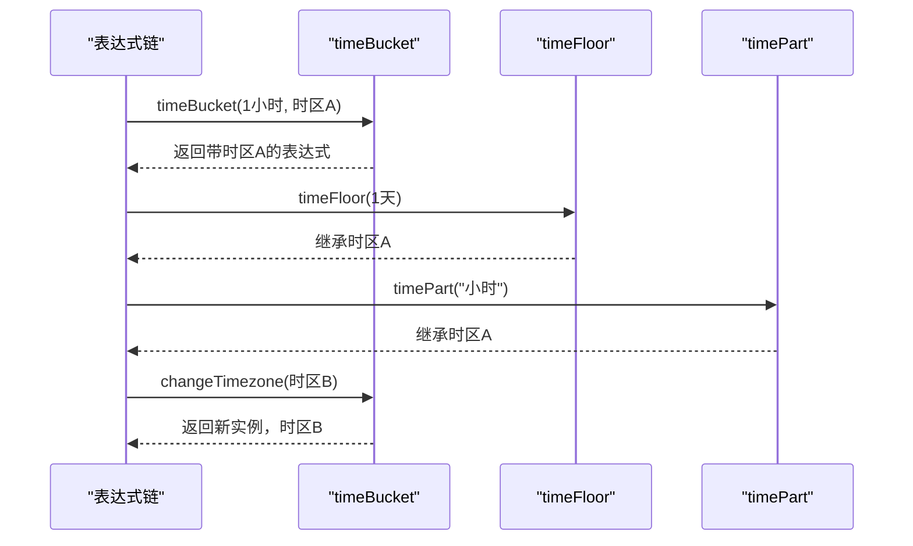
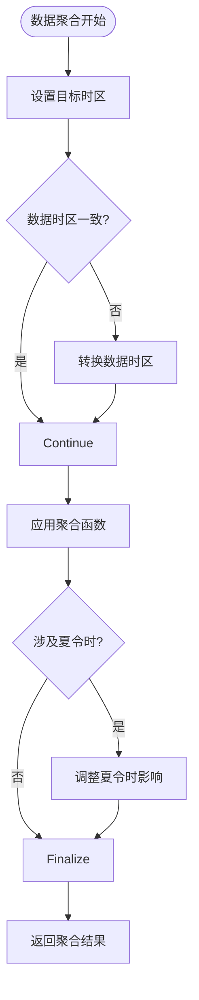
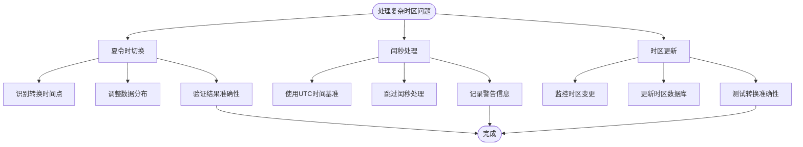

# 时区处理

<cite>
**本文档中引用的文件**   
- [hasTimezone.ts](file://src/expressions/mixins/hasTimezone.ts)
- [timeBucketExpression.ts](file://src/expressions/timeBucketExpression.ts)
- [timeFloorExpression.ts](file://src/expressions/timeFloorExpression.ts)
- [timePartExpression.ts](file://src/expressions/timePartExpression.ts)
- [timeRangeExpression.ts](file://src/expressions/timeRangeExpression.ts)
- [timeShiftExpression.ts](file://src/expressions/timeShiftExpression.ts)
- [baseDialect.ts](file://src/dialect/baseDialect.ts)
- [types.ts](file://src/types.ts)
- [baseExpression.ts](file://src/expressions/baseExpression.ts)
</cite>

## 目录
1. [简介](#简介)
2. [HasTimezone混入类设计模式](#hastimezonemixin设计模式)
3. [时区处理核心方法](#时区处理核心方法)
4. [运行时环境依赖处理](#运行时环境依赖处理)
5. [时间表达式复用机制](#时间表达式复用机制)
6. [时区传递与修改示例](#时区传递与修改示例)
7. [跨时区数据聚合最佳实践](#跨时区数据聚合最佳实践)
8. [moment-timezone库集成](#moment-timezone库集成)
9. [复杂时区问题处理策略](#复杂时区问题处理策略)
10. [分布式系统时区一致性](#分布式系统时区一致性)
11. [结论](#结论)

## 简介
Plywood框架提供了一套完整的时区处理机制，通过HasTimezone混入类为所有时间相关表达式提供统一的时区管理功能。该机制确保了在不同时间操作中时区信息的一致性，支持UTC时区的优雅降级，并允许在运行时动态绑定时区信息。本文档深入解析这一机制的设计与实现。

## HasTimezone混入设计模式



**图示来源**
- [hasTimezone.ts](file://src/expressions/mixins/hasTimezone.ts#L20-L60)
- [timeBucketExpression.ts](file://src/expressions/timeBucketExpression.ts#L1-L97)
- [timeFloorExpression.ts](file://src/expressions/timeFloorExpression.ts#L1-L134)
- [timePartExpression.ts](file://src/expressions/timePartExpression.ts#L1-L168)
- [timeRangeExpression.ts](file://src/expressions/timeRangeExpression.ts#L1-L118)
- [timeShiftExpression.ts](file://src/expressions/timeShiftExpression.ts#L1-L125)

**章节来源**
- [hasTimezone.ts](file://src/expressions/mixins/hasTimezone.ts#L1-L61)

## 时区处理核心方法

### getTimezone方法
`getTimezone()`方法提供默认UTC时区的优雅降级机制。当表达式未显式设置时区时，该方法返回UTC时区作为默认值，确保了时间操作的确定性和可预测性。



### changeTimezone方法
`changeTimezone()`方法采用不可变模式创建具有新时区的表达式实例。该方法确保了原始表达式的完整性，同时返回一个新的表达式实例，实现了函数式编程中的不可变性原则。



**图示来源**
- [hasTimezone.ts](file://src/expressions/mixins/hasTimezone.ts#L29-L34)
- [baseExpression.ts](file://src/expressions/baseExpression.ts#L457-L457)

**章节来源**
- [hasTimezone.ts](file://src/expressions/mixins/hasTimezone.ts#L29-L34)

## 运行时环境依赖处理

### needsEnvironment方法
`needsEnvironment()`方法用于检测表达式是否需要运行时环境中的时区信息。当表达式未设置时区时，该方法返回true，表明需要从运行时环境获取时区配置。

### defineEnvironment方法
`defineEnvironment()`方法实现了延迟绑定机制，允许表达式在执行时从运行时环境获取时区信息。该方法首先确保环境对象包含时区配置（默认为UTC），然后递归地为需要环境信息的子表达式绑定时区。



**图示来源**
- [hasTimezone.ts](file://src/expressions/mixins/hasTimezone.ts#L45-L60)
- [types.ts](file://src/types.ts#L1-L40)

**章节来源**
- [hasTimezone.ts](file://src/expressions/mixins/hasTimezone.ts#L45-L60)

## 时间表达式复用机制

HasTimezone混入被所有时间表达式复用，包括timeBucket、timeFloor、timePart等，确保了时区逻辑的一致性。通过Expression.applyMixins方法，这些表达式类获得了统一的时区处理能力。



**图示来源**
- [timeBucketExpression.ts](file://src/expressions/timeBucketExpression.ts#L92-L92)
- [timeFloorExpression.ts](file://src/expressions/timeFloorExpression.ts#L129-L129)
- [timePartExpression.ts](file://src/expressions/timePartExpression.ts#L163-L163)
- [timeRangeExpression.ts](file://src/expressions/timeRangeExpression.ts#L113-L113)
- [timeShiftExpression.ts](file://src/expressions/timeShiftExpression.ts#L120-L120)

**章节来源**
- [timeBucketExpression.ts](file://src/expressions/timeBucketExpression.ts#L1-L97)
- [timeFloorExpression.ts](file://src/expressions/timeFloorExpression.ts#L1-L134)
- [timePartExpression.ts](file://src/expressions/timePartExpression.ts#L1-L168)
- [timeRangeExpression.ts](file://src/expressions/timeRangeExpression.ts#L1-L118)
- [timeShiftExpression.ts](file://src/expressions/timeShiftExpression.ts#L1-L125)

## 时区传递与修改示例

在表达式链中，时区设置可以通过方法链传递和修改。每个时间操作都可以独立设置时区，或者继承上游操作的时区设置。



**章节来源**
- [baseExpression.ts](file://src/expressions/baseExpression.ts#L490-L505)

## 跨时区数据聚合最佳实践

在进行跨时区数据聚合时，应遵循以下最佳实践以避免时间错位：

1. **统一时区基准**：在聚合操作前，将所有数据转换到统一的时区基准
2. **明确时区设置**：避免依赖默认UTC时区，显式设置业务所需的时区
3. **时区转换时机**：在数据查询阶段进行时区转换，而非在应用层处理
4. **边界情况处理**：特别注意夏令时切换期间的数据聚合准确性



## moment-timezone库集成

Plywood通过@topgames/chronoshift库与moment-timezone集成，提供完整的时区处理能力。这种集成方式确保了与现有moment.js生态系统的兼容性，同时提供了更专业的时区处理功能。

```mermaid
graph LR
Plywood[Plywood框架] --> Chronoshift[@topgames/chronoshift]
Chronoshift --> MomentTimezone[moment-timezone]
MomentTimezone --> Moment[moment.js]
subgraph "时区功能"
Chronoshift --> |提供| Duration[持续时间处理]
Chronoshift --> |提供| Timezone[时区转换]
Chronoshift --> |提供| Alignment[时间对齐]
end
```

**章节来源**
- [baseDialect.ts](file://src/dialect/baseDialect.ts#L1-L174)

## 复杂时区问题处理策略

### 夏令时切换处理
在夏令时切换期间，时间序列可能出现重复或缺失的情况。Plywood通过精确的时区转换算法和时间对齐机制来处理这些问题。

### 闰秒处理
对于闰秒等特殊时间情况，Plywood采用标准的UTC时间处理策略，确保时间计算的准确性。

### 时区数据库更新
建议定期更新时区数据库，以反映各国时区政策的变化，确保时区转换的准确性。



## 分布式系统时区一致性

在分布式系统中保持时区一致性是关键挑战。建议采用以下策略：

1. **统一时区配置**：在系统配置中定义统一的时区标准
2. **时间戳标准化**：所有时间戳存储为UTC时间，显示时转换为目标时区
3. **服务间通信**：在服务间传递时间数据时，明确指定时区信息
4. **日志记录**：日志中的时间戳应包含时区信息，便于问题排查

```mermaid
graph TD
subgraph "客户端"
User[用户]
ClientApp[客户端应用]
end
subgraph "服务端"
APIGateway[API网关]
ServiceA[服务A]
ServiceB[服务B]
Database[(数据库)]
end
User --> |请求(本地时区)| ClientApp
ClientApp --> |转换为UTC| APIGateway
APIGateway --> |UTC时间戳| ServiceA
APIGateway --> |UTC时间戳| ServiceB
ServiceA --> |UTC存储| Database
ServiceB --> |UTC存储| Database
Database --> |UTC读取| ServiceA
ServiceA --> |转换为目标时区| ClientApp
ClientApp --> |显示(目标时区)| User
```

## 结论
Plywood的时区处理机制通过HasTimezone混入类提供了强大而灵活的时区管理功能。该机制不仅确保了时间操作的一致性和准确性，还通过不可变模式和延迟绑定等设计模式，实现了高性能和可维护性。在实际应用中，应充分利用这些特性，遵循最佳实践，以确保跨时区数据处理的正确性。