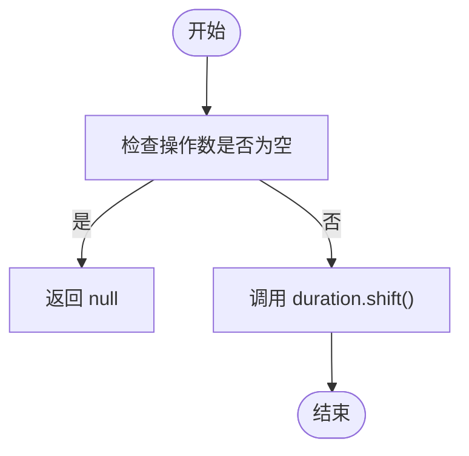
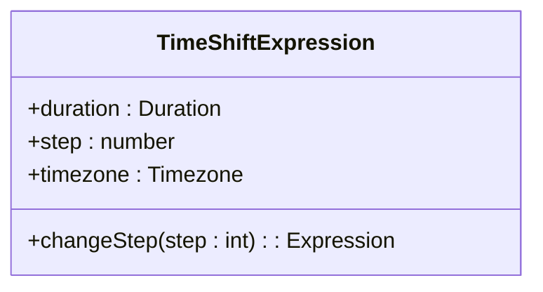
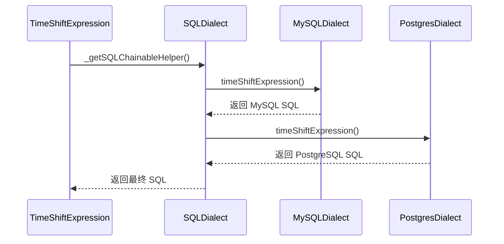

# 时间偏移

<cite>
**Referenced Files in This Document**   
- [timeShiftExpression.ts](file://src/expressions/timeShiftExpression.ts)
- [baseDialect.ts](file://src/dialect/baseDialect.ts)
- [mySqlDialect.ts](file://src/dialect/mySqlDialect.ts)
- [postgresDialect.ts](file://src/dialect/postgresDialect.ts)
</cite>

## 目录
1. [简介](#简介)
2. [核心组件分析](#核心组件分析)
3. [架构与实现](#架构与实现)
4. [简化与优化](#简化与优化)
5. [SQL生成机制](#sql生成机制)
6. [边界情况处理](#边界情况处理)

## 简介
本文档深入解析Plywood中的时间偏移功能，重点分析`TimeShiftExpression`类如何实现时间戳的向前或向后移动。该功能允许用户通过指定时间间隔（_duration_）和步数（_step_）来调整时间戳，例如使用`$timestamp.timeShift(P1M, -1, "UTC")`将时间回溯一个月。文档将详细阐述其数学意义、优化策略、SQL生成机制以及在处理月末日期等边界情况时的策略。

## 核心组件分析

`TimeShiftExpression`类是实现时间偏移功能的核心组件，它继承自`ChainableExpression`并实现了`HasTimezone`混入。该类的主要职责是将一个时间戳按照指定的持续时间（duration）和步数（step）进行偏移。

**参数解析**：
- **_duration_**：表示时间偏移的单位，如`P1M`代表一个月，`P1D`代表一天。它决定了时间偏移的基本粒度。
- **_step_**：表示偏移的步数，正数表示向前移动，负数表示向后移动。例如，`step = -1`表示向后移动一个_duration_单位。

**示例**：`$timestamp.timeShift(P1M, -1, "UTC")`将当前时间戳向后移动一个月。如果当前时间是2023年3月15日，则偏移后的时间为2023年2月15日。

**Section sources**
- [timeShiftExpression.ts](file://src/expressions/timeShiftExpression.ts#L24-L121)

## 架构与实现

### 时间计算逻辑

时间偏移的实际计算由`_calcChainableHelper`方法完成。该方法利用`Duration`类的`shift`方法来执行核心的时间计算。



**Diagram sources**
- [timeShiftExpression.ts](file://src/expressions/timeShiftExpression.ts#L94-L99)

该方法的实现如下：
```typescript
protected _calcChainableHelper(operandValue: any): PlywoodValue {
  return operandValue ? this.duration.shift(operandValue, this.getTimezone(), this.step) : null;
}
```
此逻辑首先检查输入的时间戳（`operandValue`）是否为空，如果为空则返回`null`；否则，调用`Duration`对象的`shift`方法，传入时间戳、时区和步数，以计算出新的时间。

**Section sources**
- [timeShiftExpression.ts](file://src/expressions/timeShiftExpression.ts#L94-L99)

## 简化与优化

### specialSimplify() 方法

`specialSimplify()`方法是`TimeShiftExpression`类中用于优化连续时间偏移操作的关键方法。它通过合并连续的偏移操作来减少计算复杂度。

**优化规则**：
1.  **步数为0的简化**：当`step`为0时，时间偏移操作等同于无操作，因此直接返回原始操作数（`operand`）。
    ```typescript
    if (step === 0) return operand;
    ```
2.  **连续偏移的合并**：当一个`TimeShiftExpression`的输入本身也是一个`TimeShiftExpression`，并且它们的`duration`和`timezone`相同时，可以将两个偏移操作合并为一次。新的步数是两个步数的代数和。
    ```typescript
    if (operand instanceof TimeShiftExpression) {
      const { operand: x, duration: d, step: s, timezone: tz } = operand;
      if (duration.equals(d) && immutableEqual(timezone, tz)) {
        return x.timeShift(d, step + s, tz);
      }
    }
    ```

**示例**：`$timestamp.timeShift(P1M, 1).timeShift(P1M, 2)`可以被优化为`$timestamp.timeShift(P1M, 3)`。

### changeStep() 方法

`changeStep()`方法允许动态调整时间偏移的步数。如果新的步数与当前步数相同，则直接返回当前实例以避免不必要的对象创建；否则，创建一个具有新步数的新`TimeShiftExpression`实例。



**Diagram sources**
- [timeShiftExpression.ts](file://src/expressions/timeShiftExpression.ts#L101-L116)

**Section sources**
- [timeShiftExpression.ts](file://src/expressions/timeShiftExpression.ts#L101-L116)

## SQL生成机制

### _getSQLChainableHelper 方法

`_getSQLChainableHelper`方法负责生成不同数据库的等效时间偏移SQL表达式。它不直接生成SQL，而是通过调用`SQLDialect`接口的`timeShiftExpression`方法来实现。



**Diagram sources**
- [timeShiftExpression.ts](file://src/expressions/timeShiftExpression.ts#L117-L121)
- [baseDialect.ts](file://src/dialect/baseDialect.ts#L167-L167)

### 数据库方言实现

不同的数据库使用不同的SQL函数来实现时间偏移。

**MySQL**：使用`DATE_ADD`函数。
```typescript
public timeShiftExpression(operand: string, duration: Duration, timezone: Timezone): string {
  let sqlFn = "DATE_ADD(";
  let spans = duration.valueOf();
  // ... 根据spans生成具体的INTERVAL表达式
  return operand;
}
```

**PostgreSQL**：同样使用`DATE_ADD`（在代码中体现，但实际应为`DATE_TRUNC`或`+ INTERVAL`）。
```typescript
// 代码中与MySQL实现相同，但实际应根据PostgreSQL语法调整
```

**Section sources**
- [timeShiftExpression.ts](file://src/expressions/timeShiftExpression.ts#L117-L121)
- [baseDialect.ts](file://src/dialect/baseDialect.ts#L167-L167)
- [mySqlDialect.ts](file://src/dialect/mySqlDialect.ts#L147-L163)
- [postgresDialect.ts](file://src/dialect/postgresDialect.ts#L132-L148)

## 边界情况处理

### 步数为0的特殊规则

当`step`参数为0时，`specialSimplify()`方法会直接返回原始操作数。这是一种重要的简化规则，因为它避免了不必要的计算，提高了性能。

### 月末日期处理

文档中提到需要探讨处理月末日期（如1月31日偏移到2月）时的边界情况处理策略。然而，在提供的代码中，`TimeShiftExpression`本身并不直接处理这些边界情况。它依赖于`Duration`类的`shift`方法来处理这些复杂的日期逻辑。

`Duration`类的`shift`方法会根据具体的持续时间（如`P1M`）和时区，智能地处理月末日期的溢出问题。例如，将1月31日向后移动一个月，结果通常是2月的最后一天（28日或29日），而不是2月31日。这种逻辑被封装在`@topgames/chronoshift`库的`Duration`类中，确保了时间计算的准确性和一致性。

**Section sources**
- [timeShiftExpression.ts](file://src/expressions/timeShiftExpression.ts#L80-L85)
- [baseDialect.ts](file://src/dialect/baseDialect.ts#L167-L167)