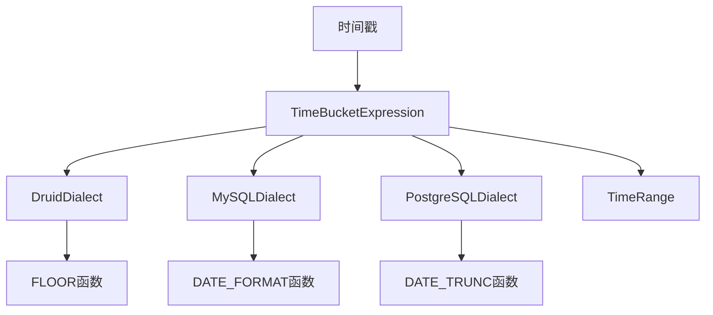
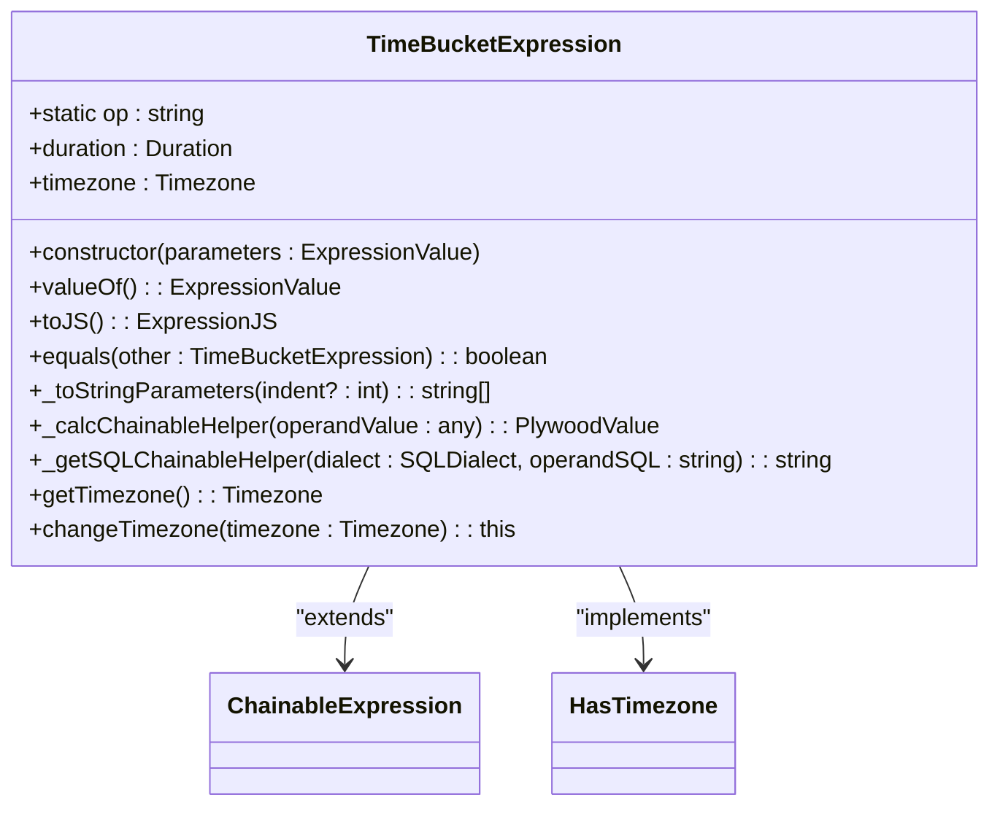
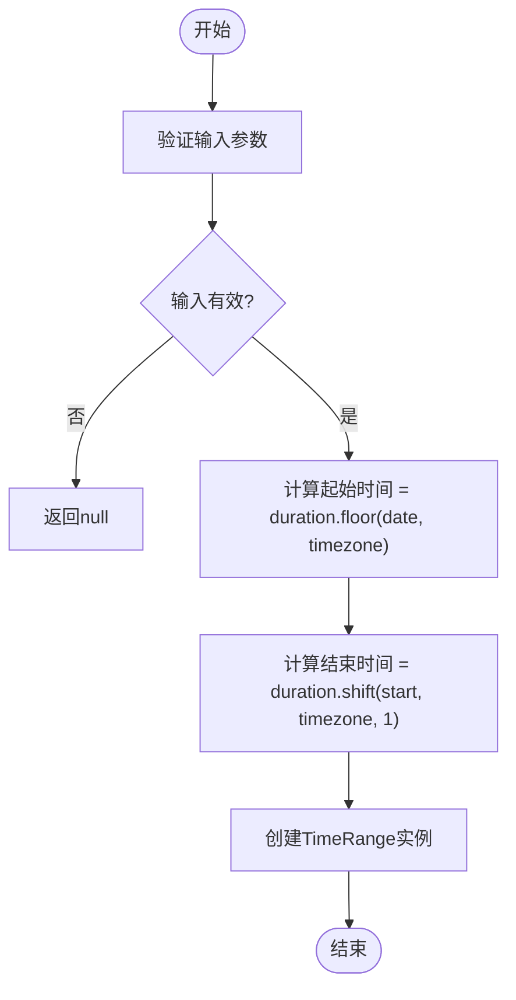
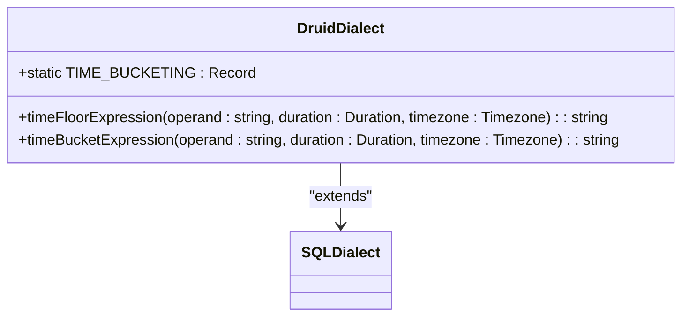
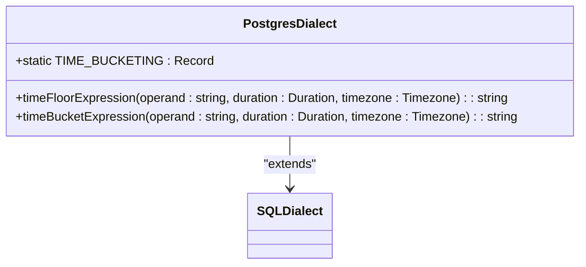
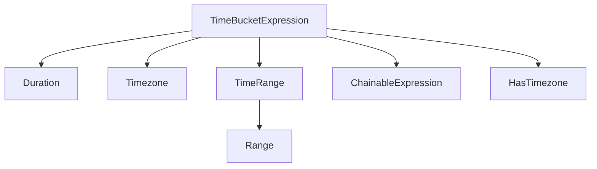

# 时间分桶

<cite>
**Referenced Files in This Document**   
- [timeBucketExpression.ts](file://src/expressions/timeBucketExpression.ts)
- [druidDialect.ts](file://src/dialect/druidDialect.ts)
- [mySqlDialect.ts](file://src/dialect/mySqlDialect.ts)
- [postgresDialect.ts](file://src/dialect/postgresDialect.ts)
- [timeRange.ts](file://src/datatypes/timeRange.ts)
- [baseExpression.ts](file://src/expressions/baseExpression.ts)
</cite>

## 目录
1. [简介](#简介)
2. [核心组件](#核心组件)
3. [架构概述](#架构概述)
4. [详细组件分析](#详细组件分析)
5. [依赖分析](#依赖分析)
6. [性能考虑](#性能考虑)
7. [故障排除指南](#故障排除指南)
8. [结论](#结论)

## 简介
本文档详细介绍了Plywood中时间分桶表达式（TimeBucketExpression）的实现机制。时间分桶是一种将连续时间戳划分为固定区间的重要技术，广泛应用于多维数据分析和数据聚合场景。本文将深入探讨TimeBucketExpression类的构造函数、类型检查、序列化与反序列化方法，以及其在不同数据库方言中的SQL生成差异。

**Section sources**
- [timeBucketExpression.ts](file://src/expressions/timeBucketExpression.ts#L1-L20)

## 核心组件
TimeBucketExpression类是Plywood中实现时间分桶功能的核心组件。它继承自ChainableExpression类，并通过HasTimezone混入（mixin）获得了时区处理能力。该类的主要职责是将时间戳按照指定的持续时间（duration）和时区（timezone）进行分组，生成时间范围（TIME_RANGE）类型的输出。

**Section sources**
- [timeBucketExpression.ts](file://src/expressions/timeBucketExpression.ts#L24-L93)

## 架构概述
时间分桶功能的架构涉及多个组件的协同工作。从表达式构建到SQL生成，整个流程体现了Plywood的模块化设计思想。TimeBucketExpression类负责表达式的定义和验证，而具体的SQL生成则委托给相应的数据库方言类（如DruidDialect、MySQLDialect、PostgreSQLDialect）。

**Diagram sources **
- [timeBucketExpression.ts](file://src/expressions/timeBucketExpression.ts#L24-L93)
- [druidDialect.ts](file://src/dialect/druidDialect.ts#L20-L175)
- [mySqlDialect.ts](file://src/dialect/mySqlDialect.ts#L21-L172)
- [postgresDialect.ts](file://src/dialect/postgresDialect.ts#L20-L158)

## 详细组件分析

### TimeBucketExpression类分析
TimeBucketExpression类的实现机制体现了Plywood对时间处理的严谨性。其构造函数不仅验证了操作数类型为TIME，还确保了持续时间参数是可向下取整的（floorable）。

#### 构造函数与类型检查
构造函数首先调用父类的构造方法，然后对持续时间参数进行类型检查。如果传入的duration不是Duration实例，将抛出错误。此外，构造函数还会检查duration是否可向下取整，这是时间分桶操作的基本要求。

**Diagram sources **
- [timeBucketExpression.ts](file://src/expressions/timeBucketExpression.ts#L24-L93)

#### 序列化与反序列化方法
TimeBucketExpression类实现了toJS和fromJS方法，用于在JavaScript对象和表达式实例之间进行转换。valueOf方法则返回表达式的值对象，包含duration和timezone等属性。

**Section sources**
- [timeBucketExpression.ts](file://src/expressions/timeBucketExpression.ts#L52-L64)

#### 时间分桶计算
_calcChainableHelper方法是时间分桶的核心计算逻辑。它调用TimeRange.timeBucket方法，根据给定的时间戳、持续时间和时区生成相应的时间范围。

**Diagram sources **
- [timeRange.ts](file://src/datatypes/timeRange.ts#L72-L80)
- [timeBucketExpression.ts](file://src/expressions/timeBucketExpression.ts#L86-L88)

### 数据库方言差异分析
不同的数据库系统对时间分桶的实现方式有所不同。Plywood通过方言类（Dialect）来适配这些差异。

#### Druid方言
在Druid中，时间分桶通过FLOOR函数实现。例如，P1D（一天）对应FLOOR($$ TO day)，P1M（一个月）对应FLOOR($$ TO month)。

**Diagram sources **
- [druidDialect.ts](file://src/dialect/druidDialect.ts#L20-L175)

#### MySQL方言
MySQL使用DATE_FORMAT函数配合格式化字符串来实现时间分桶。例如，P1D对应"%Y-%m-%d 00:00:00Z"，P1M对应"%Y-%m-01 00:00:00Z"。

**Diagram sources **
- [mySqlDialect.ts](file://src/dialect/mySqlDialect.ts#L21-L172)

#### PostgreSQL方言
PostgreSQL使用DATE_TRUNC函数来实现时间分桶。例如，P1D对应DATE_TRUNC('day', $$)，P1M对应DATE_TRUNC('month', $$)。

**Diagram sources **
- [postgresDialect.ts](file://src/dialect/postgresDialect.ts#L20-L158)

## 依赖分析
TimeBucketExpression类依赖于多个核心组件，包括Duration、Timezone、TimeRange等。这些依赖关系确保了时间分桶功能的完整性和正确性。

**Diagram sources **
- [timeBucketExpression.ts](file://src/expressions/timeBucketExpression.ts#L24-L93)
- [timeRange.ts](file://src/datatypes/timeRange.ts#L1-L188)

## 性能考虑
合理选择分桶粒度对查询性能有重要影响。过细的分桶会导致查询复杂度增加，而过粗的分桶可能无法满足分析需求。建议根据具体业务场景选择合适的分桶粒度，并考虑使用索引优化查询性能。

## 故障排除指南
当遇到时间分桶相关问题时，应首先检查持续时间参数是否可向下取整。如果duration.isFloorable()返回false，说明该持续时间不支持向下取整操作，需要选择其他持续时间。

**Section sources**
- [timeBucketExpression.ts](file://src/expressions/timeBucketExpression.ts#L33-L33)

## 结论
TimeBucketExpression类是Plywood中实现时间分桶功能的核心组件。通过深入分析其构造函数、类型检查、序列化与反序列化方法，以及在不同数据库方言中的SQL生成差异，我们可以更好地理解和使用这一重要功能。合理选择分桶粒度和时区设置，可以有效提升多维数据分析的效率和准确性。